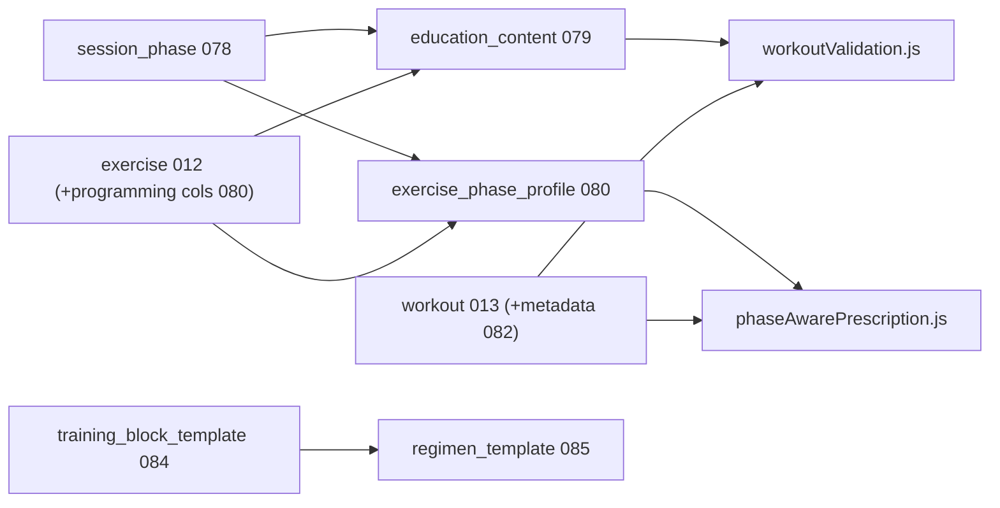
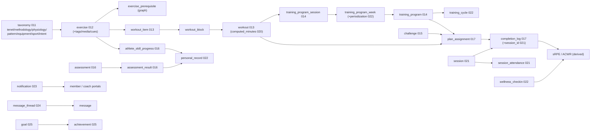

# Vortex Coaching Corner — Master Roadmap

This is the canonical, persistent roadmap for the Vortex coaching portal ("Coaching
Corner"). It captures both the original build-out roadmap (Phases 0–8) and the
"Roadmap to Best-in-Class" (Phases E–I), with current status.

> Status legend: ✅ Complete · 🟡 In progress · ⬜ Planned

## Where we are today

- ✅ Phases 0–8 (original build-out) — delivered as work tranches **A–D**.
- ✅ Phase **E** — Run the Gym Floor (live sessions + attendance).
- ✅ Phase **F** — Develop the Athlete Over Time (periodization & load).
- ✅ Phase **G** — Engage Athletes & Parents — notifications, messaging, goals/achievements, PDF reports, **video form-review**.
- 🟡 Phase **H** — Make the AI Real — LLM narratives/PDF ✅; **coach assistant + embeddings** 🟡 (needs pgvector on Postgres for RAG).
- ⬜ Phase **I** — Trust, Safety & Depth (woven in throughout).

The complete loop is live: **taxonomy → library → builder → needs engine →
programs/challenges → assign → athlete logs → grade → insights → load/PRs → AI
drafts**.

---

## Guiding principles

- **Build on existing infra**: `backend/scheduling/*` (calendar/attendance),
  `coaching.*` schema, `completion_log`, `exercise_prerequisite` (already a graph),
  `ai_draft_log` (audit trail), Cloudinary signing, SMTP.
- **Keep the deterministic engine as the executor** — AI proposes, `/prescribe`
  and the schema dispose.
- **Every migration idempotent** and appended to
  [backend/platform/initTables.js](../backend/platform/initTables.js).
- **Library ownership**: facility-global with `created_by` + `is_published` +
  `visibility`; private items mutable only by their creator (`canMutateRow`).

---

## Part 1 — Original build-out roadmap (Phases 0–8) ✅

| Phase | Deliverable | Why first |
|-------|-------------|-----------|
| 0 | Migrate taxonomy to DB (`011`) + `/api/coach/taxonomy`; refactor `AthleticismAccelerator` to read it | Single source of truth; unblocks everything |
| 1 | Exercise library schema + CRUD + filterable Library panel (incl. time + facet filters) | The spine; immediately useful to coaches |
| 2 | Workout + Warmup Builder with live time clock | First real "build a plan" value |
| 3 | Needs Engine (deterministic `/prescribe`) | The headline differentiator |
| 4 | Assign/share to athletes + athlete portal "My Training" + completion logging | Closes the coach↔athlete loop |
| 5 | Programs + Challenges builders | Longer-horizon planning |
| 6 | Assessments, grading rubrics, development analytics (Recharts) | Monitoring & teaching |
| 7 | Multi-sport progression graphs (gymnastics skill trees) | Scope-out to other sports |
| 8 | AI auto-draft + insights | Force-multiplier on a solid base |

These were delivered across work tranches **A–D** (see Part 3 for the
detailed log).

---

## Part 2 — Roadmap to Best-in-Class (Phases E–I)

### Phase E — Run the Gym Floor (operational; highest impact) ✅

*Turns the portal from a planner into the tool used during practice. Leans on the
existing scheduling system.*

**Schema (`021_coaching_sessions_attendance.sql`)**
- `coaching.session` — a scheduled instance: `facility_id`, calendar linkage
  (`calendar_event_key`), `coach_user_id`, `workout_id`, `session_date`, `status`.
- `coaching.session_attendance` — `session_id`, `member_id`, `status`, `check_in_at`.
- `session_id` (nullable FK) added to `coaching.completion_log` to link "showed up"
  with "what they did."

**Backend (`coachPortalRoutes.js`)**
- `GET /api/coach/sessions?date=` — resolve from calendar instances + assignments.
- `GET /api/coach/sessions/:id` — roster + assigned workout + per-athlete completion.
- `POST /api/coach/sessions/:id/attendance` and `POST /api/coach/sessions/:id/bulk-log`
  — log reps/RPE/grades for the whole class at once.

**Frontend**
- `LiveSessionPanel` (lazy-loaded) — "Today's Session": live clock, roster checklist,
  one-tap per-athlete logging.
- Upcoming sessions surfaced on `HomePanel`.

**Unlocks**: attendance-driven analytics, real adherence data, the daily-use habit.

---

### Phase F — Develop the Athlete Over Time (periodization & load) ✅

*Adds longitudinal intelligence on top of single workouts/programs.*

**Schema (`022_coaching_periodization_load.sql`)**
- `coaching.training_cycle` — macro/meso/micro: `training_program_id`, `cycle_type`,
  `start_date`/`end_date`, `intensity_target`, `is_deload`.
- `coaching.training_program_week` — added `phase_label`, `target_load_pct`,
  `is_deload` (per-week periodization metadata).
- `coaching.wellness_checkin` — `member_id`, `checkin_date`, `sleep_hours`, `soreness`,
  `rpe`, `mood`, `energy` (one per member per day).
- `coaching.personal_record` — auto-populated from `assessment_result` /
  `athlete_skill_progress`.

**Backend**
- PR auto-detection (`detectPersonalRecord`) on assessment-result and skill-grade
  writes → insert into `personal_record`, fire best-effort email (`notifyPrDetected`).
- `GET /api/coach/athletes/:id/load` — session-RPE (sRPE = RPE × minutes) daily series
  + acute(7d):chronic(28d) workload ratio with injury-risk flagging; includes readiness
  from latest wellness check-in.
- `GET /api/coach/athletes/:id/prs`, `GET /api/coach/athletes/:id/wellness`.
- `POST /api/member/training/wellness` (upsert) + `GET /api/member/training/wellness`;
  PRs added to `/api/member/training/progress`.
- `GET /api/coach/skill-tree` — `exercise` nodes + `exercise_prerequisite` edges, with
  optional per-athlete mastery overlay from `athlete_skill_progress`.
- Progressive overload: `applyProgression` helper +
  `POST /api/coach/training-programs/:id/weeks/:weekId/duplicate` — clones a week as the
  next week, scaling `target_load_pct` and (optionally) deep-cloning workouts with scaled
  reps/load so templates are never mutated.

**Frontend**
- `InsightsPanel`: sRPE load chart with ACWR badge, wellness/readiness trend, PR list.
- `ProgramBuilder`: per-week `phase_label` / `target_load_pct` / `is_deload` controls,
  deload styling, duplicate-with-progression.
- New `SkillTreePanel` (`skills` tab): dependency-free layered DAG of prerequisites with
  athlete mastery coloring.
- `MemberTraining` `MemberProgressTab`: daily wellness check-in form + PR display.

> Implementation note: `completion_log` has no numeric weight/sets/volume column
> (`load` is free text), so training load uses session-RPE (RPE × duration), the standard
> ACWR input — no change to `completion_log` required.

**Unlocks**: defensible "we develop athletes safely and progressively" story; injury
prevention.

---

### Phase G — Engage Athletes & Parents (retention) ✅

*Two-way communication and motivation. Email + in-app notifications; messaging threads;
goals and lightweight achievements.*

**Schema**
- `023_coaching_engagement.sql` — `coaching.notification` ✅
- `024_coaching_messaging.sql` — `message_thread`, `message` ✅
- `060_coaching_message_enhancements.sql` — `subject_locked`, `message_thread_participant`, nullable `member_id` ✅
- `061_coaching_message_sender_portal.sql` — `message.sender_portal` (`admin` | `coach` | `member`) ✅
- `025_coaching_goals_achievements.sql` — `goal`, `achievement` ✅

**Backend ✅ (except video review)**
- In-app notification fan-out for assignments, PRs, messages, achievements.
- `GET/PATCH/POST /api/coach/notifications`, `/api/member/notifications`.
- `GET/POST /api/admin/messages`, `/api/member/messages`, `/api/admin/messages` (+ thread replies).
- `GET /api/admin/messages?status=archived&sort=title|created&q=` — archived browse with search.
- `PATCH …/messages/:threadId/status` — archive or restore thread (admin + coach).
- `GET /api/coach/messages/recipient-options`, `/api/member/messages/recipient-options` (multi-recipient picker).
- `PATCH …/messages/:threadId/subject` — rename thread; coaches/admins may set `subject_locked`.
- **Mobile messaging platform (065–067)** ✅ — tags, read/unread, WebSocket `/ws/messages`, inbox tabs,
  event canonical + discussion threads, scheduling system messages, file library, critical opt-in alerts,
  reactions/polls/FAQ/audit export; rate limits via `MESSAGE_SEND_RATE_MAX`.
- Goals: `GET/POST /api/coach/athletes/:id/goals`, `PATCH /api/coach/goals/:id`,
  `GET /api/member/training/goals`.
- Achievements: auto `milestone` on PR (`notify: false` on duplicate); manual coach award;
  `GET /api/coach/athletes/:id/achievements`, `GET /api/member/training/achievements`.

**Frontend ✅ (except video review UI)**
- `NotificationBell` (coach + member headers).
- `MessagesPanel` (coach tab), `MemberMessagesTab` (member tab), `AdminMessagesPanel` (admin Accounts group).
- `MessagingMobileShell` master-detail layout, `MessagingInboxTabs`, `NotificationBell` deep links,
  `MessagingNotificationPreferences`, `MessageReactionBar`, `MessagingThreadFaq`.
- Shared `ThreadHeaderMenu` (⋯ → edit/lock thread name), `RecipientPicker` (multi-select chips).
- Goals widget on `MemberProgressTab`; coach goal CRUD in `InsightsPanel`.
- Achievements on member progress tab; print-friendly parent report from narrative + PRs.

**Remaining ⬜**
- ~~Athlete video submission + coach rubric form-review~~ ✅ (`027`, `FormReviewPanel`, member Video Submission Portal)
- ~~Coach-assigned video submission requests~~ ✅ (`029`, Assign → Form Check, assignment-linked submissions)
- ~~True PDF export~~ ✅ (server `pdfkit` PDF)

**Unlocks**: engagement/retention loop; messaging pairs with E session flow and F PR detection.

---

### Phase H — Make the AI Real 🟡

*Swap heuristics for an LLM while keeping determinism and auditability.*

- LLM provider abstraction (key via env, logged to `ai_draft_log`).
- **Full multi-week program generation** → emits structured `training_program` JSON
  validated against the schema, then executed by the existing builders.
- **Conversational coaching assistant** grounded in the athlete's history (completion log,
  assessments, load).
- **Video form-check** suggestions feeding the Phase-G review flow.
- Upgrade Phase-D NL parsing/narratives/autotag from rules → LLM, keeping the rule-based
  path as deterministic fallback.

**Unlocks**: the "wow," but only valuable once E–G provide the data it reasons over.

---

### Phase I — Trust, Safety & Depth (woven in throughout) ⬜

- **Athlete medical/injury profiles** (`coaching.athlete_health`) that auto-inject
  contraindicated body-regions into `/prescribe` (today exclusion is per-request, not
  per-athlete).
- **Normative benchmarks/percentiles** (age/sex norms) so assessment scores carry meaning.
- **Cross-facility template marketplace**: publish/clone vetted workouts/programs (the
  `visibility`/`created_by` model already supports the foundation).
- **Granular multi-coach permissions**: assign athletes to specific coaches, co-coaching
  handoff notes.

---

## Recommended sequence & rationale

1. **E** (floor) — daily-use habit + real data; infra already exists. ✅
2. **F** (periodization/load + skill tree) — longitudinal once data exists. ✅
3. **G notifications** (small slice) — pairs naturally with E's session flow. ✅
4. **Rest of G** (messaging, goals, gamification, print/PDF report cards). 🟡
5. **H** (Vercel AI SDK + pgvector RAG) — started; see [AI_AND_VECTOR_GUIDE.md](AI_AND_VECTOR_GUIDE.md). 🟡
6. **I** woven in throughout (medical profiles ideally land with F's load work).

## Non-code prerequisites (operator-provided)

- **Content**: a real exercise library (hundreds of curated, video'd, tagged movements
  vs. today's ~20 seeds) for the skill tree and load math to be meaningful.
- **Credentials/approvals**: Cloudinary, an LLM key, production SMTP, and the actual
  staging→prod migration run.

---

## Part 3 — Delivered work log (tranches A–D)

### Tranche A — closed the loop on existing APIs
- `LibraryPanel` exercise editor loads full `/exercises/:id` detail on open and edits
  media, cues/faults, and prerequisites (prereq picker), sending them back on save.
- `LibraryPanel` filter bar: aligned search field with facet dropdowns, renamed flexibility
  tenet to **Flexibility/Mobility** (migration `075`), **Phase/Intent** label, tenet tags
  show specific tenet names, removed max-sec/set filter.
- `AssessPanel` gained a rubric builder (`/api/coach/rubrics`) and a per-athlete
  skill-grade form (`/api/coach/athletes/:id/skill-grade`), alongside benchmark recording.
- `NeedsEnginePanel` exposes equipment, age min/max, and contraindicated body-region filters.
- `WorkoutBuilder` saved-workout cards open a read-only preview modal (full blocks,
  exercises, dosage, notes) with **Edit in Builder** to load into the editor.
- `MemberTraining` renders program week/session detail and challenge leaderboards, backed
  by `/api/member/training/program/:id` and `/challenge/:id`.

### Tranche B — net-new capabilities
- Workout duration search: persisted `computed_minutes` (migration `020`) +
  `?minMinutes/maxMinutes/sport/type` filters and a builder filter bar.
- Completion review + session grading: `GET /api/coach/completions` and
  `PATCH /api/coach/completions/:id`, surfaced as inline grade/note rows in `InsightsPanel`.
- Notifications: best-effort assignment emails via the existing SMTP service.
- Class analytics: `POST /api/coach/insights/cohort` + a class tenet-coverage chart.

### Tranche C — production readiness
- Verified idempotent boot locally (migrations `011`–`020` ran twice cleanly).
- Media upload pipeline: dependency-free Cloudinary signed direct-upload endpoint with
  URL-paste fallback; documented `CLOUDINARY_*` env vars.
- Integration tests covering taxonomy, exercise filter, prescribe, and the assignment +
  member-log round-trip.
- Ownership locks: private items editable/deletable only by `created_by`.

### Tranche D — fuller AI layer
- NL needs: `/api/coach/ai/nl-needs` parses free text into constraints, runs the
  deterministic engine, logs to `ai_draft_log`.
- Parent narratives: `/api/coach/ai/progress-narrative/:memberId` with a copy-able summary.
- Auto-tagging: `/api/coach/ai/autotag` suggests facet tags from name/description/cues.
- Polish: coach panels are lazy-loaded (separate build chunks); workout builder supports
  drag-and-drop reorder.

---

## Part 4 — Architecture & key decisions (and *why*, for posterity)

These are the load-bearing decisions. They are recorded here so future contributors
understand the intent and don't accidentally undo a deliberate choice.

### Dedicated `coaching` Postgres schema
All coaching tables live under a `coaching.*` schema rather than the `public` schema used
by the rest of the app. **Why:** clean isolation of a large new module, no name collisions
with ~40 existing public tables, and an obvious blast-radius boundary. Cross-schema foreign
keys to `public.facility`, `public.app_user`, and `public.member` work fine, so we keep
referential integrity while staying isolated.

### `training_program` (not `program`)
A coaching multi-week plan is named `coaching.training_program`. **Why:** `public.program`
already exists and means an *enrollment* program (classes/billing). Reusing "program" would
have been a constant source of confusion and query bugs. The distinct name keeps the
enrollment domain and the training domain unambiguous.

### Facility-global library ownership: `created_by` + `is_published` + `visibility`
Every library object (exercise, workout, training_program, challenge, assessment, rubric)
is owned by the facility, attributed to a `created_by` user, and gated by
`visibility ∈ {facility, private}` plus `is_published`. The `canMutateRow(row, userId)`
helper enforces that **private items are editable/deletable only by their creator**, while
published facility items are shared. **Why:** gives consistency (a shared facility catalog)
*and* coach personalization (private drafts) without a heavyweight per-object ACL system.

### Database-backed taxonomy (single source of truth)
The 8 Tenets of Athleticism, 8 Training Methodologies, and 6 Physiological Emphases were
previously **hardcoded** in `src/components/AthleticismAccelerator.tsx`. Migration `011`
moves them into `coaching.tenet` / `coaching.methodology` / `coaching.physiological_emphasis`
(plus `movement_pattern`, `equipment`, `sport`, `exercise_intent`, `body_region`), served via
`/api/coach/taxonomy` and consumed through a shared TS constants/`fetchTaxonomy()` cache.
**Why:** one canonical definition that the marketing page, the library tagging, the needs
engine, and challenge criteria all read from — change it once, everywhere updates.

### Faceted tagging is the connective tissue
Exercises are tagged across facets (`tenet`, `methodology`, `physiology`, `pattern`,
`equipment`, `body_region`, `intent`) via `coaching.exercise_tag`. The same facet vocabulary
drives library filtering, the Needs Engine scoring, and `challenge_criteria`. **Why:** one
tagging model powers search, prescription, and competition focus — no parallel taxonomies to
keep in sync.

### Time is a first-class, queryable property
`coaching.exercise.est_seconds_per_set` feeds the **live builder clock**, and
`coaching.workout.computed_minutes` (migration `020`) **persists** the rolled-up duration so
workouts are searchable by `minMinutes`/`maxMinutes`. **Why:** "I have 30 minutes to fill —
give me something that fits" is a core coach workflow; persisting the computed value makes it
an indexable column instead of an N+1 recompute.

### Why Layer + Athleticism Accelerator (centralized education)
Coach-facing rationale ("why") lives in **`coaching.education_content`** (migration `079`), keyed by
`entity_type` + `entity_key` (+ optional `entity_id`). Exercises, session phases, validation rules,
and regimen templates all reference the same table rather than scattering copy in JSON columns alone.
**Why:** one import path for LLM-generated content, consistent preview in Library/Builder/Needs Engine,
and publish gates that require structured why fields before `is_published`.

Seven canonical **`coaching.session_phase`** rows (migration `078`) enforce master session order:
Prepare/Access → Skill/Movement Intelligence → Output → Capacity → Control/Resilience →
Fitness/Repeatability → Restore. Workout blocks link via `workout_block.phase_id`; the validator
(`workoutValidation.js`) and Needs Engine (`phaseAwarePrescription.js`) score exercises using
`exercise_phase_profile` fit weights and return educational warnings with override flow.

### Deterministic Needs Engine; AI proposes, the schema disposes
`runPhaseAwarePrescription()` (extracted from `coachPortalRoutes.js`) is a phase-aware scorer/time-packer
with per-exercise/placement/scaling rationales from `education_content`. The AI layer still only *drafts*
inputs; the deterministic engine remains executor of record.

### Idempotent migrations, applied on boot
Every migration uses `CREATE ... IF NOT EXISTS`, `ADD COLUMN IF NOT EXISTS`, and
`INSERT ... ON CONFLICT`, and is appended to the ordered list in
[backend/platform/initTables.js](../backend/platform/initTables.js), which runs them on every
server boot. (`backend/run-migration.js` + a `schema_migrations` table also exist for explicit
runs.) **Why:** zero-step deploys and safe re-runs — boot converges the schema without a
separate, error-prone migration phase. The cost is discipline: migrations must always be
re-runnable.

### Training load uses session-RPE (sRPE), not tonnage
`coaching.completion_log` stores `reps`, `time_seconds`, `rpe`, and a **free-text** `load`
(no numeric weight/sets/volume column). Phase F's acute:chronic workload ratio therefore uses
`sRPE = RPE × session_minutes` — the standard sports-science load proxy. **Why:** it needs no
schema change to `completion_log`, works for both gymnastics and barbell contexts, and avoids
forcing a numeric-weight model onto bodyweight/skill work.

### Permissions layered onto the existing RBAC
Coaching adds granular permission keys (`library.view`, `library.manage`, `workouts.manage`,
`training_programs.manage`, `challenges.manage`, `assessments.manage`,
`athlete_grading.manage`, `plans.assign`, `coach_insights.view`) seeded in `011` and granted to
`COACH`/`ADMIN`/admin roles. Portal entry is gated by `coach_portal.access`. **Why:** reuse the
proven `role`/`permission`/`role_permission` system rather than inventing a coaching-specific
auth model; fine-grained keys let facilities scope coach capabilities later.

### Cloudinary signed direct-upload (dependency-free) + best-effort SMTP
Exercise media uses a server-signed, direct-to-Cloudinary upload (HMAC via Node `crypto`, no
SDK) with a URL-paste fallback. Notifications (assignment, PR) use the existing `sendEmail`
SMTP utility and are **best-effort** (failures never block the request). **Why:** no new heavy
dependencies, graceful degradation when credentials are absent, and the core flows never fail
because a side-effect (email/upload) did.

### Lazy-loaded coach panels
All coach panels except `HomePanel` are `React.lazy()` + `<Suspense>`. **Why:** the coach
portal is feature-dense; code-splitting keeps initial load fast and isolates each tool into its
own chunk.

---

## Part 5 — Complete data model (`coaching` schema)

Tables grouped by the migration that introduced them. All carry `facility_id` scoping unless
noted; ownership tables carry `created_by` + `is_published` + `visibility`.

- **`011` — schema, taxonomy, permissions**: `tenet` (8), `methodology` (9; HIIT added in `076`),
  `physiological_emphasis` (6), `movement_pattern`, `equipment`, `sport`, `exercise_intent`;
  seeds permission keys + role grants.
- **`012` — exercise library**: `body_region`, `exercise` (with `est_seconds_per_set`,
  age/skill bounds, default dosage), `exercise_tag` (facet links), `exercise_media`,
  `exercise_cue` (cues/faults), `exercise_prerequisite` (directed progression graph).
- **`013` — workout builder**: `workout` (types: workout/warmup/cooldown/conditioning/
  practice), `workout_block` (formats: straight_sets/circuit/amrap/emom/for_time/stations),
  `workout_item` (exercise dosage: sets/reps/work/rest/load/tempo).
- **`014` — training programs**: `training_program` (`goal_phase`, `weeks_count`),
  `training_program_week`, `training_program_session` (links a week-day to a `workout`).
- **`015` — challenges**: `challenge` (scoring types), `challenge_criteria` (facet focus),
  `challenge_entry` (per-member scores → leaderboard).
- **`016` — assessments & grading**: `rubric`, `rubric_criterion`, `assessment`
  (`higher_is_better`, type benchmark/rubric/skill), `assessment_result` (`value_numeric` —
  PR source), `athlete_skill_progress` (`score`/`max_score` — skill PR source).
- **`017` — assignment & completion**: `plan_assignment` (target member/class/family →
  workout/training_program/challenge), `completion_log` (athlete/coach logged work: reps,
  load, time, rpe, coach_grade).
- **`018` — AI traceability**: `ai_draft_log` (session_draft/coverage_nudge/narrative/
  auto_tag; prompt + JSONB response).
- **`019` — starter seed**: ~20 fitness + gymnastics exercises with tags and a sample
  prerequisite edge (round-off requires cartwheel).
- **`020` — workout minutes**: `workout.computed_minutes` (persisted duration for search).
- **`021` — live sessions (Phase E)**: `session`, `session_attendance`; `completion_log.session_id`.
- **`022` — periodization & load (Phase F)**: `training_cycle`; `training_program_week`
  +`phase_label`/`target_load_pct`/`is_deload`; `wellness_checkin`; `personal_record`.
- **`023` — engagement (Phase G)**: `notification`.
- **`024` — messaging (Phase G)**: `message_thread`, `message`.
- **`025` — goals/achievements (Phase G)**: `goal`, `achievement`.
- **`078`–`086` — Why Layer / Athleticism Accelerator**: `session_phase`, `phase_order_slot`,
  `education_content`, exercise programming profiles (`exercise_phase_profile`, dosage/scaling/
  safety/regimen), `validation_rule`, workout phase metadata, `training_block_template`,
  `regimen_template`, session allocation templates (60/90/120).

Legacy diagram (pre-Why Layer):

---

## Part 6 — Backend surface

Routes are registered in [backend/platform/coachPortalRoutes.js](../backend/platform/coachPortalRoutes.js)
(via `registerCoachPortalRoutes` in `server.js`). Each coach route spreads
`can(permission) = [authMiddleware, requirePermission(permission)]`; facility scope comes from
`req.platformAuth.user.facility_id`. Member training routes use plain `auth` (JWT) and scope by
the token's member.

- **Taxonomy/library** (`library.view`/`library.manage`): `/api/coach/taxonomy` (+ `sessionPhases`,
  `phaseOrderSlots`), `/api/coach/education`, `/api/coach/session-templates`,
  `/api/coach/exercises` (+ phase filter, programming profiles), `/exercises/:id`,
  `/exercises/:id/publish-check`, media upload-signature, autotag.
- **Workouts** (`workouts.manage`): `/api/coach/workouts` CRUD (phase metadata, rationale JSON),
  `POST /api/coach/workouts/validate`.
- **Needs Engine** (`library.view`): `/api/coach/needs-engine/prescribe` (`runPhaseAwarePrescription`).
- **Blocks & regimens** (`workouts.manage`): `/api/coach/training-blocks`,
  `/api/coach/regimen-templates` CRUD.
- **Programs** (`training_programs.manage`): `/api/coach/training-programs` CRUD +
  `…/weeks/:weekId/duplicate` (progressive overload).
- **Challenges** (`challenges.manage`): `/api/coach/challenges` (+ entries).
- **Assess/grade** (`assessments.manage` / `athlete_grading.manage`): rubrics, assessments,
  `…/results`, `…/skill-grade` (both trigger `detectPersonalRecord`).
- **Insights & longitudinal** (`coach_insights.view`): `/insights/athlete/:id`,
  `/insights/cohort`, `/completions`, `/athletes/:id/load` (sRPE/ACWR), `/athletes/:id/prs`,
  `/athletes/:id/wellness`.
- **Skill tree** (`library.view`): `/api/coach/skill-tree`.
- **Live sessions** (`plans.assign`): `/api/coach/sessions` (+ `:id`, attendance, bulk-log).
- **Notifications** (auth): `/api/coach/notifications`, `/api/member/notifications`.
- **Messaging** (auth): `/api/coach/messages`, `/api/member/messages`.
- **Goals/achievements** (`coach_insights.view`): `/athletes/:id/goals|achievements`,
  `PATCH /goals/:id`; member `/training/goals|achievements`.
- **AI** (`coach_insights.view`/`library.manage`): `/ai/nl-needs`, `/ai/coverage-nudge/:id`,
  `/ai/progress-narrative/:id`, `/ai/autotag` (all logged to `ai_draft_log`).
- **Member portal**: `/api/member/training/assignments|workout/:id|program/:id|challenge/:id|
  log|progress|wellness`.

Key helpers: `canMutateRow`, `runPhaseAwarePrescription`, `validateWorkoutDraft`,
`loadExerciseProgrammingBundle`/`saveExerciseProgramming`, `educationContent.js`,
`loadWorkout`/`writeWorkoutStructure`, `loadTrainingProgram`/`writeProgramStructure`, `applyProgression`, `notifyAssignment`,
`createInAppNotification`, `detectPersonalRecord`/`notifyPrDetected`, `computeReadiness`,
`loadSessionRoster`.

---

## Part 7 — Frontend surface

Multi-portal shell in `src/App.tsx` (website / admin / member / coach). Shared coach client
`src/coach/api.ts` (`coachFetch`), taxonomy cache `src/coach/taxonomy.ts`, builder state in
`src/coach/useCoachBuilderStore.ts` (Zustand). Charts use Recharts throughout.

- **Coach portal** ([src/components/coach/CoachLayout.tsx](../src/components/coach/CoachLayout.tsx)):
  tabs `home`, `sessions`, `needs`, `library`, `framework`, `workout`/`warmup`, `programs`,
  `training-blocks`, `regimens`, `challenges`, `assess`, `skills`, `assign`, `messages`,
  `insights`, `roster`.
- **Why Layer panels**: `FrameworkPanel` (philosophy browser), tabbed `LibraryPanel` exercise editor
  (Why/Phase/Dosage/Safety/Regimen + publish checklist), `WorkoutSetupWizard` + phase canvas +
  validation UX in `WorkoutBuilder`, rationale cards in `NeedsEnginePanel`, `TrainingBlockBuilder`,
  `RegimenBuilder`.
- **Member portal**: `MemberTraining.tsx` — `MemberTrainingTab` (assignments + completion
  logging) and `MemberProgressTab` (assessment trends, skill grades, PRs, daily wellness
  check-in). `NotificationBell` in `MemberDashboard` header.
- **Shared**: `NotificationBell.tsx` — coach + member notification dropdowns.
- **Public/marketing**: `AthleticismAccelerator.tsx` now reads the DB-backed taxonomy.

---

## Part 8 — Ideas backlog (future)

Park non-urgent ideas here during brainstorming; implement only when explicitly prioritized.

| Idea | Why / fit | Likely phase |
|------|-----------|--------------|
| Push notifications (web/mobile) | Extend in-app `notification` with browser Push API or native bridge | G |
| Coach notifications for athlete check-ins | Fan-out wellness submissions to assigned coach via `recipient_user_id` | G |
| Member-started threads without assigned coach | Any coach can reply; first reply claims `coach_user_id` on thread | G |
| True PDF report cards | Browser print from narrative works; server PDF needs a library | G |
| Video form-review scope | Cloudinary upload exists; need member submit + coach annotate UX | G |
| Integration tests for E/F endpoints | Sessions endpoint still needs live calendar data | Production hardening |
| Real exercise library (hundreds of movements) | Skill tree and load math need content depth | Operator content |
| `athlete_health` contraindications in `/prescribe` | Per-athlete injury profile auto-excludes body regions | I (pairs with load work) |
| Cross-facility template marketplace | Publish/clone vetted workouts using existing `visibility` model | I |
