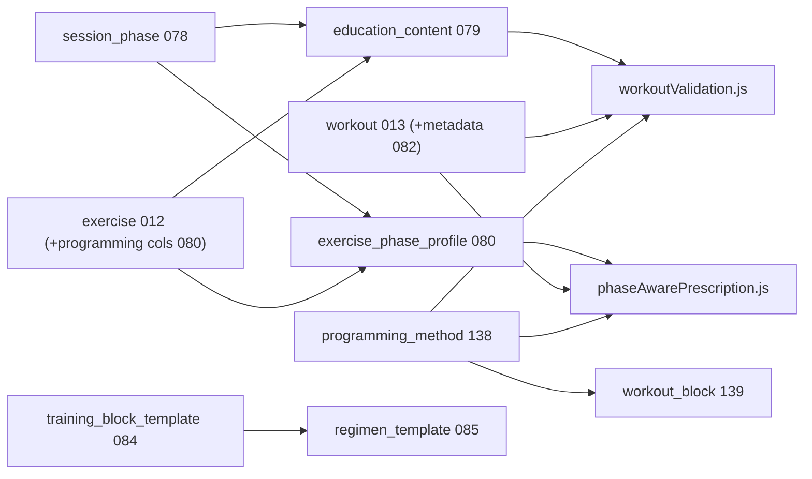
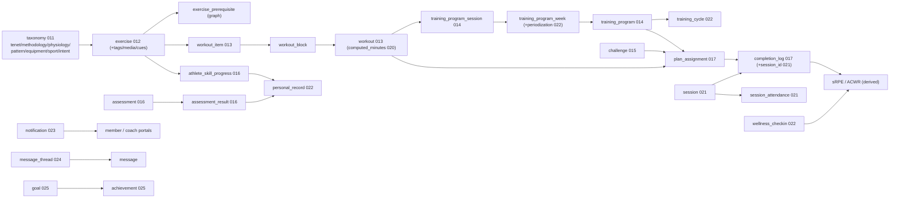

# Vortex Coaching Corner — Master Roadmap

This is the canonical, persistent roadmap for the Vortex coaching portal ("Coaching
Corner"). It captures both the original build-out roadmap (Phases 0–8) and the
"Roadmap to Best-in-Class" (Phases E–I), with current status.

> Status legend: ✅ Complete · 🟡 In progress · ⬜ Planned

## Where we are today

- ✅ Phases 0–8 (original build-out) — delivered as work tranches **A–D**.
- ✅ Phase **E** — Run the Gym Floor (live sessions + attendance).
- ✅ Phase **F** — Develop the Athlete Over Time (periodization & load).
- ✅ Phase **G** — Engage Athletes & Parents — notifications, messaging, goals/achievements, PDF reports, **video form-review**.
- 🟡 Phase **H** — Make the AI Real — LLM narratives/PDF ✅; **coach assistant + embeddings** 🟡 (needs pgvector on Postgres for RAG).
- ⬜ Phase **I** — Trust, Safety & Depth (woven in throughout).

The complete loop is live: **taxonomy → library → builder → needs engine →
programs/challenges → assign → athlete logs → grade → insights → load/PRs → AI
drafts**.

---

## Guiding principles

- **Build on existing infra**: `backend/scheduling/*` (calendar/attendance),
  `coaching.*` schema, `completion_log`, `exercise_prerequisite` (already a graph),
  `ai_draft_log` (audit trail), Cloudinary signing, SMTP.
- **Keep the deterministic engine as the executor** — AI proposes, `/prescribe`
  and the schema dispose.
- **Every migration idempotent** and appended to
  [backend/platform/initTables.js](../backend/platform/initTables.js).
- **Library ownership**: facility-global with `created_by` + `is_published` +
  `visibility`; private items mutable only by their creator (`canMutateRow`).

---

## Part 1 — Original build-out roadmap (Phases 0–8) ✅

| Phase | Deliverable | Why first |
|-------|-------------|-----------|
| 0 | Migrate taxonomy to DB (`011`) + `/api/coach/taxonomy`; refactor `AthleticismAccelerator` to read it | Single source of truth; unblocks everything |
| 1 | Exercise library schema + CRUD + filterable Library panel (incl. time + facet filters) | The spine; immediately useful to coaches |
| 2 | Workout + Warmup Builder with live time clock | First real "build a plan" value |
| 3 | Needs Engine (deterministic `/prescribe`) | The headline differentiator |
| 4 | Assign/share to athletes + athlete portal "My Training" + completion logging | Closes the coach↔athlete loop |
| 5 | Programs + Challenges builders | Longer-horizon planning |
| 6 | Assessments, grading rubrics, development analytics (Recharts) | Monitoring & teaching |
| 7 | Multi-sport progression graphs (gymnastics skill trees) | Scope-out to other sports |
| 8 | AI auto-draft + insights | Force-multiplier on a solid base |

These were delivered across work tranches **A–D** (see Part 3 for the
detailed log).

---

## Part 2 — Roadmap to Best-in-Class (Phases E–I)

### Phase E — Run the Gym Floor (operational; highest impact) ✅

*Turns the portal from a planner into the tool used during practice. Leans on the
existing scheduling system.*

**Schema (`021_coaching_sessions_attendance.sql`)**
- `coaching.session` — a scheduled instance: `facility_id`, calendar linkage
  (`calendar_event_key`), `coach_user_id`, `workout_id`, `session_date`, `status`.
- `coaching.session_attendance` — `session_id`, `member_id`, `status`, `check_in_at`.
- `session_id` (nullable FK) added to `coaching.completion_log` to link "showed up"
  with "what they did."

**Backend (`coachPortalRoutes.js`)**
- `GET /api/coach/sessions?date=` — resolve from calendar instances + assignments.
- `GET /api/coach/sessions/:id` — roster + assigned workout + per-athlete completion.
- `POST /api/coach/sessions/:id/attendance` and `POST /api/coach/sessions/:id/bulk-log`
  — log reps/RPE/grades for the whole class at once.

**Frontend**
- `LiveSessionPanel` (lazy-loaded) — "Today's Session": live clock, roster checklist,
  one-tap per-athlete logging.
- Upcoming sessions surfaced on `HomePanel`.

**Unlocks**: attendance-driven analytics, real adherence data, the daily-use habit.

---

### Phase F — Develop the Athlete Over Time (periodization & load) ✅

*Adds longitudinal intelligence on top of single workouts/programs.*

**Schema (`022_coaching_periodization_load.sql`)**
- `coaching.training_cycle` — macro/meso/micro: `training_program_id`, `cycle_type`,
  `start_date`/`end_date`, `intensity_target`, `is_deload`.
- `coaching.training_program_week` — added `phase_label`, `target_load_pct`,
  `is_deload` (per-week periodization metadata).
- `coaching.wellness_checkin` — `member_id`, `checkin_date`, `sleep_hours`, `soreness`,
  `rpe`, `mood`, `energy` (one per member per day).
- `coaching.personal_record` — auto-populated from `assessment_result` /
  `athlete_skill_progress`.

**Backend**
- PR auto-detection (`detectPersonalRecord`) on assessment-result and skill-grade
  writes → insert into `personal_record`, fire best-effort email (`notifyPrDetected`).
- `GET /api/coach/athletes/:id/load` — session-RPE (sRPE = RPE × minutes) daily series
  + acute(7d):chronic(28d) workload ratio with injury-risk flagging; includes readiness
  from latest wellness check-in.
- `GET /api/coach/athletes/:id/prs`, `GET /api/coach/athletes/:id/wellness`.
- `POST /api/member/training/wellness` (upsert) + `GET /api/member/training/wellness`;
  PRs added to `/api/member/training/progress`.
- `GET /api/coach/skill-tree` — `exercise` nodes + `exercise_prerequisite` edges, with
  optional per-athlete mastery overlay from `athlete_skill_progress`.
- Progressive overload: `applyProgression` helper +
  `POST /api/coach/training-programs/:id/weeks/:weekId/duplicate` — clones a week as the
  next week, scaling `target_load_pct` and (optionally) deep-cloning workouts with scaled
  reps/load so templates are never mutated.

**Frontend**
- `InsightsPanel`: sRPE load chart with ACWR badge, wellness/readiness trend, PR list.
- `ProgramBuilder`: per-week `phase_label` / `target_load_pct` / `is_deload` controls,
  deload styling, duplicate-with-progression.
- New `SkillTreePanel` (`skills` tab): dependency-free layered DAG of prerequisites with
  athlete mastery coloring.
- `MemberTraining` `MemberProgressTab`: daily wellness check-in form + PR display.

> Implementation note: `completion_log` has no numeric weight/sets/volume column
> (`load` is free text), so training load uses session-RPE (RPE × duration), the standard
> ACWR input — no change to `completion_log` required.

**Unlocks**: defensible "we develop athletes safely and progressively" story; injury
prevention.

---

### Phase G — Engage Athletes & Parents (retention) ✅

*Two-way communication and motivation. Email + in-app notifications; messaging threads;
goals and lightweight achievements.*

**Schema**
- `023_coaching_engagement.sql` — `coaching.notification` ✅
- `024_coaching_messaging.sql` — `message_thread`, `message` ✅
- `060_coaching_message_enhancements.sql` — `subject_locked`, `message_thread_participant`, nullable `member_id` ✅
- `061_coaching_message_sender_portal.sql` — `message.sender_portal` (`admin` | `coach` | `member`) ✅
- `025_coaching_goals_achievements.sql` — `goal`, `achievement` ✅

**Backend ✅ (except video review)**
- In-app notification fan-out for assignments, PRs, messages, achievements.
- `GET/PATCH/POST /api/coach/notifications`, `/api/member/notifications`.
- `GET/POST /api/admin/messages`, `/api/member/messages`, `/api/admin/messages` (+ thread replies).
- `GET /api/admin/messages?status=archived&sort=title|created&q=` — archived browse with search.
- `PATCH …/messages/:threadId/status` — archive or restore thread (admin + coach).
- `GET /api/coach/messages/recipient-options`, `/api/member/messages/recipient-options` (multi-recipient picker).
- `PATCH …/messages/:threadId/subject` — rename thread; coaches/admins may set `subject_locked`.
- **Mobile messaging platform (065–067)** ✅ — tags, read/unread, WebSocket `/ws/messages`, inbox tabs,
  event canonical + discussion threads, scheduling system messages, file library, critical opt-in alerts,
  reactions/polls/FAQ/audit export; rate limits via `MESSAGE_SEND_RATE_MAX`.
- Goals: `GET/POST /api/coach/athletes/:id/goals`, `PATCH /api/coach/goals/:id`,
  `GET /api/member/training/goals`.
- Achievements: auto `milestone` on PR (`notify: false` on duplicate); manual coach award;
  `GET /api/coach/athletes/:id/achievements`, `GET /api/member/training/achievements`.

**Frontend ✅ (except video review UI)**
- `NotificationBell` (coach + member headers).
- `MessagesPanel` (coach tab), `MemberMessagesTab` (member tab), `AdminMessagesPanel` (admin Accounts group).
- `MessagingMobileShell` master-detail layout, `MessagingInboxTabs`, `NotificationBell` deep links,
  `MessagingNotificationPreferences`, `MessageReactionBar`, `MessagingThreadFaq`.
- Shared `ThreadHeaderMenu` (⋯ → edit/lock thread name), `RecipientPicker` (multi-select chips).
- Goals widget on `MemberProgressTab`; coach goal CRUD in `InsightsPanel`.
- Achievements on member progress tab; print-friendly parent report from narrative + PRs.

**Remaining ⬜**
- ~~Athlete video submission + coach rubric form-review~~ ✅ (`027`, `FormReviewPanel`, member Video Submission Portal)
- ~~Coach-assigned video submission requests~~ ✅ (`029`, Assign → Form Check, assignment-linked submissions)
- ~~True PDF export~~ ✅ (server `pdfkit` PDF)

**Unlocks**: engagement/retention loop; messaging pairs with E session flow and F PR detection.

---

### Phase H — Make the AI Real 🟡

*Swap heuristics for an LLM while keeping determinism and auditability.*

- LLM provider abstraction (key via env, logged to `ai_draft_log`).
- **Full multi-week program generation** → emits structured `training_program` JSON
  validated against the schema, then executed by the existing builders.
- **Conversational coaching assistant** grounded in the athlete's history (completion log,
  assessments, load).
- **Video form-check** suggestions feeding the Phase-G review flow.
- Upgrade Phase-D NL parsing/narratives/autotag from rules → LLM, keeping the rule-based
  path as deterministic fallback.

**Unlocks**: the "wow," but only valuable once E–G provide the data it reasons over.

---

### Phase I — Trust, Safety & Depth (woven in throughout) ⬜

- **Athlete medical/injury profiles** (`coaching.athlete_health`) that auto-inject
  contraindicated body-regions into `/prescribe` (today exclusion is per-request, not
  per-athlete).
- **Normative benchmarks/percentiles** (age/sex norms) so assessment scores carry meaning.
- **Cross-facility template marketplace**: publish/clone vetted workouts/programs (the
  `visibility`/`created_by` model already supports the foundation).
- **Granular multi-coach permissions**: assign athletes to specific coaches, co-coaching
  handoff notes.

---

## Recommended sequence & rationale

1. **E** (floor) — daily-use habit + real data; infra already exists. ✅
2. **F** (periodization/load + skill tree) — longitudinal once data exists. ✅
3. **G notifications** (small slice) — pairs naturally with E's session flow. ✅
4. **Rest of G** (messaging, goals, gamification, print/PDF report cards). 🟡
5. **H** (Vercel AI SDK + pgvector RAG) — started; see [AI_AND_VECTOR_GUIDE.md](AI_AND_VECTOR_GUIDE.md). 🟡
6. **I** woven in throughout (medical profiles ideally land with F's load work).

## Non-code prerequisites (operator-provided)

- **Content**: a real exercise library (hundreds of curated, video'd, tagged movements
  vs. today's ~20 seeds) for the skill tree and load math to be meaningful.
- **Credentials/approvals**: Cloudinary, an LLM key, production SMTP, and the actual
  staging→prod migration run.

---

## Part 3 — Delivered work log (tranches A–D)

### Tranche A — closed the loop on existing APIs
- `LibraryPanel` exercise editor loads full `/exercises/:id` detail on open and edits
  media, cues/faults, and prerequisites (prereq picker), sending them back on save.
- `LibraryPanel` filter bar: aligned search field with facet dropdowns, renamed flexibility
  tenet to **Flexibility/Mobility** (migration `075`), **Phase/Intent** label, tenet tags
  show specific tenet names, removed max-sec/set filter.
- `AssessPanel` gained a rubric builder (`/api/coach/rubrics`) and a per-athlete
  skill-grade form (`/api/coach/athletes/:id/skill-grade`), alongside benchmark recording.
- `NeedsEnginePanel` exposes equipment, age min/max, and contraindicated body-region filters.
- `WorkoutBuilder` saved-workout cards open a read-only preview modal (full blocks,
  exercises, dosage, notes) with **Edit in Builder** to load into the editor.
- `MemberTraining` renders program week/session detail and challenge leaderboards, backed
  by `/api/member/training/program/:id` and `/challenge/:id`.

### Tranche B — net-new capabilities
- Workout duration search: persisted `computed_minutes` (migration `020`) +
  `?minMinutes/maxMinutes/sport/type` filters and a builder filter bar.
- Completion review + session grading: `GET /api/coach/completions` and
  `PATCH /api/coach/completions/:id`, surfaced as inline grade/note rows in `InsightsPanel`.
- Notifications: best-effort assignment emails via the existing SMTP service.
- Class analytics: `POST /api/coach/insights/cohort` + a class tenet-coverage chart.

### Tranche C — production readiness
- Verified idempotent boot locally (migrations `011`–`020` ran twice cleanly).
- Media upload pipeline: dependency-free Cloudinary signed direct-upload endpoint with
  URL-paste fallback; documented `CLOUDINARY_*` env vars.
- Integration tests covering taxonomy, exercise filter, prescribe, and the assignment +
  member-log round-trip.
- Ownership locks: private items editable/deletable only by `created_by`.

### Tranche D — fuller AI layer
- NL needs: `/api/coach/ai/nl-needs` parses free text into constraints, runs the
  deterministic engine, logs to `ai_draft_log`.
- Parent narratives: `/api/coach/ai/progress-narrative/:memberId` with a copy-able summary.
- Auto-tagging: `/api/coach/ai/autotag` suggests facet tags from name/description/cues.
- Polish: coach panels are lazy-loaded (separate build chunks); workout builder supports
  drag-and-drop reorder.

---

## Part 4 — Architecture & key decisions (and *why*, for posterity)

These are the load-bearing decisions. They are recorded here so future contributors
understand the intent and don't accidentally undo a deliberate choice.

### Dedicated `coaching` Postgres schema
All coaching tables live under a `coaching.*` schema rather than the `public` schema used
by the rest of the app. **Why:** clean isolation of a large new module, no name collisions
with ~40 existing public tables, and an obvious blast-radius boundary. Cross-schema foreign
keys to `public.facility`, `public.app_user`, and `public.member` work fine, so we keep
referential integrity while staying isolated.

### `training_program` (not `program`)
A coaching multi-week plan is named `coaching.training_program`. **Why:** `public.program`
already exists and means an *enrollment* program (classes/billing). Reusing "program" would
have been a constant source of confusion and query bugs. The distinct name keeps the
enrollment domain and the training domain unambiguous.

### Facility-global library ownership: `created_by` + `is_published` + `visibility`
Every library object (exercise, workout, training_program, challenge, assessment, rubric)
is owned by the facility, attributed to a `created_by` user, and gated by
`visibility ∈ {facility, private}` plus `is_published`. The `canMutateRow(row, userId)`
helper enforces that **private items are editable/deletable only by their creator**, while
published facility items are shared. **Why:** gives consistency (a shared facility catalog)
*and* coach personalization (private drafts) without a heavyweight per-object ACL system.

### Database-backed taxonomy (single source of truth)
The 8 Tenets of Athleticism, 8 Training Methodologies, and 6 Physiological Emphases were
previously **hardcoded** in `src/components/AthleticismAccelerator.tsx`. Migration `011`
moves them into `coaching.tenet` / `coaching.methodology` / `coaching.physiological_emphasis`
(plus `movement_pattern`, `equipment`, `sport`, `exercise_intent`, `body_region`), served via
`/api/coach/taxonomy` and consumed through a shared TS constants/`fetchTaxonomy()` cache.
**Why:** one canonical definition that the marketing page, the library tagging, the needs
engine, and challenge criteria all read from — change it once, everywhere updates.

### Faceted tagging is the connective tissue
Exercises are tagged across facets (`tenet`, `methodology`, `physiology`, `pattern`,
`equipment`, `body_region`, `intent`) via `coaching.exercise_tag`. The same facet vocabulary
drives library filtering, the Needs Engine scoring, and `challenge_criteria`. **Why:** one
tagging model powers search, prescription, and competition focus — no parallel taxonomies to
keep in sync.

### Time is a first-class, queryable property
`coaching.exercise.est_seconds_per_set` feeds the **live builder clock**, and
`coaching.workout.computed_minutes` (migration `020`) **persists** the rolled-up duration so
workouts are searchable by `minMinutes`/`maxMinutes`. **Why:** "I have 30 minutes to fill —
give me something that fits" is a core coach workflow; persisting the computed value makes it
an indexable column instead of an N+1 recompute.

### Why Layer + Athleticism Accelerator (centralized education)
Coach-facing rationale ("why") lives in **`coaching.education_content`** (migration `079`), keyed by
`entity_type` + `entity_key` (+ optional `entity_id`). Exercises, session phases, validation rules,
and regimen templates all reference the same table rather than scattering copy in JSON columns alone.
**Why:** one import path for LLM-generated content, consistent preview in Library/Builder/Needs Engine,
and publish gates that require structured why fields before `is_published`.

Seven canonical **`coaching.session_phase`** rows (migration `078`) enforce master session order:
Prepare/Access → Skill/Movement Intelligence → Output → Capacity → Control/Resilience →
Sustained Capacity → Restore. Workout blocks link via `workout_block.phase_id`; the validator
(`workoutValidation.js`) and Needs Engine (`phaseAwarePrescription.js`) score exercises using
`exercise_phase_profile` fit weights and return educational warnings with override flow.

**Age-aware difficulty (migration `202`):** Each exercise can have a canonical
`exercise_difficulty_profile` (technical / load / complexity / overall on 1–10 plus recommended ages).
[`ageDifficultyPolicy.js`](../backend/platform/ageDifficultyPolicy.js) maps audience age bands to difficulty
caps; Needs Engine applies soft penalties when exercises exceed caps; library supports `min_overall` and
`sort=difficulty_desc` for challenge search. Backfill: `node scripts/backfill-exercise-difficulty.mjs`.

**Prepare & Access subroles (migration `096`):** Within Prepare/Access, five subroles form the coach-facing sequence layer — **Raise → Mobilize → Activate → Integrate → Potentiate Bridge** — then **Performance Work** (Skill, Output, Capacity, etc.). This is a deliberate adaptation of Ian Jeffreys' RAMP model (original order: Raise → Activate → Mobilize → Potentiate); Mobilize precedes Activate so joint access comes before stabilizer activation, and Potentiate Bridge gradually ramps elastic/reactive intent before maximal output. See [EXERCISE_CARD_SPEC.md](EXERCISE_CARD_SPEC.md) §2 RAMP and [prepareAccessRampPhilosophy.ts](../src/coach/prepareAccessRampPhilosophy.ts). Fine `phase_order_slot` rows map to exactly one subrole; exercise cards store `order_slot` and derive `phase_subrole` automatically. Workout Builder and Exercise Library filter by subrole then slot; validation warns when subrole order is violated.

**Exercise card format:** See [EXERCISE_CARD_SPEC.md](EXERCISE_CARD_SPEC.md) for the canonical card v2
authoring guide (field mapping, publish gate, Prepare/Access conventions, foundation cards 1–10,
Skill shape cards 1–10, Skill tumbling cards 11–24, Skill sprint cards 25–34, Skill balance cards 35–44, Skill perception cards 45–50, Output max-velocity cards 11–18).

- **Agility / Shiftiness (50 cards):** Migrations `145`–`146` add cross-phase COD, reactive agility, elastic prep, sport-route, and repeat-shuttle cards with full Card v2 hydration. Generator: [scripts/generate-145-agility-shiftiness.mjs](../scripts/generate-145-agility-shiftiness.mjs). Validation education: `agility_shiftiness_readiness`.

- **Speed / Sprinter Quick-Release (50 cards):** Migrations `147`–`148` add cross-phase sprint mechanics, acceleration, max-velocity, elastic rudiments, jump/throw power, landing control, and speed-strength tissue cards with full Card v2 hydration. Generator: [scripts/generate-147-speed-sprinters-quick-release.mjs](../scripts/generate-147-speed-sprinters-quick-release.mjs). Source: [scripts/data/speed-sprinters-quick-release-all-cards.json](../scripts/data/speed-sprinters-quick-release-all-cards.json). Ten overlapping slugs (e.g. `a-march`, `a-skip`, `snap-down-to-stick`) are hydrated in place. Validation education: `speed_sprinters_quick_release_readiness`.

- **Loaded strength — barbell + dumbbell (100 cards):** Migrations `149`–`150` add 94 net-new Capacity barbell/dumbbell strength cards plus trainer-reviewed merge hydration for six existing slugs (`goblet-squat`, `romanian-deadlift`, `zercher-carry`, `front-rack-carry`, `dumbbell-bench-press`, `one-arm-dumbbell-row`). Barbell `box-squat` splits to new slug `barbell-box-squat` so the generic `box-squat` regression card stays intact. Generator: [scripts/generate-147-loaded-strength.mjs](../scripts/generate-147-loaded-strength.mjs). Ingest: [scripts/ingest-loaded-strength-sources.mjs](../scripts/ingest-loaded-strength-sources.mjs). Source: [scripts/data/loaded-strength-all-cards.json](../scripts/data/loaded-strength-all-cards.json). Merge rules: [scripts/data/loaded-strength-merge-overrides.mjs](../scripts/data/loaded-strength-merge-overrides.mjs). Validation education: `loaded_strength_readiness`.

- **Kettlebell strength (50 cards):** Migrations `151`–`152` add 50 net-new Capacity kettlebell-only strength cards with full Card v2 hydration (squat, hinge, push, pull, carry, integrated trunk/shoulder). Adds equipment keys `bench_or_box`, `wedge_or_plates`; 50 fine `phase_order_slot` rows (order_index 551–600). Source subrole `trunk_loaded_bracing_strength` normalized to `carry_trunk_loaded_bracing_strength`; equipment `kettlebells` → `kettlebell`. Generator: [scripts/generate-151-kettlebell-strength.mjs](../scripts/generate-151-kettlebell-strength.mjs). Ingest: [scripts/ingest-kettlebell-strength-sources.mjs](../scripts/ingest-kettlebell-strength-sources.mjs). Source: [scripts/data/kettlebell-strength-all-cards.json](../scripts/data/kettlebell-strength-all-cards.json). Validation education: `kettlebell_strength_readiness`.

- **Top 50 Balance Exercise Library (50 cards):** Migrations `153`–`154` add cross-phase balance library spanning Movement Intelligence static/beam control (20) and Resilience single-leg, deceleration, and perturbation balance (30). Adds equipment keys `line`, `tape_line`, `low_beam`; five fine `phase_order_slot` rows (`balance_control`, `beam_balance`, `single_leg_balance_control`, `deceleration_balance_control`, `perturbation_balance_control`). Source subrole `coordinate` normalized to `balance_coordination_rhythm`. Slugs `snap-down-to-stick` and `lateral-bound-to-stick` renamed to `balance-snap-down-to-stick` and `balance-lateral-bound-to-stick` to avoid overwriting speed/agility cluster cards. Generator: [scripts/generate-153-balance.mjs](../scripts/generate-153-balance.mjs). Source: [scripts/data/balance-all-cards.json](../scripts/data/balance-all-cards.json). Validation education: `balance_readiness`.

- **Bodyweight strength (50 cards):** Migrations `155`–`156` add 45 net-new Capacity bodyweight-only strength cards plus merge hydration for five existing slugs (`push-up`, `inverted-row`, `rear-foot-elevated-split-squat`, `tibialis-raise`, `hollow-body-hold`). Adds 16 support-equipment keys (e.g. `dip_bars`, `sliders_or_towels`, `rings_or_bar`); 50 fine `phase_order_slot` rows (order_index 601–650). Excludes burpees, jump squats, kipping pull-ups, and conditioning-first delivery. Generator: [scripts/generate-153-bodyweight-strength.mjs](../scripts/generate-153-bodyweight-strength.mjs). Ingest: [scripts/ingest-bodyweight-strength-sources.mjs](../scripts/ingest-bodyweight-strength-sources.mjs). Source: [scripts/data/bodyweight-strength-all-cards.json](../scripts/data/bodyweight-strength-all-cards.json). Validation education: `bodyweight_strength_readiness`.

- **Explosiveness (50 cards):** Migrations `161`–`162` add 39 net-new Output explosiveness cards plus merge hydration for 11 existing slugs (`squat-jump`, `countermovement-jump`, `broad-jump-to-stick`, `triple-broad-jump`, `pogo-jumps`, `lateral-line-hops`, `lateral-bound-to-stick`, `skater-bound-continuous`, `medicine-ball-chest-pass`, `medicine-ball-overhead-slam`, `medicine-ball-shot-put-throw`). All 50 cards are Output-phase: starts, elastic contacts, jump/projection power, COD, medicine-ball throws, and reactive partner drills — non-traditional force expression without loaded strength grinding. Adds 26 fine `phase_order_slot` rows (order_index 652–681); reuses four existing Output slots (`resisted_acceleration`, `rotational_power`, `upper_body_power`, `cod_power`) without overwriting their definitions. Generator: [scripts/generate-159-explosiveness.mjs](../scripts/generate-159-explosiveness.mjs). Source: [scripts/data/explosiveness-all-cards.json](../scripts/data/explosiveness-all-cards.json). Validation education: `explosiveness_readiness`.

- **Coordination under duress (50 cards):** Migrations `157`–`158` add cross-phase coordination library spanning visual tracking + catching decisions, reactive movement under pressure, balance-integrated object control, whole-body rhythm, and football spatial-awareness catch transfer (32 Movement Intelligence + 13 Output + 5 Resilience). Adds equipment keys `colored_ball`, `balance_pad`, `football`, `ladder`; 50 fine `phase_order_slot` rows (order_index 520–632). Full Card v2 hydration: tags, dosage, scaling (7 cohorts), safety, regimen, pairing logic, media library, education. Generator: [scripts/generate-155-coordination.mjs](../scripts/generate-155-coordination.mjs). Source: [scripts/data/coordination-all-cards.json](../scripts/data/coordination-all-cards.json). Validation education: `coordination_under_duress_readiness`.

- **Calisthenics (50 cards):** Migrations `165`–`166` add cross-phase bodyweight library spanning hand-support prep, body-shape intelligence, lower/upper bodyweight strength, anti-movement resilience, and low-amplitude repeatability (10 Prepare & Access + 10 Movement Intelligence + 20 Capacity + 5 Resilience + 5 Sustained Capacity). Adds 48 fine `phase_order_slot` rows and extends subrole CHECK for `shape_control`, `inversion_foundation`, `rolling_transition`, `locomotion_coordination`, `bodyweight_strength_endurance`, `low_amplitude_elastic_conditioning`, and `crawl_carry_repeatability`. **32 net-new inserts** plus **18 merge hydrations** for existing slugs (e.g. `push-up`, `hollow-body-hold`, `scapular-push-up`, `dead-bug`, `wall-walk`, `inverted-row`, `eccentric-pull-up`). Full Card v2 hydration: tags, dosage, scaling (7 cohorts), safety, regimen, pairing logic, media library, education. Generator: [scripts/generate-159-calisthenics.mjs](../scripts/generate-159-calisthenics.mjs). Source: [scripts/data/calisthenics-all-cards.json](../scripts/data/calisthenics-all-cards.json). Validation education: `calisthenics_readiness`.

- **Isometrics (50 cards):** Migrations `167`–`168` add cross-phase isometric library spanning trunk anti-movement holds, lower-body joint-angle strength, foot-ankle resilience, upper-body support/overcoming presses, and loaded pin/rack isometrics (9 Prepare & Access + 7 Movement Intelligence + 17 Resilience + 17 Capacity). Adds equipment keys `anchor_point`, `doorframe`, `mini_band_optional`, `pins`, `rack_optional`, `slant_board_optional`, `straps_optional`, `support_optional`; 50 fine `phase_order_slot` rows (order_index 692–717 across Prepare, Movement Intelligence, Resilience, and Capacity). Equipment normalization: `dumbbells`/`kettlebells`/`band` → canonical keys; **43 net-new inserts** plus **7 merge hydrations** (`side-plank`, `hollow-body-hold`, `pallof-press-iso-hold`, `copenhagen-side-plank`, `bird-dog-iso-hold`, `wall-sit`, `flexed-arm-hang`). Full Card v2 hydration: tags, dosage (seconds holds), scaling (7 cohorts), safety, regimen, pairing logic, media library, education. Generator: [scripts/generate-167-isometrics.mjs](../scripts/generate-167-isometrics.mjs). Ingest: [scripts/ingest-isometrics-sources.mjs](../scripts/ingest-isometrics-sources.mjs). Source: [scripts/data/isometrics-all-cards.json](../scripts/data/isometrics-all-cards.json). Validation education: `isometrics_readiness`.

- **Dynamic mobility (50 cards):** Migrations `169`–`170` add Prepare & Access / Mobilize library spanning gait prep, hip/spine/shoulder/neck access, ankle dorsiflexion, and full-body flows (all 50 in `prepare_and_access` / `mobilize`). Adds 26 fine `phase_order_slot` rows (order_index 162–187). **47 net-new inserts** plus **3 merge hydrations** (`deep-squat-pry-with-reach`, `quadruped-wrist-pronation-supination-shifts`, `rocking-plank-to-down-dog`); `squat-to-stand-with-reach` from source renamed to `squat-to-stand-mobility-reach` to preserve existing Integrate card. Full Card v2 hydration: movement requirements, coaching execution (quality gates, stop signs), weighted taxonomy, dosage, scaling (7 cohorts), safety, regimen, pairing logic, media library, education. Generator: [scripts/generate-167-mobility.mjs](../scripts/generate-167-mobility.mjs). Source: [scripts/data/mobility-all-cards.json](../scripts/data/mobility-all-cards.json). Validation education: `dynamic_mobility_readiness`.

- **Plyometrics (50 cards):** Migrations `173`–`174` add Output-phase plyometric library spanning landing/deceleration sticks, ankle stiffness rudiments, vertical/horizontal jump power, bounds, depth/drop jumps, medicine-ball power, and reactive partner hops (all 50 in `output`). Adds 43 fine `phase_order_slot` rows (order_index 683–725); reuses five existing Output slots (`vertical_power`, `horizontal_power`, `step_up_jump_power`, `medicine_ball_power`, `upper_body_power`) via `ON CONFLICT DO NOTHING`. **36 net-new inserts** plus **14 merge hydrations** (`snap-down-to-stick`, `squat-jump`, `broad-jump-to-stick`, `countermovement-jump`, `standing-broad-jump`, `box-jump`, `drop-landing-to-stick`, `lateral-bound`, `crossover-bound`, `alternating-bounds`, `single-leg-bounds`, `depth-jump`, `medicine-ball-chest-pass`, `medicine-ball-scoop-toss`). Full Card v2 hydration: movement requirements, coaching execution, weighted taxonomy, dosage, scaling (7 cohorts), safety, regimen, pairing logic, media library, education. Generator: [scripts/generate-167-plyometrics.mjs](../scripts/generate-167-plyometrics.mjs). Source: [scripts/data/plyometrics-all-cards.json](../scripts/data/plyometrics-all-cards.json). Validation education: `plyometrics_readiness`.

- **Box jump focused (50 cards):** Migrations `208`–`209` add cross-phase box-jump library spanning Resilience landing/braking sticks (7), Movement Intelligence step-down rhythm (3), Output bilateral/unilateral/reactive/loaded box power (39), and Sustained Capacity conditioning (1). Adds 21 fine `phase_order_slot` rows; reuses `box_jump_power` and `conditioning_circuit`. **46 net-new inserts** plus **4 merge hydrations** (`snap-down-to-stick`, `low-box-step-off-to-stick`, `depth-drop-to-athletic-stick`, `seated-box-jump`). Full Card v2 hydration incl. `exercise_difficulty_profile` from authoring JSON, YouTube refs, scaling (7 cohorts), education, validation rule `box_jump_readiness`. Generator: [scripts/generate-208-box-jump.mjs](../scripts/generate-208-box-jump.mjs). Source: [scripts/data/box-jump-exercise-cards-all-50.json](../scripts/data/box-jump-exercise-cards-all-50.json).

- **Cone drill (50 cards):** Migrations `210`–`211` add cross-phase cone-drill library spanning Movement Intelligence foundational mechanics and spatial control (20), Output acceleration/COD/reactive speed (22), Resilience braking and cut preparation (7), and Sustained Capacity repeatability (1). Reuses `cones`, `partner`, `tennis_ball`; adds 34 fine `phase_order_slot` rows. **46 net-new inserts** plus **4 merge hydrations** (`backpedal-to-stick`, `figure-8-cone-run`, `lateral-shuffle-to-stick`, `sprint-to-stick-deceleration`). Full Card v2 hydration incl. `exercise_difficulty_profile` (`source='authored'`), YouTube refs, scaling (7 cohorts), `participant_structure` (4 partner drills), education, validation rule `cone_drill_exercise_library_readiness`. Generator: [scripts/generate-208-cone-drill-exercise-library.mjs](../scripts/generate-208-cone-drill-exercise-library.mjs). Source: [scripts/data/cone-drill-exercise-cards-all-50.json](../scripts/data/cone-drill-exercise-cards-all-50.json).

- **Sandbag & non-traditional strength (50 cards):** Migrations `175`–`176` add 50 net-new Capacity sandbag, sled, tire, yoke, rope, vest, and D-ball strength cards (no barbells, dumbbells, or kettlebells). Strength scored 5/5; explosiveness capped at 1–2/5 delivery-dependent. Adds equipment keys `d_ball`, `jerry_cans`, `platform`, `tire`, `weighted_vest`, `yoke`; 50 fine `phase_order_slot` rows (order_index 761–810). Full Card v2 hydration: movement requirements, coaching execution (quality gates, stop signs), weighted taxonomy, dosage, scaling (7 cohorts), safety, regimen, pairing logic, media library, education. Generator: [scripts/generate-175-sandbag-nontraditional-strength.mjs](../scripts/generate-175-sandbag-nontraditional-strength.mjs). Ingest: [scripts/ingest-sandbag-nontraditional-strength-sources.mjs](../scripts/ingest-sandbag-nontraditional-strength-sources.mjs). Source: [scripts/data/sandbag-nontraditional-strength-all-cards.json](../scripts/data/sandbag-nontraditional-strength-all-cards.json). Validation education: `sandbag_nontraditional_strength_readiness`.

- **Resistance band & body resistance (50 cards):** Migrations `177`–`178` add mixed Capacity + Resilience band/body-resistance library (35 Capacity strength + 15 Resilience tissue/joint-control). Uses bands, bodyweight leverage, box, wall, bar, rings, and optional partner anchor — no barbells, dumbbells, or machines. **28 net-new inserts** plus **22 merge hydrations** for overlapping slugs (e.g. `push-up`, `inverted-row`, `hollow-body-hold`, `nordic-hamstring-eccentric`, `tempo-bodyweight-squat`). Adds 50 fine `phase_order_slot` rows (order_index 652–685 Capacity, 721–734 Resilience). Full Card v2 hydration: movement requirements, coaching execution (quality gates, stop signs), weighted taxonomy (`resistance_calisthenics` dominant), dosage, scaling (7 cohorts), safety, regimen, pairing logic, media library, education. Generator: [scripts/generate-177-resistance-band-body-resistance.mjs](../scripts/generate-177-resistance-band-body-resistance.mjs). Ingest: [scripts/ingest-resistance-band-body-resistance-sources.mjs](../scripts/ingest-resistance-band-body-resistance-sources.mjs). Source: [scripts/data/resistance-band-body-resistance-all-cards.json](../scripts/data/resistance-band-body-resistance-all-cards.json). Validation education: `resistance_band_body_resistance_readiness`.

- **Core & Body Control (50 cards):** Migrations `159`–`160` add cross-phase quality-first trunk/pelvis control library spanning Prepare & Access breathing resets (4), Resilience anti-movement and loaded pallof patterns (30), and Movement Intelligence hollow/arch shapes, crawling, rolls, and inversion prep (16). Adds equipment keys `bands_optional`, `cable_machine_optional`, `dumbbell_optional`, `kettlebell_optional`, `rings_optional`, `slider_optional`, `sliders_optional`, `stability_ball`, `wall_optional`; 50 fine `phase_order_slot` rows (order_index 142–145, 273–288, 562–591). **36 net-new INSERTs** + **14 merge hydrations** (e.g. `crocodile-breathing`, `dead-bug-heel-tap`, `hollow-body-hold`, `bear-plank-hold`). Generator: [scripts/generate-157-core-body-control.mjs](../scripts/generate-157-core-body-control.mjs). Source: [scripts/data/core-body-control-all-cards.json](../scripts/data/core-body-control-all-cards.json). Validation education: `core_body_control_readiness`.

- **Eccentric / Negative Training (50 cards):** Migrations `163`–`164` add Resilience-phase slow-eccentric joint resilience library spanning lower-body knee/hip control (1–10), posterior-chain and lower-leg eccentrics (11–20), upper-body pull/push negatives (21–30), trunk/bracing/landing deceleration (31–40), and loaded tempo machine/cable negatives (41–50). Adds equipment keys `ab_wheel`, `machine`, `step`, `barbell_optional`, `cable_optional`, `dumbbells_optional`, `plates_optional`; 50 fine `phase_order_slot` rows (order_index 633–682) under `slow_eccentric_isometric_joint_resilience`. Full Card v2 hydration: movement requirements (incl. `joint_resilience_profile`), coaching execution, tags, dosage, scaling (7 cohorts), safety, regimen, pairing logic, media library, education. Generator: [scripts/generate-159-eccentric-negative-training.mjs](../scripts/generate-159-eccentric-negative-training.mjs). Source: [scripts/data/eccentric-negative-training-all-cards.json](../scripts/data/eccentric-negative-training-all-cards.json). Validation education: `eccentric_negative_training_readiness`.

- **Neural Training (50 cards):** Migrations `171`–`172` add cross-phase neural-readiness library spanning Prepare & Access activation and elastic prep (9), Movement Intelligence sprint mechanics, proprioception, vestibular, and perception-action skill (21), and Output reaction speed, elastic stiffness, landing, and reactive agility (20). Adds 18 fine `phase_order_slot` rows with `neural_*`-prefixed keys where source slots would collide with existing Skill/Output slots (`sprint_mechanics`, `balance_coordination_rhythm`, `max_velocity_exposure`, cross-phase `reaction_speed` / `plyometric_stiffness`). **45 net-new INSERTs** + **5 merge hydrations** (`eyes-closed-single-leg-balance`, `snap-down-to-athletic-stick`, `broad-jump-to-stick`, `skater-bound-to-stick`, `backpedal-to-sprint-turn`). Full Card v2 hydration: movement requirements, coaching execution (quality gates, stop signs), weighted taxonomy (`neural` methodology dominant), dosage, scaling (7 cohorts), safety, regimen, pairing logic, media library, education. Generator: [scripts/generate-167-neural-training.mjs](../scripts/generate-167-neural-training.mjs). Source: [scripts/data/neural-training-all-cards.json](../scripts/data/neural-training-all-cards.json). Validation education: `neural_training_readiness`.

- **Reaction time reduction (50 cards):** Migrations `190`–`191` add a dedicated reaction-time library (simple cue response, hand-eye catch, partner reads, reactive COD, spatial/multi-cue constraints) across Movement Intelligence and Output. **22 net-new INSERTs** + **28 merge hydrations** for slugs already seeded in Neural Training, Coordination, Agility, and Explosiveness batches. Full Card v2 hydration incl. `reaction_time_reduction_target` in `movement_requirements`, weighted tags, dosage, scaling, safety, regimen, pairing, education, and validation rule `reaction_time_reduction_readiness`. Generator: [scripts/generate-188-reaction-time-reduction.mjs](../scripts/generate-188-reaction-time-reduction.mjs). Source: [scripts/data/reaction-time-reduction-all-50.json](../scripts/data/reaction-time-reduction-all-50.json). Surfaced in existing `ExerciseLibrary` via `/api/coach/exercises`.

**Output phase content:** Migration `111` adds six Output subroles and 35 fine order slots; `112` seeds 50 Output movements with regimen rules (`can_be_daily = false`, 48h between hard exposures). Rich passes: `113` (acceleration 1–10), `114` (max-velocity 11–18), `115` (elastic rudiments 19–27), `117` (jump/throw power 28–38), `118` (deceleration / COD 39–45), `119` (reactive agility / tumbling 46–50 — completes Output library). **Plyometrics expansion:** `173`–`174` add 36 net-new Output plyometric cards plus 14 merge hydrations with 43 fine order slots (683–725) — see cluster bullet above. Validation education: `output_readiness`, `output_acceleration_readiness`, `output_max_velocity_readiness`, `output_elastic_readiness`, `output_jump_power_readiness`, `output_decel_cod_readiness`, `output_reactive_tumbling_readiness`, `plyometrics_readiness`; validators in [workoutValidation.js](../backend/platform/workoutValidation.js). Generators: [scripts/generate-111-output-seed.mjs](../scripts/generate-111-output-seed.mjs), [scripts/generate-113-output-acceleration-cards.mjs](../scripts/generate-113-output-acceleration-cards.mjs), [scripts/generate-114-output-max-velocity-cards.mjs](../scripts/generate-114-output-max-velocity-cards.mjs), [scripts/generate-115-output-elastic-cards.mjs](../scripts/generate-115-output-elastic-cards.mjs), [scripts/generate-117-output-jump-power-cards.mjs](../scripts/generate-117-output-jump-power-cards.mjs), [scripts/generate-118-output-decel-cod-cards.mjs](../scripts/generate-118-output-decel-cod-cards.mjs), [scripts/generate-119-output-reactive-tumbling-cards.mjs](../scripts/generate-119-output-reactive-tumbling-cards.mjs), [scripts/generate-167-plyometrics.mjs](../scripts/generate-167-plyometrics.mjs). Data: [scripts/data/output-movements-top50.mjs](../scripts/data/output-movements-top50.mjs), [scripts/data/output-acceleration-cards-1-10.mjs](../scripts/data/output-acceleration-cards-1-10.mjs), [scripts/data/output-max-velocity-cards-11-18.mjs](../scripts/data/output-max-velocity-cards-11-18.mjs), [scripts/data/output-elastic-cards-19-27.mjs](../scripts/data/output-elastic-cards-19-27.mjs), [scripts/data/output-jump-power-cards-28-38.mjs](../scripts/data/output-jump-power-cards-28-38.mjs), [scripts/data/output-decel-cod-cards-39-45.mjs](../scripts/data/output-decel-cod-cards-39-45.mjs), [scripts/data/output-reactive-tumbling-cards-46-50.mjs](../scripts/data/output-reactive-tumbling-cards-46-50.mjs), [scripts/data/plyometrics-all-cards.json](../scripts/data/plyometrics-all-cards.json).

**Capacity phase content:** Migration `120` adds six Capacity subroles and 44 fine order slots; `121` seeds 50 thin Capacity movements. Rich pass: `122` (squat / knee-dominant 1–10), `123` (hinge / posterior-chain 11–18), `124` (upper-body push 19–26), `125` (pull / hang / grip 27–36), `126` (carry / trunk / loaded-bracing 37–44), `127` (tissue capacity / isometric-eccentric-accessory 45–50). **Loaded strength expansion:** `149`–`150` add 94 specialized barbell/dumbbell Capacity cards (see bullet above) with ~90 fine order slots under existing subroles. **Kettlebell strength expansion:** `151`–`152` add 50 kettlebell-only Capacity cards (see bullet above) with 50 fine order slots (551–600). **Bodyweight strength expansion:** `155`–`156` add 45 net-new bodyweight Capacity cards (see bullet above) with 50 fine order slots (601–650). **Isometrics expansion:** `167`–`168` add 43 net-new cross-phase isometric cards plus 7 merge hydrations with 17 Capacity slots (701–717) — see cluster bullet above. **Resistance band & body resistance expansion:** `177`–`178` add 28 net-new Capacity band/body-resistance cards plus 22 merge hydrations with 35 Capacity slots (652–685) — see cluster bullet above. **Sandbag & non-traditional strength expansion:** `175`–`176` add 50 net-new sandbag/sled/tire/yoke Capacity cards with 50 fine order slots (761–810) — see cluster bullet above. Validation education: `capacity_readiness`, `capacity_squat_readiness`, `capacity_hinge_readiness`, `capacity_push_readiness`, `capacity_pull_readiness`, `capacity_carry_readiness`, `capacity_tissue_readiness`, `loaded_strength_readiness`, `kettlebell_strength_readiness`, `bodyweight_strength_readiness`, `isometrics_readiness`, `resistance_band_body_resistance_readiness`, `sandbag_nontraditional_strength_readiness`; validators `analyzeCapacityReadiness`, `analyzeCapacitySquatReadiness`, `analyzeCapacityHingeReadiness`, `analyzeCapacityPushReadiness`, `analyzeCapacityPullReadiness`, `analyzeCapacityCarryReadiness`, `analyzeCapacityTissueReadiness` in [workoutValidation.js](../backend/platform/workoutValidation.js). Generators: [scripts/generate-121-capacity-seed.mjs](../scripts/generate-121-capacity-seed.mjs), [scripts/generate-122-capacity-squat-cards.mjs](../scripts/generate-122-capacity-squat-cards.mjs), [scripts/generate-123-capacity-hinge-cards.mjs](../scripts/generate-123-capacity-hinge-cards.mjs), [scripts/generate-124-capacity-push-cards.mjs](../scripts/generate-124-capacity-push-cards.mjs), [scripts/generate-125-capacity-pull-cards.mjs](../scripts/generate-125-capacity-pull-cards.mjs), [scripts/generate-126-capacity-carry-cards.mjs](../scripts/generate-126-capacity-carry-cards.mjs), [scripts/generate-127-capacity-tissue-cards.mjs](../scripts/generate-127-capacity-tissue-cards.mjs), [scripts/generate-147-loaded-strength.mjs](../scripts/generate-147-loaded-strength.mjs), [scripts/generate-151-kettlebell-strength.mjs](../scripts/generate-151-kettlebell-strength.mjs), [scripts/generate-153-bodyweight-strength.mjs](../scripts/generate-153-bodyweight-strength.mjs), [scripts/generate-167-isometrics.mjs](../scripts/generate-167-isometrics.mjs), [scripts/generate-177-resistance-band-body-resistance.mjs](../scripts/generate-177-resistance-band-body-resistance.mjs), [scripts/generate-175-sandbag-nontraditional-strength.mjs](../scripts/generate-175-sandbag-nontraditional-strength.mjs). Data: [scripts/data/capacity-movements-top-50.mjs](../scripts/data/capacity-movements-top-50.mjs), [scripts/data/capacity-squat-cards-1-10.mjs](../scripts/data/capacity-squat-cards-1-10.mjs), [scripts/data/capacity-hinge-cards-11-18.mjs](../scripts/data/capacity-hinge-cards-11-18.mjs), [scripts/data/capacity-push-cards-19-26.mjs](../scripts/data/capacity-push-cards-19-26.mjs), [scripts/data/capacity-pull-cards-27-36.mjs](../scripts/data/capacity-pull-cards-27-36.mjs), [scripts/data/capacity-carry-cards-37-44.mjs](../scripts/data/capacity-carry-cards-37-44.mjs), [scripts/data/capacity-tissue-cards-45-50.mjs](../scripts/data/capacity-tissue-cards-45-50.mjs), [scripts/data/loaded-strength-all-cards.json](../scripts/data/loaded-strength-all-cards.json), [scripts/data/kettlebell-strength-all-cards.json](../scripts/data/kettlebell-strength-all-cards.json), [scripts/data/bodyweight-strength-all-cards.json](../scripts/data/bodyweight-strength-all-cards.json), [scripts/data/isometrics-all-cards.json](../scripts/data/isometrics-all-cards.json), [scripts/data/resistance-band-body-resistance-all-cards.json](../scripts/data/resistance-band-body-resistance-all-cards.json), [scripts/data/sandbag-nontraditional-strength-all-cards.json](../scripts/data/sandbag-nontraditional-strength-all-cards.json).

**Resilience phase content:** Migration `128` adds five Control subroles and 50 fine order slots (511–560); `129` seeds 50 thin Control movements with Control-specific slugs. Rich pass: `130` (landing / braking 1–10), `131` (single-leg balance 11–20), `132` (trunk / anti-movement 21–30), `133` (scapular / hand-support 31–40), `134` (slow eccentric / isometric 41–50 — completes Control library). **Eccentric negative training expansion:** `163`–`164` add 50 dedicated deliberate-negative Resilience cards (see cluster bullet above) with 50 fine order slots (633–682). **Isometrics expansion:** `167`–`168` add 17 Resilience isometric cards (697–713) plus merge hydration for overlapping slugs — see cluster bullet above. **Resistance band & body resistance expansion:** `177`–`178` add 15 Resilience band/body-resistance cards (721–734) plus merge hydration for overlapping trunk/scapular slugs — see cluster bullet above. Validation education: `control_resilience_readiness`, `eccentric_negative_training_readiness`, `isometrics_readiness`, `resistance_band_body_resistance_readiness`; validator `analyzeControlResilienceReadiness` in [controlResilienceValidation.js](../backend/platform/controlResilienceValidation.js) (wired from [workoutValidation.js](../backend/platform/workoutValidation.js)). Generators: [scripts/generate-129-control-seed.mjs](../scripts/generate-129-control-seed.mjs), [scripts/generate-control-rich.mjs](../scripts/generate-control-rich.mjs), [scripts/generate-159-eccentric-negative-training.mjs](../scripts/generate-159-eccentric-negative-training.mjs), [scripts/generate-167-isometrics.mjs](../scripts/generate-167-isometrics.mjs), [scripts/generate-177-resistance-band-body-resistance.mjs](../scripts/generate-177-resistance-band-body-resistance.mjs). Data: [scripts/data/control-movements-top-50.mjs](../scripts/data/control-movements-top-50.mjs), [scripts/data/control-card-factory.mjs](../scripts/data/control-card-factory.mjs), cluster files `control-*-cards-*.mjs`, [scripts/data/eccentric-negative-training-all-cards.json](../scripts/data/eccentric-negative-training-all-cards.json), [scripts/data/isometrics-all-cards.json](../scripts/data/isometrics-all-cards.json), [scripts/data/resistance-band-body-resistance-all-cards.json](../scripts/data/resistance-band-body-resistance-all-cards.json).

**Movement Intelligence content:** Migration `105` seeds 50 thin skill movements; rich passes
follow the Prepare cluster pattern — `106` (shape 1–10), `107` (tumbling 11–24), `108` (sprint 25–34),
`109` (balance 35–44), `110` (perception 45–50). **All 50 Skill cards complete.** **Balance library expansion:** `153`–`154` add 50 dedicated sideline/beam/wrestling center-of-gravity balance cards (20 Movement Intelligence + 30 Resilience) with full Card v2 hydration — see cluster bullet above. **Coordination under duress expansion:** `157`–`158` add 50 perception-action, catch-decision, and multi-limb timing cards (32 Movement Intelligence + 13 Output + 5 Resilience) — see cluster bullet above. **Calisthenics expansion:** `165`–`166` add 50 cross-phase bodyweight cards (10 Prepare & Access + 10 Movement Intelligence + 20 Capacity + 5 Resilience + 5 Sustained Capacity) — see cluster bullet above. **Isometrics expansion:** `167`–`168` add 7 Movement Intelligence shape/support isometric cards (702–708) — see cluster bullet above. **Core & Body Control expansion:** `159`–`160` add 50 quality-first trunk/pelvis/shape/crawling cards (4 Prepare & Access + 30 Resilience + 16 Movement Intelligence) — see cluster bullet above. **Neural Training expansion:** `171`–`172` add 50 cross-phase neural-readiness cards (9 Prepare & Access + 21 Movement Intelligence + 20 Output) — see cluster bullet above.

### Deterministic Needs Engine; AI proposes, the schema disposes
`runPhaseAwarePrescription()` (extracted from `coachPortalRoutes.js`) is a phase-aware scorer/time-packer
with per-exercise/placement/scaling rationales from `education_content`. The AI layer still only *drafts*
inputs; the deterministic engine remains executor of record.

#### Needs Engine v2 (custom workout generation)
Migration [218](../backend/migrations/218_coaching_needs_engine_v2.sql) adds saved phasing templates and
multi-track audience splits. Frontend: [NeedsEnginePanel.tsx](../src/components/coach/NeedsEnginePanel.tsx)
+ [phaseArchitect.ts](../src/coach/phaseArchitect.ts). Backend: [phaseAwarePrescription.js](../backend/platform/phaseAwarePrescription.js).

| Capability | Implementation |
|------------|----------------|
| Work session mode | `workMode: exercise \| skill` → SQL `programming_kind` filter |
| Phase architect | Pinned Prepare 7/10/10 min; objective templates; skill/young-age exceptions |
| Per-phase Focus | `focusTargets` on each phase row (Tenet, Methodology, Physiology, Movement Slot) |
| Equipment | **Use** = hard requirement (422 `unsatisfiable_equipment`); **Avoid** = hard exclude + alias expansion ([equipmentAvoidPolicy.js](../backend/platform/equipmentAvoidPolicy.js)); semantic slug fallback; 422 `violates_equipment_avoid`; `constraint_report` on prescribe |
| Avoid list | Exercise ids/slugs + body regions |
| Age splits | `audienceSplits` → per-split variants (`same`, `substituted`, `scaled`, `progression`, `missing`) on items (`split_alternates_json`) |
| Skill gating | Ordinal `skillLevelPolicy.js` SQL filter + `beginnerExclusionPolicy.js` slug penalties |
| Focus scoring | Phase focus ×2.5; tiered UI weights; implicit objective hints via `sessionObjectivePolicy.js` |
| Dedup | Session slug-stem/name/movement_family + elastic family caps ([movementFamilyPolicy.js](../backend/platform/movementFamilyPolicy.js)) + per-phase pattern |
| Phase fill | Target fill ratios per phase; second-pass backfill; `constraint_report.phase_fill` |
| Restore gate | [restoreSelectionPolicy.js](../backend/platform/restoreSelectionPolicy.js) — primary/secondary only; excludes plyo/throw profiles |
| Sustained HIIT | [sustainedCapacityPolicy.js](../backend/platform/sustainedCapacityPolicy.js) — HIIT hard filter; split relax ≤8 min; conditioning fallback pass |
| Sport context | [sportContextPolicy.js](../backend/platform/sportContextPolicy.js) — fitness-general penalizes sport-specific slugs |
| HIIT / methodology | Method scorer accepts `methodologyKey`; sustained_capacity min 2 items when HIIT focus |
| Library audit | Migrations [219](../backend/migrations/219_equipment_tag_audit.sql)–[223](../backend/migrations/223_coaching_profile_and_sport_cleanup.sql); restore + HIIT fitness seeds [221](../backend/migrations/221_coaching_restore_library_seed.sql), [222](../backend/migrations/222_coaching_sustained_capacity_hiit_fitness.sql); `scripts/audit-prescription-coverage.mjs` (HIIT + restore primary counts) |
| Other phases | Skills (`coaching.skill`), Games (`coaching.game`), Tramp & Tumble placeholder block |
| Saved phasing | `coaching.coach_phase_template` + `/api/coach/phase-templates` |
| Send to builder | `setWorkout` only — no `applyPhasePlan` wipe |

Tests: [phaseArchitect.test.js](../backend/platform/__tests__/phaseArchitect.test.js), [phaseAwarePrescription.v2.test.js](../backend/platform/__tests__/phaseAwarePrescription.v2.test.js), [phaseAwarePrescription.integration.test.js](../backend/platform/__tests__/phaseAwarePrescription.integration.test.js) (120-min explosiveness scenario), [restoreSelectionPolicy.test.js](../backend/platform/__tests__/restoreSelectionPolicy.test.js), [sustainedCapacityPolicy.test.js](../backend/platform/__tests__/sustainedCapacityPolicy.test.js), [sportContextPolicy.test.js](../backend/platform/__tests__/sportContextPolicy.test.js), [movementFamilyPolicy.test.js](../backend/platform/__tests__/movementFamilyPolicy.test.js), [equipmentAvoidPolicy.test.js](../backend/platform/__tests__/equipmentAvoidPolicy.test.js), [coachBuilderPrescribe.test.js](../backend/platform/__tests__/coachBuilderPrescribe.test.js). Workout Builder calls `validate-programming-block` per block when a programming method is set.

### Idempotent migrations, applied on boot
Every migration uses `CREATE ... IF NOT EXISTS`, `ADD COLUMN IF NOT EXISTS`, and
`INSERT ... ON CONFLICT`, and is appended to the ordered list in
[backend/platform/initTables.js](../backend/platform/initTables.js), which runs them on every
server boot. (`backend/run-migration.js` + a `schema_migrations` table also exist for explicit
runs.) **Why:** zero-step deploys and safe re-runs — boot converges the schema without a
separate, error-prone migration phase. The cost is discipline: migrations must always be
re-runnable.

### Training load uses session-RPE (sRPE), not tonnage
`coaching.completion_log` stores `reps`, `time_seconds`, `rpe`, and a **free-text** `load`
(no numeric weight/sets/volume column). Phase F's acute:chronic workload ratio therefore uses
`sRPE = RPE × session_minutes` — the standard sports-science load proxy. **Why:** it needs no
schema change to `completion_log`, works for both gymnastics and barbell contexts, and avoids
forcing a numeric-weight model onto bodyweight/skill work.

### Permissions layered onto the existing RBAC
Coaching adds granular permission keys (`library.view`, `library.manage`, `workouts.manage`,
`training_programs.manage`, `challenges.manage`, `assessments.manage`,
`athlete_grading.manage`, `plans.assign`, `coach_insights.view`) seeded in `011` and granted to
`COACH`/`ADMIN`/admin roles. Portal entry is gated by `coach_portal.access`. **Why:** reuse the
proven `role`/`permission`/`role_permission` system rather than inventing a coaching-specific
auth model; fine-grained keys let facilities scope coach capabilities later.

### Cloudinary signed direct-upload (dependency-free) + best-effort SMTP
Exercise media uses a server-signed, direct-to-Cloudinary upload (HMAC via Node `crypto`, no
SDK) with a URL-paste fallback. Notifications (assignment, PR) use the existing `sendEmail`
SMTP utility and are **best-effort** (failures never block the request). **Why:** no new heavy
dependencies, graceful degradation when credentials are absent, and the core flows never fail
because a side-effect (email/upload) did.

### Lazy-loaded coach panels
All coach panels except `HomePanel` are `React.lazy()` + `<Suspense>`. **Why:** the coach
portal is feature-dense; code-splitting keeps initial load fast and isolates each tool into its
own chunk.

---

## Part 5 — Complete data model (`coaching` schema)

Tables grouped by the migration that introduced them. All carry `facility_id` scoping unless
noted; ownership tables carry `created_by` + `is_published` + `visibility`.

- **`011` — schema, taxonomy, permissions**: `tenet` (8), `methodology` (9; HIIT added in `076`),
  `physiological_emphasis` (6), `movement_pattern`, `equipment`, `sport`, `exercise_intent`;
  seeds permission keys + role grants.
- **`012` — exercise library**: `body_region`, `exercise` (with `est_seconds_per_set`,
  age/skill bounds, default dosage), `exercise_tag` (facet links), `exercise_media`,
  `exercise_cue` (cues/faults), `exercise_prerequisite` (directed progression graph).
- **`013` — workout builder**: `workout` (types: workout/warmup/cooldown/conditioning/
  practice), `workout_block` (formats: straight_sets/circuit/amrap/emom/for_time/stations),
  `workout_item` (exercise dosage: sets/reps/work/rest/load/tempo).
- **`014` — training programs**: `training_program` (`goal_phase`, `weeks_count`),
  `training_program_week`, `training_program_session` (links a week-day to a `workout`).
- **`015` — challenges**: `challenge` (scoring types), `challenge_criteria` (facet focus),
  `challenge_entry` (per-member scores → leaderboard).
- **`016` — assessments & grading**: `rubric`, `rubric_criterion`, `assessment`
  (`higher_is_better`, type benchmark/rubric/skill), `assessment_result` (`value_numeric` —
  PR source), `athlete_skill_progress` (`score`/`max_score` — skill PR source).
- **`017` — assignment & completion**: `plan_assignment` (target member/class/family →
  workout/training_program/challenge), `completion_log` (athlete/coach logged work: reps,
  load, time, rpe, coach_grade).
- **`018` — AI traceability**: `ai_draft_log` (session_draft/coverage_nudge/narrative/
  auto_tag; prompt + JSONB response).
- **`019` — starter seed**: ~20 fitness + gymnastics exercises with tags and a sample
  prerequisite edge (round-off requires cartwheel).
- **`020` — workout minutes**: `workout.computed_minutes` (persisted duration for search).
- **`021` — live sessions (Phase E)**: `session`, `session_attendance`; `completion_log.session_id`.
- **`022` — periodization & load (Phase F)**: `training_cycle`; `training_program_week`
  +`phase_label`/`target_load_pct`/`is_deload`; `wellness_checkin`; `personal_record`.
- **`023` — engagement (Phase G)**: `notification`.
- **`024` — messaging (Phase G)**: `message_thread`, `message`.
- **`025` — goals/achievements (Phase G)**: `goal`, `achievement`.
- **`078`–`086` — Why Layer / Athleticism Accelerator**: `session_phase`, `phase_order_slot`,
  `education_content`, exercise programming profiles (`exercise_phase_profile`, dosage/scaling/
  safety/regimen), `validation_rule`, workout phase metadata, `training_block_template`,
  `regimen_template`, session allocation templates (60/90/120).
- **`137`–`142` — Session phase canonicalization + Programming Library**: simplified 7-phase keys
  (`movement_intelligence`, `resilience`, `sustained_capacity`, …); `programming_method` schema,
  `workout_block` programming columns, 50 seeded format cards. See [PROGRAMMING_CARD_SPEC.md](PROGRAMMING_CARD_SPEC.md).
- **`179` — participant structure**: `exercise.participant_structure`
  (`individual` | `pairs` | `group`, default `individual`) — how many athletes a drill needs.
  One-shot heuristic backfill flips existing partner drills to `pairs`/`group` from names and
  `coaching_execution` setup/steps; spotters and "coach or partner" cues don't count as pairs.

Legacy diagram (pre-Why Layer):

---

## Part 6 — Backend surface

Routes are registered in [backend/platform/coachPortalRoutes.js](../backend/platform/coachPortalRoutes.js)
(via `registerCoachPortalRoutes` in `server.js`). Each coach route spreads
`can(permission) = [authMiddleware, requirePermission(permission)]`; facility scope comes from
`req.platformAuth.user.facility_id`. Member training routes use plain `auth` (JWT) and scope by
the token's member.

- **Taxonomy/library** (`library.view`/`library.manage`): `/api/coach/taxonomy` (+ `sessionPhases`,
  `phaseOrderSlots`), `/api/coach/education`, `/api/coach/session-templates`,
  `/api/coach/exercises` (+ phase filter, programming profiles, `?paired=true` /
  `?participant_structure=` participant filters), `/exercises/:id`,
  `/exercises/:id/publish-check`, media upload-signature, autotag;
  `/api/coach/programming-methods` CRUD + `/card`, `/api/coach/programming-taxonomy`,
  `POST /api/coach/workout-builder/validate-programming-block`,
  `POST /api/coach/needs-engine/prescribe-programming-method` (see [PROGRAMMING_CARD_SPEC.md](PROGRAMMING_CARD_SPEC.md)).
- **Workouts** (`workouts.manage`): `/api/coach/workouts` CRUD (phase metadata, rationale JSON),
  `POST /api/coach/workouts/validate`.
- **Needs Engine** (`library.view`): `/api/coach/needs-engine/prescribe` (`runPhaseAwarePrescription`).
- **Blocks & regimens** (`workouts.manage`): `/api/coach/training-blocks`,
  `/api/coach/regimen-templates` CRUD.
- **Programs** (`training_programs.manage`): `/api/coach/training-programs` CRUD +
  `…/weeks/:weekId/duplicate` (progressive overload).
- **Challenges** (`challenges.manage`): `/api/coach/challenges` (+ entries).
- **Assess/grade** (`assessments.manage` / `athlete_grading.manage`): rubrics, assessments,
  `…/results`, `…/skill-grade` (both trigger `detectPersonalRecord`).
- **Insights & longitudinal** (`coach_insights.view`): `/insights/athlete/:id`,
  `/insights/cohort`, `/completions`, `/athletes/:id/load` (sRPE/ACWR), `/athletes/:id/prs`,
  `/athletes/:id/wellness`.
- **Skill tree** (`library.view`): `/api/coach/skill-tree`.
- **Live sessions** (`plans.assign`): `/api/coach/sessions` (+ `:id`, attendance, bulk-log).
- **Notifications** (auth): `/api/coach/notifications`, `/api/member/notifications`.
- **Messaging** (auth): `/api/coach/messages`, `/api/member/messages`.
- **Goals/achievements** (`coach_insights.view`): `/athletes/:id/goals|achievements`,
  `PATCH /goals/:id`; member `/training/goals|achievements`.
- **AI** (`coach_insights.view`/`library.manage`): `/ai/nl-needs`, `/ai/coverage-nudge/:id`,
  `/ai/progress-narrative/:id`, `/ai/autotag` (all logged to `ai_draft_log`).
- **Member portal**: `/api/member/training/assignments|workout/:id|program/:id|challenge/:id|
  log|progress|wellness`.

Key helpers: `canMutateRow`, `runPhaseAwarePrescription`, `validateWorkoutDraft`,
`loadExerciseProgrammingBundle`/`saveExerciseProgramming`, `educationContent.js`,
`loadWorkout`/`writeWorkoutStructure`, `loadTrainingProgram`/`writeProgramStructure`, `applyProgression`, `notifyAssignment`,
`createInAppNotification`, `detectPersonalRecord`/`notifyPrDetected`, `computeReadiness`,
`loadSessionRoster`.

---

## Part 7 — Frontend surface

Multi-portal shell in `src/App.tsx` (website / admin / member / coach). Shared coach client
`src/coach/api.ts` (`coachFetch`), taxonomy cache `src/coach/taxonomy.ts`, builder state in
`src/coach/useCoachBuilderStore.ts` (Zustand). Charts use Recharts throughout.

- **Coach portal** ([src/components/coach/CoachLayout.tsx](../src/components/coach/CoachLayout.tsx)):
  tabs `home`, `sessions`, `needs`, `library`, `framework`, `workout`/`warmup`, `programs`,
  `training-blocks`, `regimens`, `challenges`, `assess`, `skills`, `assign`, `messages`,
  `insights`, `roster`. Sidebar order/visibility and optional section-break headers come from
  `facility.portal_config` via `GET /api/coach/portal-config` (configured in Admin → Settings →
  Coach Portal).
- **Why Layer panels**: `FrameworkPanel` (philosophy browser with sticky section nav and full-text search — matching terms highlighted in filtered results; section content is always visible; only Prepare & Access subroles Raise → Potentiate Bridge remain expandable; `PhilosophyAssistant` UI stub for taxonomy Q&A — backend hookup pending), tabbed `LibraryPanel` with Exercise / Skill / Programming / **Games & Competitions** libraries
  (Why/Phase/Dosage/Safety/Regimen + publish checklist on exercises), `WorkoutSetupWizard` + phase canvas +
  validation UX in `WorkoutBuilder`, rationale cards in `NeedsEnginePanel`, `TrainingBlockBuilder`,
  `RegimenBuilder`. `ExerciseLibrary` filter row includes a "Paired exercises" checkbox (next to
  Freshness required / Can be daily) backed by `exercise.participant_structure`; the editor's
  identity tab has a Participants select (Individual/Pairs/Group) and cards/detail modal show a
  Pairs/Group badge. **Exercise Library Client view** ([ExerciseLibrary.tsx](../src/components/coach/ExerciseLibrary.tsx)): Coach view / Client view toggle (persisted in `localStorage` as `vortex-exercise-library-view-mode`) previews athlete-friendly cards — plain-English grid tiles via [ClientExerciseLibraryCard.tsx](../src/components/coach/ClientExerciseLibraryCard.tsx), single-scroll detail via [ClientExerciseDetailModal.tsx](../src/components/coach/ClientExerciseDetailModal.tsx), view model in [clientExerciseCard.ts](../src/coach/clientExerciseCard.ts). **Exercise YouTube embeds** ([exerciseYoutubeUrls.ts](../src/utils/exerciseYoutubeUrls.ts)): shared collector scans all `media_library` lists + `exercise_media`; coach **Media & Docs** tab and client **Watch it** both render [YoutubeEmbedPlayer.tsx](../src/components/YoutubeEmbedPlayer.tsx) iframes in a dedicated Youtube Videos section (URLs stripped from References/Demo/etc. lists). **Programming Library detail** ([ProgrammingDetailModal.tsx](../src/components/coach/ProgrammingDetailModal.tsx)): all tabs render human-readable sections via [programmingCardDisplay.ts](../src/coach/programmingCardDisplay.ts) (no raw JSON dumps). **Games & Competitions Library** ([GamesLibraryPanel.tsx](../src/components/coach/GamesLibraryPanel.tsx)): coach-only catalog with age-bracket, tenet, player-count, and game-type filters; migrates `movement_game` exercises (e.g. Partner Tag) into `coaching.game`. Spec: [GAME_CARD_SPEC.md](GAME_CARD_SPEC.md). **Jumping for Distance 50-card batch** ([184](../backend/migrations/184_coaching_jumping_distance_infrastructure_and_seed.sql)–[185](../backend/migrations/185_coaching_jumping_distance_cards.sql)): full Card v2 seed (landing, approach, horizontal projection, bounds, strength support) surfaced in `ExerciseLibrary` / `ExerciseLibraryCard` via existing `/api/coach/exercises` hydration; 21 conflicting slugs use `distance-jump-*` prefix. **Wall Ball 50-card batch** ([192](../backend/migrations/192_coaching_wall_balls_infrastructure_and_seed.sql)–[193](../backend/migrations/193_coaching_wall_balls_cards.sql)): full Card v2 seed (front-rack skill, power throws, rotational/lateral variations, conditioning intervals, strength prerequisites) with 50 net-new slugs; generator [scripts/generate-186-wall-balls.mjs](../scripts/generate-186-wall-balls.mjs); source [scripts/data/wall-ball-exercise-library-all-50.json](../scripts/data/wall-ball-exercise-library-all-50.json). **Throwers / Throwing Athletes 50-card batch** ([194](../backend/migrations/194_coaching_throwing_athletes_infrastructure_and_seed.sql)–[195](../backend/migrations/195_coaching_throwing_athletes_cards.sql)): full Card v2 seed (mobility/activation, med-ball power, lower-body force, trunk transfer, shoulder/elbow capacity); 11 conflicting slugs use `throwing-athlete-*` prefix; generator [scripts/generate-188-throwing-athletes.mjs](../scripts/generate-188-throwing-athletes.mjs); source [scripts/data/throwers-throwing-athletes-all-cards.json](../scripts/data/throwers-throwing-athletes-all-cards.json). **Kicking Athletes 50-card batch** ([196](../backend/migrations/196_coaching_kicking_athletes_infrastructure_and_seed.sql)–[197](../backend/migrations/197_coaching_kicking_athletes_cards.sql)): full Card v2 seed for kickboxing/MMA/soccer (hip access, chamber/pivot skill, kick output, single-leg strength, deceleration/resilience, repeat-kick conditioning, restore); 8 conflicting slugs use `-kicking` suffix; generator [scripts/generate-186-kicking-athletes.mjs](../scripts/generate-186-kicking-athletes.mjs); source [scripts/data/kicking-athletes-all-cards.json](../scripts/data/kicking-athletes-all-cards.json).
- **Member portal**: `MemberTraining.tsx` — `MemberTrainingTab` (assignments + completion
  logging) and `MemberProgressTab` (assessment trends, skill grades, PRs, daily wellness
  check-in). `NotificationBell` in `MemberDashboard` header.
- **Shared**: `NotificationBell.tsx` — coach + member notification dropdowns.
- **Public/marketing**: `AthleticismAccelerator.tsx` now reads the DB-backed taxonomy.

---

## Part 8 — Ideas backlog (future)

Park non-urgent ideas here during brainstorming; implement only when explicitly prioritized.

| Idea | Why / fit | Likely phase |
|------|-----------|--------------|
| Push notifications (web/mobile) | Extend in-app `notification` with browser Push API or native bridge | G |
| Coach notifications for athlete check-ins | Fan-out wellness submissions to assigned coach via `recipient_user_id` | G |
| Member-started threads without assigned coach | Any coach can reply; first reply claims `coach_user_id` on thread | G |
| True PDF report cards | Browser print from narrative works; server PDF needs a library | G |
| Video form-review scope | Cloudinary upload exists; need member submit + coach annotate UX | G |
| Integration tests for E/F endpoints | Sessions endpoint still needs live calendar data | Production hardening |
| Real exercise library (hundreds of movements) | Skill tree and load math need content depth | Operator content |
| `athlete_health` contraindications in `/prescribe` | Per-athlete injury profile auto-excludes body regions | I (pairs with load work) |
| Cross-facility template marketplace | Publish/clone vetted workouts using existing `visibility` model | I |
