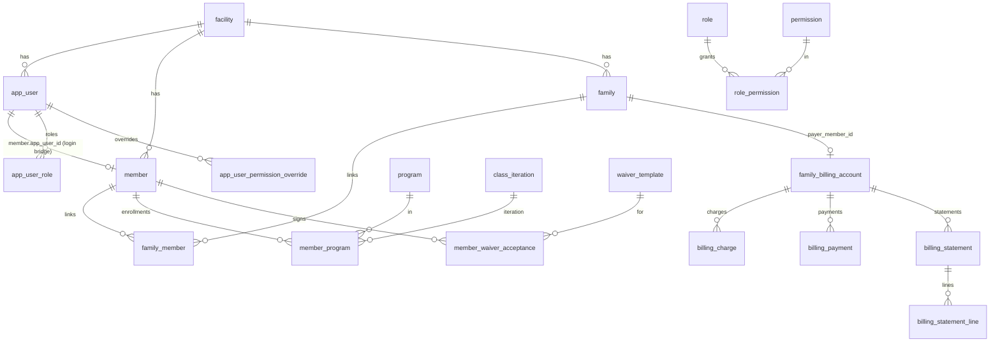

# Vortex Database Architecture

Canonical, durable record of **how the database is wired**: the connection/pool, how schema gets
applied, the schemas in use, and how entities relate across the whole system. **Anything that
touches the database — new table, column, index, enum, FK, trigger, view, migration, seed, or a
change to how migrations are applied — must be reflected here.** See the project rule
[.cursor/rules/database-architecture.mdc](../.cursor/rules/database-architecture.mdc).

This doc complements the portal docs:
[COACHING_CORNER_ROADMAP.md](COACHING_CORNER_ROADMAP.md),
[MEMBER_PORTAL_ROADMAP.md](MEMBER_PORTAL_ROADMAP.md),
[ADMIN_PORTAL_ROADMAP.md](ADMIN_PORTAL_ROADMAP.md).

> Engine: PostgreSQL. Driver: `pg`. Schemas: `public` (default) + `coaching`.

---

## 1. Connection & pool

There is **no central `db.js`**. The single production pool is created at module scope in
[backend/server.js](../backend/server.js) and injected into every route module:

```js
const pool = new Pool({
  connectionString: process.env.DATABASE_URL || process.env.DB_URL,
  user: process.env.DB_USER || 'postgres',
  host: process.env.DB_HOST || 'localhost',
  database: process.env.DB_NAME || 'vortex_athletics',
  password: process.env.DB_PASSWORD || 'password',
  port: process.env.DB_PORT || 5432,
  ssl: process.env.NODE_ENV === 'production' ? { rejectUnauthorized: false } : false,
})
```

- **Env vars:** `DATABASE_URL`/`DB_URL` (preferred) or discrete `DB_HOST/DB_PORT/DB_NAME/DB_USER/DB_PASSWORD`; `NODE_ENV=production` enables SSL; `DATABASE_SSL` is honored by `run-migration.js` only.
- **Injection:** the same `pool` is passed to `register*Routes(app, pool, …)` — analytics, scheduling, programs, platform, coach portal, schools, notes, db-queries. No DI container.
- **Lifecycle:** `pool.on('connect'|'error')` logging; `pool.end()` on `SIGINT`/`SIGTERM`.
- **CLI scripts** (`run-migration.js`, `run-unified-member-migration.js`, seeders, diagnostics) each create their **own** short-lived pool with the same env vars; they are not the server pool.
- Reference guides: `backend/SETUP_DATABASE.md`, `backend/env.example`.

---

## 2. Schemas

| Schema | Contents |
|--------|----------|
| `public` (default) | Identity/RBAC, members/families, programs/classes, scheduling, billing, waivers, analytics, schools, notes, events, highlights, inquiries |
| `coaching` | Coach portal: taxonomy, exercise library, workouts, training programs, challenges, assessments, assignments, sessions, periodization/load |

- `coaching` is created in `011_coaching_schema_taxonomy_permissions.sql` (`CREATE SCHEMA IF NOT EXISTS coaching;`).
- **`search_path` is never overridden.** `public` tables are referenced unqualified; **coaching objects are always qualified `coaching.*`**. Cross-schema references use explicit qualifiers (e.g. `REFERENCES public.facility(id)`, `public.skill_level`).

---

## 3. How schema gets applied (critical)

Three migration philosophies coexist. Knowing **which path owns a given change** is essential.


### 3.1 Boot path — `initDatabase()` then `initDbFeatureTables()`
Runs on every server start; idempotent SQL, **no `schema_migrations` tracking**.
- Inline DDL duplicates much of modules `001`–`005` (facility, app_user, program/class/class_iteration, member/family/member_program/emergency_contact/parent_guardian_authority).
- Calls `initAnalyticsTables()` ([backend/analytics/initTables.js](../backend/analytics/initTables.js)) and `initSchedulingTables()` ([backend/scheduling/initTables.js](../backend/scheduling/initTables.js)) — the latter also re-applies several scheduling `add_*.sql` files and `ensureDiscountEngineSchema`.
- Calls **`initPlatformTables(pool)`** ([backend/platform/initTables.js](../backend/platform/initTables.js)) which executes migrations **`008`–`031`** plus the explicitly-listed later files **`037`, `038`, `039`, `040`, `041`, `042`** (incl. all `coaching.*` + coach assignment scheduling link, waiver types, account invites, email verification, username-only minors, enrollment receipt tokens) from disk on every boot.
- Creates the family active-status trigger inline.
- `initDbFeatureTables(pool)` ([backend/dbfeatures/initTables.js](../backend/dbfeatures/initTables.js)) creates `school`/`member_school`/`note`/`saved_query` and seeds schools.

> Not applied on boot: numbered `006` (athlete-status triggers + `member_children_view`) and `007` (legacy drops). Those run via the CLI path only.

### 3.2 CLI path — `run-migration.js` (ledgered)
Manual/deploy-time (`npm run migrate` / `migrate:all`). Maintains a **`schema_migrations`** table
(`filename`, `checksum`, `applied_at`); each file applied once inside a transaction.
- `--all` order: numbered `NNN_*.sql` (001–025, with `add_class_iteration_table` after `002`, `add_athlete_program_table` after `004`), then an explicit `ADDON_MIGRATION_ORDER` of `add_*.sql`, then remaining `add_*.sql` alphabetically. Excludes `verify_module0.sql`, `seed_events.sql`, `add_members_tables.sql`.
- Also runs fresh-DB prerequisites, runtime base tables, and post-migration enum/column patches.
- Runbooks: `backend/RUN_PRODUCTION_MIGRATION.md`, `backend/STAGING_DEPLOYMENT_GUIDE.md`.

> Boot-vs-ledger gap: files applied on boot (008–025, scheduling, analytics) may not appear in `schema_migrations` until `migrate:all` runs. Re-running is safe because the SQL is idempotent.

### 3.3 Data migration — `run-unified-member-migration.js`
Manual CLI; migrates **rows** (`app_user`/`athlete`/`athlete_program` → `member`/`member_program`,
backfills `family_member`). Assumes `005` schema exists; does not touch `schema_migrations`.

### 3.4 Lazy per-route ensures
[backend/programs/schema.js](../backend/programs/schema.js) loads SQL patches on first relevant API
hit (program categories, discipline tags, discount engine), guarded by in-memory flags;
`ensureCoachOperationalTables` creates `coach_roster_note` on coach routes.

### 3.5 Idempotency conventions (required for any boot-applied SQL)
`CREATE TABLE IF NOT EXISTS`, `ALTER TABLE ... ADD COLUMN IF NOT EXISTS`,
`CREATE INDEX IF NOT EXISTS`, `INSERT ... ON CONFLICT DO NOTHING|UPDATE`,
`DROP TRIGGER IF EXISTS` before `CREATE TRIGGER`, and enum-add guards
(`DO $$ ... EXCEPTION WHEN duplicate_object THEN NULL`).

### 3.6 Where to put a new schema change
- **Coaching / platform change** → new numbered migration appended to the `initPlatformTables` list (idempotent). This is the established path for `008+`.
- **Public-domain change in an actively-initialized module** (scheduling/programs/analytics) → that module's init file, or an `add_*.sql` wired into the appropriate ensure/init + the `migrate:all` order.
- **Always** keep it idempotent if it runs on boot, and **update this doc** (data model + relationship map).

---

## 4. Relationship map

### 4.1 Tenant root: `facility`
`facility(id)` is the multi-tenant anchor. Direct `facility_id` FKs exist on `app_user`, `member`,
`family`, `program`, `class`, `programs`, `waiver_template`, `school`, discount/pricing tables, and
most `coaching.*` ownership tables. Scheduling tables are the main exception — they scope
**indirectly** via linked `program`/`member`.

### 4.2 Core identity graph



- **Login bridge:** `member.app_user_id` ties a portal person to a login identity. Passwords live on `app_user.password_hash`.
- **Canonical family link:** `family_member (family_id, member_id)` (not legacy `family.primary_*` / `family_guardian`, dropped in `009`). Child guardians also tracked via `member.parent_guardian_ids BIGINT[]`.
- **RBAC:** roles via `role`/`app_user_role`; permissions via `permission`/`role_permission`; per-user `allow`/`deny` in `app_user_permission_override`; master bypass via `MASTER_ADMIN`/`OWNER_ADMIN`/`admin_profile.is_master_admin`.

### 4.3 Programs taxonomy nuance (`programs` vs `program`)
After `unify_programs_scheduling.sql`: `programs` = top-level sport/category bucket;
`program` = enrollable class product (FK `programs_id`); `scheduling_form` links via `programs_id`
and/or `program_id`. `programs/schema.js#resolveProgramsSchema()` detects which names exist at
runtime — verify the target before writing queries.

### 4.4 Scheduling graph
`scheduling_form` → `scheduling_time_slot`, `scheduling_offering`,
`scheduling_slot_group`, `scheduling_signup` (`member_id → member`), `scheduling_auth_token`;
`events.scheduling_form_id → scheduling_form`. Waitlist/orphaned-signup columns added by
`add_scheduling_waitlist.sql` / `add_scheduling_orphaned_signups.sql`. The
`scheduling_category` / `scheduling_form_category` tables and every `category_id` FK were
**removed** in migration `033` (see §10) — each class now resolves slots/offerings directly
per form with no category sub-level.

### 4.5 Coaching graph (see [COACHING_CORNER_ROADMAP.md](COACHING_CORNER_ROADMAP.md) Part 5)
Strong cross-schema FKs to `public.facility`, `public.app_user`, `public.member`. **`023`**
adds `coaching.notification` (`recipient_member_id` / `recipient_user_id` FKs).
**`024`** adds `message_thread` / `message`. **`025`** adds `goal` / `achievement`. **Loose
BIGINT refs (no FK)** are deliberate for polymorphic/calendar wiring:
`plan_assignment.target_id`/`assignable_id` (polymorphic by `*_type`),
`session.facility_id`/`coach_user_id`/`assignment_id`/`program_id`/`class_iteration_id` (legacy — see §10.1),
`session_attendance.member_id`, `personal_record.source_result_id`, and `exercise_tag.facet_id`
(validated in app, not by FK).

### 4.6 Waivers ([037](../backend/migrations/037_waiver_types.sql))

`waiver_template` is versioned per facility (`UNIQUE (facility_id, name, version)`). Columns added in **037**:

| Column | Purpose |
|--------|---------|
| `waiver_type` | Stable code: `ASSUMPTION_OF_RISK`, `RELEASE_OF_LIABILITY`, `MEDICAL_EMERGENCY`, `PAYMENT_POLICY`, or custom/`NULL` |
| `is_required` | When `FALSE`, template is optional for compliance (`has_completed_waivers` ignores it) |
| `requires_resign` | Present since `008`; **not yet enforced** in compliance logic (see §10.7) |

Four canonical templates are seeded per facility on boot via [seedCanonicalWaivers.js](../backend/platform/seedCanonicalWaivers.js); the legacy generic **Athlete Waiver** placeholder is retired when canonical types are present.

`member_waiver_acceptance` stores one row per `(member_id, waiver_template_id)` with `signature_name`, `ip_address`, `user_agent`, optional `comments`, and `payment_policy_acknowledged` (037). Minors may have acceptances recorded with `accepted_by_member_id` set to a guardian.

**Minor-invite flow ([038](../backend/migrations/038_account_invite.sql), [043](../backend/migrations/043_account_invite_reminders.sql)):** `account_invite` holds bcrypt-hashed magic tokens (`token_hash`), AES-GCM `token_ciphertext` (for weekly reminder resends), `inviter_member_id` (minor), `invitee_email`, `pending_family_id`, JSON `pending_payload`, `used_at`, and `reminder_count` / `last_reminder_at` (up to four weekly reminders via [accountInviteReminderService.js](../backend/email/accountInviteReminderService.js)). Links do not expire; single-use only until parent completes signup. Token lookup for `POST /api/signup/invite/:token/verify` and `/complete` uses [findAccountInviteByToken](../backend/email/accountInviteTokens.js) (full bcrypt scan of unused rows, then used rows for a 410 response). Reminder resends decrypt `token_ciphertext` only — they must not rotate `token_hash` (that would invalidate the original email link). Parent completion uses `POST /api/signup/invite/:token/complete`; on success [ensureMemberAthleteAccount](../backend/platform/familySignup.js) links the minor `member` to `app_user` + `app_user_role` as `MEMBER_ATHLETE` (Member / Athlete label) even without login credentials.

**Email verification ([040](../backend/migrations/040_email_verification.sql)):** `app_user` gains `email_verified BOOLEAN NOT NULL DEFAULT FALSE` and `email_verified_at TIMESTAMPTZ`. `email_verification_token` holds single-use links (bcrypt-hashed `token_hash`, `user_id` FK, `email`, `expires_at`, `used_at`), mirroring `account_invite`. Issued via the shared service [email/emailVerificationService.js](../backend/email/emailVerificationService.js) on family signup (best-effort) and on demand at `POST /api/members/email/send-verification`; confirmed (publicly, the link is the secret) at `POST /api/verify-email/:token`, which sets `email_verified = TRUE` and marks the token used.

**Username-only minors ([041](../backend/migrations/041_app_user_nullable_email.sql)):** `app_user.email` is nullable; partial unique index `app_user_facility_email_unique` on `(facility_id, email) WHERE email IS NOT NULL`. Minors who use parent/guardian contact during family signup store `member.email = NULL`, link guardians via `parent_guardian_ids`, and may log in later with **username** (optional shared password). [ensureMemberAthleteAccount](../backend/platform/familySignup.js) creates the `app_user` + `MEMBER_ATHLETE` role for credential-less youth on family signup, portal add-family, and minor-invite parent completion. Transactional email resolves to a guardian when the member row has no email (see [memberContact.js](../backend/email/memberContact.js)).

**Enrollment receipt tokens ([042](../backend/migrations/042_enrollment_receipt_token.sql)):** `enrollment_receipt_token` holds bcrypt-hashed magic links (`token_hash`), `member_id` FK, optional `scheduling_signup_id` / `member_program_id` FKs, `recipient_email`, JSONB `payload` (athlete/program/schedule snapshot), `expires_at` (90 days), and `viewed_at`. Issued via [email/enrollmentReceiptService.js](../backend/email/enrollmentReceiptService.js) on every class/program enrollment path; verified (public, read-only) at `GET /api/enrollment-receipt/:token` (frontend page at `/registration/receipt?token=…`). Distinct from account email verification (`040`).

**Signup → billing ledger bridge ([046](../backend/migrations/046_signup_billing_charges.sql)):** scheduling signups created through the member-portal checkout (and any batch signup) now post a `billing_charge` row per signup via [scheduling/persistSignupCharges.js](../backend/scheduling/persistSignupCharges.js), called post-commit from `createSignupBatch`. Linkage: `billing_charge.source_type = 'scheduling_signup'`, `source_id = scheduling_signup.id`, `member_id = enrolled athlete`, `amount_cents = per-line net monthly price` from the order preview (after free passes + per-line discounts). Idempotency is enforced by the partial unique index `uq_billing_charge_source (source_type, source_id) WHERE source_id IS NOT NULL`. once-per-year additional fees are recorded in `additional_fee_redemption`. **Known gap:** order-level discounts and recurring/per-order additional fees are not yet split into `billing_charge` rows (only per-line class pricing is persisted). The member checkout enrolls one chosen family member via `POST /api/scheduling/auth/member-session` (now accepts `targetMemberId`, authorized same-family); the batch token is form-scoped so multi-class carts submit one batch per form.

**Stripe scaffold ([047](../backend/migrations/047_stripe_billing_scaffold.sql)), flag-gated:** `family_billing_account.stripe_customer_id` plus the partial unique index `uq_billing_payment_stripe_pi (stripe_payment_intent_id)` for idempotent webhook payment recording. All Stripe behavior is gated behind `STRIPE_ENABLED=true` + `STRIPE_SECRET_KEY` ([billing/stripeBilling.js](../backend/billing/stripeBilling.js), lazy SDK import). Endpoints: `POST /api/members/billing/checkout-session` (payer/guardian only, hosted Checkout for the outstanding balance) and `POST /api/stripe/webhook` (records `billing_payment` on `checkout.session.completed` / `payment_intent.succeeded`). Member balance + itemized ledger is served by `GET /api/members/billing/account`; admin per-charge ledger by `GET /api/admin/families/:familyId/charges`. Go-live (production keys, raw-body signature hardening, reconciliation, dunning) is intentionally deferred.

---

## 5. Triggers, views, functions

| Object | Defined in | On boot? |
|--------|-----------|----------|
| `update_family_active_status()` + `trigger_update_family_active` on `member` | server.js inline + `005` | ✅ |
| `calculate_family_active_status()` | server.js | ✅ (function only) |
| `update_member_athlete_status()` + trigger | `006` | ❌ CLI only |
| `update_athlete_status_on_enrollment()` + trigger on `member_program` | `006` | ❌ CLI only |
| `member_children_view` | `006` | ❌ CLI only |

---

## 6. Multi-tenancy

No row-level security. Scoping is **application-enforced**: auth context carries `facility_id`
(from `app_user`), and queries filter `WHERE ... facility_id = $n` (platform + coach routes do this
consistently). A default `facility` is inserted on boot if none exists; seed data assumes the first
facility.

---

## 7. Seeds

| Asset | Applied |
|-------|---------|
| Default `facility`, gymnastics `program` catalog, master admin | Boot inline (idempotent) |
| Coaching taxonomy (8 tenets, 8 methodologies, 6 physiology, etc.) | `011` `INSERT ... ON CONFLICT`, every boot |
| Coaching starter exercises (~20) | `019_coaching_seed_starter_library.sql`, every boot |
| Schools | `initDbFeatureTables` with `ON CONFLICT` |
| Events sample | `npm run seed-events` → `migrations/seed_events.sql` (excluded from `migrate:all`) |
| Dev members | `npm run seed:dev-members` |

---

## 8. DB documentation index (`backend/*.md`)

`SETUP_DATABASE.md` (local), `MIGRATION_GUIDE.md`, `RUN_PRODUCTION_MIGRATION.md`,
`STAGING_DEPLOYMENT_GUIDE.md`, `UNIFIED_MEMBER_MIGRATION.md`, `ACCESS_PRODUCTION_DATABASE.md`,
`PGADMIN_CONNECTION_GUIDE.md`, `INSTALL_PGADMIN.md`, `VIEW_DATABASE_GUIDE.md`,
`VIEW_DATABASE_TABLES.md`, `PSQL_COMMANDS.md`, `APP_USER_TABLE_PURPOSE.md`,
`MEMBER_TABLE_ANALYSIS.md`, `LEGACY_TABLE_CLEANUP_SUMMARY.md`.

---

## 9. Gotchas to remember

1. **Two definitions of early schema**: modules `001`–`005` exist both as numbered SQL (for `migrate:all`/fresh DB) and as inline DDL in `initDatabase()`. Keep them consistent if you change core tables.
2. **`006`/`007` are not boot-applied** — triggers/views/legacy-drops only land via `run-migration.js`.
3. **`initPlatformTables` re-runs `008`–`030` every boot** — anything added there must be idempotent.
4. **`programs` vs `program`** — confirm the table/column the query targets.
5. **Coaching uses mixed FK strictness** — polymorphic/calendar columns are intentionally loose BIGINTs.
6. **Boot-applied files may lag `schema_migrations`** until `migrate:all` runs; this is expected.

---

## 10. Cleanup backlog (legacy / candidate removal)

Items below are **not** dropped automatically. They are tracked here so we can migrate data, remove app
dependencies, then delete schema in a numbered migration. **Verify production row counts and code
references before dropping anything.**

Status key: **Active (legacy)** = still read/written in some paths · **Superseded** = replacement
exists · **Removed** = already dropped in a migration.

### 10.1 Class iterations & pre-scheduling class models (high priority)

| Object | Status | Superseded by | Notes |
|--------|--------|---------------|-------|
| `public.class_iteration` | Superseded | `scheduling_form` + `scheduling_offering` + `scheduling_time_slot` | Day/time “iterations” per program; still created on **every boot** in [server.js](../backend/server.js) and via `add_class_iteration_table.sql`. Member/coach UIs no longer assign coaches via iterations. |
| `member_program.iteration_id` | Active (legacy) | `scheduling_signup` (via `form_id` / `offering_id`) | FK to `class_iteration`. Still used by admin/member enrollment flows (`/api/members/enroll`, `EnrollmentForm`) and as a **fallback** in coach roster SQL. |
| `coach_class_assignment.class_iteration_id` | Active (legacy) | `coach_class_assignment.scheduling_form_id` ([030](../backend/migrations/030_coach_class_scheduling_form.sql)) | Nullable; kept in CHECK constraint for old rows. **Reassign** coaches in Admin → Coach Management using program + scheduling class, then drop column. |
| `coaching.session.class_iteration_id` | Active (legacy) | `scheduling_form_id` (column does not exist yet) | Loose BIGINT in [021](../backend/migrations/021_coaching_sessions_attendance.sql); coach session APIs still accept `class_iteration_id`. |
| `public.class` | Superseded | `scheduling_*` graph | Module 1 “scheduled class instances” (`day_of_week`, `start_time`). Rarely used; analytics joins in [analytics/adminHandlers.js](../backend/analytics/adminHandlers.js). |

**Suggested removal order (after data audit):**

1. Migrate any remaining `coach_class_assignment` rows off `class_iteration_id` → `scheduling_form_id`.
2. Stop writing `member_program.iteration_id`; backfill enrollments into `scheduling_signup` where missing.
3. Remove member/admin **iteration picker** APIs (`/api/members/programs/:programId/iterations`, admin class-iteration endpoints in server.js).
4. Drop FK columns: `member_program.iteration_id`, `coach_class_assignment.class_iteration_id`, `coaching.session.class_iteration_id`.
5. Drop table `class_iteration`; remove boot DDL in server.js and `run-class-iteration-migration.js`.
6. Evaluate dropping `public.class` after analytics queries use scheduling tables.

### 10.2 Enrollment dual-path (`member_program` vs scheduling)

| Object | Status | Notes |
|--------|--------|-------|
| `public.member_program` | Active (legacy) | Admin enrollment and older member flows. Coach rosters **prefer** `scheduling_signup` but still UNION `member_program`. Do not drop until all enrollments are scheduling signups or explicitly migrated. |
| `athlete_program` | Removed | Migrated to `member_program` ([005](../backend/migrations/005_unified_member_table.sql)); drop confirmed in [007](../backend/migrations/007_drop_all_legacy_member_tables.sql). |

### 10.3 Member / identity tables (mostly done)

| Object | Status | Notes |
|--------|--------|-------|
| `members`, `athlete`, `member_children`, `athlete_program` | Removed | [007](../backend/migrations/007_drop_all_legacy_member_tables.sql). See [LEGACY_TABLE_CLEANUP_SUMMARY.md](../backend/LEGACY_TABLE_CLEANUP_SUMMARY.md). |
| `family_guardian` | Removed | Dropped in [009](../backend/migrations/009_family_identity_cleanup.sql). Canonical link: `family_member`. |
| `family.primary_*` / legacy guardian columns on `family` | Removed | [009](../backend/migrations/009_family_identity_cleanup.sql). |
| `family_member.relationship_label` | Removed | Dropped in [045](../backend/migrations/045_drop_family_member_relationship_label.sql); unused free-text label on family membership. |
| `member.family_id` vs `family_member` junction | Active (dual path) | Some accounts have `member.family_id` set without `family_member` rows (invite signup, legacy create). Member portal enrollments previously queried junction only → empty list despite `scheduling_signup` rows. | Canonical: both in sync via `moveMemberToFamily` / `syncFamilyMemberLinks` ([familyMembers.js](../backend/platform/familyMembers.js)). |
| `member.parent_guardian_ids` + `parent_guardian_authority` | Active | **Keep** — used for minors messaging and guardian access. |
| `family.family_password_hash` + `/api/admin/families/verify` | Candidate | Admin signup + unified wizard (no password); column still written on family create in `familySignup.js` / legacy POST `/api/admin/members` | Verify zero public callers needing password join; then stop writing hash and drop column. |

### 10.3a Role model consolidation ([032](../backend/migrations/032_role_model_consolidation.sql))

Consolidated `user_role` enum + RBAC `role` catalog to four roles: `MASTER_ADMIN`, `ADMIN`, `COACH`, `MEMBER_ATHLETE`. Youth (<18), Athlete (18+) and Family Rep are **derived attributes**, not roles (youth/adult from `member.date_of_birth`; family rep from `family_billing_account.payer_member_id`).

| Object | Status | Replacement | Evidence / Notes |
|--------|--------|-------------|------------------|
| `user_role` value `OWNER_ADMIN` | Removed | `MASTER_ADMIN` | Migrated in [032](../backend/migrations/032_role_model_consolidation.sql); enum rebuilt via DROP/CREATE TYPE. |
| `user_role` values `MEMBER`, `PARENT_GUARDIAN`, `ATHLETE`, `ATHLETE_VIEWER` | Removed | `MEMBER_ATHLETE` | Migrated + deduped in [032](../backend/migrations/032_role_model_consolidation.sql). |
| `role` row `OWNER_ADMIN` | Removed | `MASTER_ADMIN` | Deleted in [032](../backend/migrations/032_role_model_consolidation.sql) **and again** in [035](../backend/migrations/035_remove_owner_admin_role.sql). Root cause of the re-appearance: `initPlatformTables()` ([platform/initTables.js](../backend/platform/initTables.js)) re-runs `008`/`011` on every boot, which used to re-seed `OWNER_ADMIN`; those seeds/grants were edited to drop it. Admin model is now `MASTER_ADMIN` + `ADMIN` only. |
| `role` rows `MEMBER`, `PARENT_GUARDIAN`, `ATHLETE`, `ATHLETE_VIEWER` | **Active (legacy) — re-seeded by boot** | `MEMBER_ATHLETE` | 032 deletes them, but [008](../backend/migrations/008_member_access_billing_waivers.sql) `INSERT INTO role …` is re-run every boot by `initPlatformTables()` and re-creates them. `PARENT_GUARDIAN` is still referenced in code ([platform/registerRoutes.js](../backend/platform/registerRoutes.js) `ctx.roles.includes('PARENT_GUARDIAN')`), so do **not** drop until callers are migrated. Candidate: trim the 008 role seed to the four canonical roles once member-side role checks are consolidated. |
| Boot enum re-add of `ATHLETE` | Removed | — | Deleted from `initDatabase()` ([server.js](../backend/server.js)) and `ensurePostMigrationSchema()` ([run-migration.js](../backend/run-migration.js)) so 032 is not undone each boot. Bootstrap `CREATE TYPE` now seeds the legacy superset (fresh DBs only, minus `OWNER_ADMIN`) and 032 narrows it. |
| `admins` table (legacy) | Active (legacy) | `app_user` | `initDatabase()` still migrates `admins` → `app_user` as `MASTER_ADMIN`; the legacy `/api/admin/login` `admins` path remains a fallback. Candidate for removal once no `admins` rows remain (verify zero rows before drop). |

### 10.3b Scheduling categories removed ([033](../backend/migrations/033_remove_scheduling_categories.sql))

The "class category" (scheduling-category) concept was fully removed: classes now resolve slots/offerings directly per form with no category sub-level. **Out of scope / still present:** `program_categories`, `program.category` enum, `program.programs_id`, `/api/admin/categories`, `/api/members/categories`, and `events.tag_category_ids` — these are unrelated "category" concepts.

| Object | Status | Replacement | Evidence / Notes |
|--------|--------|-------------|------------------|
| `scheduling_category` table | Removed | — (form is the unit) | Dropped in [033](../backend/migrations/033_remove_scheduling_categories.sql); boot DDL removed from [scheduling/initTables.js](../backend/scheduling/initTables.js). |
| `scheduling_form_category` table | Removed | — | Dropped in [033](../backend/migrations/033_remove_scheduling_categories.sql). |
| `scheduling_offering.category_id` (+ category unique indexes) | Removed | `UNIQUE (form_id) WHERE is_selected` | [033](../backend/migrations/033_remove_scheduling_categories.sql); single per-form selected-offering index recreated. |
| `scheduling_slot_group.category_id` | Removed | — | [033](../backend/migrations/033_remove_scheduling_categories.sql). |
| `scheduling_time_slot.category_id` | Removed | — | [033](../backend/migrations/033_remove_scheduling_categories.sql). |
| `scheduling_signup.category_id` | Removed | — | [033](../backend/migrations/033_remove_scheduling_categories.sql). |
| `program.scheduling_category_id` | Removed | — | [033](../backend/migrations/033_remove_scheduling_categories.sql); `ensureProgramSchedulingCategoryColumn()` deleted from [programs/schema.js](../backend/programs/schema.js). |
| `coach_class_assignment.scheduling_category_id` (+ indexes) | Removed | drill-down stops at class/form | [033](../backend/migrations/033_remove_scheduling_categories.sql) + boot cleanup in [coachRoster.js](../backend/platform/coachRoster.js); from [031](../backend/migrations/031_coach_assignment_drilldown.sql). |
| `pricing_benefit_selection.scope_level = 'category'` | Removed | `class` / `program` scopes | CHECK rewritten in [033](../backend/migrations/033_remove_scheduling_categories.sql) (rows deleted first). |
| `coaching.plan_assignment.target_type = 'category'` | Removed | other target types | CHECK rewritten in [033](../backend/migrations/033_remove_scheduling_categories.sql) / [029](../backend/migrations/029_coaching_video_submission_assign.sql) lineage. |
| Addon SQL `global_scheduling_categories.sql`, `add_program_scheduling_category.sql`, `add_no_category_default.sql` | Removed (unreferenced) | — | Dropped from `ADDON_MIGRATION_ORDER` in [run-migration.js](../backend/run-migration.js); files stubbed to `SELECT 1;`. |
| `backend/programs/noCategory.js`, `backend/scripts/split-merged-classes.mjs` | Removed | — | Files deleted; callers removed. |

### 10.4 Application / API surfaces to retire (no DDL until callers gone)

| Surface | Location | Replacement |
|---------|----------|-------------|
| `GET /api/admin/scheduling/legacy-forms` | [scheduling/handlers.js](../backend/scheduling/handlers.js) | `GET /api/admin/scheduling/forms` |
| Class iteration enrollment UI | `EnrollmentForm`, member enroll with `iterationId` | Scheduling signup / admin scheduling enroll |
| Coach assign “iteration” roster branches | [coachRoster.js](../backend/platform/coachRoster.js), [assignmentTargets.js](../backend/platform/assignmentTargets.js) | `scheduling_form_id` + `scheduling_signup` only |
| Inline `class_iteration` boot DDL | [server.js](../backend/server.js) ~lines 716–750, 9500+, 12376+ | Remove when table dropped |
| `account_invite` verify/complete `LIMIT 50` bcrypt scan | [familySignup.js](../backend/platform/familySignup.js) (pre-fix) | [findAccountInviteByToken](../backend/email/accountInviteTokens.js) — full scan; returns 410 when token matches a used invite |
| Reminder job rotating `token_hash` on decrypt failure | [accountInviteReminderService.js](../backend/email/accountInviteReminderService.js) `recoverInviteUrl` (pre-fix) | Skip reminder when `token_ciphertext` cannot be decrypted; never overwrite `token_hash` |
| `POST /api/members/family` 404 when solo account has no `family` row | [server.js](../backend/server.js) `getUserFamilyContext` only (pre-fix) | [ensureUserFamilyContext](../backend/server.js) on first portal add-family |
| `POST /api/members/family` raw INSERT with `status = 'family_active'` | [server.js](../backend/server.js) (pre-fix) | [createPortalFamilyMember](../backend/platform/familySignup.js) — same path as signup, `legacy` status, guardian email rules |
| `member_program` enrollments do **not** post a `billing_charge` | admin/legacy enroll path ([server.js](../backend/server.js) `/api/members/enroll`) | Only `scheduling_signup` enrollments bridge to the ledger via [persistSignupCharges.js](../backend/scheduling/persistSignupCharges.js). Candidate: extend or migrate legacy enrollments to scheduling so all charges are ledgered. Pre-drop check: `SELECT COUNT(*) FROM member_program mp WHERE NOT EXISTS (SELECT 1 FROM billing_charge c WHERE c.source_type='member_program' AND c.source_id = mp.id::text);` |

### 10.5 Migration / boot hygiene (tech debt, not user data)

| Item | Issue | Action |
|------|--------|--------|
| `030_coach_class_scheduling_form.sql` | Not in [initPlatformTables](../backend/platform/initTables.js) list until recently | Also applied via `ensureCoachClassAssignmentSchema()` at boot — add to init list or keep single ensure path. |
| Duplicate DDL for `001`–`005` | Inline in `initDatabase()` **and** numbered migrations | When editing core tables, update **both** or consolidate long-term. |
| `006` / `007` not boot-applied | Athlete-status triggers, legacy drops | Run `npm run migrate:all` on each environment so ledger matches reality. |
| `003` legacy member→family seed | Re-running on a post-`009` DB failed (`CREATE INDEX`/`INSERT` on dropped `family.primary_user_id`) and could resurrect dropped `athlete`/`family_guardian` tables | Now **idempotent/guarded**: the `primary_user_id` index and the seed `DO` block early-return when the modern schema is detected (`family.primary_user_id` absent or `members` table gone). |
| Ledger drift on long-lived dev DBs | Schema built via `initDatabase()` ahead of `schema_migrations`, so `migrate:all` re-attempts superseded migrations | Reconcile by backfilling `schema_migrations` for already-reflected files (skip them), but **never backfill genuinely-pending migrations** (verify the schema effect first — e.g., `033` was pending and had to actually run). |
| `032` backfilled-but-not-run on data DBs | When `032` is marked applied in `schema_migrations` without its body executing, legacy `app_user`/`app_user_role` role labels (`OWNER_ADMIN`, `MEMBER`, `PARENT_GUARDIAN`, `ATHLETE`, `ATHLETE_VIEWER`) and stray enum values persist, surfacing as old roles in Access Control / Members views | Fixed by the **idempotent** [036](../backend/migrations/036_normalize_legacy_account_roles.sql) (new file → always runs): re-remaps both columns to the canonical four, dedupes `app_user_role`, and rebuilds the `user_role` enum. **Must be run against the database the app actually uses** (set `DATABASE_URL`/`DB_*` for prod, then `npm run migrate:all`). |
| `member.status = 'legacy'` | Column **value**, not a table | Semantic label for non-enrolled stubs; rename only if product wants clearer vocabulary. |
| `waiver_template` name **Athlete Waiver** (no `waiver_type`) | Superseded | Four canonical types in [037](../backend/migrations/037_waiver_types.sql) | Boot seed in [008](../backend/migrations/008_member_access_billing_waivers.sql) + retire in [seedCanonicalWaivers.js](../backend/platform/seedCanonicalWaivers.js). Pre-drop: `SELECT COUNT(*) FROM waiver_template WHERE name = 'Athlete Waiver' AND waiver_type IS NULL AND active_to IS NULL;` |
| `member.has_completed_waivers` | Active (legacy flag) | Derived from `member_waiver_acceptance` + required templates | Can drift if rows are inserted outside `updateMemberWaiverCompatibility()`; accept-all and single-accept sync it. |
| `waiver_template.requires_resign` | Active (unused) | Version bump + re-accept flow | Column exists; compliance query counts all active templates regardless. |
| `008`/`011` re-run on every boot | `initPlatformTables()` executes `008`–`031` SQL on each start (idempotent), so any `INSERT INTO role`/`role_permission` seed re-creates rows that later numbered migrations (e.g. `032`/`035`) delete | Keep these seeds in sync with the canonical role set when consolidating; `OWNER_ADMIN` already trimmed. Long-term: move one-time RBAC seeds out of the boot-replayed range. |
| Legacy module0 scripts `run-module0-migration.js`, `verify-module0.js`, `diagnose-member-login.js` | Reference the **pre-032** `user_role` enum (`OWNER_ADMIN`, `PARENT_GUARDIAN`, `ATHLETE_VIEWER`) which no longer exists; running them would fail or seed dead values | Orphaned helpers — `Candidate` for deletion once confirmed unused by any runbook. |
| `scheduling_slot_group.display_label`, `scheduling_time_slot.display_label` | **Never existed** in schema/migrations; SQL in `orderPricing.js`, `memberEnrollments.js`, and admin pricing summary referenced them → `500` on `/api/scheduling/signups/order-preview` | **Removed** (2026-06): labels built in JS via [slotDisplayLabel.js](../backend/scheduling/slotDisplayLabel.js) from slot time/day columns. |

### 10.6 Pre-drop verification queries (run on staging/production)

```sql
-- Rows still tied to class_iteration
SELECT COUNT(*) FROM coach_class_assignment WHERE class_iteration_id IS NOT NULL;
SELECT COUNT(*) FROM member_program WHERE iteration_id IS NOT NULL;
SELECT COUNT(*) FROM coaching.session WHERE class_iteration_id IS NOT NULL;
SELECT COUNT(*) FROM class_iteration;

-- Coach assignments without scheduling class (program-only is OK)
SELECT COUNT(*) FROM coach_class_assignment
  WHERE scheduling_form_id IS NULL AND class_iteration_id IS NULL;

-- Enrollments only in member_program (no scheduling signup)
SELECT COUNT(*) FROM member_program mp
WHERE NOT EXISTS (
  SELECT 1 FROM scheduling_signup s
  WHERE s.member_id = mp.member_id AND s.orphaned_at IS NULL
);
```

When a cleanup migration ships, update this section (mark **Removed**, cite migration number) and
adjust §4 relationship diagrams (e.g. remove `class_iteration` from the ER chart when dropped).

### 10.7 Agent recording protocol (mandatory)

Cursor rule [`.cursor/rules/database-cleanup-backlog.mdc`](../.cursor/rules/database-cleanup-backlog.mdc)
(`alwaysApply: true`) requires agents to append new findings here during any DB/connectivity/SQL-backed
API investigation — not only when editing migration files.

**Add under the matching §10 subsection** (or create a new subsection if needed):

```markdown
| `{object}` | Candidate \| Active (legacy) \| Superseded | `{canonical replacement}` | Evidence: `{path or error}` |
```

- **Do not delete** schema or routes in the same turn unless the user explicitly requested cleanup.
- **Do not duplicate** rows already listed as Removed in §10.1–10.3.
- After adding rows, run or suggest the §10.6 verification queries when removal is implied.
- If the finding also changes live schema, update Parts 1–9 in the same PR (see
  [database-architecture.mdc](../.cursor/rules/database-architecture.mdc)).
