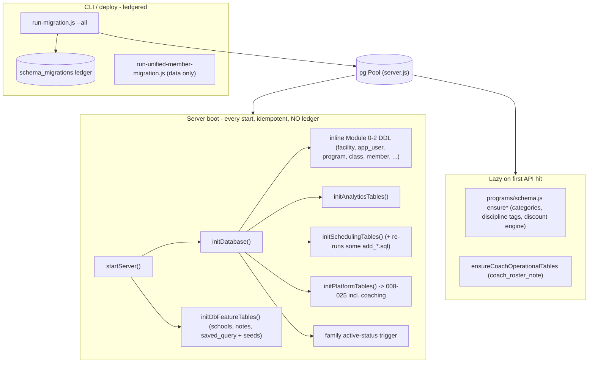
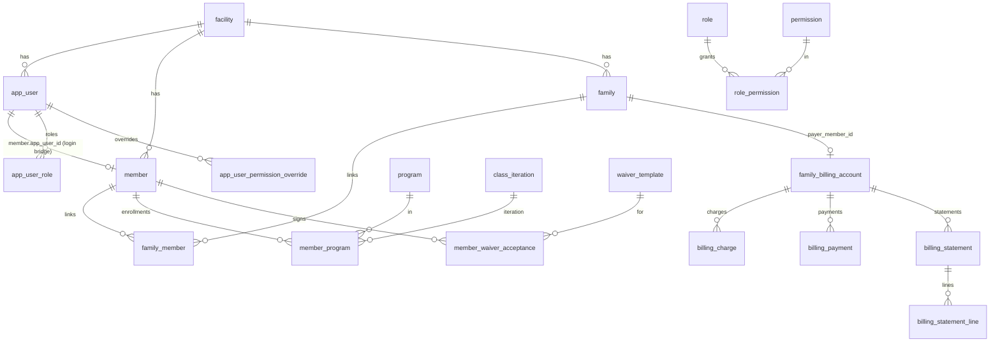

# Vortex Database Architecture

Canonical, durable record of **how the database is wired**: the connection/pool, how schema gets
applied, the schemas in use, and how entities relate across the whole system. **Anything that
touches the database — new table, column, index, enum, FK, trigger, view, migration, seed, or a
change to how migrations are applied — must be reflected here.** See the project rule
[.cursor/rules/database-architecture.mdc](../.cursor/rules/database-architecture.mdc).

This doc complements the portal docs:
[COACHING_CORNER_ROADMAP.md](COACHING_CORNER_ROADMAP.md),
[MEMBER_PORTAL_ROADMAP.md](MEMBER_PORTAL_ROADMAP.md),
[ADMIN_PORTAL_ROADMAP.md](ADMIN_PORTAL_ROADMAP.md).

> Engine: PostgreSQL. Driver: `pg`. Schemas: `public` (default) + `coaching`.

---

## 1. Connection & pool

There is **no central `db.js`**. The single production pool is created at module scope in
[backend/server.js](../backend/server.js) and injected into every route module:

```js
const pool = new Pool({
  connectionString: process.env.DATABASE_URL || process.env.DB_URL,
  user: process.env.DB_USER || 'postgres',
  host: process.env.DB_HOST || 'localhost',
  database: process.env.DB_NAME || 'vortex_athletics',
  password: process.env.DB_PASSWORD || 'password',
  port: process.env.DB_PORT || 5432,
  ssl: process.env.NODE_ENV === 'production' ? { rejectUnauthorized: false } : false,
})
```

- **Env vars:** `DATABASE_URL`/`DB_URL` (preferred) or discrete `DB_HOST/DB_PORT/DB_NAME/DB_USER/DB_PASSWORD`; `NODE_ENV=production` enables SSL; `DATABASE_SSL` is honored by `run-migration.js` only.
- **Injection:** the same `pool` is passed to `register*Routes(app, pool, …)` — analytics, scheduling, programs, platform, coach portal, schools, notes, db-queries. No DI container.
- **Lifecycle:** `pool.on('connect'|'error')` logging; `pool.end()` on `SIGINT`/`SIGTERM`.
- **CLI scripts** (`run-migration.js`, `run-unified-member-migration.js`, seeders, diagnostics) each create their **own** short-lived pool with the same env vars; they are not the server pool.
- Reference guides: `backend/SETUP_DATABASE.md`, `backend/env.example`.

---

## 2. Schemas

| Schema | Contents |
|--------|----------|
| `public` (default) | Identity/RBAC, members/families, programs/classes, scheduling, billing, waivers, analytics, schools, notes, events, highlights, inquiries |
| `coaching` | Coach portal: taxonomy, exercise library, workouts, training programs, challenges, assessments, assignments, sessions, periodization/load |

- `coaching` is created in `011_coaching_schema_taxonomy_permissions.sql` (`CREATE SCHEMA IF NOT EXISTS coaching;`).
- **`search_path` is never overridden.** `public` tables are referenced unqualified; **coaching objects are always qualified `coaching.*`**. Cross-schema references use explicit qualifiers (e.g. `REFERENCES public.facility(id)`, `public.skill_level`).

---

## 3. How schema gets applied (critical)

Three migration philosophies coexist. Knowing **which path owns a given change** is essential.



### 3.1 Boot path — `initDatabase()` then `initDbFeatureTables()`
Runs on every server start; idempotent SQL, **no `schema_migrations` tracking**.
- Inline DDL duplicates much of modules `001`–`005` (facility, app_user, program/class/class_iteration, member/family/member_program/emergency_contact/parent_guardian_authority).
- Calls `initAnalyticsTables()` ([backend/analytics/initTables.js](../backend/analytics/initTables.js)) and `initSchedulingTables()` ([backend/scheduling/initTables.js](../backend/scheduling/initTables.js)) — the latter also re-applies several scheduling `add_*.sql` files and `ensureDiscountEngineSchema`.
- Calls **`initPlatformTables(pool)`** ([backend/platform/initTables.js](../backend/platform/initTables.js)) which executes migrations **`008`–`025`** (incl. all `coaching.*`) from disk on every boot.
- Creates the family active-status trigger inline.
- `initDbFeatureTables(pool)` ([backend/dbfeatures/initTables.js](../backend/dbfeatures/initTables.js)) creates `school`/`member_school`/`note`/`saved_query` and seeds schools.

> Not applied on boot: numbered `006` (athlete-status triggers + `member_children_view`) and `007` (legacy drops). Those run via the CLI path only.

### 3.2 CLI path — `run-migration.js` (ledgered)
Manual/deploy-time (`npm run migrate` / `migrate:all`). Maintains a **`schema_migrations`** table
(`filename`, `checksum`, `applied_at`); each file applied once inside a transaction.
- `--all` order: numbered `NNN_*.sql` (001–025, with `add_class_iteration_table` after `002`, `add_athlete_program_table` after `004`), then an explicit `ADDON_MIGRATION_ORDER` of `add_*.sql`, then remaining `add_*.sql` alphabetically. Excludes `verify_module0.sql`, `seed_events.sql`, `add_members_tables.sql`.
- Also runs fresh-DB prerequisites, runtime base tables, and post-migration enum/column patches.
- Runbooks: `backend/RUN_PRODUCTION_MIGRATION.md`, `backend/STAGING_DEPLOYMENT_GUIDE.md`.

> Boot-vs-ledger gap: files applied on boot (008–025, scheduling, analytics) may not appear in `schema_migrations` until `migrate:all` runs. Re-running is safe because the SQL is idempotent.

### 3.3 Data migration — `run-unified-member-migration.js`
Manual CLI; migrates **rows** (`app_user`/`athlete`/`athlete_program` → `member`/`member_program`,
backfills `family_member`). Assumes `005` schema exists; does not touch `schema_migrations`.

### 3.4 Lazy per-route ensures
[backend/programs/schema.js](../backend/programs/schema.js) loads SQL patches on first relevant API
hit (program categories, discipline tags, discount engine), guarded by in-memory flags;
`ensureCoachOperationalTables` creates `coach_roster_note` on coach routes.

### 3.5 Idempotency conventions (required for any boot-applied SQL)
`CREATE TABLE IF NOT EXISTS`, `ALTER TABLE ... ADD COLUMN IF NOT EXISTS`,
`CREATE INDEX IF NOT EXISTS`, `INSERT ... ON CONFLICT DO NOTHING|UPDATE`,
`DROP TRIGGER IF EXISTS` before `CREATE TRIGGER`, and enum-add guards
(`DO $$ ... EXCEPTION WHEN duplicate_object THEN NULL`).

### 3.6 Where to put a new schema change
- **Coaching / platform change** → new numbered migration appended to the `initPlatformTables` list (idempotent). This is the established path for `008+`.
- **Public-domain change in an actively-initialized module** (scheduling/programs/analytics) → that module's init file, or an `add_*.sql` wired into the appropriate ensure/init + the `migrate:all` order.
- **Always** keep it idempotent if it runs on boot, and **update this doc** (data model + relationship map).

---

## 4. Relationship map

### 4.1 Tenant root: `facility`
`facility(id)` is the multi-tenant anchor. Direct `facility_id` FKs exist on `app_user`, `member`,
`family`, `program`, `class`, `programs`, `waiver_template`, `school`, discount/pricing tables, and
most `coaching.*` ownership tables. Scheduling tables are the main exception — they scope
**indirectly** via linked `program`/`member`.

### 4.2 Core identity graph



- **Login bridge:** `member.app_user_id` ties a portal person to a login identity. Passwords live on `app_user.password_hash`.
- **Canonical family link:** `family_member (family_id, member_id)` (not legacy `family.primary_*` / `family_guardian`, dropped in `009`). Child guardians also tracked via `member.parent_guardian_ids BIGINT[]`.
- **RBAC:** roles via `role`/`app_user_role`; permissions via `permission`/`role_permission`; per-user `allow`/`deny` in `app_user_permission_override`; master bypass via `MASTER_ADMIN`/`OWNER_ADMIN`/`admin_profile.is_master_admin`.

### 4.3 Programs taxonomy nuance (`programs` vs `program`)
After `unify_programs_scheduling.sql`: `programs` = top-level sport/category bucket;
`program` = enrollable class product (FK `programs_id`); `scheduling_form` links via `programs_id`
and/or `program_id`. `programs/schema.js#resolveProgramsSchema()` detects which names exist at
runtime — verify the target before writing queries.

### 4.4 Scheduling graph
`scheduling_form` → `scheduling_category`, `scheduling_time_slot`, `scheduling_offering`,
`scheduling_slot_group`, `scheduling_signup` (`member_id → member`), `scheduling_auth_token`;
`events.scheduling_form_id → scheduling_form`. Waitlist/orphaned-signup columns added by
`add_scheduling_waitlist.sql` / `add_scheduling_orphaned_signups.sql`.

### 4.5 Coaching graph (see [COACHING_CORNER_ROADMAP.md](COACHING_CORNER_ROADMAP.md) Part 5)
Strong cross-schema FKs to `public.facility`, `public.app_user`, `public.member`. **`023`**
adds `coaching.notification` (`recipient_member_id` / `recipient_user_id` FKs).
**`024`** adds `message_thread` / `message`. **`025`** adds `goal` / `achievement`. **Loose
BIGINT refs (no FK)** are deliberate for polymorphic/calendar wiring:
`plan_assignment.target_id`/`assignable_id` (polymorphic by `*_type`),
`session.facility_id`/`coach_user_id`/`assignment_id`/`program_id`/`class_iteration_id`,
`session_attendance.member_id`, `personal_record.source_result_id`, and `exercise_tag.facet_id`
(validated in app, not by FK).

---

## 5. Triggers, views, functions

| Object | Defined in | On boot? |
|--------|-----------|----------|
| `update_family_active_status()` + `trigger_update_family_active` on `member` | server.js inline + `005` | ✅ |
| `calculate_family_active_status()` | server.js | ✅ (function only) |
| `update_member_athlete_status()` + trigger | `006` | ❌ CLI only |
| `update_athlete_status_on_enrollment()` + trigger on `member_program` | `006` | ❌ CLI only |
| `member_children_view` | `006` | ❌ CLI only |

---

## 6. Multi-tenancy

No row-level security. Scoping is **application-enforced**: auth context carries `facility_id`
(from `app_user`), and queries filter `WHERE ... facility_id = $n` (platform + coach routes do this
consistently). A default `facility` is inserted on boot if none exists; seed data assumes the first
facility.

---

## 7. Seeds

| Asset | Applied |
|-------|---------|
| Default `facility`, gymnastics `program` catalog, master admin | Boot inline (idempotent) |
| Coaching taxonomy (8 tenets, 8 methodologies, 6 physiology, etc.) | `011` `INSERT ... ON CONFLICT`, every boot |
| Coaching starter exercises (~20) | `019_coaching_seed_starter_library.sql`, every boot |
| Schools | `initDbFeatureTables` with `ON CONFLICT` |
| Events sample | `npm run seed-events` → `migrations/seed_events.sql` (excluded from `migrate:all`) |
| Dev members | `npm run seed:dev-members` |

---

## 8. DB documentation index (`backend/*.md`)

`SETUP_DATABASE.md` (local), `MIGRATION_GUIDE.md`, `RUN_PRODUCTION_MIGRATION.md`,
`STAGING_DEPLOYMENT_GUIDE.md`, `UNIFIED_MEMBER_MIGRATION.md`, `ACCESS_PRODUCTION_DATABASE.md`,
`PGADMIN_CONNECTION_GUIDE.md`, `INSTALL_PGADMIN.md`, `VIEW_DATABASE_GUIDE.md`,
`VIEW_DATABASE_TABLES.md`, `PSQL_COMMANDS.md`, `APP_USER_TABLE_PURPOSE.md`,
`MEMBER_TABLE_ANALYSIS.md`, `LEGACY_TABLE_CLEANUP_SUMMARY.md`.

---

## 9. Gotchas to remember

1. **Two definitions of early schema**: modules `001`–`005` exist both as numbered SQL (for `migrate:all`/fresh DB) and as inline DDL in `initDatabase()`. Keep them consistent if you change core tables.
2. **`006`/`007` are not boot-applied** — triggers/views/legacy-drops only land via `run-migration.js`.
3. **`initPlatformTables` re-runs `008`–`025` every boot** — anything added there must be idempotent.
4. **`programs` vs `program`** — confirm the table/column the query targets.
5. **Coaching uses mixed FK strictness** — polymorphic/calendar columns are intentionally loose BIGINTs.
6. **Boot-applied files may lag `schema_migrations`** until `migrate:all` runs; this is expected.
