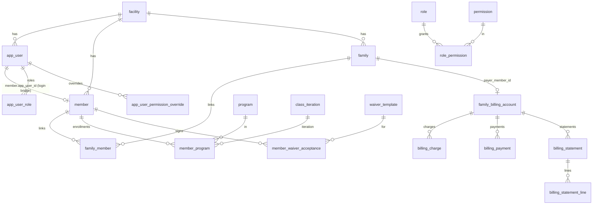

# Vortex Database Architecture

Canonical, durable record of **how the database is wired**: the connection/pool, how schema gets
applied, the schemas in use, and how entities relate across the whole system. **Anything that
touches the database — new table, column, index, enum, FK, trigger, view, migration, seed, or a
change to how migrations are applied — must be reflected here.** See the project rule
[.cursor/rules/database-architecture.mdc](../.cursor/rules/database-architecture.mdc).

This doc complements the portal docs:
[COACHING_CORNER_ROADMAP.md](COACHING_CORNER_ROADMAP.md),
[MEMBER_PORTAL_ROADMAP.md](MEMBER_PORTAL_ROADMAP.md),
[ADMIN_PORTAL_ROADMAP.md](ADMIN_PORTAL_ROADMAP.md).

> Engine: PostgreSQL. Driver: `pg`. Schemas: `public` (default) + `coaching`.

---

## 1. Connection & pool

There is **no central `db.js`**. The single production pool is created at module scope in
[backend/server.js](../backend/server.js) and injected into every route module:

```js
const pool = new Pool({
  connectionString: process.env.DATABASE_URL || process.env.DB_URL,
  user: process.env.DB_USER || 'postgres',
  host: process.env.DB_HOST || 'localhost',
  database: process.env.DB_NAME || 'vortex_athletics',
  password: process.env.DB_PASSWORD || 'password',
  port: process.env.DB_PORT || 5432,
  ssl: process.env.NODE_ENV === 'production' ? { rejectUnauthorized: false } : false,
})
```

- **Env vars:** `DATABASE_URL`/`DB_URL` (preferred) or discrete `DB_HOST/DB_PORT/DB_NAME/DB_USER/DB_PASSWORD`; `NODE_ENV=production` enables SSL; `DATABASE_SSL` is honored by `run-migration.js` only.
- **Injection:** the same `pool` is passed to `register*Routes(app, pool, …)` — analytics, scheduling, programs, platform, coach portal, schools, notes, db-queries. No DI container.
- **Lifecycle:** `pool.on('connect'|'error')` logging; `pool.end()` on `SIGINT`/`SIGTERM`.
- **CLI scripts** (`run-migration.js`, `run-unified-member-migration.js`, seeders, diagnostics) each create their **own** short-lived pool with the same env vars; they are not the server pool.
- Reference guides: `backend/SETUP_DATABASE.md`, `backend/env.example`.

---

## 2. Schemas

| Schema | Contents |
|--------|----------|
| `public` (default) | Identity/RBAC, members/families, programs/classes, scheduling, billing, waivers, analytics, schools, notes, events, highlights, inquiries |
| `coaching` | Coach portal: taxonomy, exercise library (**card v2** [`095`](../backend/migrations/095_coaching_exercise_card_v2.sql)), **skill library** (`093`), workouts, training programs, challenges, assessments, assignments, sessions, periodization/load |

- `coaching` is created in `011_coaching_schema_taxonomy_permissions.sql` (`CREATE SCHEMA IF NOT EXISTS coaching;`).
- **`search_path` is never overridden.** `public` tables are referenced unqualified; **coaching objects are always qualified `coaching.*`**. Cross-schema references use explicit qualifiers (e.g. `REFERENCES public.facility(id)`, `public.skill_level`).

---

## 3. How schema gets applied (critical)

Three migration philosophies coexist. Knowing **which path owns a given change** is essential.


### 3.1 Boot path — `initDatabase()` then `initDbFeatureTables()`
Runs on every server start; idempotent SQL, **no `schema_migrations` tracking**.
- Inline DDL duplicates much of modules `001`–`005` (facility, app_user, program/class/class_iteration, member/family/member_program/emergency_contact/parent_guardian_authority).
- Calls `initAnalyticsTables()` ([backend/analytics/initTables.js](../backend/analytics/initTables.js)) and `initSchedulingTables()` ([backend/scheduling/initTables.js](../backend/scheduling/initTables.js)) — the latter also re-applies several scheduling `add_*.sql` files and `ensureDiscountEngineSchema`.
- Calls **`initPlatformTables(pool)`** ([backend/platform/initTables.js](../backend/platform/initTables.js)) which executes migrations **`008`–`031`** plus the explicitly-listed later files **`037`, `038`, `039`, `040`, `041`, `042`** (incl. all `coaching.*` + coach assignment scheduling link, waiver types, account invites, email verification, username-only minors, enrollment receipt tokens) from disk on every boot.
- Creates the family active-status trigger inline.
- `initDbFeatureTables(pool)` ([backend/dbfeatures/initTables.js](../backend/dbfeatures/initTables.js)) creates `school`/`member_school`/`note`/`saved_query` and seeds schools.

> Not applied on boot: numbered `006` (athlete-status triggers + `member_children_view`) and `007` (legacy drops). Those run via the CLI path only.

### 3.2 CLI path — `run-migration.js` (ledgered)
Manual/deploy-time (`npm run migrate` / `migrate:all`). Maintains a **`schema_migrations`** table
(`filename`, `checksum`, `applied_at`); each file applied once inside a transaction.
- `--all` order: numbered `NNN_*.sql` (001–025, with `add_class_iteration_table` after `002`, `add_athlete_program_table` after `004`), then an explicit `ADDON_MIGRATION_ORDER` of `add_*.sql`, then remaining `add_*.sql` alphabetically. Excludes `verify_module0.sql`, `seed_events.sql`, `add_members_tables.sql`.
- Also runs fresh-DB prerequisites, runtime base tables, and post-migration enum/column patches.
- Runbooks: `backend/RUN_PRODUCTION_MIGRATION.md`, `backend/STAGING_DEPLOYMENT_GUIDE.md`.

> Boot-vs-ledger gap: files applied on boot (008–025, scheduling, analytics) may not appear in `schema_migrations` until `migrate:all` runs. Re-running is safe because the SQL is idempotent.

### 3.3 Data migration — `run-unified-member-migration.js`
Manual CLI; migrates **rows** (`app_user`/`athlete`/`athlete_program` → `member`/`member_program`,
backfills `family_member`). Assumes `005` schema exists; does not touch `schema_migrations`.

### 3.4 Lazy per-route ensures
[backend/programs/schema.js](../backend/programs/schema.js) loads SQL patches on first relevant API
hit (program categories, discipline tags, discount engine), guarded by in-memory flags;
`ensureCoachOperationalTables` creates `coach_roster_note` on coach routes.

### 3.5 Idempotency conventions (required for any boot-applied SQL)
`CREATE TABLE IF NOT EXISTS`, `ALTER TABLE ... ADD COLUMN IF NOT EXISTS`,
`CREATE INDEX IF NOT EXISTS`, `INSERT ... ON CONFLICT DO NOTHING|UPDATE`,
`DROP TRIGGER IF EXISTS` before `CREATE TRIGGER`, and enum-add guards
(`DO $$ ... EXCEPTION WHEN duplicate_object THEN NULL`).

### 3.6 Where to put a new schema change
- **Coaching / platform change** → new numbered migration appended to the `initPlatformTables` list (idempotent). This is the established path for `008+`.
- **Public-domain change in an actively-initialized module** (scheduling/programs/analytics) → that module's init file, or an `add_*.sql` wired into the appropriate ensure/init + the `migrate:all` order.
- **Always** keep it idempotent if it runs on boot, and **update this doc** (data model + relationship map).

---

## 4. Relationship map

### 4.1 Tenant root: `facility`
`facility(id)` is the multi-tenant anchor. Direct `facility_id` FKs exist on `app_user`, `member`,
`family`, `program`, `class`, `programs`, `waiver_template`, `school`, discount/pricing tables, and
most `coaching.*` ownership tables. Scheduling tables are the main exception — they scope
**indirectly** via linked `program`/`member`.

### 4.2 Core identity graph



- **Login bridge:** `member.app_user_id` ties a portal person to a login identity. Passwords live on `app_user.password_hash`.
- **Canonical family link:** `family_member (family_id, member_id)` (not legacy `family.primary_*` / `family_guardian`, dropped in `009`). Child guardians also tracked via `member.parent_guardian_ids BIGINT[]`.
- **RBAC:** roles via `role`/`app_user_role`; permissions via `permission`/`role_permission`; per-user `allow`/`deny` in `app_user_permission_override`; master bypass via `MASTER_ADMIN`/`OWNER_ADMIN`/`admin_profile.is_master_admin`.

### 4.3 Programs taxonomy nuance (`programs` vs `program`)
After `unify_programs_scheduling.sql`: `programs` = top-level sport/category bucket;
`program` = enrollable class product (FK `programs_id`); `scheduling_form` links via `programs_id`
and/or `program_id`. `programs/schema.js#resolveProgramsSchema()` detects which names exist at
runtime — verify the target before writing queries.

**Abridged calendar labels** ([052](../backend/migrations/052_scheduling_abridged_names.sql)):
`programs.abridged_name` and `program.abridged_name` (plus legacy `program_categories`) store
short monikers for calendar chips; backfilled from `display_name`. Calendar queries use
`COALESCE(abridged_name, display_name)` in [calendarQuery.js](../backend/scheduling/calendarQuery.js).
Admin create/edit forms expose **Abridged name** directly under display name.

### 4.4 Scheduling graph
`scheduling_form` → `scheduling_time_slot`, `scheduling_offering`,
`scheduling_slot_group`, `scheduling_signup` (`member_id → member`), `scheduling_auth_token`;
`events.scheduling_form_id → scheduling_form`. Waitlist/orphaned-signup columns added by
`add_scheduling_waitlist.sql` / `add_scheduling_orphaned_signups.sql`. The
`scheduling_category` / `scheduling_form_category` tables and every `category_id` FK were
**removed** in migration `033` (see §10) — each class now resolves slots/offerings directly
per form with no category sub-level. **`scheduling_slot_group.inherits_offering_dates`**
([051](../backend/migrations/051_scheduling_slot_group_inherits_offering.sql)): when true,
active dates follow the linked `scheduling_offering`; offering date edits cascade to matching
slot groups and time slots via `updateOffering` in [handlers.js](../backend/scheduling/handlers.js).

### 4.5 Coaching graph (see [COACHING_CORNER_ROADMAP.md](COACHING_CORNER_ROADMAP.md) Part 5)
Strong cross-schema FKs to `public.facility`, `public.app_user`, `public.member`. **`023`**
adds `coaching.notification` (`recipient_member_id` / `recipient_user_id` FKs).
**`024`** adds `message_thread` / `message`. **`060_coaching_message_enhancements.sql`**
adds `message_thread.subject_locked`, nullable `message_thread.member_id` (staff-only threads),
and `message_thread_participant` (`thread_id` + optional `user_id` / `member_id` for group
recipients). **`061_coaching_message_sender_portal.sql`** adds `message.sender_portal`
(`admin` | `coach` | `member`) so UI can color bubbles by portal origin for multi-role users.
**`062_coaching_message_thread_favorite.sql`** adds `message_thread_favorite` (per user/member
starred threads, sorted to top of list by `favorited_at`). **`063_coaching_message_thread_inbox_hide.sql`**
adds `message_thread_inbox_hide` (per-user inbox archive; cleared when thread gets a new message).
**`025`** adds `goal` / `achievement`. **Loose
BIGINT refs (no FK)** are deliberate for polymorphic/calendar wiring:
`plan_assignment.target_id`/`assignable_id` (polymorphic by `*_type`),
`session.facility_id`/`coach_user_id`/`assignment_id`/`program_id`/`class_iteration_id` (legacy — see §10.1),
`session_attendance.member_id`, `personal_record.source_result_id`, and `exercise_tag.facet_id`
(validated in app, not by FK).

**Event calendar + messaging ([070](../backend/migrations/070_event_calendar_and_rsvp.sql), [073](../backend/migrations/073_event_calendar_item_classes.sql), [074](../backend/migrations/074_member_messaging_create_permissions.sql), [077](../backend/migrations/077_event_calendar_item_what_to_bring.sql)):** `coaching.event_calendar_item` stores 5 Ws rows per `public.events` row; **`077`** adds `what_to_bring JSONB` (packing list line items). **`073`** adds junction `coaching.event_calendar_item_class (calendar_item_id, scheduling_form_id)` so schedule inbox rows can scope visibility to enrolled classes. Event threads link via `coaching.message_thread_link` (`object_type='event'`, roles `canonical` | `discussion`); multiple discussion boards per event are supported via [messageEventThreads.js](../backend/platform/messageEventThreads.js) `provisionAdditionalEventBoard`. **`074`** catalogs member-only RBAC keys `event_boards.create` and `event_calendar.create` (not granted to `MEMBER_ATHLETE` by default; assign via `app_user_permission_override` in Admin → Accounts → Access).

**Exercise card v2 ([095](../backend/migrations/095_coaching_exercise_card_v2.sql), registered in [initTables.js](../backend/platform/initTables.js)):** extends `coaching.exercise` with denormalized **movement identity** (`movement_family`, `primary_phase_key`, `phase_subrole`, `primary_order_slot`) synced from the primary `exercise_phase_profile` on save, plus JSONB sections `movement_requirements`, `coaching_execution`, `pairing_logic`, `media_library`. Multi-phase `exercise_phase_profile` rows remain canonical for the Needs Engine; the identity block powers library cards and filters. **`education_content`** gains `why_it_works` and `physiological_rationale` (distinct from methodology/tenet rationale). **`exercise_scaling_profile`** gains `cohort_key` (7 fixed cohorts: youth_beginner … pregnancy_postpartum), `requires_medical_clearance`, and optional `gender_specific_notes` (notes only — not gender-split prescriptions). **`exercise_safety_profile`** gains `contraindications TEXT[]`. **`exercise_dosage_profile.volume_unit`** CHECK adds `'breaths'`. API: [exerciseProgramming.js](../backend/platform/exerciseProgramming.js) `buildExerciseCard` / `saveExerciseProgramming` / `validateExercisePublishReady`; `GET /api/coach/exercises/:id/card` returns canonical card JSON. Coach UI: 11-section editor + detail modal ([ExerciseEditor.tsx](../src/components/coach/ExerciseEditor.tsx)).

**Prepare & Access subrole hierarchy ([096](../backend/migrations/096_coaching_prepare_and_access_subroles.sql)):** `coaching.phase_subrole` (5 RAMP subroles) + `phase_order_slot.subrole_key` link fine slots to subroles. `exercise.phase_subrole` derived from `order_slot` on save ([phaseSubrole.js](../backend/platform/phaseSubrole.js)).

**Prepare & Access movement seed ([097](../backend/migrations/097_coaching_prepare_and_access_seed.sql)):** Idempotent seed of **50** canonical warm-up movements (49 inserts + `worlds-greatest-stretch` update) with full card v2 fields: movement identity, `movement_requirements`, `coaching_execution`, taxonomy tags (incl. `body_region`), `prepare_and_access` phase profiles, default dosage/safety/regimen, six cohort scaling rows per exercise, and Why-layer `education_content`. Generator: [scripts/generate-097-prepare-seed.mjs](../scripts/generate-097-prepare-seed.mjs).

**Foundation Prepare/Access cards 1–10 ([098](../backend/migrations/098_coaching_prepare_and_access_foundation_cards.sql)):** Rich card v2 upgrade for the first 10 foundation movements (breathing, spine, T-spine, hip rotation, integrated mobility) with weighted taxonomy, RPE dosage, cohort scaling prose, pairing/media, and `why_it_works`. Adds `hip_rotation` order slot. Spec: [EXERCISE_CARD_SPEC.md](EXERCISE_CARD_SPEC.md). Generator: [scripts/generate-098-foundation-cards.mjs](../scripts/generate-098-foundation-cards.mjs).

**Prepare/Access content support ([099](../backend/migrations/099_coaching_prepare_and_access_content_support.sql)):** `body_region.foot` taxonomy row; `validation_rule` education `prepare_readiness_stealing` for workout validator. Coach filters: `?session_need=`, `?max_fatigue_cost=`. See [EXERCISE_CARD_SPEC.md](EXERCISE_CARD_SPEC.md) §8.

**Upper-body Prepare/Access cards 11–20 ([100](../backend/migrations/100_coaching_prepare_and_access_upper_body_cards.sql)):** Rich card v2 upgrade for wrist/shoulder/scapular upper-body access (097 slugs retained). Adds fine slots `hand_activation`, `shoulder_prep`, `shoulder_cars`; resequences upper-body `order_index` band (115–123) and bumps lower-body mobilize slots to 130+. Populates `good_for_sessions` on all 10 cards. Validation education: `prepare_upper_body_access`. Generator: [scripts/generate-100-upper-body-cards.mjs](../scripts/generate-100-upper-body-cards.mjs).

**Lower-leg Prepare/Access cards 21–30 ([101](../backend/migrations/101_coaching_prepare_and_access_lower_leg_cards.sql)):** Rich card v2 upgrade for foot/ankle/shin/calf/elastic readiness (097 slugs retained). Adds fine slots `ankle_cars`, `shin_activation`, `calf_achilles_prep`, `foot_balance_prep`, `elastic_prep`; resequences foot/ankle band (128–136) and bumps `hip_mobility`/`squat_access` to 140+. Equipment taxonomy: `wall`, `jump_rope`. Validation education: `prepare_lower_leg_readiness`; workout validator rules in [workoutValidation.js](../backend/platform/workoutValidation.js). Generator: [scripts/generate-101-lower-leg-cards.mjs](../scripts/generate-101-lower-leg-cards.mjs).

**Hip/pelvis Prepare/Access cards 31–44 ([102](../backend/migrations/102_coaching_prepare_and_access_hip_access_cards.sql)):** Rich card v2 upgrade for hip/pelvis/squat/lunge/frontal-plane access (097 slugs retained). Adds fine slots `hip_swing_sagittal`, `hip_swing_frontal`, `hip_rotation_integrated`, `hip_cars`, `adductor_mobility`, `dynamic_hip_mobility`, `dynamic_quad_hip_flexor`, `hip_transition`, `frontal_plane_mobility`, `lateral_lunge_prep`; resequences hip band (127–132, 144–150). Card 35 (`9090-hip-switch`) supersedes foundation card #8 placement. Validation education: `prepare_hip_access_readiness`. Generator: [scripts/generate-102-hip-access-cards.mjs](../scripts/generate-102-hip-access-cards.mjs).

**Activation/integration Prepare/Access cards 45–50 ([103](../backend/migrations/103_coaching_prepare_and_access_activation_cards.sql)):** Rich card v2 upgrade completing the 50-card Prepare & Access library (097 slugs retained). Adds fine slots `glute_core_integration`, `cross_body_core`, `lateral_hip_activation`, `marching_mechanics`; resequences activation band (137–140), integrate @ 151, potentiate @ 160; moves `integrated_mobility` → 165. Card 48 (`bird-dog`) subrole/slot change: integrate/`cross_body_core`. Validation education: `prepare_activation_readiness`; workout validator rules in [workoutValidation.js](../backend/platform/workoutValidation.js). Generator: [scripts/generate-103-activation-cards.mjs](../scripts/generate-103-activation-cards.mjs).

**Movement Intelligence infrastructure ([104](../backend/migrations/104_coaching_skill_phase_infrastructure.sql)):** Adds 5 skill subroles, ~41 fine `phase_order_slot` rows (bands 211–256), extends `exercise_phase_subrole_check`, subrole education, and `movement_intelligence_readiness` validation education. Updates [phaseSubrole.js](../backend/platform/phaseSubrole.js) and coach editor subrole grouping for skill phase.

**Movement Intelligence 50-card seed ([105](../backend/migrations/105_coaching_movement_intelligence_seed.sql)):** Thin publish-ready seed for all 50 skill movements; upgrades legacy slugs `hollow-body-hold`, `cartwheel`, `handstand-hold`, `round-off`; dual profile on `a-march` (Prepare primary + Skill `technical_march`). Generator: [scripts/generate-105-skill-seed.mjs](../scripts/generate-105-skill-seed.mjs).

**Skill shape cards 1–10 ([106](../backend/migrations/106_coaching_skill_shape_cards.sql)):** Rich card v2 for Shape & Position Intelligence cluster. Validation education: `skill_shape_readiness`; workout validator `analyzeSkillMovementIntelligenceReadiness` in [workoutValidation.js](../backend/platform/workoutValidation.js). Generator: [scripts/generate-106-skill-shape-cards.mjs](../scripts/generate-106-skill-shape-cards.mjs).

**Skill tumbling cards 11–24 ([107](../backend/migrations/107_coaching_skill_tumbling_cards.sql)):** Rich card v2 for Rotation / Inversion / Tumbling Foundations cluster (`rotation_inversion_tumbling_foundations`, slots 221–232). Equipment taxonomy: `wedge`, `panel_mat`, `line_tape`. Validation education: `skill_tumbling_readiness`; workout validator `analyzeSkillTumblingReadiness` in [workoutValidation.js](../backend/platform/workoutValidation.js). Generator: [scripts/generate-107-skill-tumbling-cards.mjs](../scripts/generate-107-skill-tumbling-cards.mjs). Data: [scripts/data/skill-tumbling-cards-11-24.mjs](../scripts/data/skill-tumbling-cards-11-24.mjs).

**Skill sprint cards 25–34 ([108](../backend/migrations/108_coaching_skill_sprint_cards.sql)):** Rich card v2 for Locomotion & Sprint Mechanics cluster (`locomotion_sprint_mechanics`, slots 233–240). Equipment taxonomy: `mirror`. Validation education: `skill_sprint_readiness`; workout validators `analyzeSkillSprintReadiness` and `analyzeSprintPrepBeforeOutput` in [workoutValidation.js](../backend/platform/workoutValidation.js). **`a-march`:** migration 108 enriches Skill copy/tags only — `primary_phase_key` remains `prepare_and_access` from migration 097; Skill slot is `technical_march` (not Prepare `marching_mechanics`). Generator: [scripts/generate-108-skill-sprint-cards.mjs](../scripts/generate-108-skill-sprint-cards.mjs). Data: [scripts/data/skill-sprint-cards-25-34.mjs](../scripts/data/skill-sprint-cards-25-34.mjs).

**Skill balance cards 35–44 ([109](../backend/migrations/109_coaching_skill_balance_cards.sql)):** Rich card v2 for Balance / Coordination / Rhythm cluster (`balance_coordination_rhythm`, slots resequenced to 260–268). Equipment taxonomy: `agility_ladder`, `low_hurdles`. Validation education: `skill_balance_readiness`; balance rules in `analyzeSkillMovementIntelligenceReadiness` (`skill_balance_after_fitness`, `skill_ladder_pass_volume`, `skill_skipping_high_intensity`). Generator: [scripts/generate-109-skill-balance-cards.mjs](../scripts/generate-109-skill-balance-cards.mjs). Data: [scripts/data/skill-balance-cards-35-44.mjs](../scripts/data/skill-balance-cards-35-44.mjs).

**Skill perception cards 45–50 ([110](../backend/migrations/110_coaching_skill_perception_cards.sql)):** Rich card v2 for Perception-Action / Reactive Movement cluster (`perception_action_reactive_movement`, slots resequenced to 280–285). Completes the 50-card Skill library. Equipment taxonomy: `tennis_ball`, `reaction_ball`. Validation education: `skill_perception_readiness`; workout validator `analyzeSkillPerceptionReadiness` in [workoutValidation.js](../backend/platform/workoutValidation.js). Generator: [scripts/generate-110-skill-perception-cards.mjs](../scripts/generate-110-skill-perception-cards.mjs). Data: [scripts/data/skill-perception-cards-45-50.mjs](../scripts/data/skill-perception-cards-45-50.mjs).

**Output phase infrastructure ([111](../backend/migrations/111_coaching_output_phase_infrastructure.sql)):** Six Output subroles (`acceleration_start_speed` … `reactive_agility_tumbling_output`, order_index 310–360), 35 fine `phase_order_slot` rows (311–365 bands), legacy coarse Output slots backfilled with `subrole_key`, validation education `output_readiness`. Extends `exercise_phase_subrole_check` for Output subroles; `phaseSubrole.js` derives subroles for `output` phase.

**Output seed library ([112](../backend/migrations/112_coaching_output_seed.sql)):** 50 published Output exercises (cards 1–50: acceleration, max-velocity, elastic/plyo rudiments, jump/throw power, decel/COD, reactive agility/tumbling output). Default dosage: low volume, RPE 7–9, full rest; regimen `minimum_hours_between_hard_exposures = 48`. Generator: [scripts/generate-111-output-seed.mjs](../scripts/generate-111-output-seed.mjs). Data: [scripts/data/output-movements-top50.mjs](../scripts/data/output-movements-top50.mjs). General validator: `analyzeOutputReadiness`.

**Output acceleration cards 1–10 ([113](../backend/migrations/113_coaching_output_acceleration_cards.sql)):** Rich card v2 for Acceleration & Start Speed cluster (`acceleration_start_speed`, slots 311–316). Equipment taxonomy: `incline_surface`, `harness`. Validation education: `output_acceleration_readiness`; workout validator `analyzeOutputAccelerationReadiness` in [workoutValidation.js](../backend/platform/workoutValidation.js). Generator: [scripts/generate-113-output-acceleration-cards.mjs](../scripts/generate-113-output-acceleration-cards.mjs). Data: [scripts/data/output-acceleration-cards-1-10.mjs](../scripts/data/output-acceleration-cards-1-10.mjs).

**Output max-velocity cards 11–18 ([114](../backend/migrations/114_coaching_output_max_velocity_cards.sql)):** Rich card v2 for Max-Velocity Exposure cluster (`max_velocity_exposure`, slots 321–325). Validation education: `output_max_velocity_readiness`; workout validator `analyzeOutputMaxVelocityReadiness`. Generator: [scripts/generate-114-output-max-velocity-cards.mjs](../scripts/generate-114-output-max-velocity-cards.mjs). Data: [scripts/data/output-max-velocity-cards-11-18.mjs](../scripts/data/output-max-velocity-cards-11-18.mjs).

**Output elastic cards 19–27 ([115](../backend/migrations/115_coaching_output_elastic_cards.sql)):** Rich card v2 for Elastic Stiffness / Plyometric Rudiments cluster (`elastic_stiffness_plyometric_rudiments`, slots 331–337). Equipment taxonomy: `line_tape`, `low_hurdles`, `box`. Validation education: `output_elastic_readiness`; workout validator `analyzeOutputElasticReadiness` in [workoutValidation.js](../backend/platform/workoutValidation.js). Generator: [scripts/generate-115-output-elastic-cards.mjs](../scripts/generate-115-output-elastic-cards.mjs). Data: [scripts/data/output-elastic-cards-19-27.mjs](../scripts/data/output-elastic-cards-19-27.mjs).

**Output jump/throw power cards 28–38 ([117](../backend/migrations/117_coaching_output_jump_power_cards.sql)):** Rich card v2 for Jump, Throw & Explosive Power cluster (`jump_throw_explosive_power`, slots 341–347). Equipment taxonomy: `slam_ball`, `jump_mat`. Validation education: `output_jump_power_readiness`; workout validator `analyzeOutputJumpPowerReadiness` in [workoutValidation.js](../backend/platform/workoutValidation.js). Generator: [scripts/generate-117-output-jump-power-cards.mjs](../scripts/generate-117-output-jump-power-cards.mjs). Data: [scripts/data/output-jump-power-cards-28-38.mjs](../scripts/data/output-jump-power-cards-28-38.mjs).

**Output deceleration / COD cards 39–45 ([118](../backend/migrations/118_coaching_output_decel_cod_cards.sql)):** Rich card v2 for Deceleration / COD Power cluster (`deceleration_cod_power`, slots 351–354). Optional `setup_metadata` and `cod_stress_profile` on `movement_requirements`. Validation education: `output_decel_cod_readiness`; workout validator `analyzeOutputDecelCodReadiness`. Generator: [scripts/generate-118-output-decel-cod-cards.mjs](../scripts/generate-118-output-decel-cod-cards.mjs). Data: [scripts/data/output-decel-cod-cards-39-45.mjs](../scripts/data/output-decel-cod-cards-39-45.mjs).

**Output reactive agility / tumbling cards 46–50 ([119](../backend/migrations/119_coaching_output_reactive_tumbling_cards.sql)):** Rich card v2 for final Output cluster (`reactive_agility_tumbling_output`, slots 361–365). Completes 50-card Output library. Optional `setup_metadata`, `setup_requirements`, and `reactive_output_profile` on `movement_requirements`. Equipment taxonomy: `spring_floor`. Validation education: `output_reactive_tumbling_readiness`; workout validator `analyzeOutputReactiveTumblingReadiness`. Generator: [scripts/generate-119-output-reactive-tumbling-cards.mjs](../scripts/generate-119-output-reactive-tumbling-cards.mjs). Data: [scripts/data/output-reactive-tumbling-cards-46-50.mjs](../scripts/data/output-reactive-tumbling-cards-46-50.mjs).

**Capacity phase infrastructure + seed ([120](../backend/migrations/120_coaching_capacity_phase_infrastructure.sql), [121](../backend/migrations/121_coaching_capacity_seed.sql)):** Six Capacity subroles (`squat_knee_dominant_strength` through `tissue_capacity_isometric_eccentric_accessory`, order_index 410–460) with 44 fine slots (411–466). Backfills legacy 078 coarse slots (`primary_strength` … `loaded_carry`) with `subrole_key`. Extends `exercise_phase_subrole_check`. Thin seed: 50 Capacity movements. Validation education: `capacity_readiness`; workout validator `analyzeCapacityReadiness` in [workoutValidation.js](../backend/platform/workoutValidation.js). Generator: [scripts/generate-121-capacity-seed.mjs](../scripts/generate-121-capacity-seed.mjs). Data: [scripts/data/capacity-movements-top-50.mjs](../scripts/data/capacity-movements-top-50.mjs). `phaseSubrole.js` and [ExerciseEditor.tsx](../src/components/coach/ExerciseEditor.tsx) derive Capacity subroles from order slots.

**Capacity squat / knee-dominant cards 1–10 ([122](../backend/migrations/122_coaching_capacity_squat_cards.sql)):** Rich card v2 for Squat / Knee-Dominant Strength cluster (`squat_knee_dominant_strength`, slots 411–418). Optional `setup_requirements` on `movement_requirements`. Equipment taxonomy: `bench`, `barbell`, `turf`. Validation education: `capacity_squat_readiness`; workout validator `analyzeCapacitySquatReadiness`. Generator: [scripts/generate-122-capacity-squat-cards.mjs](../scripts/generate-122-capacity-squat-cards.mjs). Data: [scripts/data/capacity-squat-cards-1-10.mjs](../scripts/data/capacity-squat-cards-1-10.mjs).

**Capacity hinge / posterior-chain cards 11–18 ([123](../backend/migrations/123_coaching_capacity_hinge_cards.sql)):** Rich card v2 for Hinge / Posterior-Chain Strength cluster (`hinge_posterior_chain_strength`, slots 421–427). Optional `setup_requirements` on `movement_requirements`. Equipment taxonomy: `trap_bar`, `sliders`, `towel`, `nordic_bench`, `roman_chair`, `glute_ham_developer`, `dowel`. Validation education: `capacity_hinge_readiness`; workout validator `analyzeCapacityHingeReadiness`. Generator: [scripts/generate-123-capacity-hinge-cards.mjs](../scripts/generate-123-capacity-hinge-cards.mjs). Data: [scripts/data/capacity-hinge-cards-11-18.mjs](../scripts/data/capacity-hinge-cards-11-18.mjs).

**Capacity upper-body push cards 19–26 ([124](../backend/migrations/124_coaching_capacity_push_cards.sql)):** Rich card v2 for Upper-Body Push Strength cluster (`upper_body_push_strength`, slots 431–436). Optional `setup_requirements` on `movement_requirements`. Equipment taxonomy: `parallettes`, `parallel_bars`. Validation education: `capacity_push_readiness`; workout validator `analyzeCapacityPushReadiness`. Generator: [scripts/generate-124-capacity-push-cards.mjs](../scripts/generate-124-capacity-push-cards.mjs). Data: [scripts/data/capacity-push-cards-19-26.mjs](../scripts/data/capacity-push-cards-19-26.mjs).

**Capacity pull / hang / grip cards 27–36 ([125](../backend/migrations/125_coaching_capacity_pull_cards.sql)):** Rich card v2 for Upper-Body Pull, Hang & Grip Strength cluster (`pull_hang_grip_strength`, slots 441–449). Progression gates: rows → assisted vertical → eccentrics → pull-ups → scapular → hang → climb. Optional `setup_requirements` on `movement_requirements`. Equipment taxonomy: `suspension_trainer`, `rack`, `cable_machine`, `assisted_pullup_machine`, `rope`, `pull_up_bar`. Validation education: `capacity_pull_readiness`; workout validator `analyzeCapacityPullReadiness`. Generator: [scripts/generate-125-capacity-pull-cards.mjs](../scripts/generate-125-capacity-pull-cards.mjs). Data: [scripts/data/capacity-pull-cards-27-36.mjs](../scripts/data/capacity-pull-cards-27-36.mjs).

**Capacity carry / trunk / loaded-bracing cards 37–44 ([126](../backend/migrations/126_coaching_capacity_carry_cards.sql)):** Rich card v2 for Carry / Trunk / Loaded-Bracing Strength cluster (`carry_trunk_loaded_bracing_strength`, slots 451–456). Walking carries use `volume_unit: distance` with integer yard distance; Pallof/chop use reps or seconds. Optional `setup_requirements` on `movement_requirements`. Equipment taxonomy: `farmer_handles`, `sandbag`, `axle_bar`, `pad`. Validation education: `capacity_carry_readiness`; workout validator `analyzeCapacityCarryReadiness`. Generator: [scripts/generate-126-capacity-carry-cards.mjs](../scripts/generate-126-capacity-carry-cards.mjs). Data: [scripts/data/capacity-carry-cards-37-44.mjs](../scripts/data/capacity-carry-cards-37-44.mjs).

**Capacity tissue / isometric-eccentric-accessory cards 45–50 ([127](../backend/migrations/127_coaching_capacity_tissue_cards.sql)):** Rich card v2 for final Tissue Capacity cluster (`tissue_capacity_isometric_eccentric_accessory`, slots 461–466). Completes the 50-card Capacity library. Isometric holds use seconds; tibialis/soleus use reps; wrist series uses `reps_or_seconds`. Optional `setup_requirements` on `movement_requirements`. Equipment taxonomy: `strap`, `tib_bar`, `calf_raise_machine`, `wrist_roller`, `rice_bucket`, `grip_tool`. Validation education: `capacity_tissue_readiness`; workout validator `analyzeCapacityTissueReadiness`. Generator: [scripts/generate-127-capacity-tissue-cards.mjs](../scripts/generate-127-capacity-tissue-cards.mjs). Data: [scripts/data/capacity-tissue-cards-45-50.mjs](../scripts/data/capacity-tissue-cards-45-50.mjs).

**Resilience phase infrastructure + seed ([128](../backend/migrations/128_coaching_control_resilience_phase_infrastructure.sql), [129](../backend/migrations/129_coaching_control_resilience_seed.sql)):** Five Control subroles (`landing_braking_control` through `slow_eccentric_isometric_joint_resilience`, order_index 510–550) with 50 fine slots (511–560). Backfills legacy 078 coarse Control slots (`isometric_control`, `eccentric_control`, `balance_stability`, `core_body_control`, `tissue_capacity`) with `subrole_key`. Extends `exercise_phase_subrole_check`. Thin seed: 50 Control movements with Control-specific slugs (intent-separated from Prepare/Skill/Output/Capacity cousins). Validation education: `control_resilience_readiness`; workout validator `analyzeControlResilienceReadiness` in [controlResilienceValidation.js](../backend/platform/controlResilienceValidation.js). Generator: [scripts/generate-129-control-seed.mjs](../scripts/generate-129-control-seed.mjs). Data: [scripts/data/control-movements-top-50.mjs](../scripts/data/control-movements-top-50.mjs). `phaseSubrole.js` derives Control subroles from order slots.

**Control landing / braking cards 1–10 ([130](../backend/migrations/130_coaching_control_landing_cards.sql)):** Full rich card v2 for Landing & Braking Control cluster (`landing_braking_control`, slots 511–520). Optional `landing_control_profile` on `movement_requirements`. Validation: `analyzeControlLandingReadiness` (15 landing rules, prefix `control_resilience_landing_*`) called from `analyzeControlResilienceReadiness`. Generator: [scripts/generate-control-rich.mjs](../scripts/generate-control-rich.mjs). Data: [scripts/data/control-landing-cards-1-10.mjs](../scripts/data/control-landing-cards-1-10.mjs).

**Control single-leg balance cards 11–20 ([131](../backend/migrations/131_coaching_control_single_leg_cards.sql)):** Rich card v2 for Single-Leg Balance / Foot-Ankle-Hip Control cluster (`single_leg_balance_foot_ankle_hip_control`, slots 521–530). Data: [scripts/data/control-single-leg-cards-11-20.mjs](../scripts/data/control-single-leg-cards-11-20.mjs).

**Control trunk / anti-movement cards 21–30 ([132](../backend/migrations/132_coaching_control_trunk_cards.sql)):** Full rich card v2 for Trunk / Pelvis / Anti-Movement Control cluster (`trunk_pelvis_anti_movement_control`, slots 531–540). Optional `anti_movement_profile` on `movement_requirements`. Equipment taxonomy: `slider` (plus existing `cable_machine`, `handles`, `bands`). Validation: `analyzeControlTrunkReadiness` (15 trunk rules, prefix `control_resilience_trunk_*`) called from `analyzeControlResilienceReadiness`. Generator: [scripts/generate-control-rich.mjs](../scripts/generate-control-rich.mjs). Data: [scripts/data/control-trunk-cards-21-30.mjs](../scripts/data/control-trunk-cards-21-30.mjs).

**Control scapular / hand-support cards 31–40 ([133](../backend/migrations/133_coaching_control_scapular_cards.sql)):** Rich card v2 for Scapular / Wrist / Hand-Support Resilience cluster (`scapular_wrist_hand_support_resilience`, slots 541–550). Data: [scripts/data/control-scapular-cards-31-40.mjs](../scripts/data/control-scapular-cards-31-40.mjs).

**Control slow eccentric / isometric cards 41–50 ([134](../backend/migrations/134_coaching_control_slow_eccentric_cards.sql)):** Rich card v2 for final Slow Eccentric / Isometric Joint Resilience cluster (`slow_eccentric_isometric_joint_resilience`, slots 551–560). Optional `joint_resilience_profile` on `movement_requirements`. Equipment taxonomy: `yoga_block`, `foam_roller`, `partner` (plus existing `sliders`, `towel`, `nordic_bench`, `tib_bar`, `box`). Validation: `analyzeControlSlowEccentricReadiness` (18 slow-eccentric rules, prefix `control_resilience_slow_ecc_*`) called from `analyzeControlResilienceReadiness`; generic loop skips cards 41–50. Completes the 50-card Resilience library. Generator: [scripts/generate-control-rich.mjs](../scripts/generate-control-rich.mjs). Data: [scripts/data/control-slow-eccentric-cards-41-50.mjs](../scripts/data/control-slow-eccentric-cards-41-50.mjs).

**Coaching library multi-facility backfill ([135](../backend/migrations/135_coaching_library_facility_backfill.sql)):** Card seeds (097, 105, 112, 121, 129) now insert with `CROSS JOIN public.facility` so every facility receives the 250-card library on boot. Migration 135 idempotently clones canonical-facility exercises plus programming rows (tags, phase profiles, dosage, safety, regimen, scaling) to any other facility still missing slugs. Generator: [scripts/generate-135-facility-backfill.mjs](../scripts/generate-135-facility-backfill.mjs).

**Session phase rename Fitness / Repeatability → Sustained Capacity ([136](../backend/migrations/136_rename_fitness_repeatability_to_sustained_capacity.sql)):** Updates `coaching.session_phase.key` from `fitness_repeatability` to `sustained_capacity`, renames display/education copy, template JSON phase keys, and validation rule conditions. Fresh installs use `sustained_capacity` from [078](../backend/migrations/078_coaching_session_phases.sql).

**Session phase key canonicalization ([137](../backend/migrations/137_rename_session_phase_labels.sql)):** Renames legacy keys (`skill_movement_intelligence` → `movement_intelligence`, `control_resilience` → `resilience`, `prepare_access` aliases → `prepare_and_access`) across JSON/text references. Shared alias module: [sessionPhaseKeys.js](../backend/platform/sessionPhaseKeys.js) + [sessionPhaseKeys.ts](../src/coach/sessionPhaseKeys.ts). Dedupe migration [142](../backend/migrations/142_coaching_session_phase_dedupe.sql).

**Programming Library infrastructure ([138](../backend/migrations/138_coaching_programming_library_infrastructure.sql), [139](../backend/migrations/139_coaching_workout_block_programming_method.sql)):** `coaching.programming_method` + child tables (phase profiles, prescriptions, exercise compatibility, quality standards, stop rules, validator rules, examples). `workout_block` gains `programming_method_id`, timing/scoring columns. API: [programmingMethodProgramming.js](../backend/platform/programmingMethodProgramming.js), [coachProgrammingRoutes.js](../backend/platform/coachProgrammingRoutes.js), validation [programmingValidation.js](../backend/platform/programmingValidation.js) integrated into [workoutValidation.js](../backend/platform/workoutValidation.js). Spec: [PROGRAMMING_CARD_SPEC.md](PROGRAMMING_CARD_SPEC.md).

**Programming Library seed — 50 method cards ([141](../backend/migrations/141_coaching_programming_library_seed.sql)):** Idempotent seed of EMOM, intervals, circuits, repeat sprints/shuttles, Zone 2, games, relays, etc. Rich reference cards: `timed-work-capacity-block`, `emom`, `repeat-shuttle-format`. Generator: [scripts/generate-141-programming-seed.mjs](../scripts/generate-141-programming-seed.mjs). Data: [scripts/data/programming-methods-top50.mjs](../scripts/data/programming-methods-top50.mjs). Coach UI: [ProgrammingLibraryPanel.tsx](../src/components/coach/ProgrammingLibraryPanel.tsx) tab in [LibraryPanel.tsx](../src/components/coach/LibraryPanel.tsx); Workout Builder + Needs Engine attach `programming_method_id` per block.

**Programming Library multi-facility backfill ([144](../backend/migrations/144_coaching_programming_library_facility_backfill.sql)):** Clone canonical 50 programming methods + child rows to every facility missing slugs (mirrors exercise backfill 135). Generator: [scripts/generate-144-programming-facility-backfill.mjs](../scripts/generate-144-programming-facility-backfill.mjs).

**Agility / Shiftiness 50-card batch ([145](../backend/migrations/145_coaching_agility_shiftiness_infrastructure_and_seed.sql), [146](../backend/migrations/146_coaching_agility_shiftiness_cards.sql)):** Cross-phase agility/shiftiness library spanning Prepare & Access elastic prep (3), Movement Intelligence skill/reactive (11), Resilience landing sticks (6), Output COD/reactive (27), Capacity (2), Sustained Capacity (1). Adds equipment keys `soccer_ball`, `lacrosse_stick`; extends `exercise_phase_subrole_check` with `conditioning_intervals`; seeds 50 fine order slots + full card v2 profiles (tags, dosage, scaling, safety, regimen, education). Validation education: `agility_shiftiness_readiness`. Generator: [scripts/generate-145-agility-shiftiness.mjs](../scripts/generate-145-agility-shiftiness.mjs). Source: [scripts/data/agility-shiftiness-all-cards.json](../scripts/data/agility-shiftiness-all-cards.json). Note: slug `lateral-bound-to-stick` supersedes Output jump-power stub with agility-shiftiness elastic/COD variant.

**Speed / Sprinter Quick-Release 50-card batch ([147](../backend/migrations/147_coaching_speed_sprinters_quick_release_infrastructure_and_seed.sql), [148](../backend/migrations/148_coaching_speed_sprinters_quick_release_cards.sql)):** Cross-phase speed/sprinter library spanning Movement Intelligence sprint mechanics (9), Output acceleration/max-velocity/elastic/jump-power (31), Resilience landing/tissue (3), Capacity strength/tissue (6), Prepare & Access activation (1). Upserts 13 existing phase/subrole order slots; adds equipment key `sled` if missing; seeds 50 exercises with full Card v2 hydration (tags, dosage, scaling, safety, regimen, education). Preserves full `movement_requirements` JSONB including optional `setup_metadata`, `cod_stress_profile`, `reactive_output_profile`, and `joint_resilience_profile`. **10 overlapping slugs** (`a-march`, `a-skip`, `snap-down-to-stick`, `trap-bar-deadlift`, etc.) are hydrated in place. Validation education: `speed_sprinters_quick_release_readiness`. Generator: [scripts/generate-147-speed-sprinters-quick-release.mjs](../scripts/generate-147-speed-sprinters-quick-release.mjs). Source: [scripts/data/speed-sprinters-quick-release-all-cards.json](../scripts/data/speed-sprinters-quick-release-all-cards.json).

**Loaded strength 100-card batch ([149](../backend/migrations/149_coaching_loaded_strength_infrastructure_and_seed.sql), [150](../backend/migrations/150_coaching_loaded_strength_cards.sql)):** Capacity-phase barbell (50) + dumbbell (50) strength library. Adds equipment keys `squat_rack`, `plates`, `landmine`, `low_step`, `bench_optional`, `bench_or_floor`, `small_plate_or_wedge`; body regions `neck`, `scapula`; ~90 fine `phase_order_slot` rows under existing Capacity subroles. **94 net-new INSERTs** + **6 merge hydrations** (`goblet-squat`, `romanian-deadlift`, `zercher-carry`, `front-rack-carry`, `dumbbell-bench-press`, `one-arm-dumbbell-row`) preserving multi-modal coaching where existing cards were more accurate. Barbell source `box-squat` → new slug `barbell-box-squat` (generic `box-squat` regression unchanged). Source `requires_coach_supervision: optional` normalized to `recommended` at ingest. Validation education: `loaded_strength_readiness`. Generator: [scripts/generate-147-loaded-strength.mjs](../scripts/generate-147-loaded-strength.mjs). Ingest: [scripts/ingest-loaded-strength-sources.mjs](../scripts/ingest-loaded-strength-sources.mjs). Source: [scripts/data/loaded-strength-all-cards.json](../scripts/data/loaded-strength-all-cards.json).

**Kettlebell strength 50-card batch ([151](../backend/migrations/151_coaching_kettlebell_strength_infrastructure_and_seed.sql), [152](../backend/migrations/152_coaching_kettlebell_strength_cards.sql)):** Capacity-phase kettlebell-only strength library (50 net-new slugs). Adds equipment keys `bench_or_box`, `wedge_or_plates`; 50 fine `phase_order_slot` rows (order_index 551–600) under existing Capacity subroles. Full Card v2 hydration: tags, dosage, scaling (7 cohorts), safety, regimen, pairing logic, media library, education. Source `kettlebells` → `kettlebell`; `trunk_loaded_bracing_strength` → `carry_trunk_loaded_bracing_strength`; `requires_coach_supervision: optional` → `recommended`. Validation education: `kettlebell_strength_readiness`. Generator: [scripts/generate-151-kettlebell-strength.mjs](../scripts/generate-151-kettlebell-strength.mjs). Ingest: [scripts/ingest-kettlebell-strength-sources.mjs](../scripts/ingest-kettlebell-strength-sources.mjs). Source: [scripts/data/kettlebell-strength-all-cards.json](../scripts/data/kettlebell-strength-all-cards.json).

**Top 50 Balance Exercise Library ([153](../backend/migrations/153_coaching_balance_infrastructure_and_seed.sql), [154](../backend/migrations/154_coaching_balance_cards.sql)):** Cross-phase balance library for sideline contact recovery, beam-level narrow-base control, and wrestling center-of-gravity ownership. Movement Intelligence (20): foundational static/sensory balance (`balance_control`) and beam/line locomotion (`beam_balance`). Resilience (30): single-leg control (`single_leg_balance_control`), deceleration/braking sticks (`deceleration_balance_control`), partner/band perturbation (`perturbation_balance_control`). Adds equipment keys `line`, `tape_line`, `low_beam`; five fine `phase_order_slot` rows (order_index 270–271, 532–534). Source subrole `coordinate` → `balance_coordination_rhythm`. Slugs `snap-down-to-stick` / `lateral-bound-to-stick` renamed to `balance-snap-down-to-stick` / `balance-lateral-bound-to-stick` to avoid overwriting speed/agility cluster cards. Full Card v2 hydration. Validation education: `balance_readiness`. Generator: [scripts/generate-153-balance.mjs](../scripts/generate-153-balance.mjs). Source: [scripts/data/balance-all-cards.json](../scripts/data/balance-all-cards.json).

**Top 50 Coordination Under Duress Exercise Library ([157](../backend/migrations/157_coaching_coordination_infrastructure_and_seed.sql), [158](../backend/migrations/158_coaching_coordination_cards.sql)):** Cross-phase coordination library for visual tracking + catching decisions, reactive movement under pressure, balance-integrated object control, whole-body rhythm, and football spatial-awareness catch transfer. Movement Intelligence (32), Output (13), Resilience (5). Adds equipment keys `colored_ball`, `balance_pad`, `football`, `ladder`; 50 fine `phase_order_slot` rows (order_index 520–632). Full Card v2 hydration: tags, dosage, scaling (7 cohorts), safety, regimen, pairing logic, media library, education. Validation education: `coordination_under_duress_readiness`. Generator: [scripts/generate-155-coordination.mjs](../scripts/generate-155-coordination.mjs). Source: [scripts/data/coordination-all-cards.json](../scripts/data/coordination-all-cards.json), [scripts/data/coordination-all-cards.md](../scripts/data/coordination-all-cards.md).

**Core & Body Control 50-card batch ([159](../backend/migrations/159_coaching_core_body_control_infrastructure_and_seed.sql), [160](../backend/migrations/160_coaching_core_body_control_cards.sql)):** Cross-phase quality-first trunk/pelvis control library. Prepare & Access (4): breathing resets and low-fatigue activation. Resilience (30): anti-extension/rotation holds, quadruped/crawling control, loaded pallof/chop patterns, Copenhagen side planks. Movement Intelligence (16): hollow/arch shapes, crawling transitions, rolls, wall handstand prep, low get-up. Adds equipment keys `bands_optional`, `cable_machine_optional`, `dumbbell_optional`, `kettlebell_optional`, `rings_optional`, `slider_optional`, `sliders_optional`, `stability_ball`, `wall_optional`; 50 fine `phase_order_slot` rows (order_index 142–145, 273–288, 562–591). **36 net-new INSERTs** + **14 merge hydrations** for slugs already in Prepare/Control/Skill libraries. Full Card v2 hydration. Validation education: `core_body_control_readiness`. Generator: [scripts/generate-157-core-body-control.mjs](../scripts/generate-157-core-body-control.mjs). Source: [scripts/data/core-body-control-all-cards.json](../scripts/data/core-body-control-all-cards.json).

**Explosiveness 50-card batch ([161](../backend/migrations/161_coaching_explosiveness_infrastructure_and_seed.sql), [162](../backend/migrations/162_coaching_explosiveness_cards.sql)):** Output-phase explosiveness library for non-traditional force expression: starts, elastic contacts, jump/projection power, COD, medicine-ball throws, and reactive partner drills — not loaded strength grinding. All 50 cards are Output-phase under existing subroles (`acceleration_start_speed`, `elastic_stiffness_plyometric_rudiments`, `jump_throw_explosive_power`, `deceleration_cod_power`, `reactive_agility_tumbling_output`). Adds 26 fine `phase_order_slot` rows (order_index 652–681); reuses four existing Output slots (`resisted_acceleration`, `rotational_power`, `upper_body_power`, `cod_power`) via `ON CONFLICT DO NOTHING`. **39 net-new INSERTs** + **11 merge hydrations** (`squat-jump`, `countermovement-jump`, `broad-jump-to-stick`, `triple-broad-jump`, `pogo-jumps`, `lateral-line-hops`, `lateral-bound-to-stick`, `skater-bound-continuous`, `medicine-ball-chest-pass`, `medicine-ball-overhead-slam`, `medicine-ball-shot-put-throw`). Full Card v2 hydration. Validation education: `explosiveness_readiness`. Generator: [scripts/generate-159-explosiveness.mjs](../scripts/generate-159-explosiveness.mjs). Source: [scripts/data/explosiveness-all-cards.json](../scripts/data/explosiveness-all-cards.json), [scripts/data/explosiveness-all-cards.md](../scripts/data/explosiveness-all-cards.md).

**Eccentric / Negative Training 50-card batch ([163](../backend/migrations/163_coaching_eccentric_negative_training_infrastructure_and_seed.sql), [164](../backend/migrations/164_coaching_eccentric_negative_training_cards.sql)):** Resilience-phase deliberate-negative library for `slow_eccentric_isometric_joint_resilience`. Lower-body knee/hip control (1–10), posterior-chain and lower-leg eccentrics (11–20), upper-body pull/push negatives (21–30), trunk/bracing/landing deceleration (31–40), loaded tempo machine/cable negatives (41–50). Adds equipment keys `ab_wheel`, `machine`, `step`, `barbell_optional`, `cable_optional`, `dumbbells_optional`, `plates_optional`; 50 fine `phase_order_slot` rows (order_index 633–682). Full Card v2 hydration including `joint_resilience_profile`, coaching execution (setup, cues, quality gates, stop signs), tags, dosage, scaling (7 cohorts), safety, regimen, pairing logic, media library, education. Validation education: `eccentric_negative_training_readiness`. Generator: [scripts/generate-159-eccentric-negative-training.mjs](../scripts/generate-159-eccentric-negative-training.mjs). Source: [scripts/data/eccentric-negative-training-all-cards.json](../scripts/data/eccentric-negative-training-all-cards.json), [scripts/data/eccentric-negative-training-all-cards.md](../scripts/data/eccentric-negative-training-all-cards.md).

**Dynamic mobility 50-card batch ([169](../backend/migrations/169_coaching_mobility_infrastructure_and_seed.sql), [170](../backend/migrations/170_coaching_mobility_cards.sql)):** Prepare & Access / Mobilize library for dynamic mobility that opens gait, hips, spine, shoulders, and neck without meaningful fatigue. All 50 cards are `prepare_and_access` / `mobilize`. Adds 26 fine `phase_order_slot` rows (order_index 162–187). **47 net-new INSERTs** + **3 merge hydrations** (`deep-squat-pry-with-reach`, `quadruped-wrist-pronation-supination-shifts`, `rocking-plank-to-down-dog`); source slug `squat-to-stand-with-reach` renamed to `squat-to-stand-mobility-reach` to preserve existing Integrate card (`squat_to_stand`). Full Card v2 hydration: movement requirements, coaching execution (quality gates, stop signs), weighted taxonomy, dosage, scaling (7 cohorts), safety, regimen, pairing logic, media library, education. Validation education: `dynamic_mobility_readiness`. Generator: [scripts/generate-167-mobility.mjs](../scripts/generate-167-mobility.mjs). Source: [scripts/data/mobility-all-cards.json](../scripts/data/mobility-all-cards.json), [scripts/data/mobility-all-cards.md](../scripts/data/mobility-all-cards.md). Merge rules: [scripts/data/mobility-merge-overrides.mjs](../scripts/data/mobility-merge-overrides.mjs).

**Isometrics 50-card batch ([167](../backend/migrations/167_coaching_isometrics_infrastructure_and_seed.sql), [168](../backend/migrations/168_coaching_isometrics_cards.sql)):** Cross-phase isometric library with `isometrics` as dominant methodology on every card. Prepare & Access (9): activation, access, and low-fatigue joint-angle prep. Movement Intelligence (7): hollow/arch and contralateral shape holds. Resilience (17): trunk anti-movement, foot-ankle, landing stick, and scapular hang isometrics. Capacity (17): loaded overcoming presses, pin/rack isometrics, and carry holds. Adds equipment keys `anchor_point`, `doorframe`, `mini_band_optional`, `pins`, `rack_optional`, `slant_board_optional`, `straps_optional`, `support_optional`; 50 fine `phase_order_slot` rows (order_index 692–717). Equipment normalization: `dumbbells`/`kettlebells`/`band` → canonical taxonomy keys. **43 net-new INSERTs** + **7 merge hydrations** (`side-plank`, `hollow-body-hold`, `pallof-press-iso-hold`, `copenhagen-side-plank`, `bird-dog-iso-hold`, `wall-sit`, `flexed-arm-hang`). Full Card v2 hydration: movement requirements, coaching execution (setup, cues, quality gates, stop signs), weighted tags, seconds-based dosage, scaling (7 cohorts), safety, regimen, pairing logic, media library, per-exercise education, validation rule `isometrics_readiness`. Generator: [scripts/generate-167-isometrics.mjs](../scripts/generate-167-isometrics.mjs). Ingest: [scripts/ingest-isometrics-sources.mjs](../scripts/ingest-isometrics-sources.mjs). Source: [scripts/data/isometrics-all-cards.json](../scripts/data/isometrics-all-cards.json), [scripts/data/isometrics-all-cards.md](../scripts/data/isometrics-all-cards.md).

**Neural Training 50-card batch ([171](../backend/migrations/171_coaching_neural_training_infrastructure_and_seed.sql), [172](../backend/migrations/172_coaching_neural_training_cards.sql)):** Cross-phase neural-readiness library with `neural` as dominant methodology. Prepare & Access (9): cross-body activation, sprint posture primers, and low-amplitude elastic prep. Movement Intelligence (21): sprint mechanics, rhythm switching, proprioceptive/vestibular control, crawling perception-action, and hand-eye reaction. Output (20): reaction starts, elastic contacts, landing skill, jump potentiation, lateral bounds, deceleration, max-velocity rhythm, and reactive agility. Adds 18 fine `phase_order_slot` rows (order_index 171–173, 691–700, 711–717); uses `neural_*`-prefixed slot keys where source slots would collide with existing Skill/Output slots. **45 net-new INSERTs** + **5 merge hydrations** (`eyes-closed-single-leg-balance`, `snap-down-to-athletic-stick`, `broad-jump-to-stick`, `skater-bound-to-stick`, `backpedal-to-sprint-turn`). Full Card v2 hydration: movement requirements, coaching execution (quality gates, stop signs), weighted taxonomy, dosage, scaling (7 cohorts), safety, regimen, pairing logic, media library, education. Validation education: `neural_training_readiness`. Generator: [scripts/generate-167-neural-training.mjs](../scripts/generate-167-neural-training.mjs). Source: [scripts/data/neural-training-all-cards.json](../scripts/data/neural-training-all-cards.json), [scripts/data/neural-training-all-cards.md](../scripts/data/neural-training-all-cards.md).

**Plyometrics 50-card batch ([173](../backend/migrations/173_coaching_plyometrics_infrastructure_and_seed.sql), [174](../backend/migrations/174_coaching_plyometrics_cards.sql)):** Output-phase plyometric library for landing/deceleration sticks, ankle stiffness rudiments, vertical/horizontal jump power, bounds, depth/drop jumps, medicine-ball power, and reactive partner hops — all 50 cards in `output` under subroles `deceleration_cod_power`, `elastic_stiffness_plyometric_rudiments`, `jump_throw_explosive_power`, and `reactive_agility_tumbling_output`. Adds 43 fine `phase_order_slot` rows (order_index 683–725); reuses five existing Output slots (`vertical_power`, `horizontal_power`, `step_up_jump_power`, `medicine_ball_power`, `upper_body_power`) via `ON CONFLICT DO NOTHING`. **36 net-new INSERTs** + **14 merge hydrations** (`snap-down-to-stick`, `squat-jump`, `broad-jump-to-stick`, `countermovement-jump`, `standing-broad-jump`, `box-jump`, `drop-landing-to-stick`, `lateral-bound`, `crossover-bound`, `alternating-bounds`, `single-leg-bounds`, `depth-jump`, `medicine-ball-chest-pass`, `medicine-ball-scoop-toss`). Full Card v2 hydration: movement requirements, coaching execution, weighted taxonomy, dosage, scaling (7 cohorts), safety, regimen, pairing logic, media library, per-exercise education, validation rule `plyometrics_readiness`. Generator: [scripts/generate-167-plyometrics.mjs](../scripts/generate-167-plyometrics.mjs). Source: [scripts/data/plyometrics-all-cards.json](../scripts/data/plyometrics-all-cards.json), [scripts/data/plyometrics-all-cards.md](../scripts/data/plyometrics-all-cards.md).

**Resistance band & body resistance 50-card batch ([177](../backend/migrations/177_coaching_resistance_band_body_resistance_infrastructure_and_seed.sql), [178](../backend/migrations/178_coaching_resistance_band_body_resistance_cards.sql)):** Mixed Capacity + Resilience library for band tension and bodyweight leverage strength/control. Capacity (35): squat/hinge/push/pull patterns and tissue accessories using bands, box, wall, bar, rings. Resilience (15): slow eccentrics, anti-movement, scapular/wrist support, and joint-control holds. Reuses existing equipment keys (`bands`, `box`, `wall`, `bar`, `rings`, `partner`, `mat`, `none`); 50 fine `phase_order_slot` rows (order_index 652–685 Capacity, 721–734 Resilience). **28 net-new INSERTs** + **22 merge hydrations** (`tempo-bodyweight-squat`, `prisoner-squat`, `bodyweight-split-squat`, `rear-foot-elevated-split-squat`, `bodyweight-reverse-lunge`, `bodyweight-step-up`, `single-leg-glute-bridge`, `nordic-hamstring-eccentric`, `single-leg-calf-raise`, `incline-push-up`, `push-up`, `tempo-push-up`, `decline-push-up`, `pike-push-up`, `scapular-push-up`, `wall-handstand-hold`, `inverted-row`, `assisted-pull-up`, `dead-bug`, `hollow-body-hold`, `front-plank`, `side-plank`). Full Card v2 hydration: movement requirements, coaching execution (quality gates, stop signs), weighted taxonomy (`resistance_calisthenics` dominant), dosage, scaling (7 cohorts), safety, regimen, pairing logic, media library, per-exercise education, validation rule `resistance_band_body_resistance_readiness`. Generator: [scripts/generate-177-resistance-band-body-resistance.mjs](../scripts/generate-177-resistance-band-body-resistance.mjs). Ingest: [scripts/ingest-resistance-band-body-resistance-sources.mjs](../scripts/ingest-resistance-band-body-resistance-sources.mjs). Source: [scripts/data/resistance-band-body-resistance-all-cards.json](../scripts/data/resistance-band-body-resistance-all-cards.json), [scripts/data/resistance-band-body-resistance-all-cards.md](../scripts/data/resistance-band-body-resistance-all-cards.md).

### 4.6 Waivers ([037](../backend/migrations/037_waiver_types.sql))

`waiver_template` is versioned per facility (`UNIQUE (facility_id, name, version)`). Columns added in **037**:

| Column | Purpose |
|--------|---------|
| `waiver_type` | Stable code: `ASSUMPTION_OF_RISK`, `RELEASE_OF_LIABILITY`, `MEDICAL_EMERGENCY`, `PAYMENT_POLICY`, or custom/`NULL` |
| `is_required` | When `FALSE`, template is optional for compliance (`has_completed_waivers` ignores it) |
| `requires_resign` | Present since `008`; **not yet enforced** in compliance logic (see §10.7) |

Four canonical templates are seeded per facility on boot via [seedCanonicalWaivers.js](../backend/platform/seedCanonicalWaivers.js); the legacy generic **Athlete Waiver** placeholder is retired when canonical types are present.

`member_waiver_acceptance` stores one row per `(member_id, waiver_template_id)` with `signature_name`, `ip_address`, `user_agent`, optional `comments`, and `payment_policy_acknowledged` (037). Minors may have acceptances recorded with `accepted_by_member_id` set to a guardian.

**Minor-invite flow ([038](../backend/migrations/038_account_invite.sql), [043](../backend/migrations/043_account_invite_reminders.sql)):** `account_invite` holds bcrypt-hashed magic tokens (`token_hash`), AES-GCM `token_ciphertext` (for weekly reminder resends), `inviter_member_id` (minor), `invitee_email`, `pending_family_id`, JSON `pending_payload`, `used_at`, and `reminder_count` / `last_reminder_at` (up to four weekly reminders via [accountInviteReminderService.js](../backend/email/accountInviteReminderService.js)). Links do not expire; single-use only until parent completes signup. Token lookup for `POST /api/signup/invite/:token/verify` and `/complete` uses [findAccountInviteByToken](../backend/email/accountInviteTokens.js) (full bcrypt scan of unused rows, then used rows for a 410 response). Reminder resends decrypt `token_ciphertext` only — they must not rotate `token_hash` (that would invalidate the original email link). Parent completion uses `POST /api/signup/invite/:token/complete`; on success [ensureMemberAthleteAccount](../backend/platform/familySignup.js) links the minor `member` to `app_user` + `app_user_role` as `MEMBER_ATHLETE` (Member / Athlete label) even without login credentials.

**Email verification ([040](../backend/migrations/040_email_verification.sql)):** `app_user` gains `email_verified BOOLEAN NOT NULL DEFAULT FALSE` and `email_verified_at TIMESTAMPTZ`. `email_verification_token` holds single-use links (bcrypt-hashed `token_hash`, `user_id` FK, `email`, `expires_at`, `used_at`), mirroring `account_invite`. Issued via the shared service [email/emailVerificationService.js](../backend/email/emailVerificationService.js) on family signup (best-effort) and on demand at `POST /api/members/email/send-verification`; confirmed (publicly, the link is the secret) at `POST /api/verify-email/:token`, which sets `email_verified = TRUE` and marks the token used.

**Username-only minors ([041](../backend/migrations/041_app_user_nullable_email.sql)):** `app_user.email` is nullable; partial unique index `app_user_facility_email_unique` on `(facility_id, email) WHERE email IS NOT NULL`. Minors who use parent/guardian contact during family signup store `member.email = NULL`, link guardians via `parent_guardian_ids`, and may log in later with **username** (optional shared password). [ensureMemberAthleteAccount](../backend/platform/familySignup.js) creates the `app_user` + `MEMBER_ATHLETE` role for credential-less youth on family signup, portal add-family, and minor-invite parent completion. Transactional email resolves to a guardian when the member row has no email (see [memberContact.js](../backend/email/memberContact.js)).

**Enrollment receipt tokens ([042](../backend/migrations/042_enrollment_receipt_token.sql)):** `enrollment_receipt_token` holds bcrypt-hashed magic links (`token_hash`), `member_id` FK, optional `scheduling_signup_id` / `member_program_id` FKs, `recipient_email`, JSONB `payload` (athlete/program/schedule snapshot), `expires_at` (90 days), and `viewed_at`. Issued via [email/enrollmentReceiptService.js](../backend/email/enrollmentReceiptService.js) on every class/program enrollment path; verified (public, read-only) at `GET /api/enrollment-receipt/:token` (frontend page at `/registration/receipt?token=…`). Distinct from account email verification (`040`).

**Signup → billing ledger bridge ([046](../backend/migrations/046_signup_billing_charges.sql)):** scheduling signups created through the member-portal checkout (and any batch signup) now post a `billing_charge` row per signup via [scheduling/persistSignupCharges.js](../backend/scheduling/persistSignupCharges.js), called post-commit from `createSignupBatch`. Linkage: `billing_charge.source_type = 'scheduling_signup'`, `source_id = scheduling_signup.id`, `member_id = enrolled athlete`, `amount_cents = per-line net monthly price` from the order preview (after free passes + per-line discounts). Idempotency is enforced by the partial unique index `uq_billing_charge_source (source_type, source_id) WHERE source_id IS NOT NULL`. once-per-year additional fees are recorded in `additional_fee_redemption`. **Weekly tier pricing** ([programs/weeklyTierPricing.js](../backend/programs/weeklyTierPricing.js)): when a program has enabled `monthly_1x`…`monthly_7x` options in `programs.pricing_cost_options`, enrollment derives cost from slot count. **Only 1× enabled:** each class bills at the 1× monthly rate (3 classes @ $150 = $450/mo). **2×+ enabled:** bundle totals by slot count (e.g. 2 slots = `monthly_2x` amount, not 2× per-slot); marginal cost of each added slot = tier(n) − tier(n−1). Max slots = highest enabled tier, or 7 when only 1× is enabled. Amounts auto-fill in [ProgramPricingOptionsFields.tsx](../src/components/pricing/ProgramPricingOptionsFields.tsx). **Known gap:** order-level discounts and recurring/per-order additional fees are not yet split into `billing_charge` rows (only per-line class pricing is persisted). The member checkout enrolls one chosen family member via `POST /api/scheduling/auth/member-session` (now accepts `targetMemberId`, authorized same-family); the batch token is form-scoped so multi-class carts submit one batch per form.

**Recurring billing model ([053](../backend/migrations/053_billing_recurring_model.sql)):** turns the flat charge ledger into a statement-capable model (Billing Overhaul Phase 1). Additive + idempotent; applied on boot via `initPlatformTables` and by `migrate:all` (auto-discovered `^\d{3}_`).
- **`billing_charge`** gains `charge_type` (`recurring`|`one_time`|`adjustment`|`refund`|`credit`, default `one_time`), `billing_interval` (`month`|`one_time`), `gross_amount_cents` + `discount_amount_cents` (net stays in `amount_cents`; gross backfilled = net), and `subscription_id` FK → `billing_subscription`. New indexes on `subscription_id`, `charge_type`.
- **`billing_subscription`** (NEW): recurring monthly-rate record and **source of truth for the cumulative monthly total**. Columns: `family_billing_account_id` FK, `member_id` FK, `source_type`/`source_id` (link to `scheduling_signup`/`member_program`), `description`, `monthly_amount_cents`, `discount_amount_cents`, `net_monthly_cents`, `status` (`active`|`paused`|`cancelled`), `start_date`, `end_date`, `anchor_day`, `next_bill_date`, `pricing_option_key`. Cumulative monthly = `SUM(net_monthly_cents) WHERE status='active'`. Partial unique `uq_billing_subscription_source (source_type, source_id) WHERE source_id IS NOT NULL AND status <> 'cancelled'` prevents duplicate active subscriptions per enrollment. The monthly job posts one recurring `billing_charge` per subscription per period using `source_type='billing_subscription'`, `source_id='<subscriptionId>:<YYYY-MM>'` (reuses `uq_billing_charge_source` for idempotency).
- **`billing_refund`** (NEW): `payment_id` FK (nullable), `amount_cents` (>0), `reason`, `external_reference`, `created_by_user_id`. Surfaces as positive-to-balance ledger entries.
- **Bundle hardening** (also in [049](../backend/migrations/049_multi_class_pass.sql) for the lazy path): `member_multi_class_pass.expires_at`, `.status` (`active`|`expired`|`refunded`); `multi_class_pass_redemption.entry_type` (`use`|`restore`|`expire`|`refund`|`adjust`), `.reason`, `.credit_delta` (signed; negative for use/expire/refund, positive for restore/adjust-up; existing rows backfilled `-classes_used`).
- **`v_account_ledger`** (NEW VIEW): UNION of charges (+`amount_cents`), payments (−), refunds (+) with a window-function `running_balance_cents` per `family_billing_account_id`. Powers statement-style admin/member views without denormalizing.

**Stripe scaffold ([047](../backend/migrations/047_stripe_billing_scaffold.sql)), flag-gated:** `family_billing_account.stripe_customer_id` plus the partial unique index `uq_billing_payment_stripe_pi (stripe_payment_intent_id)` for idempotent webhook payment recording. All Stripe behavior is gated behind `STRIPE_ENABLED=true` + `STRIPE_SECRET_KEY` ([billing/stripeBilling.js](../backend/billing/stripeBilling.js), lazy SDK import). Endpoints: `POST /api/members/billing/checkout-session` (payer/guardian only, hosted Checkout for the outstanding balance) and `POST /api/stripe/webhook` (records `billing_payment` on `checkout.session.completed` / `payment_intent.succeeded`). Member balance + itemized ledger is served by `GET /api/members/billing/account`; admin per-charge ledger by `GET /api/admin/families/:familyId/charges`.

**Stripe catalog sync ([056](../backend/migrations/056_stripe_catalog.sql)), flag-gated:** maps Vortex sellable catalog items to Stripe Products + Prices via [billing/stripeCatalogSync.js](../backend/billing/stripeCatalogSync.js). Vortex admin pricing remains source of truth; Stripe executes list-price collection at checkout/subscription time (Phase 2+). Applied on boot via `initPlatformTables` and `migrate:all`.
- **`stripe_catalog_item`** (NEW): central mapping — `entity_type` (`program_option`|`multi_class_pass`|`additional_fee`|`class_override`|`balance`), `entity_id`, optional `sub_key` (pricing option key or pass package id), `stripe_product_id`, `stripe_price_id`, unique `stripe_lookup_key` (`vortex:program:{id}:{key}`, etc.), `amount_cents`, `recurring_interval` (`month` or NULL), `active`, `last_synced_at`. Indexed on `(entity_type, entity_id)` and `(facility_id, active)`.
- **Billing extensions:** `billing_charge.stripe_price_id`, `billing_charge.stripe_invoice_item_id`; `billing_subscription.stripe_subscription_id`, `billing_subscription.stripe_subscription_item_id` (populated in Phase 2–3 checkout/subscription flows).
- **Sync triggers:** admin program pricing/pass save ([programs/registerRoutes.js](../backend/programs/registerRoutes.js)), additional fee CRUD ([scheduling/additionalFeeHandlers.js](../backend/scheduling/additionalFeeHandlers.js)), class pricing override save/reset ([scheduling/handlers.js](../backend/scheduling/handlers.js)). Price changes create a new Stripe Price and deactivate the old (Prices are immutable).
- **Backfill CLI:** `npm run stripe:sync-catalog` ([billing/runStripeCatalogSync.js](../backend/billing/runStripeCatalogSync.js)) — all programs, active fees, priced class overrides.
- **Enrollment checkout (Phase 2):** `POST /api/members/billing/enrollment-checkout-session` + `stripe_pending_enrollment` ([057](../backend/migrations/057_stripe_pending_enrollment.sql)) — stores signup batch payload; `checkout.session.completed` webhook commits enrollment via [stripeEnrollmentCheckout.js](../backend/billing/stripeEnrollmentCheckout.js). Member UI redirects to Stripe Checkout when `stripeEnabled` and order has billable lines.
- **Admin:** `GET /api/admin/stripe/catalog-status`, `POST /api/admin/stripe/sync-catalog` (requires `pricing.manage`).
- **Go-live walkthrough:** [STRIPE_GO_LIVE_CHECKLIST.md](./STRIPE_GO_LIVE_CHECKLIST.md).
- **Canonical plan:** [STRIPE_CATALOG_INTEGRATION.md](./STRIPE_CATALOG_INTEGRATION.md) (Phase 1–2 complete; Stripe subscription invoice webhooks are Phase 3).

**Stripe go-live progress (Billing Overhaul Phase 6):** the following go-live hardening is now in code (still inert until `STRIPE_ENABLED=true` + keys):
- **Raw-body webhook signature verification** — [server.js](../backend/server.js) captures `req.rawBody` only for `/api/stripe/webhook`, so `parseWebhookEvent` runs `stripe.webhooks.constructEvent` whenever `STRIPE_WEBHOOK_SECRET` + signature are present (falls back to JSON parse otherwise).
- **Idempotent recording returns the inserted row** — `recordStripePayment` now `RETURNING *` (null on `ON CONFLICT DO NOTHING`), so a receipt email fires only on a genuine first insert.
- **Payment receipt email** — `payment_receipt` category, sent on both manual admin payments (`POST /api/admin/families/:familyId/payments`) and successful Stripe webhooks ([email/paymentReceiptEmail.js](../backend/email/paymentReceiptEmail.js)).
- **Failed-payment / dunning email** — sent on `payment_intent.payment_failed` / `invoice.payment_failed` webhook events, keyed by `metadata.familyBillingAccountId` ([email/paymentFailedEmail.js](../backend/email/paymentFailedEmail.js)).

**Still requires an ops/credentials step (deferred, cannot be validated without a live Stripe account):** production keys + webhook secret config; auto-charging recurring cycles (today `generateRecurringCharges` posts records only — wiring it to Stripe invoices/off-session PaymentIntents is the remaining piece); periodic reconciliation of Stripe charges vs `billing_payment`; optional monthly billing-summary email.

---

## 5. Triggers, views, functions

| Object | Defined in | On boot? |
|--------|-----------|----------|
| `update_family_active_status()` + `trigger_update_family_active` on `member` | server.js inline + `005` | ✅ |
| `calculate_family_active_status()` | server.js | ✅ (function only) |
| `update_member_athlete_status()` + trigger | `006` | ❌ CLI only |
| `update_athlete_status_on_enrollment()` + trigger on `member_program` | `006` | ❌ CLI only |
| `member_children_view` | `006` | ❌ CLI only |

---

## 6. Multi-tenancy

No row-level security. Scoping is **application-enforced**: auth context carries `facility_id`
(from `app_user`), and queries filter `WHERE ... facility_id = $n` (platform + coach routes do this
consistently). A default `facility` is inserted on boot if none exists; seed data assumes the first
facility.

---

## 7. Seeds

| Asset | Applied |
|-------|---------|
| Default `facility`, gymnastics `program` catalog, master admin | Boot inline (idempotent) |
| Coaching taxonomy (8 tenets, 8 methodologies, 6 physiology, etc.) | `011` `INSERT ... ON CONFLICT`, every boot |
| Coaching starter exercises (~20) | `019_coaching_seed_starter_library.sql`, every boot |
| Schools | `initDbFeatureTables` with `ON CONFLICT` |
| Events sample | `npm run seed-events` → `migrations/seed_events.sql` (excluded from `migrate:all`) |
| Dev members | `npm run seed:dev-members` |

---

## 8. DB documentation index (`backend/*.md`)

`SETUP_DATABASE.md` (local), `MIGRATION_GUIDE.md`, `RUN_PRODUCTION_MIGRATION.md`,
`STAGING_DEPLOYMENT_GUIDE.md`, `UNIFIED_MEMBER_MIGRATION.md`, `ACCESS_PRODUCTION_DATABASE.md`,
`PGADMIN_CONNECTION_GUIDE.md`, `INSTALL_PGADMIN.md`, `VIEW_DATABASE_GUIDE.md`,
`VIEW_DATABASE_TABLES.md`, `PSQL_COMMANDS.md`, `APP_USER_TABLE_PURPOSE.md`,
`MEMBER_TABLE_ANALYSIS.md`, `LEGACY_TABLE_CLEANUP_SUMMARY.md`.

---

## 9. Gotchas to remember

1. **Two definitions of early schema**: modules `001`–`005` exist both as numbered SQL (for `migrate:all`/fresh DB) and as inline DDL in `initDatabase()`. Keep them consistent if you change core tables.
2. **`006`/`007` are not boot-applied** — triggers/views/legacy-drops only land via `run-migration.js`.
3. **`initPlatformTables` re-runs `008`–`030` every boot** — anything added there must be idempotent.
4. **`programs` vs `program`** — confirm the table/column the query targets.
5. **Coaching uses mixed FK strictness** — polymorphic/calendar columns are intentionally loose BIGINTs.
6. **Boot-applied files may lag `schema_migrations`** until `migrate:all` runs; this is expected.

---

## 10. Cleanup backlog (legacy / candidate removal)

Items below are **not** dropped automatically. They are tracked here so we can migrate data, remove app
dependencies, then delete schema in a numbered migration. **Verify production row counts and code
references before dropping anything.**

Status key: **Active (legacy)** = still read/written in some paths · **Superseded** = replacement
exists · **Removed** = already dropped in a migration.

### 10.1 Class iterations & pre-scheduling class models (high priority)

| Object | Status | Superseded by | Notes |
|--------|--------|---------------|-------|
| `public.class_iteration` | Removed | `scheduling_form` + `scheduling_offering` + `scheduling_time_slot` | Dropped in [089](../backend/migrations/089_drop_class_iteration.sql); boot/endpoints removed 2026-07. |
| `member_program.iteration_id` | Removed | `scheduling_signup` | Column dropped in 089. |
| `coach_class_assignment.class_iteration_id` | Removed | `coach_class_assignment.scheduling_form_id` | Column dropped in 089. |
| `coaching.session.class_iteration_id` | Removed | `assignment_id` + scheduling roster | Column dropped in 089; session INSERT no longer writes it. |
| `public.class` | Removed | `scheduling_*` graph | Dropped in 089 (0 rows on prod). |

**Suggested removal order (after data audit):**

1. Migrate any remaining `coach_class_assignment` rows off `class_iteration_id` → `scheduling_form_id`.
2. Stop writing `member_program.iteration_id`; backfill enrollments into `scheduling_signup` where missing.
3. Remove member/admin **iteration picker** APIs (`/api/members/programs/:programId/iterations`, admin class-iteration endpoints in server.js).
4. Drop FK columns: `member_program.iteration_id`, `coach_class_assignment.class_iteration_id`, `coaching.session.class_iteration_id`.
5. Drop table `class_iteration`; remove boot DDL in server.js and `run-class-iteration-migration.js`.
6. Evaluate dropping `public.class` after analytics queries use scheduling tables.

### 10.2 Enrollment dual-path (`member_program` vs scheduling)

| Object | Status | Notes |
|--------|--------|-------|
| `public.member_program` | Removed | `scheduling_signup` → billing | Dropped in [090](../backend/migrations/090_drop_member_program.sql); 0 rows on prod; all enroll/billing paths use scheduling. |
| `member_program` → billing bridge | Candidate (gap) | Billing Overhaul only bridges **`scheduling_signup`** → `billing_charge`/`billing_subscription` via [persistSignupCharges.js](../backend/scheduling/persistSignupCharges.js). Legacy `member_program` enrollments post **no** charges and create **no** recurring subscription (under-billing risk). Replacement: migrate legacy enrollments to scheduling signups, or add a `member_program` persistence path using `billing_subscription(source_type='member_program')`. Evidence: `persistSignupCharges` only called from scheduling `createSignupBatch` in [handlers.js](../backend/scheduling/handlers.js). |
| `athlete_program` | Removed | Migrated to `member_program` ([005](../backend/migrations/005_unified_member_table.sql)); drop confirmed in [007](../backend/migrations/007_drop_all_legacy_member_tables.sql). |
| `member_program` in admin enrollments view | Active (legacy) | Now **folded into** the unified admin enrollments table (`GET /api/admin/scheduling/members/:memberId/enrollments`, [adminEnrollmentsView.js](../backend/scheduling/adminEnrollmentsView.js)) labeled `source='member_program'`. These rows have **no** modern cost/subscription source (class/adjusted cost render as `—`) and only support Delete. Reinforces the migrate-to-scheduling candidate above. |

- **Object:** `scheduling_form` rows `25`, `35`, `36`, `37` (`pricing_overrides_program=true`, `programs_id IS NULL`, zero cost). **Status:** Removed ([088](../backend/migrations/088_archive_orphan_scheduling_forms.sql)). **Replacement:** active, program-linked `scheduling_form` rows with explicit class override pricing only when needed. **Evidence:** Stripe catalog sync counted these as checked forms but produced no `class_override` rows because [stripeCatalogSync.js](../backend/billing/stripeCatalogSync.js) deactivates forms without custom cost; verified production rows on 2026-07-05. **Pre-drop check:** completed — zero signups/offerings/coach assignments.

### 10.3 Member / identity tables (mostly done)

| Object | Status | Notes |
|--------|--------|-------|
| `members`, `athlete`, `member_children`, `athlete_program` | Removed | [007](../backend/migrations/007_drop_all_legacy_member_tables.sql). See [LEGACY_TABLE_CLEANUP_SUMMARY.md](../backend/LEGACY_TABLE_CLEANUP_SUMMARY.md). |
| `family_guardian` | Removed | Dropped in [009](../backend/migrations/009_family_identity_cleanup.sql). Canonical link: `family_member`. |
| `family.primary_*` / legacy guardian columns on `family` | Removed | [009](../backend/migrations/009_family_identity_cleanup.sql). |
| `family_member.relationship_label` | Removed | Dropped in [045](../backend/migrations/045_drop_family_member_relationship_label.sql); unused free-text label on family membership. |
| `member.family_id` vs `family_member` junction | Active (dual path) | Some accounts have `member.family_id` set without `family_member` rows (invite signup, legacy create). Member portal enrollments previously queried junction only → empty list despite `scheduling_signup` rows. | Canonical: both in sync via `moveMemberToFamily` / `syncFamilyMemberLinks` ([familyMembers.js](../backend/platform/familyMembers.js)). |
| `member.parent_guardian_ids` + `parent_guardian_authority` | Active | **Keep** — used for minors messaging and guardian access. |
| `family.family_password_hash` + `/api/admin/families/verify` | Candidate | Admin signup + unified wizard (no password); column still written on family create in `familySignup.js` / legacy POST `/api/admin/members` | Verify zero public callers needing password join; then stop writing hash and drop column. |

### 10.3a Role model consolidation ([032](../backend/migrations/032_role_model_consolidation.sql))

Consolidated `user_role` enum + RBAC `role` catalog to four roles: `MASTER_ADMIN`, `ADMIN`, `COACH`, `MEMBER_ATHLETE`. Youth (<18), Athlete (18+) and Family Rep are **derived attributes**, not roles (youth/adult from `member.date_of_birth`; family rep from `family_billing_account.payer_member_id`).

| Object | Status | Replacement | Evidence / Notes |
|--------|--------|-------------|------------------|
| `user_role` value `OWNER_ADMIN` | Removed | `MASTER_ADMIN` | Migrated in [032](../backend/migrations/032_role_model_consolidation.sql); enum rebuilt via DROP/CREATE TYPE. |
| `user_role` values `MEMBER`, `PARENT_GUARDIAN`, `ATHLETE`, `ATHLETE_VIEWER` | Removed | `MEMBER_ATHLETE` | Migrated + deduped in [032](../backend/migrations/032_role_model_consolidation.sql). |
| `role` row `OWNER_ADMIN` | Removed | `MASTER_ADMIN` | Deleted in [032](../backend/migrations/032_role_model_consolidation.sql) **and again** in [035](../backend/migrations/035_remove_owner_admin_role.sql). Root cause of the re-appearance: `initPlatformTables()` ([platform/initTables.js](../backend/platform/initTables.js)) re-runs `008`/`011` on every boot, which used to re-seed `OWNER_ADMIN`; those seeds/grants were edited to drop it. Admin model is now `MASTER_ADMIN` + `ADMIN` only. |
| `role` rows `MEMBER`, `PARENT_GUARDIAN`, `ATHLETE`, `ATHLETE_VIEWER` | **Active (legacy) — re-seeded by boot** | `MEMBER_ATHLETE` | 032 deletes them, but [008](../backend/migrations/008_member_access_billing_waivers.sql) `INSERT INTO role …` is re-run every boot by `initPlatformTables()` and re-creates them. `PARENT_GUARDIAN` is still referenced in code ([platform/registerRoutes.js](../backend/platform/registerRoutes.js) `ctx.roles.includes('PARENT_GUARDIAN')`), so do **not** drop until callers are migrated. Candidate: trim the 008 role seed to the four canonical roles once member-side role checks are consolidated. |
| Boot enum re-add of `ATHLETE` | Removed | — | Deleted from `initDatabase()` ([server.js](../backend/server.js)) and `ensurePostMigrationSchema()` ([run-migration.js](../backend/run-migration.js)) so 032 is not undone each boot. Bootstrap `CREATE TYPE` now seeds the legacy superset (fresh DBs only, minus `OWNER_ADMIN`) and 032 narrows it. |
| `admins` table (legacy) | Active (legacy) | `app_user` | `initDatabase()` still migrates `admins` → `app_user` as `MASTER_ADMIN`; the legacy `/api/admin/login` `admins` path remains a fallback. Candidate for removal once no `admins` rows remain (verify zero rows before drop). |

### 10.3b Scheduling categories removed ([033](../backend/migrations/033_remove_scheduling_categories.sql))

The "class category" (scheduling-category) concept was fully removed: classes now resolve slots/offerings directly per form with no category sub-level. **Out of scope / still present:** `program_categories`, `program.category` enum, `program.programs_id`, `/api/admin/categories`, `/api/members/categories`, and `events.tag_category_ids` — these are unrelated "category" concepts.

| Object | Status | Replacement | Evidence / Notes |
|--------|--------|-------------|------------------|
| `scheduling_category` table | Removed | — (form is the unit) | Dropped in [033](../backend/migrations/033_remove_scheduling_categories.sql); boot DDL removed from [scheduling/initTables.js](../backend/scheduling/initTables.js). |
| `scheduling_form_category` table | Removed | — | Dropped in [033](../backend/migrations/033_remove_scheduling_categories.sql). |
| `scheduling_offering.category_id` (+ category unique indexes) | Removed | `UNIQUE (form_id) WHERE is_selected` | [033](../backend/migrations/033_remove_scheduling_categories.sql); single per-form selected-offering index recreated. |
| `scheduling_slot_group.category_id` | Removed | — | [033](../backend/migrations/033_remove_scheduling_categories.sql). |
| `scheduling_time_slot.category_id` | Removed | — | [033](../backend/migrations/033_remove_scheduling_categories.sql). |
| `scheduling_signup.category_id` | Removed | — | [033](../backend/migrations/033_remove_scheduling_categories.sql). |
| `program.scheduling_category_id` | Removed | — | [033](../backend/migrations/033_remove_scheduling_categories.sql); `ensureProgramSchedulingCategoryColumn()` deleted from [programs/schema.js](../backend/programs/schema.js). |
| `coach_class_assignment.scheduling_category_id` (+ indexes) | Removed | drill-down stops at class/form | [033](../backend/migrations/033_remove_scheduling_categories.sql) + boot cleanup in [coachRoster.js](../backend/platform/coachRoster.js); from [031](../backend/migrations/031_coach_assignment_drilldown.sql). |
| `pricing_benefit_selection.scope_level = 'category'` | Removed | `class` / `program` scopes | CHECK rewritten in [033](../backend/migrations/033_remove_scheduling_categories.sql) (rows deleted first). |
| `coaching.plan_assignment.target_type = 'category'` | Removed | other target types | CHECK rewritten in [033](../backend/migrations/033_remove_scheduling_categories.sql) / [029](../backend/migrations/029_coaching_video_submission_assign.sql) lineage. |
| Addon SQL `global_scheduling_categories.sql`, `add_program_scheduling_category.sql`, `add_no_category_default.sql` | Removed (unreferenced) | — | Dropped from `ADDON_MIGRATION_ORDER` in [run-migration.js](../backend/run-migration.js); files stubbed to `SELECT 1;`. |
| `backend/programs/noCategory.js`, `backend/scripts/split-merged-classes.mjs` | Removed | — | Files deleted; callers removed. |

### 10.4 Application / API surfaces to retire (no DDL until callers gone)

| Surface | Location | Replacement |
|---------|----------|-------------|
| `GET /api/admin/scheduling/legacy-forms` | Removed | `GET /api/admin/scheduling/forms` | UI/API deleted 2026-07; 0 unlinked forms on prod after 088. |
| Class iteration enrollment UI | Removed | Scheduling signup / admin scheduling enroll | `EnrollmentForm`, `AdminEnrollments`, `/api/members/enroll`, iteration CRUD removed 2026-07. |
| Coach assign “iteration” roster branches | Removed | `scheduling_form_id` + `scheduling_signup` only | [coachRoster.js](../backend/platform/coachRoster.js) simplified 2026-07. |
| Inline `class_iteration` boot DDL | Removed | — | Removed from [server.js](../backend/server.js); table dropped in 089. |
| `POST /api/admin/create-member-program-table` | Removed | boot/migrations | Route deleted 2026-07. |
| `sport_pricing_default` table | Removed | [pricingDefaults.js](../backend/programs/pricingDefaults.js) | Dropped in [092](../backend/migrations/092_drop_sport_pricing_default.sql); routes removed 2026-06. |
| `admins` table + login fallback | Removed | `app_user` | Dropped in [091](../backend/migrations/091_drop_admins_and_trim_roles.sql); `/api/admin/login` uses `app_user` only. |
| Orphan scripts `run-class-iteration-migration.js`, `create-member-program-table.js`, `run-module0-migration.js`, `DEPLOY_CLASS_ITERATIONS.md` | Removed | numbered migrations | Deleted 2026-07. |
| `POST /api/{portal}/messages/:threadId/pin/:messageId` | Removed | `POST .../pin-groups` | Route removed 2026-07 ([messagePlatformRoutes.js](../backend/platform/messagePlatformRoutes.js)). |
| `POST .../messages/:messageId/poll` / `.../checklist` (attach-on-send) | Removed | thread-level poll/signup panel | Create/claim/unclaim routes removed 2026-07; vote/respond kept for carrier rows. |
| `account_invite` verify/complete `LIMIT 50` bcrypt scan | [familySignup.js](../backend/platform/familySignup.js) (pre-fix) | [findAccountInviteByToken](../backend/email/accountInviteTokens.js) — full scan; returns 410 when token matches a used invite |
| Reminder job rotating `token_hash` on decrypt failure | [accountInviteReminderService.js](../backend/email/accountInviteReminderService.js) `recoverInviteUrl` (pre-fix) | Skip reminder when `token_ciphertext` cannot be decrypted; never overwrite `token_hash` |
| `POST /api/members/family` 404 when solo account has no `family` row | [server.js](../backend/server.js) `getUserFamilyContext` only (pre-fix) | [ensureUserFamilyContext](../backend/server.js) on first portal add-family |
| `POST /api/members/family` raw INSERT with `status = 'family_active'` | [server.js](../backend/server.js) (pre-fix) | [createPortalFamilyMember](../backend/platform/familySignup.js) — same path as signup, `legacy` status, guardian email rules |
| `member_program` → billing bridge | Removed | `scheduling_signup` only | Table dropped in 090; `/api/members/enroll` removed. |
| `billing_charge.source_type='additional_fee'` | Active (canonical) | Enrollment additional fees (annual/membership) posted by [persistSignupCharges.js](../backend/scheduling/persistSignupCharges.js); idempotent `source_id` `feeId:memberId:year` (once-per-year) or `feeId:signupId`. Evidence: member billing portal redesign 2026-07. |
| Auto-created `discount_rule` rows from program pricing weekly “$ off” options (`config->>'source' = 'program_pricing_options'`, `option_kind = weekly_off'`) | [programPricingOptions.js](../backend/programs/programPricingOptions.js) `syncProgramPricingDiscountRules` (removed 2026-06) | Deactivated on program pricing save via `deactivateProgramPricingWeeklyOffRules`; Admin Pricing no longer exposes `discount_off_*` keys. Pre-drop: `SELECT COUNT(*) FROM discount_rule WHERE config->>'source' = 'program_pricing_options';` |
| Dead pricing emails `scheduling/confirmationEmail.js` (`sendConfirmationEmail`), `scheduling/waitlistEmail.js` (`sendWaitlistEmail`) | Removed (2026-07) | Enrollment receipt now carries a **cost summary** via `buildReceiptPricingSummary`/`formatReceiptPricingSummaryEmail` in [pricing.js](../backend/scheduling/pricing.js), rendered by [enrollmentReceiptEmail.js](../backend/email/enrollmentReceiptEmail.js) and [EnrollmentReceiptPage.tsx](../src/components/EnrollmentReceiptPage.tsx) | Files deleted; zero imports remained. |
| Generic per-line `spend_volume` branch in [discountEngine.js](../backend/scheduling/discountEngine.js) (`tierForOrdinal` on spend rules) | Superseded | `applyMonthlySpendSystemDiscount` via `isHouseholdSpendVolumeRule` | Tier thresholds on `discount_rule_tier` for `spend_volume` rules are **monthly-spend cents**, but this branch compared them to a class-count ordinal — could never match a tier. All tiered `spend_volume` rules now route through the household path (2026-07). Branch only remains reachable for tier-less spend rules; candidate for removal once confirmed none exist: `SELECT COUNT(*) FROM discount_rule r WHERE r.type='spend_volume' AND NOT EXISTS (SELECT 1 FROM discount_rule_tier t WHERE t.rule_id=r.id);` |
| `config->>'system_key'` as sole household-rule marker on `spend_volume` rules | Active (legacy) | `isHouseholdSpendVolumeRule` (type + tiers) in [systemDiscounts.js](../backend/scheduling/systemDiscounts.js) | Admin-created rules (e.g. prod rule id 7 "Family multi-class spend discount") lack `system_key`/`exclusivity_group`, which made the engine treat them as generic order-total rules and apply the flat rule-level `amount_value` (10%) to cart-only subtotal instead of tiered household pricing. Backfill candidate: `UPDATE discount_rule SET config = config || '{"system_key":"monthly_spend"}' WHERE type='spend_volume' AND config->>'system_key' IS NULL;` (optional — code now handles both). |
| Composer-attached poll/checklist UI (Superseded) | Removed React entry points `MessageComposerCollaboration.tsx` and `attachMessageCollaboration.ts`; old send-time attach routes remain in [messagePlatformRoutes.js](../backend/platform/messagePlatformRoutes.js) | Thread-level poll/signup list panel via `POST /api/{portal}/messages/:threadId/polls` and `/signup-sheets`. Keep `coaching.message_poll` / `coaching.message_checklist` rows; pre-drop check: verify zero callers of `/messages/:messageId/poll` and `/messages/:messageId/checklist`. |
| Poll/signup **carrier** `coaching.message` rows (`Poll: …`, `Signup list: …`) | Active (legacy) | Direct `message_poll` / `message_checklist` FK on thread via hidden carrier message ([072](../backend/migrations/072_collaboration_panel_lifecycle.sql)); excluded from thread load in [messageThreads.js](../backend/platform/messageThreads.js). Candidate: add `thread_id` on poll/checklist and drop carrier messages. Pre-drop: `SELECT COUNT(*) FROM coaching.message m WHERE EXISTS (SELECT 1 FROM coaching.message_poll p WHERE p.message_id = m.id) OR EXISTS (SELECT 1 FROM coaching.message_checklist c WHERE c.message_id = m.id);` |

### 10.5 Migration / boot hygiene (tech debt, not user data)

| Item | Issue | Action |
|------|--------|--------|
| `education_content` framework rows (`entity_id IS NULL`) duplicated on each boot | **Fixed** (2026-07) | `UNIQUE (entity_type, entity_key, entity_id)` treats NULL as distinct; [079](../backend/migrations/079_coaching_education_content.sql) re-seeded tenets/methodologies/phases every `initPlatformTables` pass → Philosophy panel showed 7× duplicate Tenets. **Fix:** partial unique index `coaching_education_framework_uniq`, [116](../backend/migrations/116_coaching_education_dedupe_framework.sql) dedupe, `ON CONFLICT (entity_type, entity_key) WHERE entity_id IS NULL` in 079, API/UI dedupe in [educationContent.js](../backend/platform/educationContent.js) + [FrameworkPanel.tsx](../src/components/coach/FrameworkPanel.tsx). Pre-check: `SELECT entity_key, COUNT(*) FROM coaching.education_content WHERE entity_type='tenet' AND entity_id IS NULL GROUP BY entity_key HAVING COUNT(*)>1;` |
| `053_billing_recurring_model.sql` not applied in production | Prod (Render) lacks `billing_subscription` and `billing_charge.gross_amount_cents`/`charge_type` as of 2026-07-03 (verified via information_schema), despite §"Recurring billing model" saying it applies on boot. Any SQL joining these objects **throws** on prod — this silently broke family-spend discount stats (swallowed by a best-effort catch, producing cart-only tiers). [systemDiscounts.js](../backend/scheduling/systemDiscounts.js) now falls back to a billing-free query. **2026-07-04:** lazy `ensureStripeCatalogSchema` ran `056` before `053`, so `POST .../enrollment-checkout-session` returned `500` `relation "billing_subscription" does not exist` on Confirm & pay. **Fixed in code:** [stripeCatalogSync.js](../backend/billing/stripeCatalogSync.js) `ensureBillingRecurringSchema` runs 053–055 before 056. **2026-07-04 (catalog):** [loadProgramRow](../backend/billing/stripeCatalogSync.js) omitted legacy pricing columns → programs with empty `pricing_cost_options` (e.g. program 5) never synced to Stripe; checkout looked up `vortex:form:3:override` for override-flag classes inheriting program cost. Fixed: hydrate legacy in sync + checkout uses program option keys unless form has custom cost. | Run `npm run migrate:all` on prod (or at least 047 + 053–057 in order); then the fallback SELECTs in `loadFamilyDbPaidLines`/`loadMemberDbPaidLines` become dead code (candidate for removal). Verify: `SELECT to_regclass('billing_subscription');` |
| `047_stripe_billing_scaffold.sql` not applied in production | **2026-07-04:** Confirm & pay failed with `column "stripe_customer_id" of relation "family_billing_account" does not exist` when creating/linking Stripe Customer. Migration adds `family_billing_account.stripe_customer_id` + `uq_billing_payment_stripe_pi`. **Fixed in code:** [stripeBilling.js](../backend/billing/stripeBilling.js) `ensureStripeBillingSchema` applies 047 before customer creation. | `node run-migration.js 047_stripe_billing_scaffold.sql` on prod; verify column exists on `family_billing_account`. |
| `046_signup_billing_charges.sql` not applied in production | **2026-07-04:** Render prod lacked `uq_billing_charge_source (source_type, source_id)` — every `persistSignupCharges` / reconcile `INSERT … ON CONFLICT` failed with `42P10`, leaving subscriptions with zero `billing_charge` / `billing_payment` rows (account 461). **Fixed in code:** [billingChargeSchema.js](../backend/billing/billingChargeSchema.js) `ensureBillingChargeSchema` applies 046 + 058 before charge upserts. | `SELECT indexname FROM pg_indexes WHERE indexname = 'uq_billing_charge_source';` — should return one row. |
| Inline `scheduling_signup.status` CHECK from [add_scheduling_tables.sql](../backend/migrations/add_scheduling_tables.sql) (`confirmed`/`cancelled` only) coexisting with named `scheduling_signup_status_check` | Active (legacy) | [enrollmentLifecycle.js](../backend/scheduling/enrollmentLifecycle.js) `dropLegacySignupStatusChecks()` drops **all** status CHECK constraints before adding the canonical set (`paused`/`completed`). Old boot ensure only dropped the named constraint — pause/complete admin actions `500`'d when the inline check remained. Pre-drop check: `SELECT c.conname, pg_get_constraintdef(c.oid) FROM pg_constraint c JOIN pg_class t ON c.conrelid=t.oid WHERE t.relname='scheduling_signup' AND c.contype='c' AND pg_get_constraintdef(c.oid) ILIKE '%status%';` |
| `030_coach_class_scheduling_form.sql` | Not in [initPlatformTables](../backend/platform/initTables.js) list until recently | Also applied via `ensureCoachClassAssignmentSchema()` at boot — add to init list or keep single ensure path. |
| Duplicate DDL for `001`–`005` | Inline in `initDatabase()` **and** numbered migrations | When editing core tables, update **both** or consolidate long-term. |
| `006` / `007` not boot-applied | Athlete-status triggers, legacy drops | Run `npm run migrate:all` on each environment so ledger matches reality. |
| `003` legacy member→family seed | Re-running on a post-`009` DB failed (`CREATE INDEX`/`INSERT` on dropped `family.primary_user_id`) and could resurrect dropped `athlete`/`family_guardian` tables | Now **idempotent/guarded**: the `primary_user_id` index and the seed `DO` block early-return when the modern schema is detected (`family.primary_user_id` absent or `members` table gone). |
| Ledger drift on long-lived dev DBs | Schema built via `initDatabase()` ahead of `schema_migrations`, so `migrate:all` re-attempts superseded migrations | Reconcile by backfilling `schema_migrations` for already-reflected files (skip them), but **never backfill genuinely-pending migrations** (verify the schema effect first — e.g., `033` was pending and had to actually run). |
| `032` backfilled-but-not-run on data DBs | When `032` is marked applied in `schema_migrations` without its body executing, legacy `app_user`/`app_user_role` role labels (`OWNER_ADMIN`, `MEMBER`, `PARENT_GUARDIAN`, `ATHLETE`, `ATHLETE_VIEWER`) and stray enum values persist, surfacing as old roles in Access Control / Members views | Fixed by the **idempotent** [036](../backend/migrations/036_normalize_legacy_account_roles.sql) (new file → always runs): re-remaps both columns to the canonical four, dedupes `app_user_role`, and rebuilds the `user_role` enum. **Must be run against the database the app actually uses** (set `DATABASE_URL`/`DB_*` for prod, then `npm run migrate:all`). |
| `member.status = 'legacy'` | Column **value**, not a table | Semantic label for non-enrolled stubs; rename only if product wants clearer vocabulary. |
| `waiver_template` name **Athlete Waiver** (no `waiver_type`) | Superseded | Four canonical types in [037](../backend/migrations/037_waiver_types.sql) | Boot seed in [008](../backend/migrations/008_member_access_billing_waivers.sql) + retire in [seedCanonicalWaivers.js](../backend/platform/seedCanonicalWaivers.js). Pre-drop: `SELECT COUNT(*) FROM waiver_template WHERE name = 'Athlete Waiver' AND waiver_type IS NULL AND active_to IS NULL;` |
| `member.has_completed_waivers` | Active (legacy flag) | Derived from `member_waiver_acceptance` + required templates | Can drift if rows are inserted outside `updateMemberWaiverCompatibility()`; accept-all and single-accept sync it. |
| `waiver_template.requires_resign` | Active (unused) | Version bump + re-accept flow | Column exists; compliance query counts all active templates regardless. |
| `008`/`011` re-run on every boot | `initPlatformTables()` executes `008`–`031` SQL on each start (idempotent), so any `INSERT INTO role`/`role_permission` seed re-creates rows that later numbered migrations (e.g. `032`/`035`) delete | Keep these seeds in sync with the canonical role set when consolidating; `OWNER_ADMIN` already trimmed. Long-term: move one-time RBAC seeds out of the boot-replayed range. |
| Legacy module0 scripts `run-module0-migration.js`, `verify-module0.js`, `diagnose-member-login.js` | Reference the **pre-032** `user_role` enum (`OWNER_ADMIN`, `PARENT_GUARDIAN`, `ATHLETE_VIEWER`) which no longer exists; running them would fail or seed dead values | Orphaned helpers — `Candidate` for deletion once confirmed unused by any runbook. |
| `scheduling_slot_group.display_label`, `scheduling_time_slot.display_label` | **Never existed** in schema/migrations; SQL in `orderPricing.js`, `memberEnrollments.js`, and admin pricing summary referenced them → `500` on `/api/scheduling/signups/order-preview` | **Removed** (2026-06): labels built in JS via [slotDisplayLabel.js](../backend/scheduling/slotDisplayLabel.js) from slot time/day columns. |
| `initPlatformTables` migration filenames `096`–`103`, `105` (`prepare_and_access` / `movement_intelligence` vs on-disk `prepare_access` / `skill_movement_intelligence`) | **Fixed** (2026-07) | [initTables.js](../backend/platform/initTables.js) | Boot aborted at `readFileSync` before `104`–`134`; Output + Resilience seeds never applied. |
| `exercise_primary_phase_key_check` legacy keys (`prepare_access`, `control_resilience`, …) | **Fixed** (2026-07) | [143](../backend/migrations/143_coaching_exercise_phase_key_constraint_sync.sql) | Seeds insert `prepare_and_access` / `resilience`; constraint blocked inserts until `143` migrates keys then recreates CHECK. |
| `ensureProgramPricingColumns()` set `programPricingReady = true` **before** applying `048`/`049` | If `add_program_pricing_defaults.sql` succeeded but `048`/`049` threw, the ready flag latched `true`, so every later call short-circuited and the cost-options/pass-packages columns were **never** created → permanent `500` on any path reading them | **Fixed** (2026-07) in [schema.js](../backend/programs/schema.js): flag is now set only after `048`/`049` both apply. |
| Card library seeds targeting `(SELECT id FROM public.facility ORDER BY id LIMIT 1)` only | **Fixed** (2026-07) | [135](../backend/migrations/135_coaching_library_facility_backfill.sql) + generators 097/105/111/121/129 now `CROSS JOIN public.facility`. Coaches on non-first facilities saw ~150/250 cards (missing Output + Control when canonical seed incomplete). Pre-check: `SELECT f.id, f.name, COUNT(*) FILTER (WHERE e.primary_phase_key='output') AS output, COUNT(*) FILTER (WHERE e.primary_phase_key='resilience') AS control FROM public.facility f LEFT JOIN coaching.exercise e ON e.facility_id=f.id AND e.archived=FALSE GROUP BY f.id, f.name;` — expect 50 each per facility after boot. |
| `141_coaching_programming_library_seed.sql` not applied on prod / repair script omitted 141 | **Fixed** (2026-07) | [repair-coaching-library.mjs](../backend/scripts/repair-coaching-library.mjs) now applies 141 + [144](../backend/migrations/144_coaching_programming_library_facility_backfill.sql); generator 141 uses canonical facility subquery. Programming Library tab showed filters but zero methods (`coaching.programming_method` empty while 138 DDL existed). Pre-check: `SELECT facility_id, COUNT(*) FROM coaching.programming_method WHERE archived=FALSE GROUP BY 1;` — expect 50 per facility. |
| `billing_subscription.anchor_day` values ≠ 1 (enrollment-day anchoring) | Superseded (2026-07, first-month proration) | `computeBillingCycle` now always anchors to the 1st; [054](../backend/migrations/054_billing_anchor_first.sql) normalizes existing rows (`anchor_day = 1`, `next_bill_date` → next 1st). `addMonthsClamped`'s day-clamping in [billingSubscriptions.js](../backend/scheduling/billingSubscriptions.js)/[generateRecurringCharges.js](../backend/scheduling/generateRecurringCharges.js) only matters for anchor 1 now (dead flexibility, keep for safety). Pre-check after rollout: `SELECT COUNT(*) FROM billing_subscription WHERE anchor_day <> 1 OR (next_bill_date IS NOT NULL AND EXTRACT(DAY FROM next_bill_date) <> 1);` should be 0. |

### 10.6 Pre-drop verification queries (run on staging/production)

```sql
-- Rows still tied to class_iteration
SELECT COUNT(*) FROM coach_class_assignment WHERE class_iteration_id IS NOT NULL;
SELECT COUNT(*) FROM member_program WHERE iteration_id IS NOT NULL;
SELECT COUNT(*) FROM coaching.session WHERE class_iteration_id IS NOT NULL;
SELECT COUNT(*) FROM class_iteration;

-- Coach assignments without scheduling class (program-only is OK)
SELECT COUNT(*) FROM coach_class_assignment
  WHERE scheduling_form_id IS NULL AND class_iteration_id IS NULL;

-- Enrollments only in member_program (no scheduling signup)
SELECT COUNT(*) FROM member_program mp
WHERE NOT EXISTS (
  SELECT 1 FROM scheduling_signup s
  WHERE s.member_id = mp.member_id AND s.orphaned_at IS NULL
);
```

When a cleanup migration ships, update this section (mark **Removed**, cite migration number) and
adjust §4 relationship diagrams (e.g. remove `class_iteration` from the ER chart when dropped).

### 10.8 Messaging platform legacy columns (post–065 migrations)

| Object | Status | Superseded by | Notes |
|--------|--------|---------------|-------|
| `coaching.message.attachment_url` / `attachment_name` / `attachment_mime` | Active (legacy) | `coaching.message_file` ([066](../backend/migrations/066_coaching_message_files_alerts.sql)) | Single-file columns still written by [messageMedia.js](../backend/platform/messageMedia.js); dual-write until UI/API migrate fully to multi-file payloads. |
| `coaching.message_thread.member_id` + `coach_user_id` (dyadic model) | Active (legacy) | `coaching.message_thread_participant` | Older threads may still rely on dyadic columns; new threads use participant rows. |
| `coaching.message_pin` | Superseded | `coaching.message_pin_group` + `coaching.message_pin_group_item` ([068](../backend/migrations/068_coaching_message_pin_groups.sql)) | Thread-global single-message pin (`UNIQUE (thread_id, message_id)`); `POST .../pin/:messageId` in [messagePlatformRoutes.js](../backend/platform/messagePlatformRoutes.js). Pre-drop: `SELECT COUNT(*) FROM coaching.message_pin;` |
| `POST /api/{portal}/messages/:threadId/pin/:messageId` | Superseded | `POST .../pin-groups` with `{ message_ids }` | Legacy route in [messagePlatformRoutes.js](../backend/platform/messagePlatformRoutes.js); retained as single-message alias until callers removed. |
| Duplicate `coaching.message_thread` pairs per `events.id` (pre–idempotent `provisionEventThreads`) | Candidate | Single canonical + discussion pair via [messageEventThreads.js](../backend/platform/messageEventThreads.js) `findEventThreadPair` | Old saves called provision on every admin event save; `getEventThreads` now returns oldest canonical pair only. Pre-drop: `SELECT object_id, COUNT(*) FILTER (WHERE link_role = 'canonical') FROM coaching.message_thread_link WHERE object_type = 'event' GROUP BY object_id HAVING COUNT(*) FILTER (WHERE link_role = 'canonical') > 1;` |

**Pre-drop check:** `SELECT COUNT(*) FROM coaching.message WHERE attachment_url IS NOT NULL AND NOT EXISTS (SELECT 1 FROM coaching.message_file mf WHERE mf.message_id = message.id);`

### 10.8 Coaching Why Layer — dual placement paths (Athleticism Accelerator)

| Object | Status | Replacement | Notes |
|--------|--------|-------------|-------|
| `coaching.exercise_intent` + `exercise_tag.facet_type = 'intent'` | Active (legacy) | `coaching.session_phase` + `coaching.exercise_phase_profile` | Coach portal UI no longer surfaces Phase/Intent (taxonomy returns empty `intents`; tags/autotag/prescription use session phases only). DB rows remain for historical tags. Pre-drop: verify zero `exercise_tag` rows with `facet_type = 'intent'` on published exercises. |
| `GET /api/coach/skill-tree` (exercise nodes) | Removed | `coaching.skill` + `skill_prerequisite` ([093](../backend/migrations/093_coaching_skill_library.sql)) | Repointed to Skill Library; mastery matches `athlete_skill_progress` via linked `exercise_id` or skill name label. |
| Inline `runPrescription()` tag-only scoring | Removed | `phaseAwarePrescription.js` | Replaced by phase-aware scoring + education rationales in `/api/coach/needs-engine/prescribe`. |
| `coaching.athlete_skill_progress` (no `skill_id` FK) | Candidate | `skill_id BIGINT REFERENCES coaching.skill(id)` | Grades resolve library skill at write time via `skill_id` body param; read path joins laterally on exercise/label match (`AssessPanel`, skill-tree). Pre-drop check: compare lateral join vs future FK column for mismatches. |
| `coaching.exercise.programming_logic` pairing keys (`recommended_preceded_by`, `recommended_followed_by`, `best_used_for`, `avoid_when`) | Active (legacy) | `coaching.exercise.pairing_logic` JSONB ([095](../backend/migrations/095_coaching_exercise_card_v2.sql)) | Backfilled on migration; API reads `pairing_logic` first with fallback to `programming_logic` in [exerciseProgramming.js](../backend/platform/exerciseProgramming.js). Pre-drop: `SELECT COUNT(*) FROM coaching.exercise WHERE pairing_logic = '{}'::jsonb AND programming_logic IS NOT NULL AND programming_logic <> '{}'::jsonb;` |
| `coaching.exercise.phase_subrole` manually authored pre-096 | Superseded | Derived from `exercise_phase_profile.order_slot` via `phase_order_slot.subrole_key` ([096](../backend/migrations/096_coaching_prepare_and_access_subroles.sql)) | Column kept as denormalized cache; [phaseSubrole.js](../backend/platform/phaseSubrole.js) syncs on save unless `subrole_override`. Pre-drop: compare manual vs derived for mismatches. |
| `9090-hip-switch` foundation card #8 placement ([098](../backend/migrations/098_coaching_prepare_and_access_foundation_cards.sql)) | Superseded | Hip cluster card #35 ([102](../backend/migrations/102_coaching_prepare_and_access_hip_access_cards.sql)) | Same slug; cluster content unified on `9090-hip-switch` at `hip_rotation`. Foundation §5 table footnote points to EXERCISE_CARD_SPEC §8.6. |
| `phase_order_slot.lunge_pattern_prep` | Candidate | `lateral_lunge_prep` ([102](../backend/migrations/102_coaching_prepare_and_access_hip_access_cards.sql)) | Card 44 moved to `lateral_lunge_prep`; verify zero exercises still on `lunge_pattern_prep` after 102. |
| `phase_order_slot.hip_mobility` (coarse) | Candidate | Fine hip slots 127–132, 144–150 ([102](../backend/migrations/102_coaching_prepare_and_access_hip_access_cards.sql)) | Legacy coarse slot retained at order_index 135 after [103](../backend/migrations/103_coaching_prepare_and_access_activation_cards.sql); verify zero cards 31–44 still reference after migration. |
| `bird-dog` on `core_activation` / activate subrole ([097](../backend/migrations/097_coaching_prepare_and_access_seed.sql)) | Superseded | integrate / `cross_body_core` ([103](../backend/migrations/103_coaching_prepare_and_access_activation_cards.sql)) | Card 48 reclassified as cross-body integration; `core_activation` slot retained for dead bug. |
| `phase_order_slot.technical_skill`, `tumbling`, `sprint_mechanics`, `reaction_coordination` ([078](../backend/migrations/078_coaching_session_phases.sql)) | Candidate | Fine skill slots 211–256 ([104](../backend/migrations/104_coaching_skill_phase_infrastructure.sql)) | Coarse 078 slots backfilled with `subrole_key`; verify zero new cards reference coarse keys after 105. |
| `019` starter skill exercises (`hollow-body-hold`, `cartwheel`, etc.) | Superseded | [105](../backend/migrations/105_coaching_movement_intelligence_seed.sql) skill library | Legacy slugs upgraded in place; thin 019 content replaced by 50-card seed + rich passes. |
| `coaching.skill` table ([093](../backend/migrations/093_coaching_skill_library.sql)) vs session-phase Skill library | Active (parallel) | [105](../backend/migrations/105_coaching_movement_intelligence_seed.sql) exercise cards | Skill Tree grading vs workout phase placement — distinct domains; do not conflate. |
| Prepare `marching_mechanics` vs Skill `technical_march` | Active (bridge) | Dual `exercise_phase_profile` on `a-march` ([105](../backend/migrations/105_coaching_movement_intelligence_seed.sql)) | Prepare potentiate_bridge → Skill locomotion escalation; slot keys globally unique per [078](../backend/migrations/078_coaching_session_phases.sql). |
| `phase_order_slot.isometric_control`, `eccentric_control`, `balance_stability`, `core_body_control`, `tissue_capacity` ([078](../backend/migrations/078_coaching_session_phases.sql)) | Superseded | Fine Control slots 511–560 ([128](../backend/migrations/128_coaching_control_resilience_phase_infrastructure.sql)) | Coarse 078 Control slots backfilled with `subrole_key`; verify zero new cards reference coarse keys after 129. |
| Orphan Control exercises `plank-hold`, `dead-bug`, `nordic-hamstring-curl` ([081](../backend/migrations/081_coaching_exercise_backfill.sql)) | Superseded | [129](../backend/migrations/129_coaching_control_resilience_seed.sql) catalog (`front-plank-long-lever-plank`, `dead-bug-heel-tap-control-progression`, `nordic-lean-isometric-partial-range`) | Legacy backfill slugs not in Top-50 spec; verify zero workout blocks reference orphans before deprecating. Pre-drop: `SELECT slug FROM coaching.exercise WHERE slug IN ('plank-hold','dead-bug','nordic-hamstring-curl') AND primary_phase_key = 'resilience';` |
| `front-squat-db-kb-barbell` (multi-modal Capacity card, [121](../backend/migrations/121_coaching_capacity_seed.sql)) | Active (legacy) | Barbell-only `front-squat` + dumbbell `double-dumbbell-front-squat` ([149](../backend/migrations/149_coaching_loaded_strength_infrastructure_and_seed.sql)) | All three coexist; canonical multi-modal entry vs equipment-specific variants. Pre-drop: verify programming still references multi-modal slug before consolidating. |
| Generic `box-squat` regression ([122](../backend/migrations/122_coaching_capacity_squat_cards.sql)) vs barbell loaded `barbell-box-squat` ([149](../backend/migrations/149_coaching_loaded_strength_infrastructure_and_seed.sql)) | Active (parallel) | Split intentionally — regression at `squat_regression`, barbell strength at `box_squat_strength` | Source barbell `box-squat` renamed at ingest; do not merge slugs. |
| Multi-modal `romanian-deadlift`, `zercher-carry`, `front-rack-carry` ([123](../backend/migrations/123_coaching_capacity_hinge_cards.sql), [126](../backend/migrations/126_coaching_capacity_carry_cards.sql)) | Active (legacy) | Equipment-specific barbell/dumbbell cluster ([149](../backend/migrations/149_coaching_loaded_strength_infrastructure_and_seed.sql)–[150](../backend/migrations/150_coaching_loaded_strength_cards.sql)) | Six slugs merge-enriched in place; specialized variants (e.g. `dumbbell-front-rack-carry`) added alongside. Pre-drop: audit workout blocks for preferred slug before deprecating multi-modal cards. |
| Multi-modal `goblet-squat`, `kettlebell-deadlift-trap-bar-deadlift`, `dumbbell-kettlebell-floor-press`, `farmer-carry`, `suitcase-carry` ([121](../backend/migrations/121_coaching_capacity_seed.sql)–[126](../backend/migrations/126_coaching_capacity_carry_cards.sql)) | Active (legacy) | Kettlebell-only cluster ([151](../backend/migrations/151_coaching_kettlebell_strength_infrastructure_and_seed.sql)–[152](../backend/migrations/152_coaching_kettlebell_strength_cards.sql)) | 50 new kettlebell-specific slugs (e.g. `kettlebell-goblet-squat`, `kettlebell-deadlift`) coexist with multi-modal Capacity cards; no merge at ingest. Pre-drop: verify programming references before consolidating. |
| `snap-down-to-stick`, `lateral-bound-to-stick` (Output [112](../backend/migrations/112_coaching_output_seed.sql), Speed [147](../backend/migrations/147_coaching_speed_sprinters_quick_release_infrastructure_and_seed.sql), Agility [145](../backend/migrations/145_coaching_agility_shiftiness_infrastructure_and_seed.sql)) vs `balance-snap-down-to-stick`, `balance-lateral-bound-to-stick` ([153](../backend/migrations/153_coaching_balance_infrastructure_and_seed.sql)) | Active (parallel) | Balance-cluster Resilience variants with distinct slugs | Same movement pattern, different phase intent and card content; do not merge slugs. Pre-drop: verify workout blocks reference intended cluster slug. |

**Why Layer tables (migrations `078`–`086`, registered in [initTables.js](../backend/platform/initTables.js)):** `session_phase`, `phase_order_slot`, `education_content`, `exercise_phase_profile`, `exercise_dosage_profile`, `exercise_scaling_profile`, `exercise_safety_profile`, `exercise_regimen_rule`, `validation_rule`, `training_block_template` (+ session/rule), `regimen_template` (+ phase distribution/session/progression), workout metadata columns on `workout` / `workout_block`. **Exercise card v2 ([095](../backend/migrations/095_coaching_exercise_card_v2.sql))** extends `coaching.exercise` and related profile tables as documented in §4.5.

**Skill library ([093](../backend/migrations/093_coaching_skill_library.sql), [094](../backend/migrations/094_coaching_skill_evaluation.sql)):** `coaching.skill` (discrete skills and combos; `evaluation_mode` execution/duration/repetitions; optional `exercise_id` link for training), `coaching.skill_component`, `coaching.skill_prerequisite`. Coach portal **Skill Library** via `GET/POST/PUT/DELETE /api/coach/skills`; **Assess & Grade** posts `skill_id` to `/api/coach/athletes/:memberId/skill-grade` (resolves label + linked exercise); **Skill Tree** mastery matches `athlete_skill_progress` by `exercise_id` or skill name label.

### 10.7 Agent recording protocol (mandatory)

Cursor rule [`.cursor/rules/database-cleanup-backlog.mdc`](../.cursor/rules/database-cleanup-backlog.mdc)
(`alwaysApply: true`) requires agents to append new findings here during any DB/connectivity/SQL-backed
API investigation — not only when editing migration files.

**Add under the matching §10 subsection** (or create a new subsection if needed):

```markdown
| `{object}` | Candidate \| Active (legacy) \| Superseded | `{canonical replacement}` | Evidence: `{path or error}` |
```

- **Do not delete** schema or routes in the same turn unless the user explicitly requested cleanup.
- **Do not duplicate** rows already listed as Removed in §10.1–10.3.
- After adding rows, run or suggest the §10.6 verification queries when removal is implied.
- If the finding also changes live schema, update Parts 1–9 in the same PR (see
  [database-architecture.mdc](../.cursor/rules/database-architecture.mdc)).
