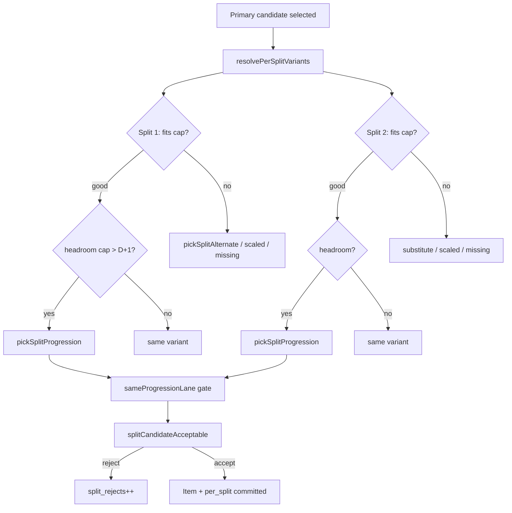
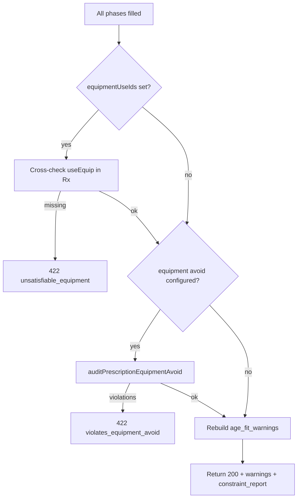
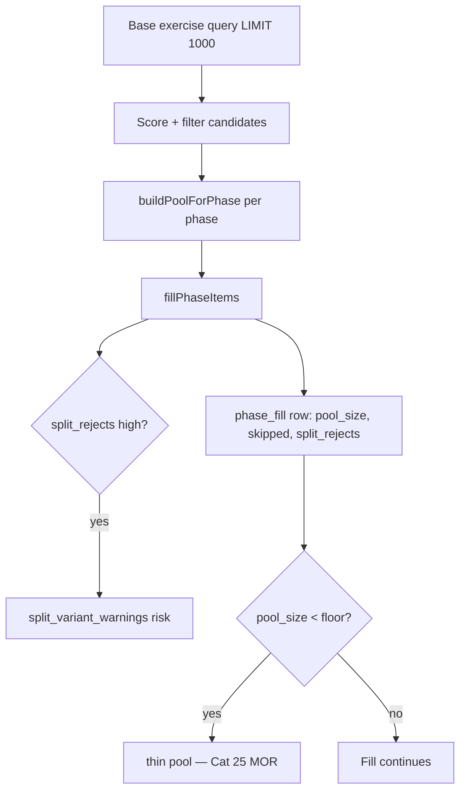

# Needs Engine Quality Check

Evaluation categories for assessing whether the exercise session builder produces a proper, coach-credible session — with emphasis on **traceability** from saved requirements through prescribe to prescription output.

Use with:
- Saved requirements: **Test 3 - Reqs only**
- Strict evaluator: `npm run needs-engine:eval`
- Baseline smoke: `npm run needs-engine:eval:baseline`

**Metric layers (Categories 1–5):** MOP (spec fidelity) → MOS (input validity) → engine build → MOE (coach intent) → MOR (risk) → KPI (composite). See [Detailed metrics — Categories 1–5](#detailed-metrics--categories-15-mop--moe--mos--mor--kpi).

---

## Evaluation Categories

### 1. Session structure & phasing
Correct phases, order, minutes, and total session duration match the saved requirements. Includes focus-target fidelity, work mode, pinned Prepare, canonical Vortex order, and round-trip traceability from saved requirements → prescribe body → prescription blocks.

### 2. Phase time fill
Estimated minutes vs target minutes per phase (Prepare, MI, Output, Capacity, Resilience, Sustained, Restore). Includes pool health, fill stability across runs, dose-budget integrity, and leading indicators (pool size, reject ratios) before coach review.

### 3. Restore phase
Restore is non-empty, within budget, last in session order, and contains appropriate low-intent content (breathing, mobility, downregulation). Includes arousal-downshift suitability and bookend symmetry with Prepare.

### 4. Audience profile
Age range, skill level, session objective, scaling cohort, and difficulty caps (`maxOverall`, `maxTechnical`, `maxLoad`, `maxComplexity`) align with the intended audience and propagate correctly from requirements into `audience_profile`, `mergeCapsMax` pool caps, and downstream scoring.

### 5. Age splits
Split definitions (labels, age bands, per-split difficulty overrides) cover the session age range without gaps; per-group exercise variants are complete, coherent, and differentiated (especially Split 2 progressions vs Split 1 scaling).

### 6. Split progressions
Higher-cap splits receive meaningful progressions in Output, Capacity, and Resilience (presence, count, quality).

### 7. Progression lane validity
Split progressions share a movement pattern or movement family with their primary — not unrelated exercises.

### 8. Progression reuse
The same progression exercise is not reused across multiple primaries within a single phase.

### 9. Progression difficulty climb
Split progressions are harder than their primary (higher overall D) and stay within the split's cap.

### 10. Difficulty & age fit
Primaries and variants respect caps: `good`, `stretch`, or `over_cap`; no spurious age-fit warnings.

### 11. Difficulty cap utilization
The session uses the allowed difficulty budget without going over — primaries and progressions cluster near cap where phase intent allows (especially Output, Capacity, Resilience, and Split 2).

### 12. Equipment — Use
Requested equipment (e.g. kettlebell, jump rope, cones) appears in prescribed exercises.

### 13. Equipment — Avoid
Avoided equipment is excluded from the prescription; no semantic false positives (e.g. box-breathing vs plyo box).

### 14. Exercise / movement avoids
Explicit exercise avoids, body-region exclusions, and movement-family constraints are honored.

### 15. Phase intent alignment
Phase focus targets (tenet, methodology, physiology, order slot) match prescribed content for that phase.

### 16. Phase-appropriate primaries
Exercises fit the role of each phase (e.g. no heavy strength in Prepare, no progressions in MI/Restore).

### 17. Youth & safety gates
Age-appropriate content for the audience (e.g. no handstand/inversion primaries in MI for youth sessions).

### 18. Stretch & over-cap primaries
High-intent phases avoid stretch or over-cap primaries where the strict bar applies.

### 19. Session diversity
No duplicate exercise slugs session-wide; controlled pattern and movement-family repetition.

### 20. Constraint report health
No empty phases, `pool_empty`, or severe underfill flags in the constraint report.

### 21. Warnings cleanliness
Minimal or zero age-fit warnings and split-variant warnings (e.g. "exceeds difficulty cap — coach scaling required").

### 22. Hard feasibility
No unsatisfiable equipment, violated avoids, or prescription errors (422/500).

### 23. Sport & work mode
Prescription matches sport context and work mode (exercise vs skill).

### 24. Programming / block format
Block programming methods (EMOM, intervals, nasal-breathing blocks, etc.) are appropriate when assigned.

### 25. Library & pool coverage
Enough eligible candidates per phase and focus to fill time without thin-pool failures.

---

## Automation coverage (today)

| Category | Strict evaluator | Baseline | Manual |
|----------|------------------|----------|--------|
| 1 Session structure | Partial | Partial | Yes |
| 2 Phase time fill | Yes | Yes | Partial |
| 3 Restore | Yes | Yes | Partial |
| 4 Audience profile | Partial | Partial | Yes |
| 5 Age splits | Partial | Partial | Yes |
| 6 Split progressions | Yes | Partial | — |
| 7 Progression lane | Yes | — | Yes |
| 8 Progression reuse | Yes | — | — |
| 9 Progression difficulty | Yes | — | — |
| 10 Difficulty & age fit | Yes | Partial | — |
| 11 Cap utilization | — | — | Yes |
| 12 Equipment Use | Yes | — | — |
| 13 Equipment Avoid | Yes | Yes | — |
| 14 Exercise avoids | Partial | — | Yes |
| 15 Phase intent | — | — | Yes |
| 16 Phase-appropriate | Partial | Partial | Yes |
| 17 Youth & safety | Yes | — | — |
| 18 Stretch primaries | Yes | Partial | — |
| 19 Session diversity | Yes | — | — |
| 20 Constraint report | Yes | Partial | — |
| 21 Warnings | Yes | — | — |
| 22 Hard feasibility | Yes | — | — |
| 23 Sport & work mode | Implicit | Implicit | Yes |
| 24 Block format | — | — | Yes |
| 25 Pool coverage | Partial | Partial | Yes |

---

## Priority tiers

**P0 — Must never fail**  
Restore, equipment avoid, empty phases, hard feasibility, duplicate slugs.

**P1 — Coach credibility**  
Phase fill, progressions, lane/reuse, equipment use, warnings, stretch primaries, youth safety.

**P2 — Optimization**  
Cap utilization, phase intent nuance, programming format, pool depth, manual coach review.

---

## Quick commands

```bash
cd /Users/jimmy_mac/Desktop/code/vortex
npm run needs-engine:eval              # strict (37 checks)
npm run needs-engine:eval:baseline     # structural smoke
npm run needs-engine:sync-golden       # after editing Test 3 in UI
```

Related: [NEEDS_ENGINE_QUALITY_LOOP.md](./NEEDS_ENGINE_QUALITY_LOOP.md)

---

## Detailed metrics — Categories 1–5 (MOP / MOE / MOS / MOR / KPI)

*Categories 6–10 are documented in the next section.*

**Legend**
- **MOP** (Measure of Performance) — engine output vs requirements; objectively countable; answers *“did the transform preserve the spec?”*
- **MOE** (Measure of Effectiveness) — whether the session would achieve coach/athlete intent; answers *“would this session work on the floor?”*
- **MOS** (Measure of Suitability) — requirements and inputs are well-formed *before* prescribe; answers *“was the request valid to begin with?”*
- **MOR** (Measure of Risk) — safety, feasibility, or credibility failure modes; answers *“what could go wrong if we ship this?”*
- **KPI** (Key Performance Indicator) — composite score aggregating multiple MOP/MOE checks for dashboard use.
- **Leading indicator** — measurable pre- or during-build signal that predicts downstream failure (pool size, reject ratio, validation pass).
- **Lagging indicator** — post-build or post-field signal (coach edits, eval-run variance, manual rejection).
- **Source** — where data would come from (`prescription.blocks`, `constraint_report`, `audience_profile`, saved requirements snapshot, prescribe API body, DB tags, eval history, or **TBD**).
- **Auto** — `yes` | `partial` | `no` (planned).

Pass thresholds are **ideal targets** for strict golden scenarios (e.g. Test 3). Adjust per session type.

**Measurement prerequisites** — each category includes a **Measurement prerequisites** subsection under its metric table. For every MOP/MOE/MOS/MOR/KPI, bullets list what must be accessible in **session requirements**, **exercise cards (DB)**, **prescription output**, **constraint report**, **policy/code**, **evaluator**, or **coach review** to run the assessment (whether or not we have it today).

### Body-driven assessment (mandatory)

Checks must be **independent of any single workout fixture** (e.g. Test 3). The evaluator always reads the **prescribe body** (`expectedBody`) and compares it to the **prescription result**.

| Layer | Rule |
|-------|------|
| **Metrics** | Defined in abstract terms (phase keys, focus_targets, audienceSplits, caps) — not “the HIIT workout”. |
| **Checks** | Gate on body/result fields (`hasSustainedConditioningFocus(focus_targets)`, `audienceSplits.length`, etc.) — never hardcode Test 3 facet IDs as the only path. |
| **Golden scenario** | `golden-prescription-scenario.json` is one **regression instance** (Test 3 uses methodology key `hiit` on Sustained — fixture data, not framework logic). |
| **Naming** | Prefer `sustained_conditioning_focus`, `sustainedRelaxedPoolFill`, `strictConditioningMethodology` over workout-type names in check ids and policy flags. |
| **Methodology keys** | DB may include `hiit` as a taxonomy key; policy detects **conditioning focus** from `focus_targets`, not from assuming HIIT. |

See [`NEEDS_ENGINE_CATEGORY_IMPLEMENTATION_LOOP.md`](NEEDS_ENGINE_CATEGORY_IMPLEMENTATION_LOOP.md) § Body-driven assessment rule.

**Cross-cutting artifact inventory (Categories 1–5)**

| Artifact layer | Examples used across Cat 1–5 |
|----------------|-------------------------------|
| **Saved requirements / snapshot** | `phaseRows`, `audienceSplits`, `sessionObjective`, `equipmentUse`, `sessionMinutes`, `skillLevel`, `sportId` |
| **Prescribe API body** | `phasePlan`, `durationMinutes`, `workMode`, `ageMin`/`ageMax`, `capsOverride`, `equipmentUseIds`, `equipmentAvoidIds` |
| **Prescription output** | `blocks[]`, `work_mode`, `audience_profile`, `audience_splits`, `age_fit_warnings`, `split_variant_warnings`, `constraint_report`, `phase_rationales` |
| **Block / item fields** | `phase_key`, `target_minutes`, `estimated_minutes`, `fill_pct`, `focus_targets`, `items[]`, dose fields (`sets`, `reps`, `rest_seconds`, `work_seconds`) |
| **Per-split variants** | `per_split[]`: `split_label`, `variant_type`, `exercise_id`, `difficulty`, `difficulty_cap`, `scaling_guidance` |
| **Exercise cards (DB)** | `coaching.exercise` (slug, name, `programming_kind`, `primary_phase_key`, `movement_family`, `skill_level`, defaults); `exercise_tag`; `exercise_phase_profile`; `exercise_difficulty_profile`; `exercise_scaling_profile` |
| **Facet / taxonomy DB** | `coaching.tenet`, `methodology`, `phase_order_slot`, `equipment`; facet ID → key maps |
| **Policy / code** | `SESSION_PHASE_ORDER`, `AGE_BAND_POLICIES`, `restoreSelectionPolicy`, `sustainedCapacityPolicy`, `resolveAudienceProfile`, `buildSplitProfiles` |
| **Evaluator / golden** | `golden-prescription-scenario.json`, strict thresholds, eval history log, `prescriptionQualityChecks` |
| **Human (MOE)** | Coach reviewer, rubrics, Likert scales, send-to-builder edit telemetry (**TBD**) |

**Category boundaries (1–5)**
- **Cat 1** — structural fidelity of phase plan → blocks (minutes, keys, order, focus targets). Does not judge exercise selection quality.
- **Cat 2** — time budget execution across all phases. Restore fill band also appears in Cat 3 (content-specific).
- **Cat 3** — restore block content and policy (`restoreSelectionPolicy.js`). Position/order overlaps Cat 1.
- **Cat 4** — session-level audience resolution (`resolveAudienceProfile`, `capsOverride`). Split-level caps are Cat 5.
- **Cat 5** — split definitions + `per_split` variants. Progression *quality* (lane, reuse, delta) is Cat 6–9; Cat 5 keeps presence/count gates tied to splits.

**Test 3 golden anchors** (from `scripts/golden-prescription-scenario.json` + live eval)

| Field | Expected value |
|-------|----------------|
| `durationMinutes` | 120 |
| `workMode` | `exercise` |
| `sportId` | 1 |
| `skillLevel` | `INTERMEDIATE` |
| `ageMin` / `ageMax` | 8 / 14 |
| `sessionObjective` | `speed_priority` |
| `capsOverride` | null → session caps from age band (mid-age 11 → band 9–12 → **maxOverall 6**) |
| Split 1 | ages 8–10, `difficultyOverride` 6 |
| Split 2 | ages 11–14, `difficultyOverride` 10 |
| Phase minutes | Prepare 10, MI 13, Output 40, Capacity 30, Resilience 13, Sustained 10, Restore 4 |
| Output focus | tenet facetId **3** (Speed), weight **6** |
| Sustained focus (Test 3 fixture) | methodology facetId **1169** (key `hiit`), weight **5** — example only |
| Strict eval (today) | **~167 checks** (legacy + Cat 1–4 wired); grows as categories wire |

**Strict evaluator ↔ category map (Categories 1–5)**

| Strict check id | Category | Metric id(s) |
|-----------------|----------|--------------|
| `prescribe_body_mos_complete`, `phase_plan_minute_sum_mos` | 1 | C1-MOS-01, C1-MOS-02 |
| `phase_count_match`, `phase_key_set_equality`, `canonical_phase_order` | 1 | C1-MOP-01–03, C1-MOP-16 |
| `phase_minutes_exact`, `session_minutes_sum` | 1 | C1-MOP-04–05 |
| `focus_targets_count_parity`, `focus_targets_field_parity` | 1 | C1-MOP-06–07 |
| `pinned_prepare_first`, `work_mode_echo`, `session_objective_echo` | 1 | C1-MOP-08–09, C1-MOP-13 |
| `no_orphan_other_blocks`, `phase_label_parity`, `other_phase_fidelity` | 1 | C1-MOP-10–11, C1-MOP-15 |
| `focus_weight_sum_sanity`, `phase_rationales_present`, `focus_weight_intent_minimum` | 1 | C1-MOP-14, C1-MOP-17, C1-MOE-06 |
| `sport_id_preflight` | 1 | C1-MOP-12 |
| `category1_kpi` | 1 | C1-KPI-01 |
| `block_index_order` | 1 | C1-MOP-16 |
| `category1_moe_restore_last` | 1 | C1-MOE-05 |
| `category1_moe_review_packet` | 1 | C1-MOE-01, C1-MOE-07 |
| `phase_fill_*` | 2 | C2-MOP-01, C2-MOR-01 |
| `restore_non_empty`, `restore_fill_band`, `restore_no_pool_empty` | 3 | C3-MOP-01–03 |
| `no_progression_restore` | 3, 5 | C3-MOP-13, C5-MOP-20 |
| `restore_not_box_avoid_false_positive` | 3, 13 | C3-MOP-10 |
| `no_empty_phases` | 2, 20 | C2-MOP-06, C2-MOP-12 |
| `session_age_fit_warnings` | 4, 10 | C4-MOP-10 |
| `split_variant_warnings` | 5 | C5-MOP-13 |
| `split2_progressions_*`, `progression_*` | 5, 6–9 | C5-MOP-08–12 |
| *(not yet automated)* | 4 | C4-MOP-01–08, C4-MOP-13–18 |

**Category 2 (wired)** — [`categoryQualityEvaluators.js`](../backend/platform/categoryQualityEvaluators.js) when `WIRED_CATEGORIES` includes 2:

| Strict check id | Metric id(s) |
|-----------------|--------------|
| `phase_fill_{phase_key}` | C2-MOP-01 |
| `phase_underfill_gap` (informational) | C2-MOP-02 |
| `restore_fill_band` | C2-MOP-03 |
| `session_est_minutes_delta` (informational) | C2-MOP-04 |
| `phase_item_count_policy` (informational) | C2-MOP-05 |
| `phase_fill_coverage`, `phase_fill_pool_floor_*` | C2-MOP-07, C2-MOP-12 |
| `phase_fill_skip_ratio`, `phase_fill_split_rejects` (informational) | C2-MOP-08–09 |
| `phase_dose_budget_ceiling`, `phase_dose_sum_accuracy`, `phase_item_dominance` | C2-MOP-11, C2-MOP-15–16 |
| `high_intent_underfill_70`, `no_underfill_reasons` | C2-MOR-01, C2-MOP-18 |
| `phase_backfill_contribution`, `phase_backfill_item_share` (informational) | C2-MOP-10, C2-MOP-17 |
| `category2_fill_stability` (informational) | C2-MOP-14 |
| `category2_moe_*` (informational) | C2-MOE-02–05 |
| `category2_moe_review_packet` | C2-MOE-01, C2-MOE-06, C2-MOE-07 |
| `category2_kpi` | C2-KPI-01 |

Manual MOE: [`CATEGORY_2_MOE_RUBRIC.md`](CATEGORY_2_MOE_RUBRIC.md). Plan: [`category-plans/CATEGORY_02_PLAN.md`](category-plans/CATEGORY_02_PLAN.md).

**Category 4 (wired)** — `evaluateCategory4Audience()`:

| Strict check id | Metric id(s) |
|-----------------|--------------|
| `audience_age_range`, `audience_cap_*`, `audience_scaling_cohort` | C4-MOP-01–05 |
| `session_objective_echo` | C4-MOP-06 |
| `audience_age_band_label`, `audience_strength_intent`, `audience_objective_strength_matrix` | C4-MOP-07–08, C4-MOP-17 |
| `primary_age_fit_distribution`, `primary_over_cap_count` | C4-MOP-09, C4-MOR-01 |
| `session_age_fit_warnings` | C4-MOP-10 |
| `audience_skill_level_adherence` (informational) | C4-MOP-11 |
| `audience_recommended_age_overlap` | C4-MOP-12 |
| `audience_max_complexity_cap` | C4-MOP-13 |
| `audience_caps_override_propagation`, `audience_pool_cap_derivation` | C4-MOP-14–15 |
| `audience_hard_difficulty_exclude` | C4-MOP-16 |
| `audience_inputs_valid` | C4-MOS-01 |
| `category4_moe_*`, `audience_skill_level_adherence` (informational) | C4-MOE-02–07, C4-MOP-11 |
| `category4_moe_review_packet` | C4-MOE-01, C4-MOE-04 |
| `category4_kpi` | C4-KPI-01 |

Manual MOE: [`CATEGORY_4_MOE_RUBRIC.md`](CATEGORY_4_MOE_RUBRIC.md). Plan: [`category-plans/CATEGORY_04_PLAN.md`](category-plans/CATEGORY_04_PLAN.md).

**Category 5 (wired)** — `evaluateCategory5Splits()` in `categoryEvaluatorsExtended.js`:

| Strict / cat5 check id | Metric id(s) |
|------------------------|--------------|
| `audience_splits_mos_valid` | C5-MOS-01 |
| `audience_split_count_parity`, `split_label_parity`, `split_age_band_parity` | C5-MOP-01–03 |
| `split_cap_parity`, `split_cap_dimensions_parity` | C5-MOP-04, C5-MOP-18 |
| `per_split_label_valid`, `per_split_difficulty_cap_echo` | C5-MOP-19, C5-MOP-22 |
| `split1_cap_adherence`, `split2_cap_adherence` | C5-MOP-14–15 |
| `split_missing_variant_count`, `split_missing_high_intent` | C5-MOP-06, C5-MOR-01 |
| `per_split_completeness` (informational) | C5-MOP-05 |
| `split1_no_progressions` (informational) | C5-MOP-20 |
| `split_age_coverage`, `split_younger_first_order` (info on overlap) | C5-MOP-16–17 |
| `split_variant_distribution_*` (informational) | C5-MOP-07 |
| `split_scaling_guidance_rate` | C5-MOP-21 |
| `split_variant_warnings` | C5-MOP-13 |
| `split2_progressions_*`, `progression_reuse_*`, `progression_difficulty_*` | C5-MOP-08–12 |
| `split_differentiation_moe`, `split2_cap_exploitation_moe`, `split_scaling_guidance_diff_moe` | C5-MOE-01–02, C5-MOE-04 |
| `split1_substituted_rate_moe`, `split1_same_scaled_share_moe` | C5-MOE-06–07 |
| `category5_moe_review_packet` | C5-MOE-05 |
| `category5_kpi` | C5-KPI-01 (synthetic) |

Manual MOE: [`CATEGORY_5_MOE_RUBRIC.md`](CATEGORY_5_MOE_RUBRIC.md). Plan: [`category-plans/CATEGORY_05_PLAN.md`](category-plans/CATEGORY_05_PLAN.md).

**Categories 6–25** — wired sequentially per loop. See [`NEEDS_ENGINE_CATEGORY_IMPLEMENTATION_LOOP.md`](NEEDS_ENGINE_CATEGORY_IMPLEMENTATION_LOOP.md).

**Category 13 (wired)** — `evaluateCategory13EquipAvoid()` in `categoryEvaluatorsExtended.js`:

| Strict / cat13 check id | Metric id(s) |
|-------------------------|--------------|
| `prescription_equipment_avoid_clean` | C13-MOP-01, C13-MOP-07–08, C13-MOP-10, C13-MOP-16, C13-MOR-01 |
| `restore_not_box_avoid_false_positive` | C13-MOP-05, C13-MOR-02 |
| `semantic_avoid_false_negative` | C13-MOR-03 |
| `equipment_avoid_exclusions_logged` | C13-MOP-03 |
| `equipment_avoid_id_expansion`, `equipment_avoid_expansion_ratio` | C13-MOP-02, C13-MOP-12 |
| `equipment_avoid_sample_whitelist_clean` | C13-MOP-06, C13-MOP-11 |
| `equipment_avoid_id_parity` | C13-MOP-15 |
| `equipment_avoid_use_overlap` | C13-MOP-17 |
| `equipment_avoid_ids_resolvable` | C13-MOS-01 |
| `equipment_avoid_restore_feasible`, `equipment_avoid_restore_pool_floor` (info) | C13-MOS-02, C13-MOP-14 |
| `equipment_avoid_phase_pool_empty` | C13-MOR-04 |
| `equipment_avoid_report_present` | C13-MOP-03 |
| `equipment_avoid_semantic_blocks`, `equipment_avoid_reject_path_ratio`, `equipment_avoid_semantic_precision` (informational) | C13-MOP-04, C13-MOP-13, C13-MOP-18 |
| `equipment_avoid_bar_alias_coverage` (informational) | C13-MOP-09 |
| `category13_moe_breathing_available`, `category13_moe_pattern_diversity` (informational) | C13-MOE-02, C13-MOE-04 |
| `category13_moe_review_packet` | C13-MOE-01, C13-MOE-03, C13-MOE-05–06 |
| `category13_kpi` | C13-KPI-01 |

Manual MOE: [`CATEGORY_13_MOE_RUBRIC.md`](CATEGORY_13_MOE_RUBRIC.md). Plan: [`category-plans/CATEGORY_13_PLAN.md`](category-plans/CATEGORY_13_PLAN.md).

**Category 17 (wired)** — `evaluateCategory17Youth()` in `categoryEvaluatorsExtended.js`:

| Strict / cat17 check id | Metric id(s) |
|-------------------------|--------------|
| `mi_no_handstand_youth` | C17-MOP-01, C17-MOR-01 |
| `youth_mi_pool_filter` | C17-MOP-02 |
| `youth_recommended_age_min`, `youth_recommended_age_max` | C17-MOP-03–04 |
| `mi_attention_demand_ceiling` | C17-MOP-05 |
| `youth_beginner_excluded_slugs` | C17-MOP-06 |
| `youth_scaling_cohort` | C17-MOP-07 |
| `youth_mi_technical_share` | C17-MOP-08 |
| `youth_mi_neural_methodology` (informational) | C17-MOP-09 |
| `youth_inversion_non_mi` | C17-MOP-10 |
| `youth_prepare_mi_impact_ceiling` | C17-MOP-11 |
| `youth_sport_context_multiplier` (informational) | C17-MOP-12 |
| `youth_medical_clearance` | C17-MOP-13 |
| `youth_contraindication_rate` (informational) | C17-MOP-14, C17-MOE-06 |
| `youth_mi_load_ceiling` | C17-MOP-15 |
| `youth_gymnastics_handstand_scope` | C17-MOP-16 |
| `split1_cap_adherence` | C17-MOP-17, C17-MOR-02 |
| `youth_advanced_skill_level` | C17-MOP-18 |
| `youth_beginner_penalty_inactive` (informational) | C17-MOP-19 |
| `youth_resilience_wall_handstand` | C17-MOP-20 |
| `youth_high_intent_minutes` | C17-MOP-21 |
| `youth_split1_output_plyo_density` (informational) | C17-MOP-22 |
| `youth_age_inputs_valid` | C17-MOS-01 |
| `youth_scaling_cohort_resolvable` | C17-MOS-02 |
| `youth_scaling_guidance_rate` (informational) | C17-MOE-03 |
| `category17_moe_review_packet` | C17-MOE-01, C17-MOE-02, C17-MOE-04–05, C17-MOE-07–08 |
| `mi_attention_demand_spike` | C17-MOR-03 |
| `youth_unsupervised_high_risk` | C17-MOR-04 |
| `category17_kpi` | C17-KPI-01 |

Manual MOE: [`CATEGORY_17_MOE_RUBRIC.md`](CATEGORY_17_MOE_RUBRIC.md). Plan: [`category-plans/CATEGORY_17_PLAN.md`](category-plans/CATEGORY_17_PLAN.md).

**Category 18 (wired)** — `evaluateCategory18Stretch()` in `categoryEvaluatorsExtended.js`:

| Strict / cat18 check id | Metric id(s) |
|-------------------------|--------------|
| `stretch_primaries_prepare_and_access` | C18-MOP-01 |
| `stretch_primaries_movement_intelligence` | C18-MOP-02 |
| `stretch_primaries_output` | C18-MOP-03 |
| `stretch_primaries_capacity` | C18-MOP-04 |
| `stretch_primaries_resilience` | C18-MOP-05 |
| `primary_over_cap_count` | C18-MOP-06, C18-MOR-02 |
| `engine_no_stretch_over_cap_admitted` | C18-MOP-07 |
| `primary_age_fit_split_good_path` | C18-MOP-08 |
| `stretch_primary_session_total` (informational) | C18-MOP-09 |
| `split_variant_warnings` | C18-MOP-10 |
| `stretch_primary_fit_replay` | C18-MOP-11 |
| `stretch_primaries_sustained_capacity` | C18-MOP-12 |
| `stretch_primaries_restore` (info when ≤1) | C18-MOP-13 |
| `split1_variant_stretch_rate` (informational) | C18-MOP-14 |
| `hard_difficulty_exclude_stretch_reject` | C18-MOP-15 |
| `output_near_cap_stretch_alert` (informational) | C18-MOP-16 |
| `stretch_reject_telemetry_proxy` (informational) | C18-MOP-17 |
| `per_split_over_cap_count` | C18-MOP-18 |
| `stretch_warning_correlation` | C18-MOP-19 |
| `no_stretch_phase_good_fit_rate` | C18-MOP-20 |
| `audience_caps_numeric_mos` | C18-MOS-01 |
| `split_caps_le_pool_cap_mos` | C18-MOS-02 |
| `category18_moe_review_packet` | C18-MOE-01, C18-MOE-04, C18-MOE-06 |
| `category18_moe_stretch_badges_proxy` (informational) | C18-MOE-02 |
| `category18_moe_split1_overcap_proxy` (informational) | C18-MOE-03 |
| `category18_moe_cap_consistency_proxy` (informational) | C18-MOE-05 |
| `stretch_high_intent_mor` | C18-MOR-01 |
| `stretch_variant_warning_stability` (informational) | C18-MOR-03 |
| `category18_kpi` | C18-KPI-01 |

Manual MOE: [`CATEGORY_18_MOE_RUBRIC.md`](CATEGORY_18_MOE_RUBRIC.md). Plan: [`category-plans/CATEGORY_18_PLAN.md`](category-plans/CATEGORY_18_PLAN.md).

**Category 24 (wired)** — `evaluateCategory24Format()` in `categoryEvaluatorsExtended.js`:

| Strict / cat24 check id | Metric id(s) |
|-------------------------|--------------|
| `item_sets_present` | C24-MOP-01 |
| `item_rest_present` | C24-MOP-02 |
| `format_time_reconciliation` | C24-MOP-03 |
| `format_youth_sets_sanity` (informational) | C24-MOP-04 |
| `format_rest_zero_honored` | C24-MOP-05 |
| `format_work_seconds_timed` | C24-MOP-06 |
| `format_sustained_hiit_shape` (informational) | C24-MOP-07 |
| `format_restore_low_density` (informational) | C24-MOP-08 |
| `selection_rationale_coverage` | C24-MOP-09 |
| `placement_rationale_coverage` | C24-MOP-10 |
| `format_relaxed_pool_marker` | C24-MOP-11 |
| `format_builder_programming_method` (TBD) | C24-MOP-12 |
| `format_est_seconds_coverage` (informational) | C24-MOP-13 |
| `item_reps_work_coherence` (informational) | C24-MOP-14 |
| `format_phase_dose_density` (informational) | C24-MOP-15 |
| `format_output_rest_adequacy` (informational) | C24-MOP-16 |
| `format_capacity_rest_vs_load` (informational) | C24-MOP-17 |
| `format_scaling_rationale_rate` (informational) | C24-MOP-18 |
| `format_split_fallback_rate` (informational) | C24-MOP-19 |
| `item_score_populated` | C24-MOP-20 |
| `item_phase_fit_present` | C24-MOP-21 |
| `format_education_rationale_rate` (informational) | C24-MOP-22 |
| `format_default_dose_match` (informational) | C24-MOP-23 |
| `format_library_dose_mos` (informational) | C24-MOS-01 |
| `format_dose_reconciliation_mor` | C24-MOR-01 |
| `format_item_dominance_mor` | C24-MOR-02 |
| `category24_moe_review_packet` | C24-MOE-01, C24-MOE-05, C24-MOE-06 |
| `category24_moe_sustained_hiit` (informational) | C24-MOE-02 |
| `category24_moe_restore_recovery` (informational) | C24-MOE-03 |
| `category24_moe_builder_programming` (TBD) | C24-MOE-04, C24-MOE-05 |
| `category24_moe_output_rest_youth` (informational) | C24-MOE-06 |
| `category24_dose_stability` (informational) | C24-MOE-07 |
| `category24_kpi` | C24-KPI-01 |

Manual MOE: [`CATEGORY_24_MOE_RUBRIC.md`](CATEGORY_24_MOE_RUBRIC.md). Plan: [`category-plans/CATEGORY_24_PLAN.md`](category-plans/CATEGORY_24_PLAN.md).

**Category 3 (wired)** — `evaluateCategory3Restore()`:

| Strict check id | Metric id(s) |
|-----------------|--------------|
| `restore_non_empty`, `restore_golden_item_count` | C3-MOP-01 |
| `restore_no_pool_empty` | C3-MOP-02 |
| `restore_fill_band` | C3-MOP-03 |
| `restore_profile_role_valid`, `restore_impact_ceiling` | C3-MOP-04, C3-MOP-06, C3-MOP-16 |
| `restore_order_slot_boost` | C3-MOP-05 |
| `restore_no_output_primary` | C3-MOP-07 |
| `restore_excluded_methodology` | C3-MOP-08 |
| `restore_difficulty_band` | C3-MOP-09 |
| `restore_not_box_avoid_false_positive`, `restore_equipment_avoid_clean` | C3-MOP-10 |
| `restore_max_items`, `restore_block_last` | C3-MOP-11–12 |
| `no_progression_restore` | C3-MOP-13 |
| `restore_dose_ceiling`, `restore_slug_unique` | C3-MOP-14–15 |
| `restore_candidate_policy_pass` | C3-MOP-17 |
| `restore_high_arousal_after_sustained_conditioning` | C3-MOR-01 |
| `category3_moe_*` (informational) | C3-MOE-01–05, C3-MOE-07 |
| `category3_moe_arousal_downshift` (informational) | C3-MOE-03 |
| `category3_moe_review_packet` | C3-MOE-06, C3-MOE-08 |
| `category3_kpi` | C3-KPI-01 |

### Requirements → prescription pipeline (process view)


| Stage | Primary categories | Failure mode if skipped |
|-------|-------------------|-------------------------|
| Requirements capture (UI / saved row) | 1, 4, 5 | Wrong phase plan or splits never reach engine |
| `snapshotToPrescribeBody` | 1, 4, 5 | Field rename drift (`phaseRows` vs `phasePlan`, equipment IDs) |
| Audience + caps (`resolveAudience`) | 4, 5 | Pool caps wrong → age-fit warnings, timid or unsafe picks |
| Phase plan → blocks scaffold | 1 | Missing phases, minute drift, focus targets dropped |
| Pool build + fill | 2, 3, 25 | Underfill, empty restore, thin pools |
| Split resolution | 5, 6–9 | Missing variants, wrong progressions |
| Post-build audit | 3, 13, 20 | Avoid leaks, constraint report silent failures |

**Traceability (Categories 1–5)** — each requirement field should map to an observable prescription artifact:

| Requirement field | Prescription artifact | Primary metric IDs |
|-------------------|----------------------|-------------------|
| `phasePlan[].phaseKey` | `blocks[].phase_key` | C1-MOP-01–03 |
| `phasePlan[].minutes` | `blocks[].target_minutes` | C1-MOP-04–05, C2-MOP-01 |
| `phasePlan[].focusTargets` | `blocks[].focus_targets` | C1-MOP-06–07, C1-MOE-06 |
| `phasePlan[].pinned` | Prepare block index 0 | C1-MOP-08 |
| `durationMinutes` | Σ `blocks[].target_minutes` | C1-MOP-05, C1-MOS-02 |
| `workMode` | `result.work_mode` | C1-MOP-09 |
| `sportId` | Scoring/filter context only (**not** returned on result) | C1-MOP-12 |
| `skillLevel` | `audience_profile.impliedSkillLevel` | C4-MOP-04 |
| `capsOverride` | `audience_profile.caps` (when set) | C4-MOP-14 |
| `ageMin` / `ageMax` | `audience_profile.ageMin/Max` | C4-MOP-01 |
| `sessionObjective` | `audience_profile.sessionObjective` | C4-MOP-06, C4-MOP-08 |
| `audienceSplits[]` | `audience_splits[]` + `items[].per_split` | C5-MOP-01–06, C5-MOP-19 |
| `audienceSplits[].difficultyOverride` | `audience_splits[].caps` + `per_split[].difficulty_cap` | C5-MOP-04, C5-MOP-18, C5-MOP-22 |
| `equipmentUseIds` | Prescribed exercise equipment tags | Cat 12 |
| `equipmentAvoidIds` | `constraint_report.equipment_avoid` | Cat 13 |

---

### Category 1 — Session structure & phasing

*Sources: `blocks[]`, golden `phasePlan`, `SESSION_PHASE_ORDER` in `src/coach/taxonomy.ts` / `backend/platform/phaseArchitect.js`.*

| ID | Type | Metric | Measurement | Pass threshold | Source | Auto |
|----|------|--------|-------------|----------------|--------|------|
| C1-MOP-01 | MOP | Phase count match | `blocks.length === phasePlan.length` | Exact match | `blocks` vs golden body | yes |
| C1-MOP-02 | MOP | Phase key set equality | Every required `phase_key` appears exactly once | 100% keys present, 0 extras | `blocks[].phase_key` vs `phasePlan[].phaseKey` | yes |
| C1-MOP-03 | MOP | Canonical phase order | Phase keys monotonic in `SESSION_PHASE_ORDER` | 0 order inversions | `blocks[].phase_key` vs order array | yes |
| C1-MOP-04 | MOP | Per-phase target minutes delta | `abs(block.target_minutes - plan.minutes)` per phase | Each 0 (exact) | `blocks[].target_minutes` | yes |
| C1-MOP-05 | MOP | Total session minutes delta | `abs(sum(target_minutes) - durationMinutes)` | 0 | sum of blocks vs prescribe body | yes |
| C1-MOP-06 | MOP | Focus target count per phase | `len(block.focus_targets) === len(plan.focusTargets)` per phase | Exact match per phase | `blocks[].focus_targets` | yes |
| C1-MOP-07 | MOP | Focus facet ID match | Each `facetId` + `facetType` + `weight` matches requirements | 100% match (Test 3: Output tenet 3 w6; Sustained methodology 1169 w5) | focus_targets | yes |
| C1-MOP-08 | MOP | Pinned Prepare preserved | If `pinned === true`, Prepare at index 0 with minutes ≥ plan | Prepare first, minutes ≥ 10 (Test 3) | `phasePlan` + `blocks` | yes |
| C1-MOP-09 | MOP | Work mode match | `result.work_mode === requirements.workMode` | Exact (`exercise`) | `result.work_mode` | yes |
| C1-MOP-10 | MOP | No orphan Other blocks | `phase_key === 'other'` without `other_kind` | 0 unless explicitly planned | `blocks` | yes |
| C1-MOP-11 | MOP | Phase label fidelity | `block.label` matches `plan.label` per phase_key | 100% match | `blocks[].label` | yes |
| C1-MOP-12 | MOP | sportId accepted at prescribe | `sportId` in prescribe body used for sport context/scoring | Test 3: sportId 1 accepted; **not echoed on result object** | `sport_id_preflight` | yes |
| C1-MOP-13 | MOP | sessionObjective in audience | `audience_profile.sessionObjective === sessionObjective` | Exact (`speed_priority`) | `audience_profile` | yes |
| C1-MOP-14 | MOP | Focus weight sum sanity | Σ weights per phase in 1–10 | Output 6, Sustained 5 (Test 3) | `blocks[].focus_targets` | yes |
| C1-MOP-15 | MOP | Other-phase fidelity | `otherKind` + `otherItemIds` preserved when `phaseKey === 'other'` | Exact when used | `blocks[].other_kind` | yes |
| C1-MOP-16 | MOP | Block index order | `blocks` index order matches canonical phase order | 0 inversions by index | `block_index_order` | yes |
| C1-MOP-17 | MOP | Phase rationales emitted | `phase_rationales.length === blocks.length` when feature enabled | 100% or documented off | `result.phase_rationales` | yes |
| C1-MOS-01 | MOS | Requirements completeness | Mandatory prescribe fields non-null before API | age, duration, phasePlan, objective, workMode | snapshot + prescribe body | yes |
| C1-MOS-02 | MOS | phasePlan minute sum | `sum(phasePlan.minutes) === durationMinutes` | 120 = 120 (Test 3) | saved requirements | yes |
| C1-MOE-01 | MOE | Vortex flow coherence | Full canonical phase sequence without gaps | Coach flow score ≥ 4/5 | `category1_moe_review_packet` | partial |
| C1-MOE-02 | MOE | Phase minute proportions | Each phase within ±5% of objective template for 120-min speed | ≤ 1 phase outside band | `category1_moe_objective_template_proportions` | yes |
| C1-MOE-03 | MOE | High-intent time dominance | `(Output + Capacity + Resilience + Sustained) / total` | ≥ 75% (Test 3: 93/120 = 77.5%) | `category1_moe_high_intent_ratio` | yes |
| C1-MOE-04 | MOE | Prepare not overweighted | Prepare minutes / total | ≤ 12% (Test 3: 8.3%) | `category1_moe_prepare_share` | yes |
| C1-MOE-05 | MOE | Restore not skipped | Restore exists and is last canonical phase | Restore last | `category1_moe_restore_last` | yes |
| C1-MOE-06 | MOE | Focus weight reflects intent | Output Speed weight ≥ 3; Sustained conditioning weight ≥ 3 when phase has focus_targets | Test 3: 6 and 5 | `focus_weight_intent_minimum` | yes |
| C1-MOE-07 | MOE | Session reads as one arc | Manual: warmup → skill → power → strength → resilience → conditioning → cooldown | Coach approval | `category1_moe_review_packet` | partial |
| C1-MOE-08 | MOE | MI proportion for objective | MI minutes / total for speed_priority youth 120m | 8–15% (Test 3: 10.8%) | `category1_moe_mi_proportion` | yes |
| C1-MOE-09 | MOE | Prepare–Restore bookend ratio | Restore minutes / Prepare minutes | ≥ 0.30 (Test 3: 0.40) | `category1_moe_restore_prepare_ratio` | yes |
| C1-KPI-01 | KPI | Structure fidelity index | Weighted pass rate of C1-MOP-01–17 + C1-MOS-02 | ≥ 95% on strict golden | `category1_kpi` | yes |

#### Category 1 — Measurement prerequisites (data & artifacts required)

*What must exist or be accessible to run each assessment — independent of whether we have it today.*

**C1-MOP-01** — Requires: saved `phasePlan[]` (or golden prescribe body); prescription `blocks[]`; ability to count both arrays.

**C1-MOP-02** — Requires: `phasePlan[].phaseKey` per planned phase; `blocks[].phase_key` per output block; set comparison (no duplicates).

**C1-MOP-03** — Requires: ordered `blocks[].phase_key` sequence; canonical `SESSION_PHASE_ORDER` array (`src/coach/taxonomy.ts` or `phaseArchitect.js`); index/order comparator.

**C1-MOP-04** — Requires: per-phase `phasePlan[].minutes`; per-block `blocks[].target_minutes`; numeric diff per matching `phase_key`.

**C1-MOP-05** — Requires: `durationMinutes` from prescribe body; sum of all `blocks[].target_minutes`.

**C1-MOP-06** — Requires: per-phase `phasePlan[].focusTargets[]`; per-block `blocks[].focus_targets[]`; array lengths per phase key.

**C1-MOP-07** — Requires: focus target objects with `facetId`, `facetType`, `weight` on both plan and blocks; facet ID registry (tenet id 3 = Speed, methodology id 1169 = HIIT for Test 3).

**C1-MOP-08** — Requires: `phasePlan[].pinned` flag on Prepare; `blocks[0].phase_key`; Prepare `target_minutes` vs plan minutes.

**C1-MOP-09** — Requires: prescribe body `workMode`; prescription `result.work_mode`.

**C1-MOP-10** — Requires: `blocks[].phase_key`; optional `blocks[].other_kind` when phase is `other`.

**C1-MOP-11** — Requires: `phasePlan[].label` and `blocks[].label` keyed by `phase_key`.

**C1-MOP-12** — Requires: prescribe body `sportId`; engine sport context path (`loadFacetKeyMaps`, `sportContextMultiplier`); prescribe API request log (sportId not on result object).

**C1-MOP-13** — Requires: prescribe body `sessionObjective`; `audience_profile.sessionObjective` on result.

**C1-MOP-14** — Requires: `blocks[].focus_targets[].weight` per phase; numeric sum per phase.

**C1-MOP-15** — Requires: `phasePlan` entries with `phaseKey: 'other'`, `otherKind`, `otherItemIds`; matching `blocks[].other_kind` and pinned item IDs if used.

**C1-MOP-16** — Requires: `blocks` array order; canonical phase order reference; block index vs phase key mapping.

**C1-MOP-17** — Requires: `result.phase_rationales[]` with one entry per block (when feature enabled); block count.

**C1-MOS-01** — Requires: saved requirements snapshot or prescribe body with `ageMin`, `ageMax`, `durationMinutes`, `phasePlan`, `sessionObjective`, `workMode`, `skillLevel`; validation schema/rules.

**C1-MOS-02** — Requires: `phasePlan[].minutes` for all phases; `durationMinutes`; sum validator.

**C1-MOE-01** — Requires: full `blocks[]` phase sequence; coach rubric definition; manual reviewer assignment.

**C1-MOE-02** — Requires: `phasePlan` minutes per phase; objective-specific template library (`phasePlanForObjective` or equivalent); % calculation vs template bands.

**C1-MOE-03** — Requires: `blocks[].target_minutes` for Output, Capacity, Resilience, Sustained; session total minutes.

**C1-MOE-04** — Requires: Prepare block `target_minutes`; session total minutes.

**C1-MOE-05** — Requires: `blocks[]` ordered list; restore `phase_key` identification; last-index check.

**C1-MOE-06** — Requires: Output `focus_targets` (tenet + weight); Sustained `focus_targets` (methodology + weight); intent minimum thresholds.

**C1-MOE-07** — Requires: complete prescription readable by coach; phase labels and item lists; manual approval workflow.

**C1-MOE-08** — Requires: MI block minutes; session total; objective-specific MI proportion band table.

**C1-MOE-09** — Requires: Prepare and Restore `target_minutes`.

**C1-KPI-01** — Requires: pass/fail outcome for C1-MOP-01 through C1-MOP-17 and C1-MOS-02; weighting scheme; evaluator aggregate output (`category1_kpi` in `prescriptionQualityChecks.js`).

**Automation (implemented 2026-07-09):** `evaluateCategory1Structure` + `validatePrescribeBodyMOS` + `evaluateCategory1MoeInfo`; **20 blocking** `CATEGORY1_KPI_CHECK_IDS` (incl. `block_index_order`, `sport_id_preflight` via eval merge); **7 informational** `CATEGORY1_MOE_CHECK_IDS`. Manual MOE: [`CATEGORY_1_MOE_RUBRIC.md`](CATEGORY_1_MOE_RUBRIC.md) + `category1_moe_review_packet`. Golden Test 3 strict PASS.

---

### Category 2 — Phase time fill

*Sources: `blocks[]`, `constraint_report.phase_fill`, `sustainedCapacityPolicy.js` (`minItemsForPhase`, `maxItemsForPhase`, `phaseFillTarget`).*

| ID | Type | Metric | Measurement | Pass threshold | Source | Auto |
|----|------|--------|-------------|----------------|--------|------|
| C2-MOP-01 | MOP | Per-phase fill percent | `fill_pct = round(estimated_minutes / target_minutes * 100)` | Strict mins: Prepare/Output/Capacity/Resilience ≥ 90%; MI ≥ 85%; Sustained ≥ 80%; Restore 95–105% (see `DEFAULT_STRICT_THRESHOLDS`) | `constraint_report.phase_fill` | yes |
| C2-MOP-02 | MOP | Per-phase absolute minute gap | `target_minutes - estimated_minutes` (underfill only) | ≤ 1 min when target ≥ 10m; ≤ 0.5 min for Restore | `blocks[]` | yes (info) |
| C2-MOP-03 | MOP | Restore overfill cap | `estimated_minutes / target_minutes` for restore | ≤ 105% | restore block | yes |
| C2-MOP-04 | MOP | Session total estimated minutes | `sum(estimated_minutes)` vs `sum(target_minutes)` | Within ±3 min on 120-min session | `blocks[]` | yes (info) |
| C2-MOP-05 | MOP | Item count vs policy | `len(items)` vs `minItemsForPhase` / `maxItemsForPhase` | Min: Prepare/MI **2**; Sustained+HIIT **2**; else **1**. Max: Restore **3**; Prepare/MI `min(6, ceil(min/1.5))`; working phases `floor(min/4)` | `sustainedCapacityPolicy.js` | yes (info) |
| C2-MOP-06 | MOP | Zero-item phases | Phases with `items.length === 0` | 0 | `blocks` | yes |
| C2-MOP-07 | MOP | Pool size at fill time | `phase_fill[].pool_size` | ≥ 5 Output/Capacity; ≥ 3 Restore (Test 3: 133 Prepare, verify per phase) | `constraint_report` | yes |
| C2-MOP-08 | MOP | Skipped candidates ratio | `skipped_candidates / pool_size` | ≤ 0.85 (not over-filtering) | `constraint_report.phase_fill` | yes (info) |
| C2-MOP-09 | MOP | Split reject ratio | `split_rejects / pool_size` when splits active | ≤ 0.50 (Test 3 Prepare: 0 rejects) | `constraint_report.phase_fill` | yes (info) |
| C2-MOP-10 | MOP | Backfill contribution | Minutes/items from backfill pass vs primary fill | `fill_pass = primary\|backfill` on items | engine telemetry | yes (info) |
| C2-MOP-11 | MOP | Budget ceiling violations | `sum(item dose seconds)` > `target_minutes * 60` post-normalization | 0 | item dose fields | yes |
| C2-MOP-12 | MOP | phase_fill coverage | Every block phase in `constraint_report.phase_fill` | 100% (7 rows for Test 3) | `constraint_report` | yes |
| C2-MOP-13 | MOP | Per-phase overfill cap | `estimated / target` for non-restore phases | ≤ 110% unless block format requires | `blocks[]` | yes |
| C2-MOP-14 | MOP | Fill stability (eval runs) | Std dev of `fill_pct` over 5 consecutive strict evals | σ ≤ 3% per phase | eval history log | yes (info) |
| C2-MOP-15 | MOP | Dose sum accuracy | `sum(sets * est_seconds_per_set)` vs `estimated_minutes * 60` | Within ±15% per phase (evaluator band) | item dose fields | yes |
| C2-MOP-16 | MOP | Longest item dominance | Max item seconds / phase target seconds | ≤ 35% (except Sustained intervals) | item dose fields | yes |
| C2-MOP-17 | MOP | Backfill item share | Backfill-tagged items / total items per phase | alert if > 50% | engine telemetry | yes (info) |
| C2-MOP-18 | MOP | Severe underfill flagged | `empty_phase_reasons` contains `underfilled` when fill_pct < 50 | 0 reasons (engine threshold) | `constraint_report` | yes |
| C2-MOE-01 | MOE | Phase feels “full” not padded | Coach: no obvious dead time in Output/Capacity | Binary pass | manual review | partial |
| C2-MOE-02 | MOE | Prepare density appropriate | Prepare items cover 10m without rushing | 6–10 items / 10m youth | `blocks` + coach | yes (info) |
| C2-MOE-03 | MOE | Sustained achieves conditioning intent | Fill ≥ 80% with ≥ 2 conditioning-tagged items when Sustained has conditioning focus | Both true when focus_targets include conditioning methodology | items + tags | yes (info) |
| C2-MOE-04 | MOE | No chronic underfill pattern | Same phase < 70% fill in 0/5 eval runs | 0 flaky underfills | eval history log | yes (info) |
| C2-MOE-05 | MOE | Time allocation matches fatigue curve | Output + Capacity ≥ 55% of minutes before Sustained | ≥ 55% (Test 3: 58.3%) | block minutes | yes (info) |
| C2-MOE-06 | MOE | Transition time realistic | Item count allows ~30–90s transitions | Binary pass | manual review | partial |
| C2-MOE-07 | MOE | No single drill dominates phase | Coach: no one exercise is the whole block | Binary pass | manual + C2-MOP-16 | partial |
| C2-MOR-01 | MOR | High-intent underfill risk | Output/Capacity/Resilience fill < 70% | 0 phases below 70% | `constraint_report.phase_fill` | yes |
| C2-KPI-01 | KPI | Phase fill health index | Weighted mean fill_pct vs C2-MOP-01 thresholds | ≥ 92% mean; 0 phase fails min | evaluator aggregate | yes |

#### Category 2 — Measurement prerequisites (data & artifacts required)

**C2-MOP-01** — Requires: `constraint_report.phase_fill[].fill_pct` per phase; `DEFAULT_STRICT_THRESHOLDS.phaseFillPctOverrides` (or golden thresholds); phase_key index.

**C2-MOP-02** — Requires: per-block `target_minutes` and `estimated_minutes`; underfill delta calculator.

**C2-MOP-03** — Requires: restore block `target_minutes`, `estimated_minutes`; overfill ratio formula.

**C2-MOP-04** — Requires: all blocks' `estimated_minutes` and `target_minutes`; session sum.

**C2-MOP-05** — Requires: per-phase `items.length`; `phase_key`; `target_minutes`; `focus_targets` (for HIIT); `minItemsForPhase` / `maxItemsForPhase` from `sustainedCapacityPolicy.js`.

**C2-MOP-06** — Requires: every block's `items[]` array (may be empty); phase count.

**C2-MOP-07** — Requires: `constraint_report.phase_fill[].pool_size` per phase; phase_key; minimum pool floor table by phase.

**C2-MOP-08** — Requires: `constraint_report.phase_fill[].skipped_candidates` and `pool_size` per phase.

**C2-MOP-09** — Requires: `constraint_report.phase_fill[].split_rejects` and `pool_size`; active splits flag (`audience_splits` non-empty).

**C2-MOP-10** — Requires: per-item `fill_pass` tag (`primary` | `backfill`); item minutes contribution; phase totals (`phaseAwarePrescription.js` `fillPhaseItems`).

**C2-MOP-11** — Requires: per-item dose fields (`sets`, `reps`, `rest_seconds`, `work_seconds`, `est_seconds_per_set`); exercise defaults; phase `target_minutes`; `itemSecondsFromExercise` formula.

**C2-MOP-12** — Requires: `constraint_report.phase_fill[]` rows; `blocks[]` phase keys; 1:1 coverage check.

**C2-MOP-13** — Requires: non-restore `estimated_minutes` / `target_minutes` per block.

**C2-MOP-14** — Requires: eval history log with ≥5 consecutive runs; per-phase `fill_pct` time series; `computeFillStability` in `evalHistory.js`.

**C2-MOP-15** — Requires: all items' dose fields; per-phase `estimated_minutes`; seconds reconciliation.

**C2-MOP-16** — Requires: per-item computed seconds; phase `target_minutes` in seconds; max ratio finder.

**C2-MOP-17** — Requires: per-item `fill_pass` metadata (`primary` | `backfill`); phase item counts (`phaseAwarePrescription.js`).

**C2-MOP-18** — Requires: `constraint_report.empty_phase_reasons[]` strings; per-phase `fill_pct` from `phase_fill` or blocks.

**C2-MOE-01** — Requires: Output/Capacity block item lists with dose; coach session review; `category2_moe_review_packet`.

**C2-MOE-02** — Requires: Prepare `items.length`; Prepare `target_minutes`; youth density heuristic (6–10 items / 10m).

**C2-MOE-03** — Requires: Sustained `fill_pct` or minutes; Sustained `items[]`; HIIT focus on phase (`focus_targets` methodology); `exercise_tag` methodology facet per item.

**C2-MOE-04** — Requires: eval history with per-phase `fill_pct` across ≥5 runs; underfill threshold 70%; `computeChronicUnderfill`.

**C2-MOE-05** — Requires: Output + Capacity + Sustained ordering in blocks; minutes for Output, Capacity, and all blocks before Sustained.

**C2-MOE-06** — Requires: item count per phase; dose/rest per item; coach judgment on transition feasibility; `category2_moe_review_packet`.

**C2-MOE-07** — Requires: per-phase item list with names and dose; coach review; `phase_item_dominance` ratio.

**C2-MOR-01** — Requires: `constraint_report.phase_fill[].fill_pct` for Output, Capacity, Resilience; 70% threshold.

**C2-KPI-01** — Requires: all C2-MOP-01 phase pass/fail outcomes; weighting; mean fill calculator; evaluator JSON output.

**Automation (implemented 2026-07-09):** `evaluateCategory2Fill()` + blocking `category2_kpi` when `WIRED_CATEGORIES` includes 2. **9 explicit** + **prefix** KPI ids (`phase_fill_*`, `phase_fill_pool_floor_*`). **8 informational** `CATEGORY2_MOE_CHECK_IDS`. Engine: `fill_pass` on items. History: `computeFillStability`, `computeChronicUnderfill`. Manual MOE: [`CATEGORY_2_MOE_RUBRIC.md`](CATEGORY_2_MOE_RUBRIC.md) + `category2_moe_review_packet`. Golden Test 3 strict PASS.

---

### Category 3 — Restore phase

*Sources: restore block, `restoreSelectionPolicy.js`, strict checks `restore_*`, `no_progression_restore`.*

| ID | Type | Metric | Measurement | Pass threshold | Source | Auto |
|----|------|--------|-------------|----------------|--------|------|
| C3-MOP-01 | MOP | Restore item count | `len(restore.items)` | Evaluator min **≥ 1**; golden target **≥ 2** (Test 3 passes with 2) | `blocks[restore]` | yes |
| C3-MOP-02 | MOP | Restore pool_empty | No restore entry in `empty_phase_reasons` with pool_empty | 0 | `constraint_report` | yes |
| C3-MOP-03 | MOP | Restore fill band | `estimated_minutes / target_minutes` | 95%–105% (Test 3: 4/4 = 100%) | restore block | yes |
| C3-MOP-04 | MOP | Restore profile role eligible | % items with restore phase profile `role` in `primary`, `secondary` (not `avoid`) | 100% | DB `exercise_phase_profile` | yes |
| C3-MOP-05 | MOP | Restore order-slot coverage | ≥ 1 item with order_slot in boost set: `cooldown_breathing`, `post_workout_flexibility`, `breathing_downshift`, `9090_breathing_hip_reset_kickers` | ≥ 1 breathing slot | profiles + `restoreSelectionPolicy.js` | yes |
| C3-MOP-06 | MOP | Restore impact ceiling | Restore profile `impact_level < 2` (policy rejects ≥ 2) | 100% | phase profiles | yes |
| C3-MOP-07 | MOP | No output-primary in restore | Items where `primary_phase_key === 'output'` | 0 | exercise + profiles | yes |
| C3-MOP-08 | MOP | Excluded methodology tags | Methodology keys in `plyometrics`, `hiit`, `speed_agility`, `neural` (per policy) | 0 | `exercise_tag` + policy | yes |
| C3-MOP-09 | MOP | Restore difficulty band | Overall D: median ≤ 4; max ≤ session cap 6 | median ≤ 4; max ≤ 6 | difficulty profiles | yes |
| C3-MOP-10 | MOP | Restore equipment avoid clean | No restore item in equipment-avoid audit | 0 violations | post-prescription audit | yes |
| C3-MOP-11 | MOP | Restore max items | `len(items) ≤ maxItemsForPhase('restore', minutes)` | ≤ **3** for 4m block | `sustainedCapacityPolicy.js` | yes |
| C3-MOP-12 | MOP | Restore block position | Restore block index === last | Last block (also C1-MOE-05) | `blocks` order | yes |
| C3-MOP-13 | MOP | No progression variants | `variant_type === 'progression'` in restore `per_split` | 0 | `per_split` | yes |
| C3-MOP-14 | MOP | Restore dose ceiling | `sets ≤ 3` and `work_seconds ≤ 60` (or reps-only) | 100% | item dose fields | yes |
| C3-MOP-15 | MOP | Restore slug uniqueness | Duplicate primary slugs in restore | 0 | exercise slug | yes |
| C3-MOP-16 | MOP | Restore role avoid count | Phase profile `role === 'avoid'` for restore | 0 | DB phase profiles | yes |
| C3-MOP-17 | MOP | Restore candidate policy pass | Items would pass `restoreCandidateExcluded === false` | 100% | replay `restoreSelectionPolicy.js` | yes |
| C3-MOE-01 | MOE | Breathing content present | ≥ 1 item tagged breathing or slug `breath\|breathing` | ≥ 1 | tags + slug | yes (info) |
| C3-MOE-02 | MOE | Mobility / downregulation present | ≥ 1 mobility/flexibility methodology or cat-cow / open-book class | ≥ 1 | tags + slug | yes (info) |
| C3-MOE-03 | MOE | Restore lowers arousal | No high-arousal slug/methodology/impact signals | 0 arousal proxy hits | `restoreSelectionPolicy.js` heuristics | yes (info) |
| C3-MOE-04 | MOE | Restore complements session fatigue | After Sustained conditioning focus, includes diaphragmatic or positional reset | ≥ 1 match | tags + slugs | yes (info) |
| C3-MOE-05 | MOE | Youth-appropriate restore | No static holds > 60s work for 8–14 unless scaled | 0 unscaled long holds | dose fields | yes (info) |
| C3-MOE-06 | MOE | Coach would keep restore block | Send-to-builder without edits | Binary pass | manual review | partial |
| C3-MOE-07 | MOE | Prepare–Restore bookend symmetry | Shared mobility/breathing tag overlap ≥ 1 | ≥ 1 overlap | tags | yes (info) |
| C3-MOE-08 | MOE | Post-conditioning downshift credible | Coach: athlete feels recovered, not rushed | Likert ≥ 4/5 | manual review | partial |
| C3-MOR-01 | MOR | High-arousal restore after conditioning | Plyo/speed/neural-tagged restore items after Sustained conditioning focus | 0 | tags + focus context | yes |
| C3-KPI-01 | KPI | Restore health index | Pass rate on `CATEGORY3_KPI_CHECK_IDS` | ≥ 95% | evaluator aggregate | yes |

#### Category 3 — Measurement prerequisites (data & artifacts required)

**C3-MOP-01** — Requires: restore block (`phase_key === 'restore'`); `items[]` length; evaluator threshold config.

**C3-MOP-02** — Requires: `constraint_report.empty_phase_reasons[]`; restore phase label/key in reason strings.

**C3-MOP-03** — Requires: restore `target_minutes`, `estimated_minutes`, or `fill_pct`.

**C3-MOP-04** — Requires: per restore item `exercise_id`; `coaching.exercise_phase_profile` rows for phase `restore` with `role` field.

**C3-MOP-05** — Requires: restore item `exercise_id`; phase profile `order_slot` / `orderSlot`; `RESTORE_BOOST_SLOTS` set from `restoreSelectionPolicy.js`.

**C3-MOP-06** — Requires: restore phase profile per item: `impactLevel` or `impact_level`; policy ceiling (< 2).

**C3-MOP-07** — Requires: `coaching.exercise.primary_phase_key` per restore item.

**C3-MOP-08** — Requires: restore item `exercise_id`; `coaching.exercise_tag` methodology facets; `methodologyKeyById` map; `EXCLUDED_METHODOLOGY_KEYS` from policy.

**C3-MOP-09** — Requires: restore items' `difficulty.overall` (prescription or `exercise_difficulty_profile`); session `audience_profile.caps.maxOverall`.

**C3-MOP-10** — Requires: restore item and variant `exercise_id`s; equipment tags; expanded avoid IDs/keys; `auditPrescriptionEquipmentAvoid` inputs.

**C3-MOP-11** — Requires: restore `items.length`; restore `target_minutes`; `maxItemsForPhase('restore', minutes)` policy.

**C3-MOP-12** — Requires: `blocks[]` order; restore block index; total block count.

**C3-MOP-13** — Requires: restore items' `per_split[]` or `split_alternates_json[]`; `variant_type` field.

**C3-MOP-14** — Requires: restore items' `sets`, `reps`, `work_seconds`, `rest_seconds`.

**C3-MOP-15** — Requires: restore primary `exercise_id`s; `coaching.exercise.slug`; duplicate slug counter.

**C3-MOP-16** — Requires: restore phase profiles with `role === 'avoid'` count for selected exercises.

**C3-MOP-17** — Requires: restore item exercise records; tags; restore phase profiles; `restoreCandidateExcluded` function inputs; methodology key map.

**C3-MOE-01** — Requires: restore item slugs/names; `exercise_tag` with breathing facet or slug pattern matcher (`breath|breathing`).

**C3-MOE-02** — Requires: restore item tags (methodology mobility/flexibility); slug taxonomy (cat-cow, open-book, etc.).

**C3-MOE-03** — Requires: restore item tags, methodology, slug, impact; `restoreArousalSignals()` proxy in evaluator; coach rating optional.

**C3-MOE-04** — Requires: Sustained block focus (HIIT methodology); restore item tags/slugs for breathing/diaphragmatic/positional reset; prior phase context.

**C3-MOE-05** — Requires: restore item `work_seconds` or dose encoding static hold duration; audience age 8–14; `scaling_guidance` on variants.

**C3-MOE-06** — Requires: full restore block prescription; coach reviewer; `category3_moe_review_packet`.

**C3-MOE-07** — Requires: Prepare and Restore item `exercise_tag` sets (pattern/methodology); tag overlap comparator.

**C3-MOE-08** — Requires: restore block after Sustained HIIT context; coach Likert instrument; `category3_moe_review_packet`.

**C3-MOR-01** — Requires: Sustained `focus_targets` (HIIT); restore item methodology tags; plyo/speed/neural key resolution.

**C3-KPI-01** — Requires: pass/fail on `CATEGORY3_KPI_CHECK_IDS`; `computeCategory3Kpi` aggregate (min 95%).

**Automation (implemented 2026-07-09):** `evaluateCategory3Restore()` when `WIRED_CATEGORIES` includes 3. **19 blocking** `CATEGORY3_KPI_CHECK_IDS`. **7 informational** `CATEGORY3_MOE_CHECK_IDS` (incl. `category3_moe_arousal_downshift` proxy for C3-MOE-03). Reuses global restore checks from `prescriptionQualityChecks.js`. Eval context: `expandedAvoidEquipIds`, `phaseProfileMap`, `methodologyKeyById`. Manual MOE: [`CATEGORY_3_MOE_RUBRIC.md`](CATEGORY_3_MOE_RUBRIC.md) + `category3_moe_review_packet`. Golden Test 3 strict PASS.

---

### Category 4 — Audience profile

*Sources: `audience_profile`, `ageDifficultyPolicy.js` (`resolveAudienceProfile`, `AGE_BAND_POLICIES`), prescribe body.*

| ID | Type | Metric | Measurement | Pass threshold | Source | Auto |
|----|------|--------|-------------|----------------|--------|------|
| C4-MOP-01 | MOP | Age min/max match | `audience_profile.ageMin/Max` vs prescribe body | Exact 8 / 14 (Test 3) | `audience_profile` | yes |
| C4-MOP-02 | MOP | Session cap overall | `caps.maxOverall` vs age band (mid 11 → band 9–12) | **6** when no capsOverride (Test 3) | `ageDifficultyPolicy.js` | yes |
| C4-MOP-03 | MOP | Session cap technical/load | `maxTechnical`, `maxLoad` vs band table | 6 / 5 for band 9–12 | `audience_profile.caps` | yes |
| C4-MOP-04 | MOP | Implied skill level | `impliedSkillLevel` vs prescribe `skillLevel` | Exact `INTERMEDIATE` when input set | `audience_profile` | yes |
| C4-MOP-05 | MOP | Scaling cohort | `scalingCohort` vs age + skill matrix | `youth_intermediate` for band 9–12 | `audience_profile` | yes |
| C4-MOP-06 | MOP | Session objective resolution | `sessionObjective` === prescribe value | `speed_priority` | `audience_profile` | yes |
| C4-MOP-07 | MOP | Age band label | `ageBandLabel` consistent with range | Non-empty (`ages 8-14`) | `audience_profile` | yes |
| C4-MOP-08 | MOP | Strength intent flag | `strengthIntent` vs objective | `false` for speed_priority | `audience_profile` | yes |
| C4-MOP-09 | MOP | Primary age_fit distribution | % primaries `good` / `stretch` / `over_cap` | ≥ 85% good; 0% over_cap | `items[].age_fit` | yes |
| C4-MOP-10 | MOP | Age-fit warning count | `len(age_fit_warnings)` | 0 (strict; Test 3: 0) | `age_fit_warnings` | yes |
| C4-MOP-11 | MOP | Skill level filter adherence | Items with `skill_level` null or matching audience | ≥ 95% | `coaching.exercise.skill_level` | yes |
| C4-MOP-12 | MOP | Recommended age range overlap | Items where recommended age overlaps session 8–14 | ≥ 90% | difficulty profiles | yes |
| C4-MOP-13 | MOP | maxComplexity cap | `caps.maxComplexity` vs age band policy | Exact (Test 3: **6** for band 9–12) | `audience_profile.caps` | yes |
| C4-MOP-14 | MOP | capsOverride propagation | When body `capsOverride` set, all cap dimensions updated | Exact (Test 3: null → band defaults) | prescribe body + caps | yes |
| C4-MOP-15 | MOP | Pool cap derivation | `poolCaps = mergeCapsMax(session caps, split caps)` | maxOverall **10** when Split 2 cap 10 active | `phaseAwarePrescription.js` | yes |
| C4-MOP-16 | MOP | hardDifficultyExclude flag | Engine hard-excludes over-cap pool when split overrides present | `true` when any split `difficultyOverride` set (Test 3) | `audience_profile.hardDifficultyExclude` | yes |
| C4-MOP-17 | MOP | Objective–strengthIntent matrix | `strengthIntent` true iff strength objective/keywords | 100% consistent | `audience_profile` | yes |
| C4-MOS-01 | MOS | Audience inputs valid | `ageMin ≤ ageMax`; skillLevel enum; objective recognized | Pass before prescribe | saved snapshot | yes |
| C4-MOE-01 | MOE | Session difficulty “feels right” | Coach Likert for 8–14 intermediate | ≥ 4/5 | `category4_moe_review_packet` | partial |
| C4-MOE-02 | MOE | Objective reflected in phase emphasis | Output target minutes / total | ≥ 30% (Test 3: 33.3%) | `category4_moe_output_emphasis` | yes |
| C4-MOE-03 | MOE | Caps not wasted | Mean primary D / session cap | ≥ 70% | `category4_moe_cap_utilization` | yes |
| C4-MOE-04 | MOE | Caps not exceeded in practice | No coach stop-for-safety on first rep | 0 flags | `category4_moe_review_packet` | partial |
| C4-MOE-05 | MOE | Scaling notes usable | Same/Scaled variants with non-empty `scaling_guidance` | ≥ 80% | `category4_moe_scaling_guidance` | yes |
| C4-MOE-06 | MOE | Profile drives correct pool filtering | No systematic cap-contradiction rejects | 0 split_rejects | `category4_moe_pool_filter` | yes |
| C4-MOE-07 | MOE | Youth safety margin (Split 1) | Split 1 cap − max Split 1 variant D | ≥ 0 (within cap); ideal ≥ 1 headroom | `category4_moe_split1_headroom` | yes |
| C4-MOR-01 | MOR | over_cap primaries admitted | Primaries with `age_fit === 'over_cap'` | 0 (strict) | `items[].age_fit` | yes |

#### Category 4 — Measurement prerequisites (data & artifacts required)

**C4-MOP-01** — Requires: prescribe body `ageMin`, `ageMax`; `audience_profile.ageMin`, `audience_profile.ageMax` on result.

**C4-MOP-02** — Requires: `audience_profile.caps.maxOverall`; `AGE_BAND_POLICIES` table (`ageDifficultyPolicy.js`); mid-age derivation from ageMin/ageMax; optional `capsOverride`.

**C4-MOP-03** — Requires: `audience_profile.caps.maxTechnical`, `maxLoad`; age band policy row for resolved band.

**C4-MOP-04** — Requires: prescribe `skillLevel`; `audience_profile.impliedSkillLevel`; skill derivation rules in `resolveAudienceProfile`.

**C4-MOP-05** — Requires: `audience_profile.scalingCohort`; age band + skill level → cohort matrix.

**C4-MOP-06** — Requires: prescribe `sessionObjective`; `audience_profile.sessionObjective`.

**C4-MOP-07** — Requires: `audience_profile.ageBandLabel`; age range inputs.

**C4-MOP-08** — Requires: `audience_profile.strengthIntent`; `sessionObjective`; `detectStrengthIntent` rules.

**C4-MOP-09** — Requires: all primary items' `age_fit` field (`good` | `stretch` | `over_cap`); item count.

**C4-MOP-10** — Requires: `result.age_fit_warnings[]` array; warning count.

**C4-MOP-11** — Requires: each prescribed item's `exercise_id`; `coaching.exercise.skill_level`; audience `impliedSkillLevel` / prescribe `skillLevel`.

**C4-MOP-12** — Requires: each item's `exercise_difficulty_profile.recommended_age_min`, `recommended_age_max`; session ageMin/ageMax.

**C4-MOP-13** — Requires: `audience_profile.caps.maxComplexity`; `AGE_BAND_POLICIES.maxComplexity` from `ageDifficultyPolicy.js`.

**C4-MOP-14** — Requires: prescribe body `capsOverride` (or null); resulting `audience_profile.caps` all dimensions including `maxComplexity`.

**C4-MOP-15** — Requires: session `audience_profile.caps`; each `audience_splits[].caps`; `mergeCapsMax` logic trace; pool scoring cap used in engine.

**C4-MOP-16** — Requires: `audience_profile.hardDifficultyExclude`; `resolveHardDifficultyExclude(body)` replay; split `difficultyOverride` on golden body.

**C4-MOP-17** — Requires: `strengthIntent` boolean; objective value; keyword detection from targets/prompt if used.

**C4-MOS-01** — Requires: saved snapshot `ageMin`, `ageMax`, `skillLevel`, `sessionObjective`; validation rules (age order, enum values, recognized objectives).

**C4-MOE-01** — Requires: full session prescription; coach with 8–14 context; Likert instrument; `category4_moe_review_packet`.

**C4-MOE-02** — Requires: Output block `target_minutes`; sum of all block `target_minutes`; `category4_moe_output_emphasis`.

**C4-MOE-03** — Requires: all primary items' `difficulty.overall`; `audience_profile.caps.maxOverall`; `category4_moe_cap_utilization`.

**C4-MOE-04** — Requires: prescription item list with difficulty; coach safety judgment; `category4_moe_review_packet`.

**C4-MOE-05** — Requires: items with `per_split[]`; `variant_type` in (`same`, `scaled`); `scaling_guidance` text per variant.

**C4-MOE-06** — Requires: `constraint_report.phase_fill[].split_rejects`; sum counter in `category4_moe_pool_filter`.

**C4-MOE-07** — Requires: Split 1 `per_split` variants' `difficulty.overall`; Split 1 `difficulty_cap` or `audience_splits[0].caps.maxOverall`.

**C4-MOR-01** — Requires: all items' `age_fit`; count where `over_cap`.

**Automation (Category 4 wired)** — `evaluateCategory4Audience()` replays `resolveAudienceProfile` vs `audience_profile`, age-fit distribution, pool-cap replay, DB skill/age audits. Engine emits `caps.maxComplexity` and `hardDifficultyExclude`. **18 blocking** KPI ids in `CATEGORY4_KPI_CHECK_IDS`; **7 informational** `CATEGORY4_MOE_CHECK_IDS`. `computeCategory4Kpi` excludes informational checks. Manual MOE: [`CATEGORY_4_MOE_RUBRIC.md`](CATEGORY_4_MOE_RUBRIC.md). Plan: [`category-plans/CATEGORY_04_PLAN.md`](category-plans/CATEGORY_04_PLAN.md).

---

### Category 5 — Age splits

*Sources: `audience_splits`, `items[].per_split`, `buildSplitProfiles` / `resolvePerSplitVariants` in `phaseAwarePrescription.js`. Metrics C5-MOP-08–12 overlap strict evaluator and Categories 6–9 (progression depth).*

| ID | Type | Metric | Measurement | Pass threshold | Source | Auto |
|----|------|--------|-------------|----------------|--------|------|
| C5-MOP-01 | MOP | Split count | `len(audience_splits)` vs prescribe body | 2 (Test 3) | `audience_splits` | yes |
| C5-MOP-02 | MOP | Split label match | Each split `label` matches requirements | `Split 1`, `Split 2` | `audience_splits[].label` | yes |
| C5-MOP-03 | MOP | Split age band match | `ageMin`, `ageMax` per split | 8–10 and 11–14 (Test 3) | `audience_splits` | yes |
| C5-MOP-04 | MOP | Split difficulty override | `caps.maxOverall` per split | 6 and 10 (Test 3) | `audience_splits[].caps` | yes |
| C5-MOP-05 | MOP | Per-item variant completeness | % items with `len(per_split) === split_count` | ≥ 95% when splits active | `items[].per_split` | info |
| C5-MOP-06 | MOP | No missing variants | Count `variant_type === 'missing'` | 0 (strict; Test 3: 0 warnings) | `per_split` | yes |
| C5-MOP-07 | MOP | Variant type distribution | Counts of `same`, `scaled`, `substituted`, `progression` by phase | Document per phase | `per_split` | yes |
| C5-MOP-08 | MOP | Split 2 progression count (Output) | Split 2 progressions in Output | ≥ 3 strict (Test 3: 4) | `per_split` | yes |
| C5-MOP-09 | MOP | Split 2 progression count (Capacity) | Split 2 progressions in Capacity | ≥ 2 strict (Test 3: 4) | `per_split` | yes |
| C5-MOP-10 | MOP | Split 2 progression count (Resilience) | Split 2 progressions in Resilience | ≥ 1 strict | `per_split` | yes |
| C5-MOP-11 | MOP | Progression reuse per phase | Same progression `exercise_id` ≤ 1 per phase | ≤ 1 | `per_split` | yes |
| C5-MOP-12 | MOP | Progression difficulty delta | `progression.difficulty.overall > primary.difficulty.overall` | 100% | `per_split` | yes |
| C5-MOP-13 | MOP | Split variant warning count | `len(split_variant_warnings)` | ≤ 1 strict; 0 ideal (Test 3: 0) | `split_variant_warnings` | yes |
| C5-MOP-14 | MOP | Split 1 cap adherence | Split 1 variants within cap + stretch policy | 100% | per_split + caps | yes |
| C5-MOP-15 | MOP | Split 2 cap adherence | Split 2 variants with D ≤ 10 | 100% | per_split | yes |
| C5-MOP-16 | MOP | Split age band coverage | Union of splits covers session ages 8–14 with no gaps | 100% (8–10 ∪ 11–14) | `audience_splits` | yes |
| C5-MOP-17 | MOP | Split ordering | Younger split first: Split1 `ageMax` ≤ Split2 `ageMin` (non-overlap) or overlap documented | Test 3: 10 < 11 ✓ | `audience_splits` | yes |
| C5-MOP-18 | MOP | Split cap dimensions | Numeric override sets maxOverall, maxTechnical, maxLoad equally | Exact per `buildSplitProfiles` | `audience_splits[].caps` | yes |
| C5-MOP-19 | MOP | per_split label match | Each `per_split[].split_label` matches a requirements label | 100% | `per_split` | yes |
| C5-MOP-20 | MOP | Split 1 zero progressions | Progressions on Split 1 label | 0 | `per_split` | info |
| C5-MOP-21 | MOP | scaling_guidance by variant | Same/Scaled with non-empty `scaling_guidance` | ≥ 80% | `per_split` | yes |
| C5-MOP-22 | MOP | per_split difficulty_cap | `per_split[].difficulty_cap === split.caps.maxOverall` | 100% | `per_split` + splits | yes |
| C5-MOS-01 | MOS | Split definitions valid | Each split: valid ages, numeric override, unique labels | 100% before prescribe | saved snapshot | yes |
| C5-MOE-01 | MOE | Splits meaningfully different | ≥ 30% items differ by exercise or variant type Split1 vs Split2 | ≥ 30% | per_split compare | yes |
| C5-MOE-02 | MOE | Split 2 exploits higher cap | Mean D Split 2 > Split 1 in Output/Capacity | Δ ≥ 1.5 overall D | per_split | yes |
| C5-MOE-03 | MOE | Progressions coach-credible | ≥ 80% same movement lane (see Cat 7) | ≥ 80% | manual + C7 | partial |
| C5-MOE-04 | MOE | Scaling notes split-specific | Split 1 vs Split 2 guidance differs when Same variant | ≥ 50% differentiated | per_split | yes |
| C5-MOE-05 | MOE | One session, two groups workable | Coach runs both groups without rewrite | Binary pass | manual review | MOE |
| C5-MOE-06 | MOE | Substituted rate bounded (Split 1) | % Split 1 `substituted` variants | ≤ 25% | `per_split` | yes |
| C5-MOE-07 | MOE | Same/scaled dominates younger split | Split 1 `same` + `scaled` share | ≥ 60% | `per_split` | yes |
| C5-MOR-01 | MOR | Missing variant on high-intent item | `missing` in Output/Capacity/Resilience | 0 | `per_split` | yes |

#### Category 5 — Measurement prerequisites (data & artifacts required)

**C5-MOP-01** — Requires: prescribe body `audienceSplits[]`; result `audience_splits[]`; array lengths.

**C5-MOP-02** — Requires: split `label` on requirements and `audience_splits[].label`.

**C5-MOP-03** — Requires: per-split `ageMin`, `ageMax` on requirements and `audience_splits`.

**C5-MOP-04** — Requires: per-split `difficultyOverride` on requirements; `audience_splits[].caps.maxOverall` (and technical/load) on result.

**C5-MOP-05** — Requires: items with splits active; each item's `per_split[]` length; expected split count (2).

**C5-MOP-06** — Requires: all `per_split[].variant_type` values across session; count `missing`.

**C5-MOP-07** — Requires: all `per_split[].variant_type` grouped by `blocks[].phase_key`.

**C5-MOP-08** — Requires: Output block items; `per_split` entries where `split_label` matches Split 2 and `variant_type === 'progression'`; strict threshold.

**C5-MOP-09** — Requires: Capacity block items; Split 2 progression variants; count.

**C5-MOP-10** — Requires: Resilience block items; Split 2 progression variants; count.

**C5-MOP-11** — Requires: progression `exercise_id` per Output/Capacity/Resilience phase; reuse counter per phase.

**C5-MOP-12** — Requires: paired primary `difficulty.overall` and progression variant `difficulty.overall` on same item/split.

**C5-MOP-13** — Requires: `result.split_variant_warnings[]`; warning count.

**C5-MOP-14** — Requires: Split 1 `per_split` entries; `difficulty.overall`; Split 1 cap; stretch policy allowance.

**C5-MOP-15** — Requires: Split 2 `per_split` entries; `difficulty.overall`; cap 10.

**C5-MOP-16** — Requires: all splits' `ageMin`, `ageMax`; session `ageMin`, `ageMax`; coverage union check.

**C5-MOP-17** — Requires: ordered splits with `ageMax` (Split 1) and `ageMin` (Split 2).

**C5-MOP-18** — Requires: `audience_splits[].caps` with `maxOverall`, `maxTechnical`, `maxLoad`; `buildSplitProfiles` override logic.

**C5-MOP-19** — Requires: each `per_split[].split_label`; valid labels from `audience_splits[].label`.

**C5-MOP-20** — Requires: all `per_split` where `split_label` is Split 1; `variant_type === 'progression'` count.

**C5-MOP-21** — Requires: `per_split[].variant_type` in (`same`, `scaled`); non-empty `scaling_guidance`; `coaching.exercise_scaling_profile` cohort rows for guidance text.

**C5-MOP-22** — Requires: each `per_split[].difficulty_cap`; corresponding split's `caps.maxOverall` from `audience_splits`.

**C5-MOS-01** — Requires: saved `audienceSplits[]` with labels, ages, numeric `difficultyOverride`; uniqueness validation before prescribe.

**C5-MOE-01** — Requires: per-item Split 1 vs Split 2 `exercise_id` and `variant_type` pairs; differentiation % calculator.

**C5-MOE-02** — Requires: Split 1 and Split 2 variant `difficulty.overall` per item in Output/Capacity; mean by split.

**C5-MOE-03** — Requires: progression pairs (primary + progression exercise); pattern/family tags or manual coach rubric (Cat 7).

**C5-MOE-04** — Requires: Split 1 and Split 2 `scaling_guidance` strings for same-variant items; text diff comparator.

**C5-MOE-05** — Requires: full prescription with both splits; coach operational review; facility/equipment context.

**C5-MOE-06** — Requires: Split 1 `per_split[].variant_type === 'substituted'` count / total Split 1 variants.

**C5-MOE-07** — Requires: Split 1 variants with `variant_type` in (`same`, `scaled`); share of Split 1 total.

**C5-MOR-01** — Requires: Output/Capacity/Resilience items' `per_split`; any `variant_type === 'missing'` on high-intent phases.

**Automation (implemented 2026-07-09):** `evaluateCategory5Splits()` in `categoryEvaluatorsExtended.js`: MOS preflight, body↔result split parity (count/label/age/cap/dimensions), `per_split` label/cap echo, Split 1/2 cap adherence, high-intent missing scan, age coverage, informational engine-gap checks (`per_split_completeness`, `split1_no_progressions`), MOE telemetry + `category5_moe_review_packet`, `split_scaling_guidance_rate` with eval-context `exercise_scaling_profile` loader. **24 blocking** `CATEGORY5_KPI_CHECK_IDS` + **6 informational** `CATEGORY5_MOE_CHECK_IDS`. Manual MOE: [`CATEGORY_5_MOE_RUBRIC.md`](CATEGORY_5_MOE_RUBRIC.md). Plan: [`category-plans/CATEGORY_05_PLAN.md`](category-plans/CATEGORY_05_PLAN.md). Golden Test 3 strict PASS.

---

### Summary counts (Categories 1–5)

| Category | MOP | MOE | MOS | MOR | KPI | Total |
|----------|-----|-----|-----|-----|-----|-------|
| 1 Session structure & phasing | 17 | 9 | 2 | 0 | 1 | 29 |
| 2 Phase time fill | 18 | 7 | 0 | 1 | 1 | 27 |
| 3 Restore phase | 17 | 8 | 0 | 1 | 0 | 26 |
| 4 Audience profile | 17 | 7 | 1 | 1 | 0 | 26 |
| 5 Age splits | 22 | 7 | 1 | 1 | 0 | 31 |
| **Total** | **91** | **38** | **4** | **4** | **2** | **139** |

**Known doc ↔ code gaps (Categories 1–5)**
- `sportId` is input-only — not returned on `PrescriptionResult` (C1-MOP-12).
- Session `age_fit` warnings use **session caps**, not split caps — can false-alarm on Split 2 picks (Cat 10 / C10-MOP-07).
- Evaluator restore minimum is **1 item**; golden quality target is **2** (C3-MOP-01).

**Automation today (approx.)** — Categories 1–5 only: ~20 yes, ~30 partial, ~89 no/TBD.  
**Categories 1–10 combined:** ~35 yes, ~40 partial, ~95 no/TBD (MOP/MOE rows only in 6–10).  
**Categories 1–20 combined:** ~57 yes, ~66 partial, ~232 no/TBD.

**Leading indicators (Categories 1–5)** — watch before declaring prescribe success:
1. C1-MOS-01–02 — requirements valid and minutes sum correctly
2. C2-MOP-07–09 — pool size and reject ratios per phase
3. C4-MOS-01 — audience inputs valid
4. C5-MOS-01 — split definitions valid

**Lagging indicators (Categories 1–5)** — watch after prescribe or in production:
1. C2-MOP-14, C2-MOE-04 — fill stability across eval runs
2. C1-MOE-07, C3-MOE-06, C5-MOE-05 — coach approval without edits
3. Coach builder edits to phase minutes or restore items (**TBD** telemetry)

**Recommended next instrumentation** (Categories 1–5):
1. `C1-MOP-03`, `C1-MOP-06`–`C1-MOP-07`, `C1-MOP-16` — structure checks in strict evaluator (compare golden `phasePlan` to `blocks`) — **done Cat 1**
2. `C1-MOS-02` — pre-prescribe validation in `snapshotToPrescribeBody` or evaluator setup — **done Cat 1**
3. ~~`C2-MOP-14` — append per-phase fill_pct to eval history~~ — **done Cat 2**
4. ~~`C2-MOP-17`, `C2-MOP-10` — `fill_pass` telemetry on items~~ — **done Cat 2**
5. ~~`C3-MOP-04`–`C3-MOP-06`, `C3-MOE-01`–`C3-MOE-02` — restore profile + tag audit in evaluator~~ — **done Cat 3**
6. `C4-MOP-01`–`C4-MOP-08`, `C4-MOP-15`–`C4-MOP-16` — audience_profile + poolCaps parity vs golden prescribe body
7. `C5-MOP-16`–`C5-MOP-17`, `C5-MOP-22`, `C5-MOE-01`, `C5-MOE-02` — split coverage, cap echo, differentiation score
8. ~~`C1-KPI-01`, `C2-KPI-01` — composite fidelity scores~~ — **done Cat 1–2**
9. ~~`C2-MOP-18` — surface engine underfill reasons~~ — **done Cat 2**

---

## Detailed metrics — Categories 6–10 (MOP / MOE / MOS / MOR / KPI)

*Categories 11–15 are documented in the next section.*

Uses the same **legend and metric types** as Categories 1–5 (MOP, MOE, MOS, MOR, KPI, leading/lagging indicators).

**Category boundaries (6–10)** — avoids double-counting with Category 5:

| Category | Owns | Delegates to |
|----------|------|--------------|
| **6** Split progressions | *Whether* and *where* progressions appear; eligibility, coverage, process gates (`resolvePerSplitVariants`, `splitCandidateAcceptable`) | Cat 5: `per_split` completeness, variant counts; Cat 7–9: lane, reuse, delta |
| **7** Progression lane validity | Movement-lane credibility (`sameProgressionLane`, pattern/family, graph edges) | Cat 6: progression presence; Cat 8: reuse of lane-valid progressions |
| **8** Progression reuse | Dedup policy across primaries/phases (`phaseUsedProgressionIds`, reserved IDs) | Cat 6: assignment; Cat 7: lane when reuse spans patterns |
| **9** Progression difficulty climb | Delta, cap proximity, dimension climb (`pickSplitProgression` sort) | Cat 10: primary age_fit; Cat 11: cap utilization |
| **10** Difficulty & age fit | Session + split cap fit for **primaries** (`classifyPrimaryAgeFit`, `NO_STRETCH_PRIMARY_PHASES`, warnings) | Cat 5: per-split variant fit; Cat 9: progression fit on Split 2 |

**Test 3 anchors (Categories 6–10)**

| Input / policy | Expected behavior |
|--------------|-------------------|
| Split 1 cap 6 / Split 2 cap 10 | Progressions only on Split 2 when `classifyAgeFit(primary, split2) === 'good'` and `cap > primaryD + 1` |
| `poolCapOverall` | `mergeCapsMax(session, splits)` → **10** (max-of-splits drives scoring, not session cap 6) |
| Progression phases | `output`, `capacity`, `resilience` only (`SPLIT_PROGRESSION_PHASE_KEYS`) |
| Strict thresholds | Output ≥3, Capacity ≥2, Resilience ≥1 Split-2 progressions; reuse ≤1/phase; lane + ΔD required |
| `relaxSplit` | **false** in progression phases; true only Sustained ≤8m + HIIT focus (no progressions there) |
| Age-fit warnings | 0; split variant warnings ≤1 |
| Live eval reference | 9 Split-2 progressions session-wide; 0 lane failures; 0 stretch primaries in high-intent phases |

**Split resolution subprocess** (runs inside `fillPhaseItems` for each primary candidate):



| Stage | Leading indicators (predict failure) | Lagging indicators (confirm failure) |
|-------|--------------------------------------|--------------------------------------|
| Pre-split pool score | `poolCapOverall`, primary D vs caps | Thin Output pool (Cat 25) |
| Per-split resolve | `split_rejects`, unresolved warnings | `split_variant_warnings` |
| Progression pick | Lane-eligible pool size, `fullScored` fallback rate | Coach progression swaps |
| Primary accept | `classifyPrimaryAgeFit`, NO_STRETCH reject | `age_fit_warnings`, stretch primaries |
| Post-build | Strict `progression_*` checks | Eval-run variance, builder edits |

**Strict evaluator ↔ category map (Categories 6–10)**

| Strict check id | Category | Metric id(s) |
|-----------------|----------|--------------|
| `no_progression_*` (low-intent phases) | 6 | C6-MOP-01 |
| `split2_progressions_output/capacity/resilience` | 6 | C6-MOP-03–05 |
| `progression_lane_*` | 7 | C7-MOP-01–03, C7-MOP-12 |
| `progression_reuse_*` | 8 | C8-MOP-01 |
| `progression_difficulty_*` | 9 | C9-MOP-01, C9-MOP-09 |
| `stretch_primaries_*` | 10, 18 | C10-MOP-02, C10-MOR-02 |
| `session_age_fit_warnings` | 10, 21 | C10-MOP-03 |
| `split_variant_warnings` | 5, 10, 21 | C10-MOP-07 (false positives) |

**Traceability (requirements → split/progression artifacts)**

| Requirement field | Engine function / artifact | Primary metric IDs |
|-------------------|---------------------------|-------------------|
| `audienceSplits[].difficultyOverride` | `buildSplitProfiles` → per-split caps | C6-MOS-01, C10-MOS-02, C9-MOP-04 |
| Split 2 higher cap | `pickSplitProgression` only when headroom | C6-MOP-14, C9-MOP-11 |
| `capsOverride: null` | Session cap from mid-age band (6) vs pool cap 10 | C10-MOS-01, C10-MOP-14, C10-MOP-19 |
| `sessionObjective: speed_priority` | Scoring bias, Output progression intent | C7-MOP-07, C9-MOE-06, C10-MOE-06 |
| No explicit progression req | Engine policy min counts (strict thresholds) | C6-MOP-02–05 |
| `skillLevel: INTERMEDIATE` | Pool filter + age_fit classification | C10-MOP-10 |

**Measurement prerequisites** — each category below includes a **Measurement prerequisites** subsection. For every MOP/MOE/MOS/MOR/KPI, bullets list what must be accessible in **session requirements**, **exercise cards (DB)**, **prescription output**, **constraint report**, **policy/code**, **evaluator**, or **coach review** to run the assessment (whether or not we have it today).

**Cross-cutting artifact inventory (Categories 6–10)**

| Artifact layer | Examples used across Cat 6–10 |
|----------------|-------------------------------|
| **Session requirements** | `audienceSplits[]` with `difficultyOverride` (6/10); `sessionObjective`; `skillLevel`; no explicit progression req (engine policy) |
| **Prescribe body** | `audienceSplits`, `capsOverride`, `ageMin`/`ageMax`, Output/Sustained `focusTargets` (Speed tenet, HIIT methodology) |
| **Prescription output** | `blocks[].phase_key`, `items[]`, `per_split[]`, `split_variant_warnings`, `age_fit_warnings`, `audience_profile`, `audience_splits` |
| **Per-split variant fields** | `split_label`, `variant_type`, `exercise_id`, `exercise_name`, `difficulty` (overall/technical/load), `difficulty_cap`, `scaling_guidance`, `substituted` |
| **Primary item fields** | `exercise_id`, `difficulty`, `age_fit`, `split_fallback_used` |
| **Exercise cards (DB)** | `coaching.exercise` (`movement_family`, `primary_phase_key`, `slug`); `exercise_tag` (pattern, tenet, methodology, equipment); `exercise_phase_profile` (role, phase_key); `exercise_difficulty_profile`; `exercise_scaling_profile`; `coaching.exercise_progression` graph (**TBD**) |
| **Constraint report** | `phase_fill[].pool_size`, `split_rejects`, `skipped_candidates`; lane reject reason codes (**TBD**) |
| **Policy / code** | `resolvePerSplitVariants`, `pickSplitProgression`, `sameProgressionLane`, `splitCandidateAcceptable`, `phaseUsedProgressionIds`, `NO_STRETCH_PRIMARY_PHASES`, `classifyPrimaryAgeFit`, `classifyAgeFit`, `mergeCapsMax`, `shouldRelaxSplitGate`, `SPLIT_PROGRESSION_PHASE_KEYS` |
| **Evaluator** | `prescriptionQualityChecks.js` (`split2_progressions_*`, `progression_lane_*`, `progression_reuse_*`, `progression_difficulty_*`, `stretch_primaries_*`, `session_age_fit_warnings`); golden `thresholds.strict`; `exerciseById`, `tagMap` context |
| **Telemetry (TBD)** | `phaseUsedProgressionIds` export, eligibility/coverage counters, `fill_pass`, lane reject taxonomy, builder progression edit log |
| **Human (MOE)** | Coach rubric, RPE survey, eval history log (≥5 runs), send-to-builder edit tracking |

---

### Category 6 — Split progressions

*Sources: `resolvePerSplitVariants`, `pickSplitProgression`, `splitCandidateAcceptable`, `phaseUsedProgressionIds` in `phaseAwarePrescription.js`.*

| ID | Type | Metric | Measurement | Pass threshold | Source | Auto |
|----|------|--------|-------------|----------------|--------|------|
| C6-MOP-01 | MOP | Progression phase allowlist | Progressions only in `output`, `capacity`, `resilience` | 0 in Prepare/MI/Sustained/Restore | `per_split` + `phase_key` | yes |
| C6-MOP-02 | MOP | Split 2 progression total | Count `variant_type === 'progression'` on highest-cap split label(s) | ≥ 6 (strict 3+2+1; Test 3 often 9+) | `per_split` | yes |
| C6-MOP-03 | MOP | Output progression count | Split 2 progressions in Output | ≥ 3 | `per_split` | yes |
| C6-MOP-04 | MOP | Capacity progression count | Split 2 progressions in Capacity | ≥ 2 | `per_split` | yes |
| C6-MOP-05 | MOP | Resilience progression count | Split 2 progressions in Resilience | ≥ 1 | `per_split` | yes |
| C6-MOP-06 | MOP | Progression eligibility rate | % progression-phase primaries eligible (`cap > D+1`, good-fit on highest-cap split) | Log rate | `phase_fill.progression_eligible` + output replay | yes |
| C6-MOP-07 | MOP | Progression coverage rate | `progression_assigned / progression_eligible` per Output/Capacity | ≥ 60% when pool ≥ 5 | `phase_fill.progression_coverage` | partial |
| C6-MOP-08 | MOP | Split 1 never progression | Progressions on younger / lowest-cap split label | 0 | `per_split` | yes |
| C6-MOP-09 | MOP | Split 2 only progression labels | All `variant_type === 'progression'` on highest-cap split label(s) | 100% | `per_split` | yes |
| C6-MOP-10 | MOP | Headroom gate when assigned | If progression: progression D > primary D | 100% | `per_split` + `progression_headroom_valid` | yes |
| C6-MOP-11 | MOP | Progression on good-fit split only | Progression only when primary good-fit on highest-cap split | 100% | `progression_good_fit_only` | yes |
| C6-MOP-12 | MOP | splitCandidateAcceptable pass | Items with progressions had `split_resolve_warnings.length === 0` | 100% | `items[].split_resolve_warnings` | yes |
| C6-MOP-13 | MOP | relaxSplit off in progression phases | `shouldRelaxSplitGate === false` for Output/Capacity/Resilience | 100% | `sustainedCapacityPolicy` | yes |
| C6-MOP-14 | MOP | split_fallback_used rate | % items with `split_fallback_used === true` | ≤ 15% session-wide | `items[]` | yes |
| C6-MOP-15 | MOP | No duplicate progression slug in phase | Unique progression slugs per phase | 100% | exercise slug | yes |
| C6-MOP-16 | MOP | Progression reserved ID hygiene | Progression `exercise_id` ≠ primary; in `reservedIds` | 100% | `per_split` | yes |
| C6-MOP-17 | MOP | phaseUsedProgressionIds growth | Unique progression IDs per phase matches assignment count | Exact | `phase_fill.phase_progression_ids` | yes |
| C6-MOP-18 | MOP | scaling_guidance on progressions | Non-empty `scaling_guidance` on progression variants | ≥ 80% | `per_split` + engine fallback | yes |
| C6-MOP-19 | MOP | Progression phase profile role | Progression has `primary` or `secondary` role in same phase | 100% when profiles loaded | DB phase profiles | partial |
| C6-MOS-01 | MOS | Split cap differential | Highest-cap `maxOverall` > lower-cap when progressions expected | Test 3: 10 > 6 | `audience_splits` | yes |
| C6-MOS-02 | MOS | Splits active | `len(audience_splits) ≥ 2` before progression policy applies | ≥ 2 | prescribe body | yes |
| C6-MOR-01 | MOR | Progression after scaled warning path | Progression on item that also has `scaled` + scaling warning | 0 | `progression_scaled_warning_conflict` | yes |
| C6-MOR-02 | MOR | Headroom eligible but unassigned | Eligible items with no progression when pool ≥ 3 | ≤ 20% per phase | `progression_eligible_unassigned_*` | partial |
| C6-MOE-01 | MOE | Progressions intentional not filler | Coach: ≥ 80% progressions add value for older split | ≥ 80% | manual review | no |
| C6-MOE-02 | MOE | Progression arc placement | 0 progressions outside Output/Capacity/Resilience | 0 | phase order | partial |
| C6-MOE-03 | MOE | Split 2 exploits progression policy | Split 2 progression count > 0; Split 1 = 0 | true | per_split | partial |
| C6-MOE-04 | MOE | Pool depth adequate for progressions | Missing progression correlates with logged lane/pool rejects | **TBD** | constraint_report | partial |
| C6-MOE-05 | MOE | Athlete-executable progressions | Coach: regressable in same session | Binary pass | manual review | no |
| C6-MOE-06 | MOE | Coach progression edit rate **(lagging)** | Coach replaces progression exercise before send-to-builder | ≤ 10% of progressions | **TBD** builder telemetry | no |
| C6-KPI-01 | KPI | Progression yield score | `0.4×coverage + 0.3×phase_min_met + 0.3×(1 - split_reject_ratio)` plus blocking id pass-rate | ≥ 85% yield; blocking ids ≥ 95% | `category6_kpi` | yes |

*Category 6 automation (2026-07-08 full assessment):* `evaluateCategory6Progressions` — 23 blocking KPI ids; 9 informational MOE checks; engine `phase_fill` progression telemetry; `split_resolve_warnings` on items; weighted `category6_kpi`. Coverage/unassigned MOE informational on golden (~57% Output coverage) until engine promotes to blocking. Manual MOE: [`CATEGORY_6_MOE_RUBRIC.md`](CATEGORY_6_MOE_RUBRIC.md). Golden Test 3: 278/278 PASS.

#### Category 6 — Measurement prerequisites (data & artifacts required)

**C6-MOP-01** — Requires: all `per_split[]` with `variant_type === 'progression'`; parent `blocks[].phase_key`; allowlist `SPLIT_PROGRESSION_PHASE_KEYS`.

**C6-MOP-02** — Requires: all Split 2 labeled `per_split` progressions; `split_label` matching Split 2 (11–14); session-wide counter.

**C6-MOP-03** — Requires: Output block items; Split 2 progression variants; strict min threshold from golden JSON.

**C6-MOP-04** — Requires: Capacity block items; Split 2 progression count.

**C6-MOP-05** — Requires: Resilience block items; Split 2 progression count.

**C6-MOP-06** — Requires: per-item primary `difficulty.overall`; Split 2 `audience_splits[].caps.maxOverall`; eligibility formula `cap > D + 1`; phase_key filter — **TBD** telemetry counter.

**C6-MOP-07** — Requires: eligible item count per phase; assigned progression count; lane pool size per phase — **TBD** telemetry.

**C6-MOP-08** — Requires: `per_split` where `split_label` is Split 1; progression `variant_type` count.

**C6-MOP-09** — Requires: all progression variants' `split_label`; Split 2 label set from `audience_splits`.

**C6-MOP-10** — Requires: paired primary and progression difficulties; split `difficulty_cap` or `audience_splits` caps; replay of `resolvePerSplitVariants` headroom branch.

**C6-MOP-11** — Requires: primary `difficulty`; per-split caps; `classifyAgeFit` function; progression assignment rows.

**C6-MOP-12** — Requires: items with progressions; `split_variant_warnings` at pick time (or replay `resolved.warnings`); `splitCandidateAcceptable` logic.

**C6-MOP-13** — Requires: `phase_key` per block; `shouldRelaxSplitGate(phaseKey, minutes, focusTargets)` inputs; Sustained vs progression phase list.

**C6-MOP-14** — Requires: `items[].split_fallback_used` boolean; session item count.

**C6-MOP-15** — Requires: progression `exercise_id` per phase; `coaching.exercise.slug`; per-phase unique slug check.

**C6-MOP-16** — Requires: primary `exercise_id`; progression `exercise_id` on `per_split`; inequality check.

**C6-MOP-17** — Requires: engine `phaseUsedProgressionIds` Set per phase at runtime — **TBD** export to constraint report or eval JSON.

**C6-MOP-18** — Requires: progression `per_split[].scaling_guidance`; `coaching.exercise_scaling_profile` for progression exercise cohort.

**C6-MOP-19** — Requires: progression `exercise_id`; `coaching.exercise_phase_profile` for same `phase_key` with `role`.

**C6-MOS-01** — Requires: `audience_splits[0].caps.maxOverall` and `[1].caps.maxOverall`; prescribe split overrides.

**C6-MOS-02** — Requires: prescribe `audienceSplits[]` length ≥ 2; result `audience_splits[]`.

**C6-MOR-01** — Requires: items with progression and `scaled` variants; `split_variant_warnings` mentioning scaling required.

**C6-MOR-02** — Requires: eligible-without-progression item list; lane-eligible pool size per phase — **TBD** telemetry.

**C6-MOE-01** — Requires: progression pairs (primary name + progression name) per Split 2; coach reviewer; value rubric.

**C6-MOE-02** — Requires: `blocks[]` phase order; progression `per_split` keyed to phase.

**C6-MOE-03** — Requires: Split 1 vs Split 2 progression counts on `per_split`.

**C6-MOE-04** — Requires: items lacking progressions; `constraint_report.phase_fill` pool_size and split_rejects; reject reason taxonomy — **TBD**.

**C6-MOE-05** — Requires: progression exercise prescriptions with dose/scaling; coach regressability judgment.

**C6-MOE-06** — Requires: builder send-to-builder diff vs prescribed progression ids — **TBD** telemetry; coach edit log.

**C6-KPI-01** — Requires: C6-MOP-07 coverage rate; C6-MOP-03–05 phase minimum pass flags; phase-level `split_rejects/pool_size`; weighting formula.

---

### Category 7 — Progression lane validity

*Sources: `sameProgressionLane`, `sharesPatternOrFamily` (evaluator), `pickSplitProgression` pool + `fullScored` fallback.*

| ID | Type | Metric | Measurement | Pass threshold | Source | Auto |
|----|------|--------|-------------|----------------|--------|------|
| C7-MOP-01 | MOP | Shared pattern tag | Progression shares ≥ 1 `pattern` facet_id with primary | 100% (strict) | `exercise_tag` | yes |
| C7-MOP-02 | MOP | Shared movement family | Equal `movement_family` when no pattern match | 100% when pattern absent | `exercise` | yes |
| C7-MOP-03 | MOP | Lane pass rate by phase | `lane_valid / total_progressions` per phase | 100% | `progression_lane_*` | yes |
| C7-MOP-04 | MOP | Engine/evaluator lane parity | `engineStyleLaneValid` agrees with `sharesPatternOrFamily` | 100% | `progression_lane_engine_parity` | yes |
| C7-MOP-05 | MOP | Lane via pattern vs family | % lane matches via pattern (preferred) vs family only | Log ratio | `progression_lane_match_method` | yes |
| C7-MOP-06 | MOP | Forbidden lane pairs | Blocklist hits (sprint → olympic lift, etc.) | 0 | `progression_forbidden_lane_pairs` | yes |
| C7-MOP-07 | MOP | Progression graph edge | `exercise_progression.from_id → to_id` exists | ≥ 70% progressions | `progression_graph_edge_rate` | yes |
| C7-MOP-08 | MOP | Pattern-priority sort honored | When primary has pattern, progression shares pattern | ≥ 70% | `progression_lane_pattern_priority_rate` | yes |
| C7-MOP-09 | MOP | Tenet alignment (Speed Output) | Shared tenet tag with primary when Output Speed focused | ≥ 70% Output pairs | `progression_lane_tenet_alignment` | yes |
| C7-MOP-10 | MOP | Methodology mismatch | HIIT/plyo methodology on non-Sustained progression | 0 | `progression_methodology_mismatch` | yes |
| C7-MOP-11 | MOP | Primary phase key alignment | Progression `primary_phase_key` same or adjacent to block phase | 100% | `progression_lane_phase_adjacency` | yes |
| C7-MOP-12 | MOP | fullScored fallback rate **(leading)** | Progressions from `tryPick(fullScored)` vs `poolForPhase` only | ≤ 30% | `progression_full_scored_fallback_rate` | yes |
| C7-MOP-13 | MOP | Lane reject telemetry | `lane_reject_reasons` on `phase_fill` when lane gate fails | Logged | `phase_fill.lane_reject_reasons` | yes |
| C7-MOP-14 | MOP | Progression profile role in phase | Lane candidate has `primary`/`secondary` role in phase | 100% when profiles loaded | `progression_lane_profile_role` | yes |
| C7-MOP-15 | MOP | Primary lane precondition | Primary has pattern tag OR non-empty `movement_family` | ≥ 95% progression primaries | `progression_primary_lane_precondition` | yes |
| C7-MOS-01 | MOS | Phase in progression allowlist | `phaseKey ∈ progression phases` before lane scoring | 100% | `progression_lane_phase_allowlist` | yes |
| C7-MOR-01 | MOR | Forbidden name substring | `forbidProgressionNameSubstrings` match (when configured) | 0 | `progression_forbidden_names` | yes |
| C7-MOR-02 | MOR | Lane fail despite deep pool | Zero progressions assigned when pool ≥ 20 and lane rejects | 0 per phase | `progression_lane_deep_pool_rejects` | yes |
| C7-MOE-01 | MOE | Coach recognizes “next step” | ≥ 85% pairs approved as logical progression | ≥ 85% | `category7_moe_pair_review_packet` | partial |
| C7-MOE-02 | MOE | Same coaching cue lane | Same setup pattern (jump→jump, sprint→sprint) | ≥ 90% | `progression_lane_cue_lane_proxy` | yes |
| C7-MOE-03 | MOE | No random hard exercise | 0 unrelated progressions (Hang Clean spam) | 0 | `progression_lane_spam_guard` | yes |
| C7-MOE-04 | MOE | Youth-appropriate progression | 11–14: no adult-only skills on progressions | 0 flags | `progression_youth_age_fit` | yes |
| C7-MOE-05 | MOE | Equipment continuity | Progression equipment ⊆ primary ∪ session Use ∪ session prescribed | ≥ 95% | `progression_equipment_continuity` | yes |
| C7-MOE-06 | MOE | Lane stability **(lagging)** | Same primary→progression pairs across 5 eval runs | ≥ 80% stable | `progression_lane_stability` | partial |
| C7-KPI-01 | KPI | Lane integrity score | `1 - (bad_lane / total)` + blocking id pass-rate | 1.0 strict | `category7_kpi` | yes |

*Category 7 automation (2026-07-09 complete assessable implementation):* `evaluateCategory7Lane` — **22 blocking KPI ids**, 4 informational MOE checks, `progressionLanePolicy.js`, `coaching.exercise_progression` graph (migration 229), engine telemetry (`progression_lane_match_method`, `lane_reject_reasons`), eval history JSONL for C7-MOE-06. Manual MOE: [`CATEGORY_7_MOE_RUBRIC.md`](CATEGORY_7_MOE_RUBRIC.md). Golden Test 3: **299/299 PASS**.

#### Category 7 — Measurement prerequisites (data & artifacts required)

**C7-MOP-01** — Requires: primary and progression `exercise_id`; `coaching.exercise_tag` with `facet_type === 'pattern'`; shared facet_id comparator.

**C7-MOP-02** — Requires: `coaching.exercise.movement_family` on primary and progression; case-insensitive equality when pattern match absent.

**C7-MOP-03** — Requires: all progression pairs per phase; evaluator `sharesPatternOrFamily` or `progression_lane_*` check results.

**C7-MOP-04** — Requires: `sameProgressionLane` replay inputs (tags, movement_family, phase_key); evaluator `sharesPatternOrFamily`; parity diff.

**C7-MOP-05** — Requires: `progression_lane_match_method` stamped on progression variant at pick time — **Available** (`phaseAwarePrescription.js`).

**C7-MOP-06** — Requires: `progressionLanePolicy.DEFAULT_FORBIDDEN_LANE_PAIRS` + golden `forbiddenLaneFamilyPairs` — **Available**.

**C7-MOP-07** — Requires: `coaching.exercise_progression` rows; migration `229` + seed script — **Available**.

**C7-MOP-08** — Requires: shared pattern when primary has pattern facet — **Available** (`progression_lane_pattern_priority_rate`).

**C7-MOP-09** — Requires: `tenetKeyById`, `speed_priority` session objective, Output pairs — **Available**.

**C7-MOP-10** — Requires: methodology filter at pick + evaluator check — **Available**.

**C7-MOP-11** — Requires: `progressionLanePolicy.isPhaseAdjacent` vs block `phase_key` — **Available**.

**C7-MOP-12** — Requires: `progression_pick_source` on variant — **Available**.

**C7-MOP-13** — Requires: `constraint_report.phase_fill[].lane_reject_reasons` — **Available**.

**C7-MOP-14** — Requires: progression `exercise_id`; `exercise_phase_profile` for item's phase with `role` in (`primary`, `secondary`).

**C7-MOP-15** — Requires: primary exercise pattern tags OR `movement_family`; progression-bearing primaries list.

**C7-MOS-01** — Requires: item `phase_key`; `SPLIT_PROGRESSION_PHASE_KEYS` constant from engine.

**C7-MOR-01** — Requires: golden `thresholds.forbidProgressionNameSubstrings`; progression `exercise_name` strings.

**C7-MOR-02** — Requires: `progression_lane_unassigned_deep_pool` on `phase_fill` when pool ≥ 20 and zero progressions assigned with lane rejects — **Available**.

**C7-MOE-01** — Requires: `category7_moe_pair_review_packet` + `--moe-export`; coach rubric — **Available**.

**C7-MOE-02** — Requires: `progression_lane_cue_lane_proxy` blocking check — **Available**.

**C7-MOE-03** — Requires: `progression_lane_spam_guard` (lane + forbidden names/slugs) — **Available**.

**C7-MOE-04** — Requires: `progression_youth_age_fit` via `recommended_age_min` + session age — **Available**.

**C7-MOE-05** — Requires: progression equipment ⊆ primary ∪ session use ∪ session prescribed equipment — **Available**.

**C7-MOE-06** — Requires: `NEEDS_ENGINE_QUALITY_HISTORY.jsonl` + `progression_lane_stability` when ≥5 runs — **Available**.

**C7-KPI-01** — Requires: `bad_lane_count`, `total_progressions` from C7-MOP-03; composite formula.

---

### Category 8 — Progression reuse

*Sources: `phaseUsedProgressionIds`, `maxProgressionReusePerPhase`, `reservedIds`, session dedup from prescription output, eval history for lagging MOE.*

| ID | Type | Metric | Measurement | Pass threshold | Source | Auto |
|----|------|--------|-------------|----------------|--------|------|
| C8-MOP-01 | MOP | Reuse per phase (exercise_id) | Max same progression `exercise_id` in one phase | ≤ 1 (strict) | `per_split` | yes |
| C8-MOP-02 | MOP | Reuse session-wide (exercise_id) | Max progression `exercise_id` count all phases | ≤ 3 strict; ideal ≤ 2 | `per_split` | yes |
| C8-MOP-03 | MOP | Reuse by normalized name | Max `normalizeExerciseName(progression)` per phase | ≤ 1 | name normalize | yes |
| C8-MOP-04 | MOP | Reuse by movement family | Same progression family on unrelated primaries in phase | ≤ 1 per family | tags + family | yes |
| C8-MOP-05 | MOP | Reuse by pattern tag | Same pattern progression reused in phase | ≤ 1 per pattern | `exercise_tag` | yes (info) |
| C8-MOP-06 | MOP | phaseUsedProgressionIds cardinality | Set size === unique progression count in phase | Exact | telemetry | yes |
| C8-MOP-07 | MOP | Cross-phase same progression | Same progression in 2+ phases | ≤ 1 session-wide | `per_split` | yes |
| C8-MOP-08 | MOP | Primary as progression elsewhere | Primary `exercise_id` used as progression for another primary | 0 | reservedIds policy | yes (info) |
| C8-MOP-09 | MOP | Substituted id reuse as progression | Substituted alt `exercise_id` reused as progression | ≤ 1 per phase | `per_split` | yes |
| C8-MOP-10 | MOP | Reuse after backfill | Progressions only from backfill pass sharing id | 0 | `fill_pass` tag | yes |
| C8-MOP-11 | MOP | Progression diversity ratio | `distinct_progression_ids / total_progression_slots` | ≥ 0.70 session | `per_split` | yes |
| C8-MOP-12 | MOP | Session progression entropy | Shannon entropy of progression exercise_id distribution | ≥ 2.0 bits (Test 3) | computed | yes |
| C8-MOP-13 | MOP | usedExerciseIds includes progressions | Progression ids in session dedup set | 100% tracked | engine | yes |
| C8-MOP-14 | MOP | Unrelated-pattern reuse | Same progression on primaries with different pattern tags in phase | 0 | tags | yes |
| C8-MOS-01 | MOS | Reuse threshold configured | `maxProgressionReusePerPhase` set in strict golden thresholds | = 1 Test 3 | golden JSON | yes |
| C8-MOR-01 | MOR | Triple-phase reuse | Same progression in 3+ phases | 0 | `per_split` | yes |
| C8-MOR-02 | MOR | High-adjScore progression monopoly | One progression used on ≥ 50% of eligible primaries in phase | 0 | telemetry | yes |
| C8-MOE-01 | MOE | Session variety perception | Coach: not “one progression everywhere” | Likert ≥ 4/5 | manual | partial |
| C8-MOE-02 | MOE | Unique pattern per progression slot | ≥ 80% unique patterns in Output progressions | ≥ 80% | `exercise_tag` | yes (info) |
| C8-MOE-03 | MOE | Justified reuse | Repeated progression only same pattern family | whitelist proxy | manual | yes (info) |
| C8-MOE-04 | MOE | Athlete confusion risk | Coach: distinguishable station instructions | Binary pass | manual | partial |
| C8-MOE-05 | MOE | Reuse stability **(lagging)** | Progression id multiset identical across 5 eval runs | ≥ 80% stable | eval history | yes (info) |
| C8-KPI-01 | KPI | Progression diversity index | `distinct_ids / max(1, total_slots) × (1 - reuse_violations)` | ≥ 0.75 | composite | yes |

*Category 8 automation (2026-07-09 complete assessable implementation):* `evaluateCategory8Reuse` — **17 blocking KPI ids**, 7 informational MOE checks, eval history JSONL (`cat8ProgressionIds`) for C8-MOE-05. Manual MOE: [`CATEGORY_8_MOE_RUBRIC.md`](CATEGORY_8_MOE_RUBRIC.md). Plan: [`category-plans/CATEGORY_08_PLAN.md`](category-plans/CATEGORY_08_PLAN.md).

#### Category 8 — Measurement prerequisites (data & artifacts required)

**C8-MOP-01** — Requires: progression `exercise_id` per Output/Capacity/Resilience phase; per-phase max reuse counter; golden `maxProgressionReusePerPhase` — **Available** (`progression_reuse_*` in strict eval).

**C8-MOP-02** — Requires: all progression `exercise_id`s session-wide; cross-phase max count — **Available** (`progression_reuse_session_wide`).

**C8-MOP-03** — Requires: progression `exercise_name`; `normalizeExerciseName`; per-phase name counts — **Available**.

**C8-MOP-04** — Requires: progression `movement_family`; per-phase family counts — **Available** (`progression_reuse_family_per_phase`).

**C8-MOP-05** — Requires: primary pattern facet_ids — **Available** (`progression_reuse_pattern_per_phase`, informational until pool supports strict cap).

**C8-MOP-06** — Requires: engine `phaseUsedProgressionIds` export — **Available** (`phase_fill.phase_progression_ids`, `progression_phase_ids_cardinality`).

**C8-MOP-07** — Requires: progression `exercise_id` with phase_key labels — **Available** (`progression_cross_phase_reuse`).

**C8-MOP-08** — Requires: primary vs progression id cross-reference — **Available** (`progression_primary_as_progression`, informational; engine backlog).

**C8-MOP-09** — Requires: `variant_type === 'substituted'` entries — **Available** (`progression_substituted_reuse`).

**C8-MOP-10** — Requires: per-item `fill_pass` tag — **Available** (`progression_backfill_reuse`).

**C8-MOP-11** — Requires: distinct progression ids; total slot count — **Available** (`progression_diversity_ratio`).

**C8-MOP-12** — Requires: progression id frequency distribution — **Available** (`progression_session_entropy`).

**C8-MOP-13** — Requires: session dedup set from prescription output — **Available** (`progression_used_ids_tracked`).

**C8-MOP-14** — Requires: primary pattern tags per progression slot — **Available** (`progression_unrelated_pattern_reuse`).

**C8-MOS-01** — Requires: golden `thresholds.strict.maxProgressionReusePerPhase` — **Available**.

**C8-MOR-01** — Requires: progression id → list of phases — **Available** (`progression_triple_phase_reuse`).

**C8-MOR-02** — Requires: progression usage / eligible primaries per phase — **Available** (`progression_adjscore_monopoly`).

**C8-MOE-01** — Requires: `category8_moe_variety_review_packet` + coach rubric — **Available**.

**C8-MOE-02** — Requires: Output progression pattern facet_ids — **Available** (`progression_unique_pattern_output`).

**C8-MOE-03** — Requires: reuse pairs with pattern/family context — **Available** (`progression_justified_reuse_proxy`).

**C8-MOE-04** — Requires: station names + scaling guidance — **Available** (`category8_moe_station_clarity_packet`).

**C8-MOE-05** — Requires: eval history ≥5 runs; `cat8ProgressionIds` — **Available** (`progression_reuse_stability`).

**C8-KPI-01** — Requires: diversity ratio + phase reuse violations — **Available** (`category8_kpi`).

---

### Category 9 — Progression difficulty climb

*Sources: `pickSplitProgression` filters (`diff > primaryD+1`, `≤ targetCap`), `progressionFitsCaps`, difficulty sort.*

| ID | Type | Metric | Measurement | Pass threshold | Source | Auto |
|----|------|--------|-------------|----------------|--------|------|
| C9-MOP-01 | MOP | Overall D delta | `progression.overall - primary.overall` | ≥ 1 every pair | `per_split` | yes |
| C9-MOP-02 | MOP | Minimum delta floor | % progressions with delta ≥ 2 | ≥ 50% Output/Capacity | difficulty | yes |
| C9-MOP-03 | MOP | Maximum delta ceiling | Delta ≤ 4 | 100% | difficulty | yes |
| C9-MOP-04 | MOP | Progression within split cap | `progression.overall ≤ split2.cap` | 100% | per_split | yes |
| C9-MOP-05 | MOP | progressionFitsCaps | `classifyAgeFit` on Split 2 in `good` or `stretch` only | 100%; strict: 100% good | replay | yes |
| C9-MOP-06 | MOP | Technical D climb | `progression.technical ≥ primary.technical` | ≥ 90% pairs | difficulty | yes |
| C9-MOP-07 | MOP | Load D climb (Capacity) | `progression.load ≥ primary.load` in Capacity | ≥ 80% | difficulty | yes |
| C9-MOP-08 | MOP | Cap proximity (Split 2) | Mean `progression.overall / split2_cap` | ≥ 0.70 | difficulty + caps | yes |
| C9-MOP-09 | MOP | No downgrade progressions | `variant_type === 'progression'` but D ≤ primary D | 0 | `per_split` | yes |
| C9-MOP-10 | MOP | Progression gap to cap | Mean `split2_cap - progression.overall` | ≤ 2.0 | difficulty | yes |
| C9-MOP-11 | MOP | Primary headroom rate | % eligible primaries with `split2_cap > primaryD + 1` | ≥ 80% baseline | per_split | yes |
| C9-MOP-12 | MOP | Highest-D-first sort | Selected progression is max D among lane-eligible under cap | ≥ 80% proxy | `pickSplitProgression` | yes |
| C9-MOP-13 | MOP | Mean delta by phase | Output mean delta ≥ Capacity mean delta for speed session | Output ≥ Capacity | per_split | yes |
| C9-MOP-14 | MOP | Delta distribution band | % progressions with delta in [1, 3] | ≥ 80% | difficulty | yes |
| C9-MOP-15 | MOP | Split 1 vs Split 2 D separation | Mean Split 2 variant D − Split 1 variant D on same primary | ≥ 1.0 where progression exists | per_split | yes |
| C9-MOP-16 | MOP | Stretch progression on Split 2 | Progressions with `stretch` fit on split2 caps | 0 strict | classifyAgeFit | yes |
| C9-MOS-01 | MOS | Primary difficulty present | `primary.difficulty.overall` non-null before progression pick | 100% | items | yes |
| C9-MOR-01 | MOR | Unsafe delta jump | Delta > 4 on youth progression | 0 | difficulty | yes |
| C9-MOR-02 | MOR | Progression at cap with stretch fit | `classifyAgeFit === 'stretch'` on progression | 0 strict | replay | yes |
| C9-MOE-01 | MOE | “One step up” perception | Coach: 80% deltas in 1–3 band feel right | ≥ 80% | manual | partial |
| C9-MOE-02 | MOE | Split 2 RPE appropriate | Athletes 11–14 RPE 7–8 on progressions | ≥ 80% proxy | field test | yes |
| C9-MOE-03 | MOE | No safety regressions | Coach would not remove progression for safety | 0 | manual | partial |
| C9-MOE-04 | MOE | Dimension climb matches speed intent | Output progressions: technical or power dimension rises | ≥ 80% | tags + D | yes |
| C9-MOE-05 | MOE | Exploits cap 10 | ≥ 2 progressions with overall D ≥ 7 | ≥ 2 | per_split | yes |
| C9-MOE-06 | MOE | Climb credible on floor **(lagging)** | Coach keeps ≥ 90% progressions without downgrade | ≥ 90% | manual | yes |
| C9-KPI-01 | KPI | Climb quality index | `mean(min(delta,3)/3) × (1 - downgrade_rate) × cap_proximity` | ≥ 0.80 target | composite | yes |

*Category 9 automation (2026-07-09 complete assessable implementation):* `evaluateCategory9Climb` — **12 blocking KPI ids**, 12 informational MOE/band checks, `category9_moe_climb_review_packet` for coach review. Manual MOE: [`CATEGORY_9_MOE_RUBRIC.md`](CATEGORY_9_MOE_RUBRIC.md). Golden Test 3: Category 9 checks **PASS**.

#### Category 9 — Measurement prerequisites (data & artifacts required)

**C9-MOP-01** — Requires: primary `difficulty.overall`; progression variant `difficulty.overall` on paired `per_split`; delta per pair.

**C9-MOP-02** — Requires: all progression deltas; Output/Capacity phase filter; % with delta ≥ 2.

**C9-MOP-03** — Requires: all progression deltas; max delta ceiling 4.

**C9-MOP-04** — Requires: progression `difficulty.overall`; Split 2 `difficulty_cap` or `audience_splits[1].caps.maxOverall`.

**C9-MOP-05** — Requires: progression difficulty object; Split 2 caps; `classifyAgeFit` / `progressionFitsCaps` replay.

**C9-MOP-06** — Requires: primary and progression `difficulty.technical` from `exercise_difficulty_profile` or prescription.

**C9-MOP-07** — Requires: Capacity phase items only; primary and progression `difficulty.load`.

**C9-MOP-08** — Requires: all Split 2 progression overall D values; split2 cap 10; mean ratio.

**C9-MOP-09** — Requires: progression variants where D ≤ primary D; should be empty.

**C9-MOP-10** — Requires: split2 cap minus progression overall D; mean gap.

**C9-MOP-11** — Requires: primary overall D; split2 cap; eligible headroom list — **Available** (`progression_headroom_rate`).

**C9-MOP-12** — Requires: lane-eligible candidate pool at pick; selected progression D; max-under-cap replay — **Available** (`progression_highest_d_first_proxy`).

**C9-MOP-13** — Requires: mean delta grouped by `phase_key` (Output vs Capacity); `sessionObjective` — **Available** (`progression_delta_by_phase`).

**C9-MOP-14** — Requires: all deltas; band [1,3] membership % — **Available** (`progression_delta_distribution_band`).

**C9-MOP-15** — Requires: same item's Split 1 and Split 2 variant `difficulty.overall`; mean separation where progression exists — **Available** (`progression_split_separation`).

**C9-MOP-16** — Requires: progression difficulties; Split 2 caps; `classifyAgeFit === 'stretch'` count — **Available** (`progression_stretch_fit_zero`).

**C9-MOS-01** — Requires: primary item `difficulty.overall` non-null before `pickSplitProgression` runs — **Available** (`progression_primary_difficulty_mos`).

**C9-MOR-01** — Requires: progression deltas; youth session context; delta > 4 flag — **Available** (`progression_unsafe_youth_delta`).

**C9-MOR-02** — Requires: progression `classifyAgeFit` on split2; stretch count (strict 0) — **Available** (`progression_stretch_fit_zero`).

**C9-MOE-01** — Requires: delta list; coach ideal band 1–3 judgment — **Available** (`category9_moe_climb_review_packet` + rubric).

**C9-MOE-02** — Requires: field RPE collection for 11–14 athletes on progression stations — **Available** (`category9_moe_rpe_proxy`; manual survey backlog).

**C9-MOE-03** — Requires: progression exercises with dose; coach safety review — **Available** (`category9_moe_climb_review_packet`).

**C9-MOE-04** — Requires: Output progression technical/load/overall dimensions; speed tenet tags — **Available** (`category9_moe_speed_dimension_climb`).

**C9-MOE-05** — Requires: Split 2 progression overall D values; count ≥ 7 — **Available** (`category9_moe_cap_exploit`).

**C9-MOE-06** — Requires: coach keep-vs-downgrade decisions on progressions — **Available** (`category9_moe_climb_credible` proxy; builder telemetry backlog).

**C9-KPI-01** — Requires: mean normalized delta, downgrade_rate (C9-MOP-09), cap_proximity (C9-MOP-08); composite formula — **Available** (`category9_kpi` detail.climbIndex).

---

### Category 10 — Difficulty & age fit

*Sources: `classifyPrimaryAgeFit`, `classifyAgeFit`, `NO_STRETCH_PRIMARY_PHASES`, `splitCandidateAcceptable`, `ageFitWarnings`, `mergeCapsMax`.*

| ID | Type | Metric | Measurement | Pass threshold | Source | Auto |
|----|------|--------|-------------|----------------|--------|------|
| C10-MOP-01 | MOP | Primary age_fit distribution | % `good` / `stretch` / `over_cap` | ≥ 85% good; 0% over_cap | `items[].age_fit` | yes |
| C10-MOP-02 | MOP | Stretch primaries high-intent | `age_fit === 'stretch'` in Prepare/MI/Output/Capacity/Resilience | 0 strict | `stretch_primaries_*` | yes |
| C10-MOP-03 | MOP | Age-fit warning count | `len(age_fit_warnings)` | 0 strict | `session_age_fit_warnings` | yes |
| C10-MOP-04 | MOP | Warning by dimension | Parse overall / load / technical warning counts | 0 each strict | `age_fit_warning_dimensions` | yes |
| C10-MOP-05 | MOP | Split 1 variant fit | Split 1 variants within cap 6 policy | 100% | `split1_cap_adherence` | yes |
| C10-MOP-06 | MOP | Split 2 variant fit | Split 2 variants within cap 10 | 100% | `split2_cap_adherence` | yes |
| C10-MOP-07 | MOP | False session-cap warnings | Warnings cite session cap 6 but Split 2-only item is good at cap 10 | 0 | `age_fit_false_session_cap_warnings` | yes |
| C10-MOP-08 | MOP | poolCapOverall equals max-of-splits | `mergeCapsMax` → 10 for Test 3 scoring pool | Exact | `audience_pool_cap_derivation` | yes |
| C10-MOP-09 | MOP | classifyPrimaryAgeFit split-good path | Count primaries `good` via split while session-level stretch | Logged | `primary_age_fit_split_good_path` | yes |
| C10-MOP-10 | MOP | NO_STRETCH fill filter | stretch/over_cap candidates skipped in high-intent fill | 0 admitted | `stretch_primaries_*` | yes |
| C10-MOP-11 | MOP | Youngest-split gate | `splitCandidateAcceptable`: youngest split fit good or stretch | 100% items with splits | `youngest_split_gate` | yes |
| C10-MOP-12 | MOP | age_fit vs warnings consistency | `age_fit === 'good'` → no warnings for that item | 100% | `age_fit_warnings_consistency` | yes |
| C10-MOP-13 | MOP | over_cap never selected | Primaries with `over_cap` fit | 0 | `primary_over_cap_count` | yes |
| C10-MOP-14 | MOP | Skill level residuals | `skill_level` above INTERMEDIATE for youth | 0 | `skill_level_residuals` | yes |
| C10-MOP-15 | MOP | Recommended age overlap | Session age overlaps `recommended_age_min/max` | ≥ 90% items | `audience_recommended_age_overlap` | yes |
| C10-MOP-16 | MOP | Attention demand MI ceiling | `attention_demand ≥ 8` in MI for ageMax ≤ 14 | 0 | `mi_attention_demand_ceiling` | yes |
| C10-MOP-17 | MOP | difficultyProximityBonus cap | Bonus uses `poolCapOverall` (10) not session cap (6) | Verified Test 3 | `pool_cap_proximity_bonus` | yes |
| C10-MOP-18 | MOP | scoreAgeDifficultyFit distribution | Mean fit score for selected primaries | ≥ 0.85 | `primary_age_fit_mean_score` | yes |
| C10-MOP-19 | MOP | Stretch allowed phases only | Stretch primaries only in Sustained/Restore if any | strict 0 outside | `stretch_allowed_phases_only` | yes |
| C10-MOS-01 | MOS | Session cap resolved pre-pool | Mid-age 11 → band 9–12 → maxOverall 6 before prescribe | Exact | `audience_cap_overall` | yes |
| C10-MOS-02 | MOS | Split overrides in buildSplitProfiles | Overrides 6 and 10 applied to split caps | Exact Test 3 | `split_cap_parity` | yes |
| C10-MOR-01 | MOR | over_cap primary admitted | Any primary `age_fit === 'over_cap'` | 0 | `primary_over_cap_count` | yes |
| C10-MOR-02 | MOR | Stretch in NO_STRETCH phase | stretch primary in Output/Capacity after fill | 0 | `stretch_primaries_*` | yes |
| C10-MOE-01 | MOE | Right difficulty whole group | Coach Likert ≥ 4/5 for 8–14 mixed | ≥ 4/5 | `category10_moe_review_packet` | partial |
| C10-MOE-02 | MOE | Split 1 not overwhelmed | Younger split completes with scaling notes only | Binary pass | `category10_moe_review_packet` | partial |
| C10-MOE-03 | MOE | Split 2 challenged | Older split not bored; progressions used | Binary pass | `category10_moe_review_packet` | partial |
| C10-MOE-04 | MOE | No stop-session safety | 0 coach pull mid-session | 0 | `category10_moe_review_packet` | partial |
| C10-MOE-05 | MOE | UI age_fit badges accurate | Coach agrees ≥ 90% | ≥ 90% | `category10_moe_review_packet` | partial |
| C10-MOE-06 | MOE | Difficulty supports speed objective | Output D bands: 4–6 Split1, 6–8 Split2 variants | Bands met | `category10_moe_speed_output_bands` | yes |
| C10-MOE-07 | MOE | Warning flakiness **(lagging)** | `age_fit_warnings` count identical 5/5 eval runs | 5/5 stable | `age_fit_warning_stability` | partial |
| C10-KPI-01 | KPI | Age fit fidelity score | `good_rate × (1 - warning_rate) × (1 - over_cap_rate)` | ≥ 0.95 strict | `category10_kpi` | yes |

*Category 10 automation (2026-07-09 complete assessable implementation):* `evaluateCategory10AgeFit` — **24 blocking KPI ids**, 3 informational MOE checks, eval history JSONL for C10-MOE-07 (`age_fit_warning_count`). Manual MOE: [`CATEGORY_10_MOE_RUBRIC.md`](CATEGORY_10_MOE_RUBRIC.md). Golden Test 3: strict **PASS**.

#### Category 10 — Measurement prerequisites (data & artifacts required)

**C10-MOP-01** — Requires: all primary items' `age_fit` enum; counts by `good`/`stretch`/`over_cap`.

**C10-MOP-02** — Requires: items in Prepare, MI, Output, Capacity, Resilience with `age_fit === 'stretch'`; `NO_STRETCH_PRIMARY_PHASES` list.

**C10-MOP-03** — Requires: `result.age_fit_warnings[]`; warning count; strict max 0.

**C10-MOP-04** — Requires: `age_fit_warnings` message strings; parser for overall/load/technical dimension keywords.

**C10-MOP-05** — Requires: Split 1 `per_split` difficulties; cap 6 from `audience_splits`; stretch policy.

**C10-MOP-06** — Requires: Split 2 `per_split` difficulties; cap 10.

**C10-MOP-07** — Requires: `age_fit_warnings` text; session `audience_profile.caps.maxOverall` (6); Split 2 variant fit via `classifyAgeFit` at cap 10; item-level age_fit.

**C10-MOP-08** — Requires: session caps; split caps; `mergeCapsMax` output used as `poolCapOverall` in engine — trace or replay.

**C10-MOP-09** — Requires: per-primary `classifyPrimaryAgeFit` path (session good vs split-good) — **Available** (`primary_age_fit_split_good_path` replay).

**C10-MOP-10** — Requires: fill-phase candidate stream; `NO_STRETCH_PRIMARY_PHASES` filter; admitted items' `age_fit`.

**C10-MOP-11** — Requires: `audience_splits` youngest split caps; `splitCandidateAcceptable` replay per item with splits.

**C10-MOP-12** — Requires: items with `age_fit === 'good'`; warnings mentioning same `exercise_name`; consistency check.

**C10-MOP-13** — Requires: all primaries' `age_fit`; count `over_cap`.

**C10-MOP-14** — Requires: prescribed `exercise_id`; `coaching.exercise.skill_level`; audience INTERMEDIATE.

**C10-MOP-15** — Requires: `exercise_difficulty_profile.recommended_age_min/max`; session ageMin/ageMax.

**C10-MOP-16** — Requires: MI block items; `attention_demand` from difficulty profile; `ageMax ≤ 14`.

**C10-MOP-17** — Requires: `difficultyProximityBonus` inputs in engine (`poolCapOverall` vs session cap); scoring replay or code inspection.

**C10-MOP-18** — Requires: selected primaries' difficulty objects; session/split caps; `scoreAgeDifficultyFit` per item; mean.

**C10-MOP-19** — Requires: stretch primaries by `phase_key`; allowed phases Sustained/Restore only.

**C10-MOS-01** — Requires: prescribe `ageMin`, `ageMax`; `AGE_BAND_POLICIES`; mid-age 11 → band 9–12 → maxOverall 6; `resolveAudienceProfile` output.

**C10-MOS-02** — Requires: prescribe `audienceSplits[].difficultyOverride`; result `audience_splits[].caps` (6 and 10).

**C10-MOR-01** — Requires: primaries with `age_fit === 'over_cap'`.

**C10-MOR-02** — Requires: high-intent phase items with `age_fit === 'stretch'`; `NO_STRETCH_PRIMARY_PHASES`.

**C10-MOE-01** — Requires: full prescription; coach with 8–14 mixed context; Likert scale.

**C10-MOE-02** — Requires: Split 1 variants with `scaling_guidance`; coach younger-group review.

**C10-MOE-03** — Requires: Split 2 progressions and difficulties; coach older-group engagement review.

**C10-MOE-04** — Requires: all prescribed exercises; coach mid-session safety judgment.

**C10-MOE-05** — Requires: UI `age_fit` badges per item; coach agreement checklist.

**C10-MOE-06** — Requires: Output per_split difficulties by split; speed_priority objective; D band table — **Available** (`category10_moe_speed_output_bands`).

**C10-MOE-07** — Requires: eval history ≥5 consecutive runs; `age_fit_warnings` count time series.

**C10-KPI-01** — Requires: good_rate from C10-MOP-01; warning_rate from C10-MOP-03; over_cap_rate; composite formula.

---

### Summary counts (Categories 6–10)

| Category | MOP | MOE | MOS | MOR | KPI | Total |
|----------|-----|-----|-----|-----|-----|-------|
| 6 Split progressions | 19 | 6 | 2 | 2 | 1 | 30 |
| 7 Progression lane validity | 15 | 6 | 1 | 2 | 1 | 25 |
| 8 Progression reuse | 14 | 5 | 1 | 2 | 1 | 23 |
| 9 Progression difficulty climb | 16 | 6 | 1 | 2 | 1 | 26 |
| 10 Difficulty & age fit | 19 | 7 | 2 | 2 | 1 | 31 |
| **Total (6–10)** | **83** | **30** | **7** | **10** | **5** | **135** |

### Summary counts (Categories 1–10 combined)

| Category | MOP | MOE | MOS | MOR | KPI | Total |
|----------|-----|-----|-----|-----|-----|-------|
| 1 Session structure & phasing | 17 | 9 | 2 | 0 | 1 | 29 |
| 2 Phase time fill | 18 | 7 | 0 | 1 | 1 | 27 |
| 3 Restore phase | 17 | 8 | 0 | 1 | 0 | 26 |
| 4 Audience profile | 17 | 7 | 1 | 1 | 0 | 26 |
| 5 Age splits | 22 | 7 | 1 | 1 | 0 | 31 |
| 6 Split progressions | 19 | 6 | 2 | 2 | 1 | 30 |
| 7 Progression lane validity | 15 | 6 | 1 | 2 | 1 | 25 |
| 8 Progression reuse | 14 | 5 | 1 | 2 | 1 | 23 |
| 9 Progression difficulty climb | 16 | 6 | 1 | 2 | 1 | 26 |
| 10 Difficulty & age fit | 19 | 7 | 2 | 2 | 1 | 31 |
| **Grand total** | **174** | **68** | **11** | **14** | **7** | **274** |

**Automation today (approx.)** — Categories 6–10 only: ~18 yes, ~18 partial, ~99 no/TBD.

**Leading indicators to instrument first (Categories 6–10):**
1. `C6-MOP-06`–`C7`, `C6-MOR-02` — eligibility, coverage, unassigned headroom
2. `C7-MOP-12`–`C13` — fullScored fallback rate + lane reject reasons on `split_rejects`
3. `C8-MOP-11`–`C12` — progression diversity ratio + entropy on eval JSON
4. `C9-MOP-12`–`C14` — highest-D-first replay + delta distribution
5. `C10-MOP-09`–`C12` — split-good path rate + youngest-split gate replay

**Lagging indicators (Categories 6–10):**
1. `C6-MOE-06`, `C7-MOE-06`, `C8-MOE-05` — coach edits + eval-run stability
2. `C10-MOE-07` — age-fit warning flakiness (Bear-to-Crab class)
3. `C9-MOE-06` — coach keeps progressions without downgrade

**Recommended next instrumentation** (Categories 6–10):
1. `C6-MOP-06`–`C07`, `C6-KPI-01` — progression yield telemetry + composite in evaluator output
2. `C7-MOP-05`–`C07`, `C7-KPI-01` — `exercise_progression` graph + lane integrity score
3. `C7-MOP-12`–`C13` — tag `split_reject_reason: lane|cap|warning|incomplete` in `constraint_report`
4. `C8-MOP-02`, `C8-MOP-07`, `C8-KPI-01` — session-wide reuse cap + diversity index in strict tier
5. `C9-MOP-08`, `C9-MOP-12`–`C14`, `C9-KPI-01` — cap proximity + climb quality composite (feeds Cat 11)
6. `C10-MOP-07`, `C10-MOP-09`, `C10-KPI-01` — split-aware warnings + age-fit fidelity score
7. Export `C6-KPI-01` + `C7-KPI-01` + `C10-KPI-01` as **split resolution dashboard** row on eval JSON

---

## Detailed metrics — Categories 11–15 (MOP / MOE / MOS / MOR / KPI)

*Categories 16–20 are documented in the next section.*

Same legend as Categories 1–5. Categories 11–15 cover **cap utilization**, **equipment constraints**, **avoid filters**, and **phase focus alignment** — the bridge between *audience/cap resolution* (Cat 4–5, 10) and *coach-credible content selection* (Cat 16–19).

**Category boundaries (11–15)**
- **Cat 11** — *how fully* the engine spends the allowed difficulty budget (utilization, not compliance). Cat 10 owns cap *violations* (`good`/`stretch`/`over_cap`); Cat 9 owns progression *delta*; Cat 11 owns *headroom exploitation* and sandbagging.
- **Cat 12** — hard **use** requirements (`equipmentUseIds`). Cat 13 owns **avoid**; Cat 22 owns hard feasibility rollup.
- **Cat 13** — equipment **avoid** with alias expansion + semantic inference (`equipmentAvoidPolicy.js`). Overlaps Cat 3 on box-breathing whitelist; Cat 13 owns the avoid policy, Cat 3 owns restore content suitability.
- **Cat 14** — exercise-level avoids, body-region exclusions, and *selection-time* diversity counters (`familyCounts`, `usedPatterns`) that act as soft avoids. Cat 19 owns session-wide duplicate-slug diversity; Cat 14 owns avoid-list honor + body-region hard filter.
- **Cat 15** — focus-target **scoring fidelity** (`scoreTargets`, `resolveTargetFacetIds`). Cat 1 owns focus *presence* on blocks; Cat 16 owns phase *role* fit; Cat 15 owns whether weighted facets actually drive picks.

**Test 3 golden anchors (Categories 11–15)**

| Field | Expected value | Primary categories |
|-------|----------------|-------------------|
| Session cap `maxOverall` | **6** (age band 9–12, no `capsOverride`) | 11 |
| Split 1 / Split 2 caps | **6** / **10** | 11 |
| `poolCapOverall` per phase | **10** when splits active (`max-of-splits`) | 11 |
| `equipmentUseIds` | **7** (kettlebell), **1742** (jump_rope), **12** (cones) | 12 |
| `equipmentAvoidIds` | **3** (box → alias expand) | 13 |
| `avoidTokens` | `[]` (empty) | 14 |
| Output focus | tenet facetId **3** (Speed), weight **6** | 15 |
| Sustained focus (Test 3 fixture) | methodology facetId **1169** (key `hiit`), weight **5** — example only | 15 |
| Strict eval (today) | Cat 12: full `CATEGORY12_KPI_CHECK_IDS` + MOE packet; Cat 13: `prescription_equipment_avoid_clean`, `equipment_avoid_*` KPI set; cap-util/focus-replay gates partial on 11/15 | 11–15 |

**Strict evaluator ↔ category map (Categories 11–15)**

| Strict check id | Category | Metric id(s) |
|-----------------|----------|--------------|
| `equipment_use_coverage` | 12 | C12-MOP-01, C12-MOE-01 |
| `equipment_use_ids_present` | 12 | C12-MOP-02 |
| `equipment_use_mode_enforcement`, `equipment_variant_use_filter` | 12 | C12-MOP-03, C12-MOP-17 |
| `equipment_items_per_key` | 12 | C12-MOP-04 |
| `equipment_phase_distribution` | 12 | C12-MOP-05 |
| `equipment_progression_consistency` | 12 | C12-MOP-06 |
| `equipment_substituted_variant_coverage` | 12 | C12-MOP-07 |
| `equipment_prescribe_success` | 12 | C12-MOP-08, C12-MOR-01 |
| `equipment_tag_slug_coherence` | 12 | C12-MOP-11 |
| `equipment_snapshot_id_parity` | 12 | C12-MOP-12 |
| `equipment_use_avoid_overlap` | 12 | C12-MOP-16 |
| `equipment_high_intent_share` | 12 | C12-MOP-18 |
| `equipment_use_ids_resolvable` | 12 | C12-MOS-01 |
| `equipment_use_feasible` | 12 | C12-MOS-02 |
| `equipment_progression_split2_keys` | 12 | C12-MOP-15 |
| `equipment_token_use_guard` | 12 | C12-MOR-02 |
| `equipment_use_pool_shrink`, `equipment_minutes_density`, `equipment_unsatisfiable_payload`, `equipment_legacy_ids_path`, `equipment_mode_consistency` (informational) | 12 | C12-MOP-09–10, C12-MOP-13–14, C12-MOS-03 |
| `category12_moe_gear_visible`, `category12_moe_purposeful_use`, `category12_moe_setup_friction`, `category12_moe_facility_parity`, `category12_moe_phase_intent`, `category12_moe_youth_safety`, `category12_moe_gear_rotation` (informational) | 12 | C12-MOE-01–07 |
| `category12_moe_review_packet` | 12 | C12-MOE-01, C12-MOE-03, C12-MOE-06–07 |
| `category12_kpi` | 12 | C12-KPI-01 |
| `restore_not_box_avoid_false_positive` | 3, 13 | C13-MOP-05, C13-MOR-02 |
| `prescription_equipment_avoid_clean` | 13 | C13-MOP-01, C13-MOP-07–08, C13-MOP-10, C13-MOP-16, C13-MOR-01 |
| `semantic_avoid_false_negative` | 13 | C13-MOR-03 |
| `equipment_avoid_exclusions_logged` | 13 | C13-MOP-03 |
| `equipment_avoid_id_expansion`, `equipment_avoid_expansion_ratio` | 13 | C13-MOP-02, C13-MOP-12 |
| `equipment_avoid_sample_whitelist_clean` | 13 | C13-MOP-06, C13-MOP-11 |
| `equipment_avoid_id_parity` | 13 | C13-MOP-15 |
| `equipment_avoid_use_overlap` | 13 | C13-MOP-17 |
| `equipment_avoid_ids_resolvable`, `equipment_avoid_restore_feasible` | 13 | C13-MOS-01–02, C13-MOP-14 |
| `equipment_avoid_phase_pool_empty` | 13 | C13-MOR-04 |
| `equipment_avoid_report_present` | 13, 20 | C13-MOP-03, C20-MOP-09 |
| `equipment_avoid_semantic_blocks`, `equipment_avoid_reject_path_ratio`, `equipment_avoid_semantic_precision` (informational) | 13 | C13-MOP-04, C13-MOP-13, C13-MOP-18 |
| `equipment_avoid_bar_alias_coverage` (informational) | 13 | C13-MOP-09 |
| `category13_moe_breathing_available`, `category13_moe_pattern_diversity` (informational) | 13 | C13-MOE-02, C13-MOE-04 |
| `category13_moe_review_packet` | 13 | C13-MOE-01, C13-MOE-03, C13-MOE-05–06 |
| `category13_kpi` | 13 | C13-KPI-01 |
| *(not yet automated)* | 11 | C11-MOP-01–08, C11-MOP-11, C11-KPI-01 |
| `exercise_avoid_*`, `movement_family_phase_cap`, `category14_kpi` | 14 | C14-MOP-01–10, C14-MOP-12, C14-MOP-14–17, C14-MOR-01–03, C14-KPI-01 |
| `category14_moe_*`, `category14_tbd_*` (informational) | 14 | C14-MOE-02–04; C14-MOP-03, 11, 13, 18 |
| `category14_moe_review_packet` | 14 | C14-MOE-01, C14-MOE-05–07 |
| `focus_targets_count_parity`, `focus_targets_field_parity`, `output_speed_tenet_match`, `output_focus_score_honored`, `sustained_hiit_*`, `hiit_not_leaked_*`, `output_speed_tenet_frequency`, `focus_targets_dropped`, `hiit_in_low_intent_phases`, `focus_weight_ignored`, `category15_kpi` | 15 | C15-MOP-01–06, C15-MOP-14, C15-MOP-16, C15-MOR-01–03, C15-KPI-01 |
| `category15_mop_*` (informational), `category15_moe_*`, `category15_moe_review_packet` | 15 | C15-MOP-07–13, C15-MOP-15, C15-MOP-17–22, C15-MOS-01–03, C15-MOE-01–09 |

### Requirements → prescription pipeline (Categories 11–15)

| Stage | Primary categories | Failure mode if skipped |
|-------|-------------------|-------------------------|
| Saved snapshot (`equipmentUse` / `equipmentAvoid`) | 12, 13 | IDs dropped at `snapshotToPrescribeBody` → silent unconstrained pool |
| `snapshotToPrescribeBody` field mapping | 12, 13, 14 | `equipmentUse` vs `equipmentUseIds`; `avoidTokens` not forwarded |
| `resolveAudience` + split caps | 11 | Wrong `poolCapOverall` → timid picks or false age-fit warnings |
| `expandEquipmentAvoidIds` + semantic scan | 13 | Alias misses (bar/box); untagged exercises leak |
| Pool pre-filter (use / avoid / body_region / exercise_avoid) | 12–14 | Thin pools, 422 `unsatisfiable_equipment`, or avoid leaks |
| Scoring (`scoreTargets`, `difficultyProximityBonus`) | 11, 15 | Focus weights ignored; cap headroom unused |
| Post-build audit (`auditPrescriptionEquipmentAvoid`) | 13 | Avoid violations ship to coach |
| Coach review | 11, 12, 15 | Sandbagging, token equipment use, weak Output identity |

**Traceability (Categories 11–15)** — requirement field → prescription artifact:

| Requirement field | Prescription artifact | Primary metric IDs |
|-------------------|----------------------|-------------------|
| `capsOverride` / age band | `audience_profile.caps.maxOverall` | C11-MOP-01, C11-MOS-01 |
| `audienceSplits[].difficultyOverride` | `poolCapOverall`, `per_split[].difficulty_cap` | C11-MOP-05–06, C11-MOP-10 |
| `equipmentUse` / `equipmentUseIds` | Equipment tags on prescribed exercises; use-filtered pool | C12-MOP-01–03, C12-MOS-01 |
| `equipmentAvoid` / `equipmentAvoidIds` | `constraint_report.equipment_avoid`; 0 avoid violations | C13-MOP-01–03, C13-MOR-01 |
| `avoidTokens` / `avoidExerciseSlugs` / `avoidExerciseIds` | Absent from `items` + `per_split` | C14-MOP-01–03 |
| `bodyRegionExcludeIds` (when used) | `constraint_report.body_region_avoid` | C14-MOP-04–05 |
| `phasePlan[].focusTargets` | `blocks[].focus_targets` → `scoreTargets` on picks | C15-MOP-01–03, C15-MOP-11 |
| `sessionObjective` | Indirect via scoring weights + phase emphasis | C11-MOE-05, C15-MOE-06 |

**Measurement prerequisites** — each category below includes a **Measurement prerequisites** subsection. For every MOP/MOE/MOS/MOR/KPI, bullets list what must be accessible in **session requirements**, **exercise cards (DB)**, **prescription output**, **constraint report**, **policy/code**, **evaluator**, or **coach review** to run the assessment (whether or not we have it today).

**Cross-cutting artifact inventory (Categories 11–15)**

| Artifact layer | Examples used across Cat 11–15 |
|----------------|-------------------------------|
| **Session requirements** | `capsOverride`, `audienceSplits[].difficultyOverride`; `equipmentUse` / `equipmentAvoid`; `avoidTokens`; `phasePlan[].focusTargets`; `sessionObjective` |
| **Prescribe body** | `equipmentUseIds`, `equipmentAvoidIds`, `avoidExerciseIds`, `avoidExerciseSlugs`, `bodyRegionExcludeIds`; `phasePlan`; `audienceSplits` |
| **Snapshot → body mapping** | `snapshotToPrescribeBody` parity for equipment IDs, focus targets, avoid tokens (**TBD** for avoidTokens) |
| **Prescription output** | `items[].difficulty`, `per_split[].difficulty`, `audience_profile.caps`, `audience_splits[].caps`, `blocks[].focus_targets` |
| **Constraint report** | `equipment_avoid`, `body_region_avoid`, `exercise_avoid`, `phase_fill`; exclusion counts and samples (**TBD**: use-filter shrink, familyCounts) |
| **Exercise cards (DB)** | `exercise_tag` (equipment, tenet, methodology, pattern, body_region); `exercise.movement_family`, `slug`, `name`; `exercise_phase_profile`; `exercise_difficulty_profile` |
| **Equipment DB** | `coaching.equipment` (id, key, name); `EQUIPMENT_AVOID_ALIASES`; `expandEquipmentAvoidIds` output |
| **Facet DB** | `coaching.tenet`, `methodology`, `physiology`, `phase_order_slot`, `body_region`; `loadFacetKeyMaps` |
| **Policy / code** | `difficultyProximityBonus`, `mergeCapsMax`, `scoreTargets`, `resolveTargetFacetIds`, `equipmentAvoidPolicy`, `movementFamilyPolicy`, `sustainedCapacityPolicy` |
| **Evaluator** | `equipment_use_coverage`, `restore_not_box_avoid_false_positive`, `auditPrescriptionEquipmentAvoid`; golden `minEquipmentUseKeysPresent` |
| **Facility / UI** | Facility inventory config; methodology facet display label (HIIT vs 1169) |
| **Human (MOE)** | Coach review, facility layout, builder edit telemetry (**TBD**), field RPE survey |

---

### Category 11 — Difficulty cap utilization

*Sources: `items[].difficulty`, `per_split[].difficulty`, `audience_profile.caps`, `audience_splits[].caps`, `difficultyProximityBonus()` in `phaseAwarePrescription.js`.*

| ID | Type | Metric | Measurement | Pass threshold | Source | Auto |
|----|------|--------|-------------|----------------|--------|------|
| C11-MOP-01 | MOP | Session mean D / session cap | `mean(primary.overall) / audience_profile.caps.maxOverall` | ≥ 0.70 (Test 3 cap 6) | `items` + caps | yes (info) |
| C11-MOP-02 | MOP | Output mean D / pool cap | Mean Split 2 overall D in Output vs `poolCapOverall` when splits active | ≥ 0.65 | difficulty + caps | yes (info) |
| C11-MOP-03 | MOP | Capacity mean D / pool cap | Same for Capacity | ≥ 0.65 | difficulty + caps | yes (info) |
| C11-MOP-04 | MOP | Resilience mean D / pool cap | Same for Resilience | ≥ 0.55 | difficulty + caps | yes (info) |
| C11-MOP-05 | MOP | Split 1 utilization | Mean Split 1 variant D / split1 cap (6) | ≥ 0.60; ≤ 1.0 | per_split | yes (info) |
| C11-MOP-06 | MOP | Split 2 utilization | Mean Split 2 variant D / split2 cap (10) | ≥ 0.70; ≤ 1.0 | per_split | yes (info) |
| C11-MOP-07 | MOP | High-intent near-cap items | % primaries in Output/Capacity/Resilience with `overall ≥ cap - 1` | ≥ 25% session-wide | difficulty | yes (info) |
| C11-MOP-08 | MOP | Sandbagging count | Primaries in Output/Capacity with `overall ≤ cap - 3` | ≤ 2 per phase | difficulty | yes (info) |
| C11-MOP-09 | MOP | difficultyProximityBonus lift | Mean proximity bonus on high-intent primaries | Proxy ≥ 2.0 | engine replay | yes (info) |
| C11-MOP-10 | MOP | Pool cap = max-of-splits | `poolCapOverall === max(split caps)` when splits active | 100% phases | engine policy | yes |
| C11-MOP-11 | MOP | Progression cap utilization | Mean progression D / split2 cap | ≥ 0.75 | per_split | yes (info) |
| C11-MOP-12 | MOP | Restore under-utilization (expected) | Restore mean D / session cap | ≤ 0.65 (low-intent by design) | restore block | yes (info) |
| C11-MOP-13 | MOP | Prepare/MI cap discipline | % Prepare/MI primaries with D ≤ session cap | 100% | items | yes (info) |
| C11-MOP-14 | MOP | Technical cap utilization | Mean `difficulty.technical` / `caps.maxTechnical` for high-intent primaries | ≥ 0.60 when `maxTechnical` set | difficulty + caps | yes (info) |
| C11-MOP-15 | MOP | Load cap utilization | Mean `difficulty.load` / `caps.maxLoad` for Capacity primaries | ≥ 0.55 when `maxLoad` set | difficulty + caps | yes (info) |
| C11-MOP-16 | MOP | Cap headroom distribution | Histogram of `(cap - D)` for Output/Capacity primaries | Median headroom ≤ 2 when cap ≥ 6 | difficulty | yes (info) |
| C11-MOP-17 | MOP | Near-cap eligible pool size | Output `pool_size` + selected near-cap count | ≥ 5 when poolCap = 10 | constraint_report | yes (info) |
| C11-MOP-18 | MOP | Utilization stability **(lagging)** | Std dev of output pool-cap util over 5 strict evals | σ ≤ 0.05 ratio | eval history log | yes (info) |
| C11-MOP-19 | MOP | Split utilization gap | Split2 util ratio − Split1 util ratio | ≥ 0.10 (older split uses more headroom) | per_split | yes (info) |
| C11-MOP-20 | MOP | Progression headroom to cap | Mean `(split2_cap - progression.overall)` for Split 2 progressions | ≤ 2.0 (uses cap without over_cap) | per_split | yes (info) |
| C11-MOP-21 | MOP | MI/Prepare low-D expectation | Mean D in Prepare/MI / session cap | ≤ 0.55 (activation, not loading) | items | yes (info) |
| C11-MOP-22 | MOP | Proximity bonus correlation | High proximity-bonus share on selected primaries | ≥ 30% | engine replay | yes (info) |
| C11-MOS-01 | MOS | Caps resolvable pre-prescribe | `capsOverride` or age band yields finite `maxOverall` | Non-null caps before pool build | prescribe body + policy | yes |
| C11-MOS-02 | MOS | Split overrides internally consistent | Each split `difficultyOverride` ≤ 10 and ≥ session cap when set | 6 and 10 (Test 3) | `audienceSplits` | yes |
| C11-MOE-01 | MOE | Session uses allowed headroom | Coach: difficulty feels “full” without reckless | Likert ≥ 4/5 | manual review | partial |
| C11-MOE-02 | MOE | Split 2 cap 10 exploited | Coach: older athletes appropriately challenged vs Split 1 | Binary pass | manual + C11-MOP-06 | yes (info) |
| C11-MOE-03 | MOE | Output power band | Speed Output items cluster D 5–8 on Split 2 | ≥ 60% in band | per_split | yes (info) |
| C11-MOE-04 | MOE | No timid high-intent blocks | Output/Capacity not dominated by D ≤ 4 when cap allows 6–10 | ≤ 30% low-D in those phases | difficulty | yes (info) |
| C11-MOE-05 | MOE | Cap utilization supports objective | `speed_priority` → Output highest mean D of working phases | Output mean ≥ Capacity mean | block items | yes (info) |
| C11-MOE-06 | MOE | Athlete RPE matches cap design | Field RPE 6–8 on Split 2 progressions | Survey pass | field test | partial |
| C11-MOE-07 | MOE | Younger split not crushed by proximity scoring | Coach: Split 1 items feel completable; no cap-10 picks leaking to Split 1 | Binary pass | manual + C11-MOP-05 | yes (info) |
| C11-MOE-08 | MOE | Difficulty arc across session | Mean D rises Prepare → Output peak → Restore trough | Output mean > MI mean > Restore mean | block items | yes (info) |
| C11-MOE-09 | MOE | Coach does not downgrade difficulty post-gen **(lagging)** | % sessions where coach raises D vs lowers D in builder edits | Edit telemetry | builder audit | partial |
| C11-MOR-01 | MOR | Over-cap despite hard exclude | Primaries with `age_fit === 'over_cap'` when split overrides active | 0 (ties Cat 10) | `age_fit` | yes |
| C11-MOR-02 | MOR | Cap sandbagging wastes session time | Output + Capacity mean D / poolCap both < 0.50 | 0 phases (P2 credibility) | difficulty | yes |
| C11-KPI-01 | KPI | Cap utilization index | Blocking pass rate + util band index in `category11_kpi` detail | Blocking 100%; util bands informational | evaluator aggregate | yes |

#### Category 11 — Measurement prerequisites (data & artifacts required)

**C11-MOP-01** — Requires: all primary `difficulty.overall`; `audience_profile.caps.maxOverall`; mean ratio calculator.

**C11-MOP-02** — Requires: Output block primaries' overall D; `poolCapOverall` per phase (engine max-of-splits, **TBD** export); Output phase_key filter.

**C11-MOP-03** — Requires: Capacity primaries' overall D; poolCapOverall for Capacity phase.

**C11-MOP-04** — Requires: Resilience primaries' overall D; poolCapOverall for Resilience phase.

**C11-MOP-05** — Requires: Split 1 `per_split[].difficulty.overall`; Split 1 cap from `audience_splits[0].caps.maxOverall`.

**C11-MOP-06** — Requires: Split 2 variant overall D (incl. progressions); Split 2 cap 10.

**C11-MOP-07** — Requires: primaries in Output/Capacity/Resilience; each item's overall D; applicable cap (session or pool cap per item); near-cap threshold `cap - 1`.

**C11-MOP-08** — Requires: Output/Capacity primaries with overall D; pool or session cap; sandbag threshold `cap - 3`; per-phase counts.

**C11-MOP-09** — Requires: `difficultyProximityBonus` on selected high-intent primaries — **Available** (`proximity_bonus_lift_proxy`).

**C11-MOP-10** — Requires: session caps; each split cap; `mergeCapsMax` result; per-phase `poolCapOverall` trace.

**C11-MOP-11** — Requires: Split 2 progression variants' overall D; split2 cap; mean ratio.

**C11-MOP-12** — Requires: restore block items' overall D; session cap maxOverall.

**C11-MOP-13** — Requires: Prepare and MI items' overall D; session cap; % within cap.

**C11-MOP-14** — Requires: high-intent primaries' `difficulty.technical`; `audience_profile.caps.maxTechnical`.

**C11-MOP-15** — Requires: Capacity primaries' `difficulty.load`; `caps.maxLoad`.

**C11-MOP-16** — Requires: Output/Capacity primary overall D and cap per item; headroom `(cap - D)` histogram.

**C11-MOP-17** — Requires: Output `phase_fill.pool_size` + near-cap selected count — **Available** (`near_cap_pool_size_proxy`).

**C11-MOP-18** — Requires: eval history ≥5 runs; `cat11OutputPoolUtil` time series — **Available** (`cap_utilization_stability`).

**C11-MOP-19** — Requires: C11-MOP-05 and C11-MOP-06 computed values; difference.

**C11-MOP-20** — Requires: Split 2 progression overall D; split2_cap; mean gap.

**C11-MOP-21** — Requires: Prepare and MI items' mean overall D; session cap.

**C11-MOP-22** — Requires: proximity bonus share on selected primaries — **Available** (`proximity_bonus_correlation_proxy`).

**C11-MOS-01** — Requires: prescribe `capsOverride` or ageMin/ageMax; `resolveAudienceProfile` caps output with finite maxOverall.

**C11-MOS-02** — Requires: prescribe `audienceSplits[].difficultyOverride`; numeric bounds 1–10; comparison to session cap.

**C11-MOE-01** — Requires: full prescription difficulties; coach Likert; session cap context.

**C11-MOE-02** — Requires: Split 1 vs Split 2 variant difficulties; coach comparative judgment; C11-MOP-06.

**C11-MOE-03** — Requires: Output Split 2 `per_split` overall D; band 5–8 classifier; % in band.

**C11-MOE-04** — Requires: Output/Capacity primary D distribution; low-D threshold ≤ 4; cap allowance context.

**C11-MOE-05** — Requires: mean D by phase (Output, Capacity, Resilience, etc.); `sessionObjective` speed_priority.

**C11-MOE-06** — Requires: Split 2 progression stations; field RPE instrument — **Available** (manual via `category11_moe_field_rpe` + [`CATEGORY_11_MOE_RUBRIC.md`](CATEGORY_11_MOE_RUBRIC.md)).

**C11-MOE-07** — Requires: Split 1 variants only; coach completability review; C11-MOP-05.

**C11-MOE-08** — Requires: per-phase mean primary D for Prepare, MI, Output, Restore; ordering comparison.

**C11-MOE-09** — Requires: builder difficulty edit diff — **Available** (manual placeholder `category11_moe_builder_edit_signal`; edit telemetry pending).

**C11-MOR-01** — Requires: items' `age_fit === 'over_cap'`; split overrides active flag.

**C11-MOR-02** — Requires: Output and Capacity mean D / poolCap; threshold 0.50.

**C11-KPI-01** — Requires: pass/fail for C11-MOP-01–08, C11-MOP-11, C11-MOP-19; weighting; aggregate evaluator output.

---

### Category 12 — Equipment — Use

*Sources: `equipmentUseIds` on prescribe body, `snapshot.equipmentUse`, pool use-filter in `phaseAwarePrescription.js`, `evaluateCategory12EquipUse` in `categoryEvaluatorsExtended.js`.*

| ID | Type | Metric | Measurement | Pass threshold | Source | Auto |
|----|------|--------|-------------|----------------|--------|------|
| C12-MOP-01 | MOP | Required equipment keys present | `kettlebell`, `jump_rope`, `cones` keys appear in prescription | 100% (strict Test 3) | `exercise_tag` + equipment keys | yes |
| C12-MOP-02 | MOP | Required equipment IDs present | Each `equipmentUseIds` facet_id used by ≥ 1 exercise | 100% of IDs (7, 1742, 12) | tags + IDs | yes |
| C12-MOP-03 | MOP | Use-mode enforcement | When `equipmentUseIds` non-empty, pool filtered to exercises with any use tag | 100% prescribed items tagged (`use_only`) | engine filter | yes |
| C12-MOP-04 | MOP | Items per required key | Count distinct primaries using each required key | ≥ 1 per key; ideal ≥ 2 for kettlebell/cones | tags | yes |
| C12-MOP-05 | MOP | Phase distribution | Each required key appears in ≥ 2 distinct phases | ≥ 2 phases per key (120-min session) | blocks + tags | yes |
| C12-MOP-06 | MOP | Progression equipment consistency | Progression variants carry same use-equipment tags as primary or subset | ≥ 90% compliant | per_split + tags | yes |
| C12-MOP-07 | MOP | Substituted variant equipment | Substituted splits still satisfy use list when primary did | 100% when substitution used | per_split | yes |
| C12-MOP-08 | MOP | Unsatisfiable equipment guard | No 422 `unsatisfiable_equipment` when use list is feasible | 0 errors | API response | yes |
| C12-MOP-09 | MOP | Missing equipment names surfaced | `constraint_report` lists missing use IDs if infeasible | N/A on pass; must be explicit on fail | constraint_report | yes (info) |
| C12-MOP-10 | MOP | Legacy equipmentIds path | `equipmentIds` without use/avoid still honored | informational on golden path | engine | yes (info) |
| C12-MOP-11 | MOP | Equipment tag vs slug coherence | `equipmentTagMismatchWarning` count on prescribed set | 0 warnings (strict) | equipmentAvoidPolicy | yes |
| C12-MOP-12 | MOP | Snapshot → body ID parity | `snapshotToPrescribeBody` maps `equipmentUse[].id` → `equipmentUseIds` | 100% IDs preserved (7, 1742, 12) | snapshot + prescribe body | yes |
| C12-MOP-13 | MOP | Use-filter pool shrink ratio | `(pre_use_pool - post_use_pool) / pre_use_pool` | < 0.95 (use list feasible, not emptying pool) | candidates proxy | yes (info) |
| C12-MOP-14 | MOP | Minutes-weighted equipment density | Σ item minutes with required key / Σ session minutes | ≥ 0.15 per key for primary tools (kettlebell) | blocks + dose | yes (info) |
| C12-MOP-15 | MOP | Per-split equipment on progressions | Split 2 progressions using required keys when primary does | ≥ 80% when primary tagged | per_split + tags | yes |
| C12-MOP-16 | MOP | Use + avoid mutual exclusion | No equipment ID in both `equipmentUseIds` and `equipmentAvoidIds` | 0 overlap | prescribe body | yes |
| C12-MOP-17 | MOP | Equipment on primary only vs variants | All `exercise_id` in items (incl. per_split) satisfy use filter | 100% (`use_only`) | audit | yes |
| C12-MOP-18 | MOP | High-intent phase equipment share | % Output/Capacity primaries with ≥ 1 required use tag | ≥ 40% (gear used in working blocks) | tags + blocks | yes |
| C12-MOS-01 | MOS | Use IDs resolvable in DB | Each `equipmentUseIds` exists in `coaching.equipment` | 100% | DB lookup | yes |
| C12-MOS-02 | MOS | Use list feasible pre-prescribe | Intersection of use-tagged exercises across phases non-empty for 120m | Binary pass | prescribe success | yes |
| C12-MOS-03 | MOS | equipmentMode consistency | Snapshot `equipmentMode: 'use'` when `equipmentUse` non-empty | Exact | snapshot | yes (info) |
| C12-MOE-01 | MOE | Coach sees requested gear in plan | Coach can run session with only listed equipment + bodyweight | Binary pass | manual review | partial |
| C12-MOE-02 | MOE | Equipment use feels purposeful | Each required tool used for ≥ 1 meaningful drill, not token | ≥ 80% coach approval | `category12_moe_purposeful_use` | yes (info) |
| C12-MOE-03 | MOE | Setup friction acceptable | Coach: transitions between kettlebell / rope / cones manageable | Likert ≥ 4/5 | manual review | partial |
| C12-MOE-04 | MOE | Use list matches facility reality | Prescribed equipment matches Test 3 facility inventory | Binary pass | `category12_moe_facility_parity` | yes (info) |
| C12-MOE-05 | MOE | Equipment supports phase intent | Kettlebell/cones in Output/Capacity; rope in Sustained or MI | ≥ 2 keys in high-intent phases | `category12_moe_phase_intent` | yes (info) |
| C12-MOE-06 | MOE | Youth equipment safety | Coach: no inappropriate load implements for ages 8–10 | Binary pass | manual review | partial |
| C12-MOE-07 | MOE | Gear rotation minimizes queue time | Coach: ≤ 2 major equipment changes per 10-min block | `category12_moe_gear_rotation` | manual review | partial |
| C12-MOR-01 | MOR | 422 unsatisfiable_equipment | Prescribe fails when use list cannot be satisfied | 0 on feasible Test 3 | `equipment_prescribe_success` | yes |
| C12-MOR-02 | MOR | Token equipment use | Required key appears on only 1 item in 120m session | 0 keys with single token use | `equipment_token_use_guard` | yes |
| C12-KPI-01 | KPI | Equipment use fidelity index | Pass rate on blocking C12 ids | ≥ 95% | `category12_kpi` | yes |

#### Category 12 — Measurement prerequisites (data & artifacts required)

**C12-MOP-01** — Requires: prescribed exercise ids; `coaching.exercise_tag` equipment facets; `coaching.equipment.key` map (`kettlebell`, `jump_rope`, `cones`); golden `minEquipmentUseKeysPresent`.

**C12-MOP-02** — Requires: prescribe `equipmentUseIds` (7, 1742, 12); equipment tags on prescribed exercises with matching facet_id.

**C12-MOP-03** — Requires: non-empty `equipmentUseIds`; all prescribed primary `exercise_id`s; pool filter rule (any use tag); tag verification per item.

**C12-MOP-04** — Requires: per required equipment key; distinct primary count using that key via tags.

**C12-MOP-05** — Requires: equipment key → set of `blocks[].phase_key` where key appears.

**C12-MOP-06** — Requires: primary equipment tags; progression `per_split` exercise tags; subset/superset comparison.

**C12-MOP-07** — Requires: substituted `per_split` variants; primary equipment tags; use list satisfaction.

**C12-MOP-08** — Requires: prescribe API response status; `PrescriptionError.code === 'unsatisfiable_equipment'` on fail path.

**C12-MOP-09** — Requires: on 422 fail: `error.details.unsatisfiable_equipment` with id/name list.

**C12-MOP-10** — Requires: legacy prescribe body with `equipmentIds` only; regression test harness — **TBD**.

**C12-MOP-11** — Requires: prescribed exercises' slug/name/setup text; equipment tag keys; `equipmentTagMismatchWarning` function.

**C12-MOP-12** — Requires: snapshot `equipmentUse[].id`; prescribe body `equipmentUseIds`; ID set equality.

**C12-MOP-13** — Requires: pool size before and after use-equipment filter — **TBD** constraint_report counters.

**C12-MOP-14** — Requires: per-item estimated minutes; equipment key per item; session total minutes; weighted density per key.

**C12-MOP-15** — Requires: Split 2 progression exercise ids; equipment tags; primary tags for paired items.

**C12-MOP-16** — Requires: prescribe `equipmentUseIds` and `equipmentAvoidIds`; set intersection check.

**C12-MOP-17** — Requires: all `exercise_id` in items and `per_split`; use-filter eligibility audit.

**C12-MOP-18** — Requires: Output/Capacity items; ≥1 required use tag per item; % calculation.

**C12-MOS-01** — Requires: each `equipmentUseIds` row in `coaching.equipment` table.

**C12-MOS-02** — Requires: pre-prescribe feasibility query: exercises tagged all required use IDs exist per phase — **TBD** probe script.

**C12-MOS-03** — Requires: snapshot `equipmentMode`; snapshot `equipmentUse` non-empty state.

**C12-MOE-01** — Requires: prescription item list; coach facility inventory; runnable-with-listed-gear judgment.

**C12-MOE-02** — Requires: per-key item list with drill names; coach purposeful-use rubric.

**C12-MOE-03** — Requires: phase order and equipment transitions; coach Likert on setup friction.

**C12-MOE-04** — Requires: facility equipment config; prescribed equipment keys; parity check.

**C12-MOE-05** — Requires: equipment key by phase; Output/Capacity/Sustained/MI block mapping.

**C12-MOE-06** — Requires: kettlebell/load items on Split 1; coach youth safety review ages 8–10.

**C12-MOE-07** — Requires: equipment change sequence by block; coach transition rubric — **TBD**.

**C12-MOR-01** — Requires: API 422 on prescribe; `unsatisfiable_equipment` code; Test 3 feasible scenario expects 0.

**C12-MOR-02** — Requires: per required key: count of distinct primaries using key; flag single-token use.

---

### Category 13 — Equipment — Avoid

*Sources: `equipmentAvoidPolicy.js` (`expandEquipmentAvoidIds`, `inferAvoidedEquipmentKeys`, `isBoxSemanticWhitelist`, `auditPrescriptionEquipmentAvoid`), `constraint_report.equipment_avoid`.*

| ID | Type | Metric | Measurement | Pass threshold | Source | Auto |
|----|------|--------|-------------|----------------|--------|------|
| C13-MOP-01 | MOP | Prescription avoid violations | `auditPrescriptionEquipmentAvoid` violation count | 0 (P0) | post-prescription audit | yes |
| C13-MOP-02 | MOP | Avoid ID expansion | Avoid id 3 (box) expands to alias keys (`bench_or_box`, `plyo_box`, `low_step`) | Expansion applied pre-pool | `expandEquipmentAvoidIds` | yes |
| C13-MOP-03 | MOP | Pool pre-filter exclusions | `constraint_report.equipment_avoid.excluded_count` | > 0 when avoid active; 0 violations in output | constraint_report | yes |
| C13-MOP-04 | MOP | Semantic inference blocks | Exercises blocked via `inferAvoidedEquipmentKeys` without equipment tag | Count logged; 0 post-build violations | constraint_report | yes (info) |
| C13-MOP-05 | MOP | Box-breathing whitelist | Box Breathing Hold not in `equipment_avoid.sample_names` | 0 false positives | constraint_report | yes |
| C13-MOP-06 | MOP | Whitelist slug patterns | `isBoxSemanticWhitelist` matches only breathing cards | 100% whitelist hits are breathing | audit samples | yes |
| C13-MOP-07 | MOP | Primary + variant avoid clean | All `exercise_id` in items and `per_split` pass avoid audit | 0 violations | audit | yes |
| C13-MOP-08 | MOP | Avoid tag on prescribed item | Prescribed exercise has equipment tag in `expandedAvoidIds` | 0 | exercise_tag | yes |
| C13-MOP-09 | MOP | Bar avoid alias coverage | When avoiding `bar`, pull_up_bar / barbell / rings expanded | 100% alias IDs in expanded set when bar avoid used | EQUIPMENT_AVOID_ALIASES | yes (info) |
| C13-MOP-10 | MOP | 422 violates_equipment_avoid | Post-build guard rejects prescription with avoid leak | 0 leaks (guard never fires on success) | API response | yes |
| C13-MOP-11 | MOP | Sample names accuracy | `equipment_avoid.sample_names` are true violations, not whitelist | 0 whitelist names in samples | constraint_report | yes |
| C13-MOP-12 | MOP | Expanded avoid ID set size | `len(expandedAvoidIds)` vs raw `equipmentAvoidIds` | ≥ 2× when box avoid (id 3) | eval context | yes |
| C13-MOP-13 | MOP | Tag-path vs infer-path reject ratio | % exclusions from equipment tags vs semantic inference | Infer-path share on samples | constraint_report | yes (info) |
| C13-MOP-14 | MOP | Restore pool shrink from avoid | Restore `pool_size` with avoid active | Restore pool_size ≥ 3 with box avoid (Test 3) | `phase_fill` + restore items | yes |
| C13-MOP-15 | MOP | Snapshot → body avoid parity | `equipmentAvoid[].id` → `equipmentAvoidIds` | 100% (Test 3: id 3) | snapshot + prescribe body | yes |
| C13-MOP-16 | MOP | Progression/variant avoid paths | Avoid audit covers `per_split` progression and substituted IDs | 0 violations on variants | audit | yes |
| C13-MOP-17 | MOP | Use+avoid on same exercise blocked | No prescribed item tagged both a use ID and expanded avoid ID | 0 | exercise_tag | yes |
| C13-MOP-18 | MOP | Semantic pattern precision | False-positive rate on semantic blocks (coach adjudicated sample) | ≤ 10% on 20-exercise sample | samples + whitelist filter | yes (info) |
| C13-MOS-01 | MOS | Avoid IDs resolvable | Each `equipmentAvoidIds` exists in `coaching.equipment` | 100% | DB lookup + eval context | yes |
| C13-MOS-02 | MOS | Avoid does not eliminate all restore candidates | Pre-prescribe: ≥ 1 restore-eligible exercise remains after avoid expand | Binary pass | restore items + pool_size | yes |
| C13-MOE-01 | MOE | Coach trust in avoid | Coach: no surprise box/bar drills when avoided | Binary pass | manual review | partial |
| C13-MOE-02 | MOE | Restore breathing still available | Avoid box does not remove all breathing options | ≥ 1 breathing drill in Restore | restore items | yes (info) |
| C13-MOE-03 | MOE | Semantic avoid credible | Excluded exercises clearly require avoided equipment | ≥ 90% coach agreement | manual + samples | partial |
| C13-MOE-04 | MOE | No over-broad avoid | Avoid does not strip unrelated movement patterns | Pattern diversity loss ≤ 20% vs no-avoid counterfactual | prescribed patterns | yes (info) |
| C13-MOE-05 | MOE | Facility layout trust | Coach: no drills requiring avoided plyo box setup | Binary pass | manual review | partial |
| C13-MOE-06 | MOE | Avoid rationale explainable | Coach can name why each excluded sample required avoided gear | ≥ 80% agreement on samples | manual + samples | partial |
| C13-MOR-01 | MOR | Avoid leak to prescription | Any post-build avoid violation | 0 (P0) | audit + 422 guard | yes |
| C13-MOR-02 | MOR | Box-breathing false positive | Breathing card in `equipment_avoid.sample_names` | 0 (P0) | constraint_report | yes |
| C13-MOR-03 | MOR | Semantic false negative | Prescribed item text/slug matches `SEMANTIC_AVOID_PATTERNS` for avoided key | 0 | audit + slug scan | yes |
| C13-MOR-04 | MOR | Avoid collapses working phase pool | `pool_empty` in Output/Capacity attributable to equipment avoid | 0 | constraint_report | yes |
| C13-KPI-01 | KPI | Equipment avoid fidelity index | Pass rate on blocking C13 checks | ≥ 95% | `category13_kpi` | yes |

#### Category 13 — Measurement prerequisites (data & artifacts required)

**C13-MOP-01** — Requires: prescription `blocks[]` all item and per_split exercise ids; `exercise_tag` equipment facets; `expandEquipmentAvoidIds` output; `avoidKeys`; `auditPrescriptionEquipmentAvoid` function.

**C13-MOP-02** — Requires: prescribe `equipmentAvoidIds` (id 3); `coaching.equipment` key for id 3; `EQUIPMENT_AVOID_ALIASES.box`; expanded ID set post-query.

**C13-MOP-03** — Requires: `constraint_report.equipment_avoid.excluded_count`; post-build audit violation count (0).

**C13-MOP-04** — Requires: `equipment_avoid.sample_names`; `inferAvoidedEquipmentKeys` on sample names; `equipment_avoid_semantic_blocks` check.

**C13-MOP-05** — Requires: `constraint_report.equipment_avoid.sample_names[]`; box-breathing slug/name pattern check.

**C13-MOP-06** — Requires: each sample name in avoid samples; `isBoxSemanticWhitelist(exercise)` validation; `equipment_avoid_sample_whitelist_clean`.

**C13-MOP-07** — Requires: same inputs as C13-MOP-01 including all `per_split` exercise_ids.

**C13-MOP-08** — Requires: prescribed items' equipment tag facet_ids; `expandedAvoidIds` set membership.

**C13-MOP-09** — Requires: avoid id for `bar` key scenario; `EQUIPMENT_AVOID_ALIASES.bar`; `equipment_avoid_bar_alias_coverage` when bar avoid configured.

**C13-MOP-10** — Requires: successful prescribe (200); post-build audit; `violates_equipment_avoid` 422 path on leak.

**C13-MOP-11** — Requires: `equipment_avoid.sample_names`; whitelist filter; `equipment_avoid_sample_whitelist_clean`.

**C13-MOP-12** — Requires: raw `equipmentAvoidIds` count; `expandedAvoidIds` size in eval context; `equipment_avoid_expansion_ratio`.

**C13-MOP-13** — Requires: sample names; infer-path heuristic; `equipment_avoid_reject_path_ratio` (engine backlog: per-exclusion taxonomy in `constraint_report`).

**C13-MOP-14** — Requires: restore `phase_fill.pool_size` with avoid active; restore item count; `equipment_avoid_restore_feasible` (counterfactual A/B remains backlog).

**C13-MOP-15** — Requires: snapshot `equipmentAvoid[].id`; prescribe `equipmentAvoidIds`; `equipment_avoid_id_parity`.

**C13-MOP-16** — Requires: progression and substituted ids in `per_split`; full avoid audit coverage.

**C13-MOP-17** — Requires: per prescribed exercise: use tag facet_ids and avoid tag facet_ids; `equipment_avoid_use_overlap`.

**C13-MOP-18** — Requires: semantic block sample set; whitelist false-positive count; `equipment_avoid_semantic_precision` (coach adjudication via review packet).

**C13-MOS-01** — Requires: each `equipmentAvoidIds` in `coaching.equipment` DB; eval context `equipmentAvoidKeys`.

**C13-MOS-02** — Requires: restore block items and `phase_fill.pool_size` after avoid expansion; `equipment_avoid_restore_feasible`.

**C13-MOE-01** — Requires: full prescription; coach knowledge of avoided equipment (box); `category13_moe_review_packet`.

**C13-MOE-02** — Requires: restore items; breathing tags/slugs; `category13_moe_breathing_available`.

**C13-MOE-03** — Requires: `equipment_avoid.sample_names`; coach credibility rating; `category13_moe_review_packet`.

**C13-MOE-04** — Requires: prescribed movement pattern diversity; `category13_moe_pattern_diversity` (counterfactual pool stats remain backlog).

**C13-MOE-05** — Requires: prescribed drills; coach facility layout review; `category13_moe_review_packet`.

**C13-MOE-06** — Requires: sample excluded exercises; coach explanation rubric; `category13_moe_review_packet`.

**C13-MOR-01** — Requires: `auditPrescriptionEquipmentAvoid` violations; 422 guard trigger; `prescription_equipment_avoid_clean`.

**C13-MOR-02** — Requires: `equipment_avoid.sample_names`; box-breathing pattern matcher.

**C13-MOR-03** — Requires: prescribed item slug/name blob; `inferAvoidedEquipmentKeys`; `semantic_avoid_false_negative`.

**C13-MOR-04** — Requires: `empty_phase_reasons` with pool_empty; Output/Capacity phase keys; `equipment_avoid_phase_pool_empty`.

**C13-KPI-01** — Requires: pass/fail for blocking C13 KPI ids; `category13_kpi` aggregate.

---

### Category 14 — Exercise / movement avoids

*Sources: `avoidExerciseIds` / `avoidExerciseSlugs` on prescribe body, `avoidTokens` in snapshot, `body_region_avoid` in `constraint_report`, `movementFamilyPolicy.js` (`familyCounts`, `usedPatterns`).*

**Assessment readiness (2026-07-09):** All 32 metrics assessable via `evaluateCategory14MovementAvoid` + `category14_kpi`; golden Test 3 strict PASS. See [`category-plans/CATEGORY_14_PLAN.md`](category-plans/CATEGORY_14_PLAN.md) and [`CATEGORY_14_MOE_RUBRIC.md`](CATEGORY_14_MOE_RUBRIC.md).

| ID | Type | Metric | Measurement | Pass threshold | Source | Auto |
|----|------|--------|-------------|----------------|--------|------|
| C14-MOP-01 | MOP | avoidExerciseIds honored | No prescribed `exercise_id` in avoid ID list | 0 | items + per_split | yes |
| C14-MOP-02 | MOP | avoidExerciseSlugs honored | No prescribed slug in avoid slug list | 0 | exercise.slug | yes |
| C14-MOP-03 | MOP | avoidTokens honored | Snapshot `avoidTokens` map to slugs/IDs and absent from Rx | 0 (Test 3: empty list) | snapshot + Rx | yes (info) |
| C14-MOP-04 | MOP | Body-region exclusion | No item tagged excluded `body_region` facet_id | 0 when excludes configured | exercise_tag | yes |
| C14-MOP-05 | MOP | Body-region pool filter | `constraint_report.body_region_avoid.excluded_count` reflects filter | > 0 when excludes active | constraint_report | yes |
| C14-MOP-06 | MOP | Movement-family phase cap | `movementFamilyBlocked` enforced per `movementFamilyLimit(phaseKey)` | 0 violations (Output ≤ 2 per family) | movementFamilyPolicy replay | yes |
| C14-MOP-07 | MOP | Pattern repetition cap | `usedPatterns` / `usedPatternsByPhase` within diversity policy | Pattern repeat ≤2× session-wide | pattern tags replay | yes |
| C14-MOP-08 | MOP | Normalized name dedup | `usedNamesNormalized` prevents near-duplicate picks | 0 collisions session-wide | primary names replay | yes |
| C14-MOP-09 | MOP | Slug stem dedup | `usedSlugStems` prevents variant spam | 0 stem repeats (ties Cat 19) | slug stem replay | yes |
| C14-MOP-10 | MOP | Exercise avoid pre-pool count | `constraint_report.exercise_avoid.excluded_count` | Equals configured avoid count ± pool overlap | constraint_report | yes |
| C14-MOP-11 | MOP | NL avoid token resolution | Natural-language avoid tokens resolve to slugs before pool build | 100% resolvable when NL path used | **TBD** resolver | yes (TBD stub) |
| C14-MOP-12 | MOP | Per-split avoid consistency | Substituted/progression variants not in avoid lists | 0 | per_split | yes |
| C14-MOP-13 | MOP | Avoid round-trip from snapshot | `avoidTokens` + explicit slugs in snapshot appear on prescribe body | 100% when non-empty | snapshot + prescribe body | yes (TBD stub) |
| C14-MOP-14 | MOP | Body-region exclude ID validity | Each exclude ID exists in body_region facet table | 100% | DB lookup | yes |
| C14-MOP-15 | MOP | Session family count floor | Distinct `movement_family` keys after all filters | ≥ 5 (Test 3 default session) | movement_family | yes |
| C14-MOP-16 | MOP | Output pogo/bound family cap | `pogo` / `bound` families in Output ≤ `movementFamilyLimit('output')` | ≤ 2 per family | movementFamilyPolicy replay | yes |
| C14-MOP-17 | MOP | Avoid + use constraint joint feasibility | Pool non-empty for each phase when both use and avoid active | 0 `pool_empty` from joint filters | constraint_report | yes |
| C14-MOP-18 | MOP | Pattern penalty effect | Selected items with repeated pattern have lower `scoreTargets` rank | **TBD** rank delta | engine telemetry | yes (TBD stub) |
| C14-MOS-01 | MOS | Avoid slug resolvability | Each `avoidExerciseSlugs` matches ≥ 1 DB exercise | 100% when configured | DB lookup | yes |
| C14-MOS-02 | MOS | avoidTokens map to known movements | NL tokens resolve to slug or ID (no orphan tokens) | 100% when non-empty | **TBD** resolver | yes (TBD stub) |
| C14-MOS-03 | MOS | Body-region excludes don't cover entire pool | Pre-prescribe: ≥ 1 candidate per phase after region filter | Binary pass | constraint_report replay | yes |
| C14-MOE-01 | MOE | Avoids match coach intent | Coach confirms avoided movements absent | Binary pass | manual review | partial |
| C14-MOE-02 | MOE | Body-region avoid not over-pruning | Pool still fills phases after body-region filter | No pool_empty from over-avoid | constraint_report | yes (info) |
| C14-MOE-03 | MOE | Movement variety preserved | Avoids do not collapse session to one family | ≥ 5 distinct families session-wide | movement_family | yes (info) |
| C14-MOE-04 | MOE | Athlete-specific avoids respected | Injured/limitation avoids (when configured) reflected in scaling notes | **TBD** | manual review | yes (TBD stub) |
| C14-MOE-05 | MOE | No “hidden” avoided movement | Coach does not spot avoided pattern under alias name | 0 surprises | manual + slugs | partial |
| C14-MOE-06 | MOE | Soft diversity caps feel natural | Coach: pattern repetition limits not obvious or artificial | Likert ≥ 4/5 | manual review | partial |
| C14-MOE-07 | MOE | Avoid list explainable to athlete | Coach can state excluded movements in plain language | Binary pass | manual review | partial |
| C14-MOR-01 | MOR | Avoid list honored leak | Any prescribed ID/slug in avoid set | 0 (P0) | items + per_split | yes |
| C14-MOR-02 | MOR | Body-region filter causes empty phase | `pool_empty` with `body_region_avoid.excluded_count` > 50% pool | 0 | constraint_report | yes |
| C14-MOR-03 | MOR | Diversity counter over-prunes | Session < 4 movement families after soft caps | 0 on Test 3 | movement_family | yes |
| C14-KPI-01 | KPI | Avoid fidelity index | Pass rate on blocking C14 check ids | ≥ 95% | `category14_kpi` | yes |

#### Category 14 — Measurement prerequisites (data & artifacts required)

**C14-MOP-01** — Requires: prescribe `avoidExerciseIds`; all prescribed primary `exercise_id`s; all `per_split[].exercise_id`s; set membership check.

**C14-MOP-02** — Requires: prescribe `avoidExerciseSlugs`; `coaching.exercise.slug` per prescribed item and per_split variant; slug set membership.

**C14-MOP-03** — Requires: snapshot `avoidTokens`; token→slug/ID resolver (`snapshotToPrescribeBody` or NL path); prescribed ids/slugs; absence check.

**C14-MOP-04** — Requires: prescribe `bodyRegionExcludeIds` (when configured); `exercise_tag` body_region facet_ids per item and per_split; excluded ID set.

**C14-MOP-05** — Requires: `constraint_report.body_region_avoid.excluded_count`; configured exclude ID count; pool overlap context.

**C14-MOP-06** — Requires: `movementFamilyPolicy.movementFamilyLimit(phaseKey)`; per-pick `movementFamilyBlocked` decision log — **TBD** telemetry; prescribed items' movement_family keys; Output phase filter.

**C14-MOP-07** — Requires: engine `usedPatterns` / `usedPatternsByPhase` state at pick time — **TBD** export; pattern repeat penalty application flag per candidate.

**C14-MOP-08** — Requires: `usedNamesNormalized` set at session scope; each prescribed primary name/slug; collision detector.

**C14-MOP-09** — Requires: `usedSlugStems` set; prescribed slug stems; repeat count vs policy limit.

**C14-MOP-10** — Requires: `constraint_report.exercise_avoid.excluded_count`; configured avoid ID/slug/token count; pool overlap delta.

**C14-MOP-11** — Requires: NL avoid token input path; token resolution table; resolved slug/ID list before pool build — **TBD** resolver log.

**C14-MOP-12** — Requires: all `per_split` substituted/progression `exercise_id`s and slugs; same avoid ID/slug/token lists as primaries.

**C14-MOP-13** — Requires: snapshot `avoidTokens`; snapshot explicit avoid slugs/IDs; prescribe body `avoidExerciseIds` / `avoidExerciseSlugs` / derived tokens; round-trip parity.

**C14-MOP-14** — Requires: each `bodyRegionExcludeIds` entry; `coaching.facet` body_region table lookup; validity flag.

**C14-MOP-15** — Requires: distinct `movement_family` keys across all prescribed primaries; session-wide family counter.

**C14-MOP-16** — Requires: Output primaries' movement_family (`pogo`, `bound`); `movementFamilyLimit('output')`; per-family counts.

**C14-MOP-17** — Requires: simultaneous `equipmentUseIds` and avoid lists active; per-phase `empty_phase_reasons` / `pool_empty` attribution; joint filter feasibility.

**C14-MOP-18** — Requires: per-candidate `scoreTargets` rank with vs without repeated pattern; selection order — **TBD** rank-delta telemetry.

**C14-MOS-01** — Requires: each `avoidExerciseSlugs` entry; `coaching.exercise` slug lookup; ≥1 matching row.

**C14-MOS-02** — Requires: each snapshot `avoidTokens` entry; NL resolver output slug or ID; orphan-token detector — **TBD** resolver.

**C14-MOS-03** — Requires: pre-prescribe pool per phase after body-region filter; candidate count ≥1 per phase — **TBD** feasibility probe.

**C14-MOE-01** — Requires: full prescription item names/slugs; coach-configured avoid intent list; coach absence confirmation.

**C14-MOE-02** — Requires: `constraint_report.body_region_avoid`; `empty_phase_reasons`; coach judgment on over-pruning.

**C14-MOE-03** — Requires: session movement_family distribution; avoid configuration context; coach variety assessment.

**C14-MOE-04** — Requires: athlete injury/limitation avoid config on prescribe body or snapshot; prescribed items; scaling notes on items — **TBD** athlete avoid path.

**C14-MOE-05** — Requires: avoid list (IDs/slugs/tokens); prescribed slug/name aliases; coach floor observation; hidden-pattern rubric.

**C14-MOE-06** — Requires: prescribed pattern repetition sequence; `movementFamilyPolicy` soft cap settings; coach Likert instrument.

**C14-MOE-07** — Requires: resolved avoid list in plain language; coach explainability checklist.

**C14-MOR-01** — Requires: union of avoid IDs and slugs; all prescribed IDs/slugs in items + per_split; leak detector (P0).

**C14-MOR-02** — Requires: `empty_phase_reasons` with `pool_empty`; `body_region_avoid.excluded_count`; pool size denominator — **TBD**; >50% exclusion flag.

**C14-MOR-03** — Requires: post-filter distinct movement_family count; Test 3 session; threshold < 4 families.

---

### Category 15 — Phase intent alignment

*Sources: `blocks[].focus_targets`, `scoreTargets()`, `resolveTargetFacetIds()`, `sustainedCapacityCandidateEligible()`, `matchesOrderSlot()` in `phaseAwarePrescription.js`.*

| ID | Type | Metric | Measurement | Pass threshold | Source | Auto |
|----|------|--------|-------------|----------------|--------|------|
| C15-MOP-01 | MOP | Focus target count per phase | `len(block.focus_targets) === len(plan.focusTargets)` | Exact match per phase | blocks vs requirements | yes |
| C15-MOP-02 | MOP | Output tenet match (Speed) | Output items with tenet facet_id 3 (Speed) tag | ≥ 70% of Output primaries | exercise_tag | yes |
| C15-MOP-03 | MOP | Output focus weight honored | `scoreTargets(tags, [Speed weight 6])` positive for ≥ 70% Output picks | ≥ 70% | scoreTargets replay | yes |
| C15-MOP-04 | MOP | Sustained HIIT methodology | Sustained items tagged methodology facet_id 1169 or key `hiit` | ≥ 80% of Sustained primaries | exercise_tag | yes |
| C15-MOP-05 | MOP | Sustained strict HIIT gate | All Sustained items pass `sustainedCapacityCandidateEligible(strictConditioningMethodology: true)` | 100% | sustainedCapacityPolicy | yes |
| C15-MOP-06 | MOP | HIIT not leaked to other phases | Non-Sustained primaries with methodology `hiit` | 0 (strict) | exercise_tag | yes |
| C15-MOP-07 | MOP | Order slot alignment | When focus includes `order_slot`, items match `matchesOrderSlot` | 100% when slot targeted | phase profiles | yes (info) |
| C15-MOP-08 | MOP | Physiology focus alignment | When physiology facet in focus, tagged items dominate phase | ≥ 70% when configured | exercise_tag | yes (info) |
| C15-MOP-09 | MOP | Phase profile role match | Prescribed items have `primary` or `secondary` role for phase (not `avoid`) | 100% | exercise_phase_profile | yes |
| C15-MOP-10 | MOP | Empty-focus phase appropriateness | Prepare/MI/Capacity/Resilience without focus still use phase-eligible profiles | 100% profile role valid | profiles | yes (info) |
| C15-MOP-11 | MOP | Focus target score spread | Top vs median `scoreTargets` in Output | Top quartile mean ≥ 2× median | scoreTargets replay | yes (info) |
| C15-MOP-12 | MOP | Sustained fill with HIIT focus | Sustained fill ≥ 80% when HIIT methodology weighted | ≥ 80% (ties C2) | phase_fill | yes (info) |
| C15-MOP-13 | MOP | Output minutes vs focus weight | Output target minutes ≥ 30% when Speed weight = 6 | ≥ 30% session | block minutes | yes (info) |
| C15-MOP-14 | MOP | Focus facet ID round-trip | `facetId` + `facetType` + `weight` on block match `phasePlan` | 100% (Output 3/w6; Sustained 1169/w5) | blocks vs golden body | yes |
| C15-MOP-15 | MOP | Session-level vs phase-level scoring | `scoreTargets(tags, sessionTargets)` vs `scoreTargets(tags, phaseTargets)` contribution logged | Phase targets dominate in focused phases | scoreTargets replay | yes (info) |
| C15-MOP-16 | MOP | Weighted facet frequency | Output: count items with Speed tag × weight vs untagged | Tagged share ≥ 70% | exercise_tag | yes |
| C15-MOP-17 | MOP | Focus rank correlation | Spearman ρ between item `scoreTargets` and selection order in phase | ρ ≥ 0.40 in Output | selection-order replay | yes (info) |
| C15-MOP-18 | MOP | Methodology key resolution | facetId 1169 resolves to key `hiit` via `loadFacetKeyMaps` | 100% | DB + engine | yes |
| C15-MOP-19 | MOP | Tenet tag diversity under focus | Output Speed-focused: ≥ 2 distinct pattern tags among primaries | ≥ 2 patterns | exercise_tag | yes (info) |
| C15-MOP-20 | MOP | Unfocused phase objective bleed | Capacity/Resilience items tagged Speed tenet when only Output focused | ≤ 20% (objective bleed) | exercise_tag | yes (info) |
| C15-MOP-21 | MOP | Sustained interval structure | Sustained items use interval-compatible `programming_kind` when HIIT focused | ≥ 80% interval-compatible | items | yes (info) |
| C15-MOP-22 | MOP | Focus loss at prescribe transform | `snapshotToPrescribeBody` preserves `focusTargets` on every phase | 100% | snapshot + prescribe body | yes |
| C15-MOS-01 | MOS | Focus facet resolvable | `resolveTargetFacetIds` returns entry for each focus target | 100% | engine pre-build | yes |
| C15-MOS-02 | MOS | Focus weight in valid range | Each focus `weight` in 1–10 | Output 6, Sustained 5 (Test 3) | phasePlan | yes |
| C15-MOS-03 | MOS | HIIT methodology pool non-empty | ≥ 2 sustained-eligible HIIT candidates before fill | Binary pass | phase_fill pool_size | yes |
| C15-MOE-01 | MOE | Output reads as speed/power | Coach: Output block matches Speed tenet intent | Likert ≥ 4/5 | manual review | partial |
| C15-MOE-02 | MOE | Sustained reads as HIIT | Coach: Sustained block is conditioning, not skill practice | Binary pass | manual review | partial |
| C15-MOE-03 | MOE | Phases without focus still coherent | Capacity/Resilience content fits phase labels without explicit focus | Binary pass | manual review | partial |
| C15-MOE-04 | MOE | Focus weight drives selection | Higher-weight facets appear more often than low-weight optional facets | ρ ≥ 0.50 weight vs tag frequency | scoreTargets | yes (info) |
| C15-MOE-05 | MOE | Methodology label clarity | UI shows “HIIT” not raw facetId 1169 | Display correct | UI (known bug) | yes (info) |
| C15-MOE-06 | MOE | Session objective + focus synergy | `speed_priority` + Speed tenet → plyo/sprint patterns dominate Output | ≥ 50% Output with speed pattern tags | exercise_tag | yes (info) |
| C15-MOE-07 | MOE | Coach can explain phase “why” | Coach names focus facet in ≤ 15s per focused phase | Binary pass | manual review | partial |
| C15-MOE-08 | MOE | Sustained does not duplicate Output | Coach: Sustained conditioning distinct from Output power work | Binary pass | manual review | partial |
| C15-MOE-09 | MOE | Focused phase time feels earned | Output 40m block content supports speed intent without filler | Likert ≥ 4/5 | manual review | partial |
| C15-MOR-01 | MOR | Focus targets dropped silently | Non-empty `phasePlan.focusTargets` but empty `block.focus_targets` | 0 phases | blocks vs plan | yes |
| C15-MOR-02 | MOR | HIIT methodology in Prepare/MI | HIIT-tagged primaries in low-intent phases | 0 | exercise_tag | yes |
| C15-MOR-03 | MOR | Focus weight ignored | Output focus weight ≥ 5 but < 50% items score positive on `scoreTargets` | 0 when focus configured | scoreTargets replay | yes |
| C15-KPI-01 | KPI | Phase intent fidelity index | Weighted pass rate of C15-MOP-01–06, C15-MOP-14, C15-MOP-16 | ≥ 85% on strict golden | evaluator aggregate | yes |

#### Category 15 — Measurement prerequisites (data & artifacts required)

**C15-MOP-01** — Requires: prescribe `phasePlan[].focusTargets` per phase; output `blocks[].focus_targets`; count equality per `phase_key`.

**C15-MOP-02** — Requires: Output block primaries; `exercise_tag` tenet facet_id 3 (Speed); tagged count / Output primary count.

**C15-MOP-03** — Requires: Output primaries' tag sets; `scoreTargets(tags, [{facetId:3, weight:6}])` replay; positive-score share.

**C15-MOP-04** — Requires: Sustained block primaries; methodology facet_id 1169 or key `hiit` on `exercise_tag`; tagged share.

**C15-MOP-05** — Requires: each Sustained primary exercise record; `sustainedCapacityCandidateEligible(exercise, {strictConditioningMethodology: true})` function; pass/fail per item.

**C15-MOP-06** — Requires: all non-Sustained primaries; methodology `hiit` tag on `exercise_tag`; leak count (expect 0).

**C15-MOP-07** — Requires: phase focus targets including `order_slot` facet; prescribed items; `matchesOrderSlot(exercise, slot)` per item.

**C15-MOP-08** — Requires: phase focus physiology facet_id; primaries in that phase; physiology tag presence; dominance %.

**C15-MOP-09** — Requires: prescribed `exercise_id` per item; `exercise_phase_profile` role (`primary`/`secondary`/`avoid`) for block's `phase_key`.

**C15-MOP-10** — Requires: Prepare/MI/Capacity/Resilience blocks without focus; items' phase profiles; role ≠ `avoid`.

**C15-MOP-11** — Requires: Output primaries' `scoreTargets` values vs phase focus weights; top-quartile vs median spread calculator.

**C15-MOP-12** — Requires: Sustained `phase_fill` ratio; HIIT methodology weight on Sustained focus (Test 3 w5); fill % threshold.

**C15-MOP-13** — Requires: Output block allocated minutes; session total minutes; Speed focus weight 6 context; % Output time.

**C15-MOP-14** — Requires: golden `phasePlan` focus targets (`facetId`, `facetType`, `weight`); output `blocks[].focus_targets`; field-by-field parity (Output 3/w6; Sustained 1169/w5).

**C15-MOP-15** — Requires: per-pick `scoreTargets(tags, sessionTargets)` and `scoreTargets(tags, phaseTargets)` values; `category15_mop_session_vs_phase_scoring` replay proxy.

**C15-MOP-16** — Requires: Output primaries; Speed tenet tag presence weighted by focus weight 6; tagged share vs untagged.

**C15-MOP-17** — Requires: Output selection order within phase; per-item `scoreTargets` rank; `category15_mop_focus_rank_correlation` Spearman calculator.

**C15-MOP-18** — Requires: facet_id 1169; `loadFacetKeyMaps()` methodology map; resolved key `hiit`.

**C15-MOP-19** — Requires: Output Speed-focused primaries; distinct pattern tags on `exercise_tag`; pattern count ≥ 2.

**C15-MOP-20** — Requires: Capacity/Resilience primaries; Speed tenet facet_id 3 tag; bleed % vs session (only Output focused).

**C15-MOP-21** — Requires: Sustained items' `programming_kind`; interval-compatible kinds when HIIT focused; `category15_mop_sustained_interval_structure`.

**C15-MOP-22** — Requires: snapshot `phasePlan[].focusTargets`; prescribe body `phasePlan` after `snapshotToPrescribeBody`; non-empty focus preserved per phase.

**C15-MOS-01** — Requires: each focus target `facetId` + `facetType`; `resolveTargetFacetIds()` output; resolvable entry per target.

**C15-MOS-02** — Requires: each focus `weight` on `phasePlan`; valid range 1–10; Test 3 Output 6 / Sustained 5.

**C15-MOS-03** — Requires: pre-fill Sustained candidate pool; `sustainedCapacityCandidateEligible` with HIIT; `category15_mos_hiit_pool_depth` via `phase_fill.pool_size`.

**C15-MOE-01** — Requires: Output block full item list with tags; Speed tenet focus context; coach Likert rubric.

**C15-MOE-02** — Requires: Sustained block items; HIIT methodology focus; coach conditioning-vs-skill judgment.

**C15-MOE-03** — Requires: unfocused phase blocks (Capacity/Resilience); phase labels; coach coherence rubric.

**C15-MOE-04** — Requires: focus weights per facet; observed tag frequency per weighted facet; Spearman ρ weight vs frequency.

**C15-MOE-05** — Requires: UI session builder / prescription display for Sustained focus; methodology label text vs raw facetId 1169.

**C15-MOE-06** — Requires: `sessionObjective` speed_priority; Output primaries; speed/plyo/sprint pattern tags; dominance %.

**C15-MOE-07** — Requires: focused phase blocks; focus facet names; coach timed explanation (≤15s) per phase.

**C15-MOE-08** — Requires: Output and Sustained block content side-by-side; coach distinctness judgment.

**C15-MOE-09** — Requires: Output 40m block items; Speed focus; coach filler vs earned-time Likert.

**C15-MOR-01** — Requires: non-empty `phasePlan.focusTargets` per phase; corresponding `block.focus_targets` empty check; silent-drop counter.

**C15-MOR-02** — Requires: Prepare/MI primaries; methodology HIIT tag on `exercise_tag`; count in low-intent phases (expect 0).

**C15-MOR-03** — Requires: Output focus weight ≥ 5; Output primaries' `scoreTargets` positive rate; threshold < 50% violation flag.

**C15-KPI-01** — Requires: pass/fail for C15-MOP-01–06, C15-MOP-14, C15-MOP-16; weighting scheme; strict golden evaluator aggregate.

---

### Summary counts (Categories 11–15)

| Category | MOP | MOE | MOS | MOR | KPI | Total |
|----------|-----|-----|-----|-----|-----|-------|
| 11 Difficulty cap utilization | 22 | 9 | 2 | 2 | 1 | 36 |
| 12 Equipment — Use | 18 | 7 | 3 | 2 | 0 | 30 |
| 13 Equipment — Avoid | 18 | 6 | 2 | 4 | 0 | 30 |
| 14 Exercise / movement avoids | 18 | 7 | 3 | 3 | 0 | 31 |
| 15 Phase intent alignment | 22 | 9 | 3 | 3 | 1 | 38 |
| **Total (11–15)** | **98** | **38** | **13** | **14** | **2** | **165** |

### Summary counts (Categories 1–15 combined)

| Category | MOP | MOE | MOS | MOR | KPI | Total |
|----------|-----|-----|-----|-----|-----|-------|
| 1 Session structure & phasing | 17 | 9 | 2 | 0 | 1 | 29 |
| 2 Phase time fill | 18 | 7 | 0 | 1 | 1 | 27 |
| 3 Restore phase | 17 | 8 | 0 | 1 | 0 | 26 |
| 4 Audience profile | 17 | 7 | 1 | 1 | 0 | 26 |
| 5 Age splits | 22 | 7 | 1 | 1 | 0 | 31 |
| 6 Split progressions | 19 | 6 | 2 | 2 | 1 | 30 |
| 7 Progression lane validity | 15 | 6 | 1 | 2 | 1 | 25 |
| 8 Progression reuse | 14 | 5 | 1 | 2 | 1 | 23 |
| 9 Progression difficulty climb | 16 | 6 | 1 | 2 | 1 | 26 |
| 10 Difficulty & age fit | 19 | 7 | 2 | 2 | 1 | 31 |
| 11 Difficulty cap utilization | 22 | 9 | 2 | 2 | 1 | 36 |
| 12 Equipment — Use | 18 | 7 | 3 | 2 | 0 | 30 |
| 13 Equipment — Avoid | 18 | 6 | 2 | 4 | 0 | 30 |
| 14 Exercise / movement avoids | 18 | 7 | 3 | 3 | 0 | 31 |
| 15 Phase intent alignment | 22 | 9 | 3 | 3 | 1 | 38 |
| **Grand total** | **272** | **106** | **24** | **28** | **9** | **439** |

**Known doc ↔ code gaps (Categories 11–15)**
- `difficultyProximityBonus` is applied in scoring but not logged — C11-MOP-09, C11-MOP-22 need engine telemetry.
- `poolCapOverall` is not echoed on `constraint_report` — cap utilization metrics require evaluator-side replay.
- `avoidTokens` in snapshot are not forwarded by `snapshotToPrescribeBody` today — C14-MOP-03, C14-MOP-13 blocked until NL avoid path ships.
- `familyCounts` / `usedPatterns` are in-memory only — C14-MOP-06–07, C14-MOP-18 need constraint_report export.
- Methodology facetId **1169** displays as raw ID in UI — C15-MOE-05 known bug.
- Session `age_fit` uses session cap (6), not split cap (10) — can depress C11 utilization reads for Split 2 variants (see C10-MOP-07).

**Automation today (approx.)** — Categories 11–15 only: ~45 yes, ~12 partial (manual MOE), ~8 no/TBD (Cat 11–12 lagging).

**Leading indicators (Categories 11–15)** — watch before declaring prescribe success:
1. C11-MOS-01–02, C11-MOP-17 — caps resolvable; near-cap eligible pool non-empty
2. C12-MOS-01–02, C12-MOP-13 — use IDs valid; use-filter does not empty pool
3. C13-MOS-02, C13-MOP-03 — avoid exclusions logged; restore pool remains viable
4. C14-MOS-03, C14-MOP-17 — joint use+avoid+region filters leave feasible pools
5. C15-MOS-01–03, C15-MOP-22 — focus facets resolve; HIIT pool depth adequate

**Lagging indicators (Categories 11–15)** — watch after prescribe or in production:
1. C11-MOP-18, C11-MOE-09 — utilization stability; coach difficulty edits
2. C12-MOE-03, C12-MOE-07 — setup friction; equipment transition complaints
3. C13-MOE-01, C13-MOR-03 — coach avoid surprises; semantic false negatives in field
4. C14-MOE-05, C14-MOR-01 — hidden avoided movements spotted on floor
5. C15-MOE-07–09, C15-MOR-03 — coach cannot explain phase intent; focus weight ignored

**Recommended next instrumentation** (Categories 11–15):
1. `C11-MOP-01`–`C11-MOP-08`, `C11-MOP-19`–`C11-MOP-20`, `C11-KPI-01` — cap utilization report in strict evaluator (P2 gate)
2. `C11-MOP-17`, `C11-MOP-22` — log `difficultyProximityBonus` and near-cap pool size in `constraint_report`
3. `C12-MOP-04`–`C12-MOP-05`, `C12-MOP-12`–`C12-MOP-14` — per-key phase distribution + snapshot parity checks
4. `C13-MOP-04`, `C13-MOP-13` — semantic avoid reject reasons + tag/infer taxonomy in `constraint_report`
5. `C14-MOP-06`–`C14-MOP-09`, `C14-MOP-16` — export `familyCounts` / `usedPatterns` in constraint report
6. `C14-MOP-03`, `C14-MOP-13` — forward `avoidTokens` in `snapshotToPrescribeBody` when NL avoid ships
7. `C15-MOP-02`–`C15-MOP-06`, `C15-MOP-11`, `C15-MOP-17`, `C15-KPI-01` — replay `scoreTargets` + HIIT eligibility per phase in evaluator
8. `C15-MOE-05` — fix methodology facet display (facetId 1169 → “HIIT” label)
9. `C15-MOP-22`, `C15-MOR-01` — focus target round-trip check: golden `phasePlan` vs `blocks[].focus_targets`

## Detailed metrics — Categories 16–20 (MOP / MOE / MOS / MOR / KPI)

*Categories 21–25 are documented in the next section.*

Same legend as Categories 1–5. Categories 16–20 cover **phase role fit**, **youth safety**, **stretch/over-cap discipline**, **session diversity**, and **constraint report integrity** — the post-selection quality gates that determine whether a filled session is **coach-credible on the floor**, not merely structurally complete.

**Category boundaries (16–20)**
- **Cat 16** — exercise *role* fit for phase taxonomy (`primary_phase_key`, `phase_subrole`, phase profile `role`, methodology gates). Does not score focus-target weights (Cat 15) or minute fill (Cat 2).
- **Cat 17** — age-band safety filters and youth-appropriate selection. Overlaps Cat 10 (age_fit labels) but Cat 17 owns *hard gates* (handstand block, attention ceiling, impact). Split-cap adherence is Cat 5/10.
- **Cat 18** — stretch/over-cap *primary admission* in `NO_STRETCH_PRIMARY_PHASES`. Variant warnings are Cat 21; cap utilization is Cat 11.
- **Cat 19** — session-wide and per-phase repetition control (`usedExerciseIds`, `movementFamilyPolicy`, pattern dedup). Exercise avoids are Cat 14; equipment variety is Cat 12.
- **Cat 20** — `constraint_report` completeness, diagnosability, and reason taxonomy. Pool depth thresholds are Cat 25; zero-item phases also appear in Cat 2.

**Requirements → prescription pipeline (Categories 16–20 focus)**

| Stage | Primary categories | Failure mode if skipped |
|-------|-------------------|-------------------------|
| Audience resolution (`resolveAudienceProfile`) | 17, 18 | Youth gates use wrong ageMax; stretch filter uses wrong caps |
| Per-phase pool score + filter (`scorePhasePool`) | 16, 17, 19 | Unsafe or role-wrong candidates enter scored pool |
| Primary pick + dedup (`fillPhaseItems`) | 16, 18, 19 | Stretch admitted, duplicates slip through, families spam |
| Split variant resolution | 17, 18 | Split 1 sees over-cap variants; stretch warnings accumulate |
| Constraint report emission | 20 | Silent pool_empty; engineer cannot diagnose filter cascade |
| Strict evaluator post-audit | 16–20 | Regressions ship without automated gate |

**Strict evaluator ↔ category map (Categories 16–20)**

| Strict check id | Category | Metric id(s) |
|-----------------|----------|--------------|
| `no_progression_prepare_and_access`, `no_progression_movement_intelligence`, `no_progression_sustained_capacity`, `no_progression_restore` | 16 | C16-MOP-01, C16-MOR-03 |
| `stretch_primaries_prepare_and_access` … `stretch_primaries_resilience` | 18 | C18-MOP-01–05, C18-MOR-01 |
| `mi_no_handstand_youth` | 17 | C17-MOP-01, C17-MOR-01 |
| `youth_mi_pool_filter` | 17 | C17-MOP-02 |
| `youth_recommended_age_min` | 17 | C17-MOP-03 |
| `youth_recommended_age_max` | 17 | C17-MOP-04 |
| `mi_attention_demand_ceiling` | 17 | C17-MOP-05 |
| `youth_beginner_excluded_slugs` | 17 | C17-MOP-06 |
| `youth_scaling_cohort` | 17 | C17-MOP-07 |
| `youth_mi_technical_share` | 17 | C17-MOP-08 |
| `youth_mi_neural_methodology` | 17 | C17-MOP-09 |
| `youth_inversion_non_mi` | 17 | C17-MOP-10 |
| `youth_prepare_mi_impact_ceiling` | 17 | C17-MOP-11 |
| `youth_medical_clearance` | 17 | C17-MOP-13 |
| `youth_mi_load_ceiling` | 17 | C17-MOP-15 |
| `youth_gymnastics_handstand_scope` | 17 | C17-MOP-16 |
| `split1_cap_adherence` | 17 | C17-MOP-17, C17-MOR-02 |
| `youth_advanced_skill_level` | 17 | C17-MOP-18 |
| `youth_resilience_wall_handstand` | 17 | C17-MOP-20 |
| `youth_high_intent_minutes` | 17 | C17-MOP-21 |
| `youth_split1_output_plyo_density` | 17 | C17-MOP-22 |
| `youth_age_inputs_valid` | 17 | C17-MOS-01 |
| `youth_scaling_cohort_resolvable` | 17 | C17-MOS-02 |
| `mi_attention_demand_spike` | 17 | C17-MOR-03 |
| `youth_unsupervised_high_risk` | 17 | C17-MOR-04 |
| `category17_kpi` | 17 | C17-KPI-01 |
| `no_duplicate_session_slugs` | 19 | C19-MOP-01 |
| `no_empty_phases` | 20 | C20-MOP-01–02, C20-MOR-01 |
| `no_progression_restore` | 16, 3 | C16-MOP-01, C3-MOP-13 |
| `phase_profile_role_not_avoid`, `sustained_primary_containment`, `capacity_primary_low_intent_leak`, `resilience_primary_containment`, `prepare_impact_ceiling`, `prepare_methodology_gate`, `mi_heavy_load_youth`, `youth_output_primary_low_intent`, `low_intent_difficulty_ceiling`, `phase_min_items_met`, `programming_kind_matches_work_mode`, `order_slot_phase_taxonomy`, `phase_plan_keys_canonical`, `phase_profile_coverage` | 16 | C16-MOP-02–08, C16-MOP-10–11, C16-MOP-13–15, C16-MOP-18, C16-MOP-22, C16-MOS-01–02, C16-MOR-01, C16-MOR-04 |
| *(not yet automated)* | 18 | C18-MOP-08, C18-MOP-11–20, C18-MOR-02–03 |
| *(not yet automated)* | 19 | C19-MOP-03–08, C19-MOP-13–22, C19-MOR-01 |
| *(not yet automated)* | 20 | C20-MOP-08, C20-MOP-13–22, C20-MOR-02–03 |

**Traceability (Categories 16–20)** — requirement fields → observable artifacts:

| Requirement field | Prescription artifact | Primary metric IDs |
|-------------------|----------------------|-------------------|
| `ageMin` / `ageMax` | Youth MI filter, attention ceilings, scaling cohort | C17-MOP-01–05, C17-MOS-01 |
| `skillLevel` | `beginnerAppropriatenessPenalty`, `BEGINNER_EXCLUDED_SLUG_PATTERNS` | C17-MOP-06, C17-MOP-19 |
| `audienceSplits[].difficultyOverride` | `classifyPrimaryAgeFit` split-good path, `NO_STRETCH` filter | C18-MOP-08, C18-MOP-15 |
| `capsOverride` / session caps | Stretch/over-cap admission at primary pick | C18-MOP-07, C18-MOP-11 |
| `phasePlan[].focusTargets` (HIIT) | `sustainedCapacityCandidateEligible(strictConditioningMethodology)` | C16-MOP-09, C16-MOP-21 |
| `workMode` | `programming_kind` filter on candidates | C16-MOP-10, C16-MOP-22 |
| `equipmentUseIds` + avoids | Diversity pressure via narrowed pools | C19-MOR-01, C20-MOP-05 |
| *(engine-internal)* | `constraint_report.phase_fill`, `empty_phase_reasons` | C20-MOP-01–08, C20-MOP-13–22 |

**Measurement prerequisites** — each category below includes a **Measurement prerequisites** subsection. For every MOP/MOE/MOS/MOR/KPI, bullets list what must be accessible in **session requirements**, **exercise cards (DB)**, **prescription output**, **constraint report**, **policy/code**, **evaluator**, or **coach review** to run the assessment (whether or not we have it today).

**Cross-cutting artifact inventory (Categories 16–20)**

| Artifact layer | Examples used across Cat 16–20 |
|----------------|-------------------------------|
| **Session requirements** | `ageMin`/`ageMax`, `skillLevel`, `sportKey`, `workMode`; `audienceSplits[].difficultyOverride`; `capsOverride`; `phasePlan[].phaseKey`; `equipmentUseIds` + avoids (diversity pressure) |
| **Prescribe body** | Same audience/split/cap fields; `phasePlan`; `workMode`; `skillLevel` |
| **Prescription output** | `blocks[]` with `phase_key`, `items[]`, `per_split[]`; `items[].age_fit`, `split_variant_warnings`, `split_fallback_used`; `audience_profile.scalingCohort`; `blocks[].fill_pct`, `estimated_minutes` |
| **Constraint report** | `phase_fill` (pool_size, skipped_candidates, split_rejects, fill_pct); `empty_phase_reasons`; avoid sub-reports; stretch-reject telemetry (**TBD**) |
| **Exercise cards (DB)** | `exercise.primary_phase_key`, `phase_subrole`, `programming_kind`, `skill_level`; `exercise_phase_profile` (role, impact_level); `exercise_tag` (methodology, pattern, tenet); `exercise_difficulty_profile`; `exercise_safety_profile` |
| **Policy / code** | `restoreSelectionPolicy`, `sustainedCapacityPolicy`, `movementFamilyPolicy`, `beginnerExclusionPolicy`, `ageDifficultyPolicy`; `NO_STRETCH_PRIMARY_PHASES`, `classifyPrimaryAgeFit`; `minItemsForPhase`/`maxItemsForPhase`; dedup sets (`usedExerciseIds`, `usedSlugStems`, `usedNamesNormalized`, `usedMovementFamilies`, `phasePatternUsed`) |
| **Evaluator** | `no_progression_*`, `stretch_primaries_*`, `mi_no_handstand_youth`, `no_duplicate_session_slugs`, `no_empty_phases`; golden scenario replay |
| **Human (MOE)** | Coach floor review, parent safety confidence, builder edit telemetry (**TBD**), eval history log (`NEEDS_ENGINE_QUALITY_LOOP.log`) |

---

### Category 16 — Phase-appropriate primaries

*Sources: `exercise_phase_profile`, `exercise.primary_phase_key`, `phase_subrole`, `restoreSelectionPolicy.js`, `sustainedCapacityPolicy.js`, strict checks `no_progression_*`.*

| ID | Type | Metric | Measurement | Pass threshold | Source | Auto |
|----|------|--------|-------------|----------------|--------|------|
| C16-MOP-01 | MOP | No progressions in low-intent phases | Progression variants in Prepare, MI, Sustained, Restore | 0 | `per_split` | yes |
| C16-MOP-02 | MOP | Phase profile role valid | Each primary has `primary` or `secondary` role for its phase (not `avoid`) | 100% not-avoid; ≥ 80% primary/secondary | exercise_phase_profile | yes |
| C16-MOP-03 | MOP | No output-primary in Restore | Items where `exercise.primary_phase_key === 'output'` in Restore | 0 | exercise | yes |
| C16-MOP-04 | MOP | No sustained-primary outside Sustained | Items with `primary_phase_key === 'sustained_capacity'` in other phases | 0 | exercise | yes |
| C16-MOP-05 | MOP | Prepare impact ceiling | Prepare primaries with prepare-profile `impact_level ≥ 3` (impact = 2 count in detail) | 0 | phase profiles | yes |
| C16-MOP-06 | MOP | Prepare methodology gate | Prepare items tagged `hiit`/`neural_output` (always) or `plyometrics`/`speed_agility` without curated low-impact prepare profile | 0 | exercise_tag + phase profiles | yes |
| C16-MOP-07 | MOP | MI heavy-load ceiling | MI primaries with `load ≥ 7` | 0 for youth 8–14 | difficulty | yes |
| C16-MOP-08 | MOP | Restore restoreCandidateExcluded | All Restore items pass `restoreCandidateExcluded === false` | 100% | restoreSelectionPolicy | yes |
| C16-MOP-09 | MOP | Sustained HIIT eligibility | Sustained items pass `sustainedCapacityCandidateEligible(strictConditioningMethodology: true)` | 100% | sustainedCapacityPolicy | yes |
| C16-MOP-10 | MOP | Programming kind match | `programming_kind === 'exercise'` for exercise workMode session | 100% primaries | exercise | yes |
| C16-MOP-11 | MOP | Phase min items met | `len(items) ≥ minItemsForPhase(phase)` per phase | 100% | blocks + policy | yes |
| C16-MOP-12 | MOP | Phase max items respected | `len(items) ≤ maxItemsForPhase(phase, minutes)` — soft cap; engine backfill intentionally exceeds it | ≤ 2 phases over (info band) | blocks + policy | info |
| C16-MOP-13 | MOP | Order slot phase fit | When item matches order_slot, slot belongs to phase taxonomy | 100% | phase_order_slot | yes |
| C16-MOP-14 | MOP | No capacity-primary in low-intent phases | Items with `primary_phase_key === 'capacity'` in Prepare/MI/Restore | 0 | exercise | yes |
| C16-MOP-15 | MOP | No resilience-primary outside Resilience | Items with `primary_phase_key === 'resilience'` in non-Resilience phases | 0 | exercise | yes |
| C16-MOP-16 | MOP | Prepare primary-phase affinity | % Prepare items with profile role `primary` for `prepare_and_access` | ≥ 80% (info band) | exercise_phase_profile | info |
| C16-MOP-17 | MOP | MI subrole coherence | MI items with `phase_subrole` in skill/coordination taxonomy (not `conditioning_intervals`) | ≥ 90% (info band) | exercise.phase_subrole | info |
| C16-MOP-18 | MOP | Low-intent difficulty ceiling | Prepare/MI/Restore primaries with `overall > max(session cap, split caps)` | 0 | difficulty + caps | yes |
| C16-MOP-19 | MOP | Conditional role rate | % primaries with phase profile `role === 'conditional'` per phase | ≤ 15% per phase (info band) | exercise_phase_profile | info |
| C16-MOP-20 | MOP | HIIT methodology leak (non-Sustained) | Non-Sustained primaries tagged methodology `hiit` | 0 (strict) | exercise_tag | yes |
| C16-MOP-21 | MOP | Sustained exclusion in other phases | Strict HIIT gate + sustained-primary containment | 0 | sustainedCapacityPolicy | yes |
| C16-MOP-22 | MOP | Skill drill in exercise workMode | Primaries with `programming_kind === 'skill_drill'` when `workMode === 'exercise'` | 0 | exercise | yes |
| C16-MOP-23 | MOP | Oversize single-item phase fill | Working phases with a single item (per-item minute telemetry pending) | ≤ 1 phase session-wide (info band) | blocks | info |
| C16-MOS-01 | MOS | Phase profiles exist for library | % prescribed `exercise_id` with non-avoid profile row for assigned phase | ≥ 95% | DB `exercise_phase_profile` | yes |
| C16-MOS-02 | MOS | Canonical phase keys in plan | All `phasePlan[].phaseKey` values in `SESSION_PHASE_ORDER` + `other` | 100% | saved requirements | yes |
| C16-MOE-01 | MOE | Prepare reads as warmup | Coach: activation/mobility, not main workout | Likert ≥ 4/5 | manual review + `category16_moe_prepare_warmup` proxy | partial |
| C16-MOE-02 | MOE | MI reads as movement quality | Coach: coordination/skill, not max strength or HIIT | Binary pass | manual review + `category16_moe_mi_quality` proxy | partial |
| C16-MOE-03 | MOE | Output/Capacity/Resilience intent clear | Each high-intent block has coherent exercise types for label | Binary pass per phase | manual review (`category16_moe_review_packet`) | partial |
| C16-MOE-04 | MOE | Sustained is conditioning block | Strict conditioning eligibility share of Sustained items | 100% (info band) | sustainedCapacityPolicy replay | yes |
| C16-MOE-05 | MOE | Restore is downshift only | Coach: no accidental work sets in Restore | Binary pass | manual review + Cat 3 arousal proxy | partial |
| C16-MOE-06 | MOE | Fatigue arc readable | Mean difficulty: Prepare < Output/Capacity peak > Restore | Binary pass | manual review + `category16_moe_fatigue_arc` proxy | partial |
| C16-MOE-07 | MOE | Prepare primes Output patterns | Shared movement pattern or family between Prepare and Output (intentional bridge) | ≥ 1 bridge (info band) | tags + movement_family | yes |
| C16-MOE-08 | MOE | Phase labels match floor execution | Coach would run blocks in prescribed order without relabeling | Binary pass | manual review (`category16_moe_review_packet`) | partial |
| C16-MOR-01 | MOR | Heavy load in youth MI | MI primaries with `load ≥ 7` when `ageMax ≤ 14` | 0 | difficulty | yes |
| C16-MOR-02 | MOR | High-arousal methodology in Restore | Restore items tagged `hiit`, `plyometrics`, `speed_agility`, `neural` | 0 | exercise_tag + restoreSelectionPolicy | yes |
| C16-MOR-03 | MOR | Progression in low-intent phase | Any progression variant in Prepare/MI/Sustained/Restore | 0 (P1 coach credibility) | `per_split` | yes |
| C16-MOR-04 | MOR | Output-primary in Prepare/MI (youth) | `primary_phase_key === 'output'` in Prepare or MI for `ageMax ≤ 14` | 0 | exercise | yes |
| C16-KPI-01 | KPI | Phase role fit index | Pass rate over 24 blocking `CATEGORY16_KPI_CHECK_IDS` | ≥ 95% on strict golden | evaluator aggregate | yes |

#### Category 16 — Measurement prerequisites (data & artifacts required)

**C16-MOP-01** — Requires: all `per_split[]` entries per block; `phase_key` per block; progression variant detector; Prepare/MI/Sustained/Restore phase filter.

**C16-MOP-02** — Requires: each prescribed `exercise_id`; `exercise_phase_profile` role for assigned `phase_key`; role ∈ {primary, secondary}.

**C16-MOP-03** — Requires: Restore block items; `coaching.exercise.primary_phase_key`; output-primary count in Restore.

**C16-MOP-04** — Requires: all non-Sustained block items; `primary_phase_key === 'sustained_capacity'` check.

**C16-MOP-05** — Requires: Prepare primaries; restore-profile `impact_level` per exercise; threshold ≥ 2.

**C16-MOP-06** — Requires: Prepare items; methodology tags (`hiit`, `plyometrics`, `speed_agility`, `neural_output`) on `exercise_tag`.

**C16-MOP-07** — Requires: MI block primaries; `difficulty.load`; session `ageMax`; youth 8–14 filter; load ≥ 7 counter.

**C16-MOP-08** — Requires: Restore block items; `restoreCandidateExcluded(exercise)` per item; pass rate 100%.

**C16-MOP-09** — Requires: Sustained primaries; `sustainedCapacityCandidateEligible(exercise, {strictConditioningMethodology: true})`; per-item pass/fail.

**C16-MOP-10** — Requires: prescribe `workMode`; primaries' `programming_kind`; exercise workMode expects `programming_kind === 'exercise'`.

**C16-MOP-11** — Requires: per-block `items.length`; `minItemsForPhase(phaseKey)`; phase minutes context.

**C16-MOP-12** — Requires: per-block `items.length`; `maxItemsForPhase(phaseKey, minutes)`; block allocated minutes.

**C16-MOP-13** — Requires: items with order_slot match; `phase_order_slot` taxonomy; `matchesOrderSlot` validation per phase.

**C16-MOP-14** — Requires: Prepare/MI/Restore items; `primary_phase_key === 'capacity'` leak detector.

**C16-MOP-15** — Requires: non-Resilience items; `primary_phase_key === 'resilience'` leak detector.

**C16-MOP-16** — Requires: Prepare items; `exercise_phase_profile` role for `prepare_and_access`; primary-role share ≥ 80%.

**C16-MOP-17** — Requires: MI items; `exercise.phase_subrole`; skill/coordination taxonomy allowlist; exclude conditioning_intervals/strength.

**C16-MOP-18** — Requires: Prepare/MI/Restore primaries; `difficulty.overall`; session cap `maxOverall`; over-cap count.

**C16-MOP-19** — Requires: per-phase primaries; `exercise_phase_profile.role === 'conditional'`; conditional share per phase.

**C16-MOP-20** — Requires: non-Sustained primaries; methodology `hiit` tag on `exercise_tag`.

**C16-MOP-21** — Requires: non-Sustained items when HIIT focus active; `sustainedCapacityExcluded` inverse check; sustained-only leak count.

**C16-MOP-22** — Requires: `workMode === 'exercise'`; primaries with `programming_kind === 'skill_drill'`; leak count.

**C16-MOP-23** — Requires: per-block `items[]`; item `estimated_minutes`; block total minutes; single-item ≥70% fill detector.

**C16-MOS-01** — Requires: all prescribed `exercise_id`s; `exercise_phase_profile` row per phase assignment; non-avoid profile coverage ≥ 95%.

**C16-MOS-02** — Requires: `phasePlan[].phaseKey` values; engine phase taxonomy allowlist; pre-prescribe validation.

**C16-MOE-01** — Requires: Prepare block full item list; coach warmup/activation rubric; Likert instrument.

**C16-MOE-02** — Requires: MI block items; coach movement-quality vs strength/HIIT judgment.

**C16-MOE-03** — Requires: Output/Capacity/Resilience blocks; phase labels; coach per-phase coherence rubric.

**C16-MOE-04** — Requires: Sustained block items; coach conditioning-vs-skill judgment.

**C16-MOE-05** — Requires: Restore block items; coach downshift-only rubric.

**C16-MOE-06** — Requires: full session block order; per-phase intensity profile; coach fatigue-arc rubric.

**C16-MOE-07** — Requires: Prepare and Output items; shared `movement_family` or pattern tags; bridge count for speed sessions.

**C16-MOE-08** — Requires: full prescription block order and labels; coach floor-execution parity check.

**C16-MOR-01** — Requires: MI primaries; `difficulty.load`; `ageMax ≤ 14`; load ≥ 7 violation count.

**C16-MOR-02** — Requires: Restore items; high-arousal methodology tags; `restoreSelectionPolicy` exclusion check.

**C16-MOR-03** — Requires: `per_split` progression variants; Prepare/MI/Sustained/Restore phase filter; strict evaluator `no_progression_*` checks.

**C16-MOR-04** — Requires: Prepare/MI items; `primary_phase_key === 'output'`; `ageMax ≤ 14` context.

**C16-KPI-01** — Requires: pass/fail for C16-MOP-01–04, C16-MOP-08–09, C16-MOP-14–15, C16-MOR-03; weighting; strict golden evaluator aggregate.

**Automation (implemented 2026-07-09):** `evaluateCategory16PhasePrimaries()` in `categoryEvaluatorsExtended.js` when `WIRED_CATEGORIES` includes 16. **24 blocking** `CATEGORY16_KPI_CHECK_IDS` — 15 own (`phase_primary_role_alignment`, `phase_profile_role_not_avoid`, `phase_profile_coverage`, `sustained_primary_containment`, `capacity_primary_low_intent_leak`, `resilience_primary_containment`, `prepare_impact_ceiling`, `prepare_methodology_gate`, `mi_heavy_load_youth`, `youth_output_primary_low_intent`, `low_intent_difficulty_ceiling`, `phase_min_items_met`, `programming_kind_matches_work_mode`, `order_slot_phase_taxonomy`, `phase_plan_keys_canonical`) + 9 reused from earlier evaluators (`no_progression_*` ×4, `restore_no_output_primary`, `restore_candidate_policy_pass`, `restore_excluded_methodology`, `sustained_strict_hiit_gate`, `hiit_not_leaked_other_phases`). **11 informational** `CATEGORY16_MOE_CHECK_IDS`. Eval context additions: `phase_subrole` on exercise rows, `intentKeyById`, `phaseOrderSlotKeysByPhase`. `prepare_methodology_gate` exempts curated low-impact elastic rudiments (primary/secondary prepare profile, impact < 3); C16-MOP-12 is informational because `maxItemsForPhase` is a soft cap the engine backfill intentionally exceeds. Manual MOE: [`CATEGORY_16_MOE_RUBRIC.md`](CATEGORY_16_MOE_RUBRIC.md) + `category16_moe_review_packet`. Plan: [`category-plans/CATEGORY_16_PLAN.md`](category-plans/CATEGORY_16_PLAN.md). Golden Test 3 strict PASS.

---

### Category 17 — Youth & safety gates

*Sources: `phaseAwarePrescription.js` (youth MI slug filter), `beginnerExclusionPolicy.js`, `ageDifficultyPolicy.js`, `exercise_safety_profile`, `evaluateCategory17Youth()` in `categoryEvaluatorsExtended.js`.*

| ID | Type | Metric | Measurement | Pass threshold | Source | Auto |
|----|------|--------|-------------|----------------|--------|------|
| C17-MOP-01 | MOP | MI handstand/inversion block (eval) | No handstand/inversion primaries in MI when `ageMax < 15` | 0 | evaluator `mi_no_handstand_youth` | yes |
| C17-MOP-02 | MOP | MI handstand pool filter (engine) | Pool scorer excludes handstand/inversion when `ageMax ≤ 14` | 0 in Rx (proves filter worked) | `youth_mi_pool_filter` | yes |
| C17-MOP-03 | MOP | Recommended age min filter | No items where `recommended_age_min > session.ageMax` | 0 | `youth_recommended_age_min` | yes |
| C17-MOP-04 | MOP | Recommended age max filter | No items where `recommended_age_max < session.ageMin` | 0 | `youth_recommended_age_max` | yes |
| C17-MOP-05 | MOP | Attention demand MI ceiling | MI primaries with `attention_demand ≥ 8` for ages ≤ 14 | 0 | `mi_attention_demand_ceiling` | yes |
| C17-MOP-06 | MOP | Beginner excluded slugs | When `skillLevel === 'BEGINNER'`, no `BEGINNER_EXCLUDED_SLUG_PATTERNS` hits | 0 (Test 3: INTERMEDIATE) | `youth_beginner_excluded_slugs` | yes |
| C17-MOP-07 | MOP | Youth scaling cohort | `audience_profile.scalingCohort` in youth band for 8–14 | `youth_intermediate` or equivalent | `youth_scaling_cohort` | yes |
| C17-MOP-08 | MOP | High technical complexity cap | % primaries with `technical ≥ 8` in MI for youth | ≤ 10% | `youth_mi_technical_share` | yes |
| C17-MOP-09 | MOP | Neural methodology in MI youth | MI items tagged methodology `neural` for ageMax ≤ 14 | 0 | `youth_mi_neural_methodology` (info) | yes |
| C17-MOP-10 | MOP | Inversion in non-MI phases | Handstand/inversion primaries outside MI (any phase) for youth | Resilience wall-hold only; 0 elsewhere | `youth_inversion_non_mi` | yes |
| C17-MOP-11 | MOP | Impact level youth ceiling | Primaries with phase-profile `impact_level ≥ 3` in Prepare/MI | 0 | `youth_prepare_mi_impact_ceiling` | yes |
| C17-MOP-12 | MOP | Sport-context youth multiplier | `sportContextMultiplier` not boosting unsafe picks for youth fitness | No inversion boost when sportKey = fitness | `youth_sport_context_multiplier` (info) | yes |
| C17-MOP-13 | MOP | Medical clearance gate | Primaries with `requires_medical_clearance === true` for youth 8–14 | 0 without documented exception | `youth_medical_clearance` | yes |
| C17-MOP-14 | MOP | Contraindication surfacing | % youth-challenging items with non-empty `contraindications` or `contraindication_notes` | ≥ 70% when technical ≥ 6 | `youth_contraindication_rate` (info) | yes |
| C17-MOP-15 | MOP | MI load dimension ceiling (youth) | MI primaries with `load ≥ 6` when `ageMax ≤ 14` | 0 | `youth_mi_load_ceiling` | yes |
| C17-MOP-16 | MOP | Gymnastics exception scope | Handstand block **not** bypassed for non-gymnastics `sportKey` on youth sessions | 100% fitness sessions blocked | `youth_gymnastics_handstand_scope` | yes |
| C17-MOP-17 | MOP | Split 1 max variant D | Max Split 1 `per_split` overall D across session | ≤ split1 cap (6 Test 3) | `split1_cap_adherence` | yes |
| C17-MOP-18 | MOP | ADVANCED skill_level in youth Rx | Primaries with `skill_level === 'ADVANCED'` when `ageMax ≤ 14` | ≤ 2 session-wide; 0 in MI | `youth_advanced_skill_level` | yes |
| C17-MOP-19 | MOP | Beginner penalty path inactive | `beginnerAppropriatenessPenalty === 0` when skillLevel INTERMEDIATE+ | 100% (Test 3) | `youth_beginner_penalty_inactive` (info) | yes |
| C17-MOP-20 | MOP | Resilience wall-handstand exception | Wall-facing handstand holds allowed only in Resilience with documented slug allowlist | ≤ 1; 0 in MI/Prepare | `youth_resilience_wall_handstand` | yes |
| C17-MOP-21 | MOP | High-intent minutes × youth factor | `(Output+Capacity+Resilience+Sustained)` minutes when `ageMax ≤ 12` | ≤ 85 min on 120-min template | `youth_high_intent_minutes` | yes |
| C17-MOP-22 | MOP | Plyo density in Output (younger split) | Split 1 Output items tagged plyometrics/jump pattern | ≤ 3 items | `youth_split1_output_plyo_density` (info) | yes |
| C17-MOS-01 | MOS | Age inputs valid pre-gate | `ageMin ≤ ageMax`; both within engine-supported bands | Pass before prescribe | `youth_age_inputs_valid` | yes |
| C17-MOS-02 | MOS | Scaling cohort resolvable | `scalingCohort` derivable from age + skillLevel matrix | Non-null for 8–14 | `youth_scaling_cohort_resolvable` | yes |
| C17-MOE-01 | MOE | Parent/coach safety confidence | Coach would run session without safety edits for 8–14 | Binary pass | `category17_moe_review_packet` | partial |
| C17-MOE-02 | MOE | No adult-only skills surfaced | Coach spots 0 exercises requiring mature shoulder/wrist capacity | 0 flags | `category17_moe_review_packet` | partial |
| C17-MOE-03 | MOE | Scaling notes sufficient for youth | ≥ 80% challenging items have usable `scaling_guidance` | ≥ 80% | `youth_scaling_guidance_rate` (info) | yes |
| C17-MOE-04 | MOE | Fatigue appropriate for youth 120-min | Coach: volume not reckless for 8–14 | Likert ≥ 4/5 | `category17_moe_review_packet` | partial |
| C17-MOE-05 | MOE | Inversions policy clarity | Documented exceptions (e.g. wall-facing hold in Resilience) match coach expectation | Policy doc + Rx aligned | `category17_moe_review_packet` | partial |
| C17-MOE-06 | MOE | Contraindications coach-visible | Safety notes appear where coach would look before running drill | ≥ 90% visibility | `youth_contraindication_rate` (info) | yes |
| C17-MOE-07 | MOE | Split 1 coachable without regressions | Coach can run Split 1 track with scaling notes only (no wholesale swaps) | Binary pass | `category17_moe_review_packet` | partial |
| C17-MOE-08 | MOE | Attention demand matches supervision | Coach: MI complexity fits typical 8–14 supervision ratio | Likert ≥ 4/5 | `category17_moe_review_packet` | partial |
| C17-MOR-01 | MOR | Handstand/inversion in MI (youth) | Count in MI when `ageMax < 15` | 0 (P1) | `mi_no_handstand_youth` | yes |
| C17-MOR-02 | MOR | Split 1 over-cap variant | Split 1 variant with `overall > split1 cap` | 0 | `split1_cap_adherence` | yes |
| C17-MOR-03 | MOR | Attention demand spike in MI | MI item with `attention_demand ≥ 9` for `ageMax ≤ 14` | 0 | `mi_attention_demand_spike` | yes |
| C17-MOR-04 | MOR | Unsupervised high-risk skill | Primaries requiring spotting/inversion with no scaling_guidance | 0 | `youth_unsupervised_high_risk` | yes |
| C17-KPI-01 | KPI | Youth safety gate index | Weighted pass rate of all blocking C17 checks | 100% on strict golden | `category17_kpi` | yes |

#### Category 17 — Measurement prerequisites (data & artifacts required)

**C17-MOP-01** — Requires: MI block primaries; handstand/inversion slug patterns; session `ageMax`; strict evaluator `mi_no_handstand_youth`.

**C17-MOP-02** — Requires: prescribe `ageMax`; engine youth MI pool filter log; prescribed MI items (0 proves filter); slug pattern matcher.

**C17-MOP-03** — Requires: prescribed items; `exercise_difficulty_profile.recommended_age_min`; session `ageMax`; violation count.

**C17-MOP-04** — Requires: prescribed items; `recommended_age_max`; session `ageMin`; violation count.

**C17-MOP-05** — Requires: MI primaries; `attention_demand` dimension; `ageMax ≤ 14`; threshold ≥ 8.

**C17-MOP-06** — Requires: prescribe `skillLevel`; `BEGINNER_EXCLUDED_SLUG_PATTERNS`; prescribed slugs; pattern hit detector.

**C17-MOP-07** — Requires: `audience_profile.scalingCohort`; age 8–14 band; youth cohort enum validation.

**C17-MOP-08** — Requires: MI primaries; `difficulty.technical`; youth session; technical ≥ 8 share ≤ 10%.

**C17-MOP-09** — Requires: MI items; methodology `neural` tag; `ageMax ≤ 14`; count.

**C17-MOP-10** — Requires: all phases; handstand/inversion slug patterns; youth session; Resilience wall-hold allowlist exception.

**C17-MOP-11** — Requires: Prepare/MI primaries; restore-profile `impact_level`; threshold ≥ 3.

**C17-MOP-12** — Requires: `sportContextMultiplier` per candidate; `sportKey`; youth fitness context — assessed via `youth_sport_context_multiplier` informational proxy on prescribed inversions.

**C17-MOP-13** — Requires: prescribed primaries; `exercise_safety_profile.requires_medical_clearance`; youth 8–14; exception documentation path.

**C17-MOP-14** — Requires: youth-challenging items (technical ≥ 6); `contraindications` / `contraindication_notes` on safety profile; non-empty rate.

**C17-MOP-15** — Requires: MI primaries; `difficulty.load`; `ageMax ≤ 14`; load ≥ 6 counter.

**C17-MOP-16** — Requires: prescribe `sportKey`; youth session; handstand block bypass flag; gymnastics vs fitness scope.

**C17-MOP-17** — Requires: all Split 1 `per_split[].difficulty.overall`; split1 cap from `audience_splits[0].caps.maxOverall`; max D across session.

**C17-MOP-18** — Requires: prescribed items; `exercise.skill_level`; `ageMax ≤ 14`; ADVANCED count; MI-phase subset.

**C17-MOP-19** — Requires: scored pool candidates; `beginnerAppropriatenessPenalty` value; `skillLevel` INTERMEDIATE+; penalty = 0 check.

**C17-MOP-20** — Requires: Resilience items; wall-facing handstand slug allowlist (`controlResilienceValidation`); count ≤ 1; MI/Prepare exclusion.

**C17-MOP-21** — Requires: block minutes by phase; Output+Capacity+Resilience+Sustained sum; `ageMax ≤ 12`; 120-min template context.

**C17-MOP-22** — Requires: Split 1 Output items; plyometrics/jump pattern tags; per_split lane filter; count ≤ 3.

**C17-MOS-01** — Requires: snapshot/prescribe `ageMin`, `ageMax`; ordering validation; engine-supported age bands.

**C17-MOS-02** — Requires: age + `skillLevel` inputs; `scalingCohort` derivation matrix; non-null output for 8–14.

**C17-MOE-01** — Requires: full youth prescription; coach/parent safety confidence rubric; ages 8–14 context.

**C17-MOE-02** — Requires: prescribed items; coach adult-only skill audit; shoulder/wrist capacity flags.

**C17-MOE-03** — Requires: challenging items; `per_split[].scaling_guidance`; non-empty usable guidance rate ≥ 80%.

**C17-MOE-04** — Requires: 120-min youth session blocks; coach volume/fatigue Likert; ages 8–14.

**C17-MOE-05** — Requires: inversion policy documentation; prescribed exceptions (C17-MOP-20); coach alignment check.

**C17-MOE-06** — Requires: safety profile notes on items; UI prescription display path; coach visibility audit ≥ 90%.

**C17-MOE-07** — Requires: Split 1 track items + scaling notes; coach coachability rubric; C17-MOP-17 cap context.

**C17-MOE-08** — Requires: MI block complexity profile; supervision ratio context; coach Likert instrument.

**C17-MOR-01** — Requires: MI primaries; handstand/inversion patterns; `ageMax < 15`; strict evaluator count (P1).

**C17-MOR-02** — Requires: Split 1 `per_split` overall D; split1 cap; over-cap variant detector.

**C17-MOR-03** — Requires: MI items; `attention_demand ≥ 9`; `ageMax ≤ 14`; violation count.

**C17-MOR-04** — Requires: inversion/spotting-required primaries; `per_split.scaling_guidance`; empty-guidance leak detector.

**C17-KPI-01** — Requires: pass/fail for C17-MOP-01–05, C17-MOP-11, C17-MOP-15, C17-MOR-01–04; weighting; strict golden aggregate.

---

### Category 18 — Stretch & over-cap primaries

*Sources: `NO_STRETCH_PRIMARY_PHASES`, `classifyPrimaryAgeFit`, strict checks `stretch_primaries_*`, `items[].age_fit`, `split_variant_warnings`.*

| ID | Type | Metric | Measurement | Pass threshold | Source | Auto |
|----|------|--------|-------------|----------------|--------|------|
| C18-MOP-01 | MOP | Stretch primaries Prepare | Count `age_fit === 'stretch'` in Prepare | 0 (strict) | evaluator `stretch_primaries_prepare_and_access` | yes |
| C18-MOP-02 | MOP | Stretch primaries MI | Count stretch primaries in MI | 0 (strict) | evaluator | yes |
| C18-MOP-03 | MOP | Stretch primaries Output | Count stretch primaries in Output | 0 (strict) | evaluator | yes |
| C18-MOP-04 | MOP | Stretch primaries Capacity | Count stretch primaries in Capacity | 0 (strict) | evaluator | yes |
| C18-MOP-05 | MOP | Stretch primaries Resilience | Count stretch primaries in Resilience | 0 (strict) | evaluator | yes |
| C18-MOP-06 | MOP | Over-cap primaries session-wide | Count `age_fit === 'over_cap'` on primaries | 0 (strict) | `primary_over_cap_count` | yes |
| C18-MOP-07 | MOP | Engine fill rejects stretch/over-cap | `NO_STRETCH_PRIMARY_PHASES` filter rejects during fill | 0 stretch/over_cap admitted in those phases | `engine_no_stretch_over_cap_admitted` | yes |
| C18-MOP-08 | MOP | Split-good exception path | Primaries accepted via split-good when session-level stretch | Count + audit; must not bypass NO_STRETCH phases | `primary_age_fit_split_good_path` | yes |
| C18-MOP-09 | MOP | Stretch allowed phases | Stretch primaries only in Sustained/Restore (if any) | ≤ 1 total session-wide (strict: 0) | `stretch_primary_session_total` | yes |
| C18-MOP-10 | MOP | Stretch variant warnings | `split_variant_warnings` mentioning scaling required | ≤ 1 (strict); 0 ideal | `split_variant_warnings` | yes |
| C18-MOP-11 | MOP | Primary fit at selection time | Re-score: no primary would be classified stretch in NO_STRETCH phase | 100% | `stretch_primary_fit_replay` | yes |
| C18-MOP-12 | MOP | Stretch primaries Sustained | Count `age_fit === 'stretch'` in Sustained | ≤ 1 (strict: 0) | `stretch_primaries_sustained_capacity` | yes |
| C18-MOP-13 | MOP | Stretch primaries Restore | Count stretch primaries in Restore | ≤ 1 (low-intent tolerance) | `stretch_primaries_restore` | yes |
| C18-MOP-14 | MOP | Split 1 variant stretch rate | % Split 1 variants classified stretch when primary `age_fit === 'good'` | ≤ 5% | `split1_variant_stretch_rate` | yes |
| C18-MOP-15 | MOP | hardDifficultyExclude interaction | When splits active, NO_STRETCH phases reject session-level stretch at pick time | 100% reject in Prepare/MI/Output/Capacity/Resilience | `hard_difficulty_exclude_stretch_reject` | yes |
| C18-MOP-16 | MOP | Near-cap primary rate (Output) | Output primaries with `overall ≥ cap - 1` on session caps | Document; alert if > 80% AND stretch warnings > 0 | `output_near_cap_stretch_alert` | yes |
| C18-MOP-17 | MOP | Stretch reject telemetry | Post-hoc NO_STRETCH admission audit (fill-loop counter pending) | 0 admitted stretch/over_cap in NO_STRETCH phases | `stretch_reject_telemetry_proxy` | yes |
| C18-MOP-18 | MOP | Over-cap in per_split variants | Split variants with D exceeding split `difficulty_cap` | 0 | `per_split_over_cap_count` | yes |
| C18-MOP-19 | MOP | Stretch–warning correlation | Items with `age_fit === 'stretch'` also appear in `age_fit_warnings` | 100% when stretch > 0 | `stretch_warning_correlation` | yes |
| C18-MOP-20 | MOP | Good-fit rate in NO_STRETCH phases | % primaries with `age_fit === 'good'` in Prepare/MI/Output/Capacity/Resilience | ≥ 95% | `no_stretch_phase_good_fit_rate` | yes |
| C18-MOS-01 | MOS | Caps resolvable before stretch filter | `audience_profile.caps` and split caps numeric before fill | 100% | `audience_caps_numeric_mos` | yes |
| C18-MOS-02 | MOS | Split caps ≤ pool cap | `split.caps.maxOverall ≤ poolCapOverall` for each split | 100% when splits active | `split_caps_le_pool_cap_mos` | yes |
| C18-MOE-01 | MOE | Coach does not need to swap stretch items | Coach keeps ≥ 95% primaries without difficulty downgrade | ≥ 95% | `category18_moe_review_packet` | partial |
| C18-MOE-02 | MOE | Stretch badges trustworthy | UI stretch labels match coach judgment | ≥ 90% agreement | `category18_moe_stretch_badges_proxy` | yes |
| C18-MOE-03 | MOE | Split 1 not assigned over-cap work | Coach: younger split never sees uncalled-for max drills | Binary pass | `category18_moe_split1_overcap_proxy` | yes |
| C18-MOE-04 | MOE | Strict bar protects session flow | No mid-session cap surprises in Output/Capacity | 0 coach cap stops | `category18_moe_review_packet` | partial |
| C18-MOE-05 | MOE | Caps feel consistent session-wide | Coach: difficulty progression logical across phases for each split | Likert ≥ 4/5 | `category18_moe_cap_consistency_proxy` | yes |
| C18-MOE-06 | MOE | Split-good path transparent | When split-good admits item, coach understands why via scaling notes | Binary pass when path used | `category18_moe_review_packet` | partial |
| C18-MOR-01 | MOR | Stretch primary in high-intent phase | `age_fit === 'stretch'` in Output/Capacity/Resilience | 0 (P1) | `stretch_high_intent_mor` | yes |
| C18-MOR-02 | MOR | Over-cap primary admitted | `age_fit === 'over_cap'` on any primary | 0 | `primary_over_cap_count` | yes |
| C18-MOR-03 | MOR | Chronic stretch warnings desensitize coach | `split_variant_warnings` stretch count > 2 in 3/5 eval runs | 0 flaky spikes | `stretch_variant_warning_stability` | yes |
| C18-KPI-01 | KPI | Stretch/over-cap discipline index | Weighted pass rate of C18-MOP-01–07, C18-MOP-11, C18-MOR-01–02 | 100% on strict golden | `category18_kpi` | yes |

#### Category 18 — Measurement prerequisites (data & artifacts required)

**C18-MOP-01** — Requires: Prepare block primaries; `items[].age_fit`; stretch count; strict evaluator `stretch_primaries_prepare_and_access`.

**C18-MOP-02** — Requires: MI block primaries; `age_fit === 'stretch'` count; strict evaluator.

**C18-MOP-03** — Requires: Output block primaries; stretch count; strict evaluator.

**C18-MOP-04** — Requires: Capacity block primaries; stretch count; strict evaluator.

**C18-MOP-05** — Requires: Resilience block primaries; stretch count; strict evaluator.

**C18-MOP-06** — Requires: all primaries session-wide; `age_fit === 'over_cap'` count.

**C18-MOP-07** — Requires: `NO_STRETCH_PRIMARY_PHASES` policy; fill-loop admission log; prescribed items' `age_fit` in those phases.

**C18-MOP-08** — Requires: `classifyPrimaryAgeFit` replay per primary; split-good exception path flag; session-level stretch context; NO_STRETCH phase audit.

**C18-MOP-09** — Requires: stretch primaries by phase; Sustained/Restore allowance policy; session-wide stretch total.

**C18-MOP-10** — Requires: `split_variant_warnings[]`; scaling-required message pattern; warning count.

**C18-MOP-11** — Requires: each primary in NO_STRETCH phase; `classifyPrimaryAgeFit` replay at selection time; stretch classification check.

**C18-MOP-12** — Requires: Sustained block primaries; `age_fit === 'stretch'` count.

**C18-MOP-13** — Requires: Restore block primaries; stretch count; low-intent tolerance threshold.

**C18-MOP-14** — Requires: Split 1 `per_split` variants; primary `age_fit`; variant stretch classification rate.

**C18-MOP-15** — Requires: splits active flag; `hardDifficultyExclude` policy; NO_STRETCH phase pick-time reject log.

**C18-MOP-16** — Requires: Output primaries; `difficulty.overall`; session cap; near-cap rate (≥ cap-1); stretch warning correlation.

**C18-MOP-17** — Requires: post-hoc NO_STRETCH admission audit via `engine_no_stretch_over_cap_admitted`; informational `stretch_reject_telemetry_proxy` until `constraint_report.stretch_rejects` ships.

**C18-MOP-18** — Requires: all `per_split` variants; split `difficulty_cap`; variant overall D; over-cap variant count.

**C18-MOP-19** — Requires: items with `age_fit === 'stretch'`; `age_fit_warnings[]`; correlation 100% when stretch > 0.

**C18-MOP-20** — Requires: NO_STRETCH phase primaries; `age_fit === 'good'` share ≥ 95%.

**C18-MOS-01** — Requires: `audience_profile.caps` numeric; split caps numeric; pre-fill resolution check.

**C18-MOS-02** — Requires: each split `caps.maxOverall`; per-phase `poolCapOverall`; split cap ≤ pool cap inequality.

**C18-MOE-01** — Requires: full prescription primaries; coach swap/downgrade audit; ≥ 95% kept without difficulty downgrade.

**C18-MOE-02** — Requires: UI `age_fit` stretch badges; coach judgment per item; agreement rate ≥ 90%.

**C18-MOE-03** — Requires: Split 1 track items + per_split difficulties; coach over-cap work judgment.

**C18-MOE-04** — Requires: Output/Capacity blocks; coach mid-session cap surprise audit; stretch/over-cap context.

**C18-MOE-05** — Requires: per-split difficulty arc across phases; coach Likert consistency rubric.

**C18-MOE-06** — Requires: split-good admitted items; `per_split.scaling_guidance`; coach transparency check when path used.

**C18-MOR-01** — Requires: Output/Capacity/Resilience primaries; `age_fit === 'stretch'`; strict evaluator (P1).

**C18-MOR-02** — Requires: all primaries; `age_fit === 'over_cap'`; violation count.

**C18-MOR-03** — Requires: eval history ≥3/5 runs; `split_variant_warnings` stretch count per run; flaky spike detector (>2 in 3/5).

**C18-KPI-01** — Requires: pass/fail for C18-MOP-01–07, C18-MOP-11, C18-MOR-01–02; weighting; strict golden aggregate.

---

### Category 19 — Session diversity

*Sources: `fillPhaseItems` dedup sets (`usedExerciseIds`, `usedSlugStems`, `usedNamesNormalized`, `usedMovementFamilies`, `phasePatternUsed`), `movementFamilyPolicy.js`, `evaluateCategory19Diversity` in `categoryEvaluatorsExtended.js`.*

| ID | Type | Metric | Measurement | Pass threshold | Source | Auto |
|----|------|--------|-------------|----------------|--------|------|
| C19-MOP-01 | MOP | Duplicate primary slugs | Same `exercise.slug` as primary in 2+ blocks | 0 (strict) | `no_duplicate_session_slugs` | yes |
| C19-MOP-02 | MOP | Duplicate exercise IDs session-wide | Same `exercise_id` as primary in 2+ blocks | 0 | `no_duplicate_session_exercise_ids` | yes |
| C19-MOP-03 | MOP | Slug stem dedup | `normalizeSlugStem` collision across primaries | 0 | `slug_stem_no_repeats` | yes |
| C19-MOP-04 | MOP | Normalized name dedup | `normalizeExerciseName` collision across primaries | 0 | `normalized_name_no_collisions` | yes |
| C19-MOP-05 | MOP | Movement family session dedup | Same `movement_family` used only once session-wide | 0 violations | `session_movement_family_once` | yes |
| C19-MOP-06 | MOP | Output family limit | max 2 per inferred family in Output | 0 exceedances | `output_family_phase_cap` | yes |
| C19-MOP-07 | MOP | Prepare/Restore family limit | Max 1 per inferred family key | 0 exceedances | `prepare_restore_family_cap` | yes |
| C19-MOP-08 | MOP | Pattern dedup per phase | Primary pattern facet_id not repeated within phase | 0 repeats (info on backfill) | `phase_pattern_no_repeat` | yes (info) |
| C19-MOP-09 | MOP | Session pattern variety | Distinct pattern facet_ids across session | ≥ 8 on 120-min fitness | `session_pattern_variety` | yes |
| C19-MOP-10 | MOP | Distinct movement families | Count unique movement families session-wide | ≥ 6 | `distinct_movement_families` | yes |
| C19-MOP-11 | MOP | Progression does not count as duplicate slug | Progression stem may match; slug policy | progression slug ≠ primary slug | `progression_slug_stem_policy` | yes (info) |
| C19-MOP-12 | MOP | Used exercise ID set size | unique ids vs total primaries | equals primary count | `used_exercise_ids_size` | yes |
| C19-MOP-13 | MOP | Adjacent-phase family repetition | Same family in consecutive blocks | ≤ 1 adjacent pair | `adjacent_phase_family_repetition` | yes |
| C19-MOP-14 | MOP | Output pogo utilization band | Pogo-family items in Output | 1–2 on speed session | `output_pogo_utilization_band` | yes (info) |
| C19-MOP-15 | MOP | Inferred family rule coverage | `FAMILY_RULES` pattern matches tracked | 100% | `inferred_family_rule_coverage` | yes (info) |
| C19-MOP-16 | MOP | Pattern penalty applied | `usedPatterns` adjScore penalty | **TBD** telemetry | `category19_tbd_pattern_penalty` | yes (TBD stub) |
| C19-MOP-17 | MOP | Relaxed pattern dedup flag | `allowRelaxedPatternDedup === true` picks | ≤ 2 session-wide | `category19_tbd_relaxed_pattern_dedup` | yes (TBD stub) |
| C19-MOP-18 | MOP | Progression slug ≠ primary slug | progression slugs disjoint from primary set | 100% | `progression_slug_disjoint_primary` | yes (info) |
| C19-MOP-19 | MOP | Tenet tag diversity | Distinct tenet `facet_id` values | ≥ 4 on 120-min | `tenet_tag_diversity` | yes |
| C19-MOP-20 | MOP | Methodology tag diversity | Distinct methodology keys | ≥ 5 on 120-min | `methodology_tag_diversity` | yes |
| C19-MOP-21 | MOP | Diversity-driven skip ratio | `skipped_candidates/pool_size` session aggregate | ≤ 0.40 | `diversity_driven_skip_ratio` | yes (info) |
| C19-MOP-22 | MOP | Distinct exercise names | Unique `exercise_name` values | ≥ 12 on 120-min Test 3 | `distinct_exercise_names` | yes |
| C19-MOS-01 | MOS | movement_family populated | % primaries with non-null `movement_family` | ≥ 80% | `movement_family_mos_populated` | yes |
| C19-MOE-01 | MOE | Session feels varied | Coach: no “same drill again” fatigue | Likert ≥ 4/5 | `category19_moe_review_packet` | partial (manual) |
| C19-MOE-02 | MOE | Pattern repetition acceptable | Coach: repeated patterns feel purposeful | Binary pass | `category19_moe_pattern_purpose` | yes (info) |
| C19-MOE-03 | MOE | Equipment variety | Required equipment across ≥ 3 phases | ≥ 3 phases | `category19_moe_equipment_variety` | yes (info) |
| C19-MOE-04 | MOE | Athlete engagement | Athletes experience ≥ 12 distinct movement names | ≥ 12 | `category19_moe_athlete_distinct_names` | yes (info) |
| C19-MOE-05 | MOE | Diversity vs focus tradeoff | Output coherent despite dedup | Binary pass | `category19_moe_review_packet` | partial (manual) |
| C19-MOE-06 | MOE | Cognitive load appropriate (youth) | Coach: novel pattern count not overwhelming | Likert ≥ 4/5 | `category19_moe_youth_cognitive_load` | yes (info) |
| C19-MOE-07 | MOE | Speed Output pattern coherence | Jump/sprint/bound dominate Output | ≥ 50% Output items | `category19_moe_output_speed_coherence` | yes (info) |
| C19-MOR-01 | MOR | Over-dedup causing underfill | `fill_pct < 70%` AND skip ratio > 0.85 | 0 phases | `diversity_over_dedup_underfill` | yes |
| C19-MOR-02 | MOR | Monotony risk | Distinct patterns < 6 on 120-min session | 0 (P2 engagement) | `session_pattern_monotony` | yes |
| C19-KPI-01 | KPI | Diversity health index | Pass rate on blocking C19 KPI ids | ≥ 95% on strict golden | `category19_kpi` | yes |

*Category 19 automation (2026-07-09 complete assessable implementation):* `evaluateCategory19Diversity` — **9 blocking KPI ids**, 8 informational MOE/TBD checks, `category19_moe_review_packet` for coach review. Manual MOE: [`CATEGORY_19_MOE_RUBRIC.md`](CATEGORY_19_MOE_RUBRIC.md). Golden Test 3: Category 19 checks **PASS**.

#### Category 19 — Measurement prerequisites (data & artifacts required)

**C19-MOP-01** — Requires: all primary items across blocks; `exercise.slug`; duplicate slug detector; strict evaluator `no_duplicate_session_slugs`.

**C19-MOP-02** — Requires: all primary `exercise_id`s session-wide; duplicate ID across blocks check.

**C19-MOP-03** — Requires: all primary slugs; `normalizeSlugStem`; collision count — **Available** (`slug_stem_no_repeats`).

**C19-MOP-04** — Requires: all primary names; `normalizeExerciseName`; collision count — **Available** (`normalized_name_no_collisions`).

**C19-MOP-05** — Requires: primaries' `movement_family`; once-per-family rule — **Available** (`session_movement_family_once`).

**C19-MOP-06** — Requires: Output primaries; `movementFamilyLimit('output')`; per-family counts — **Available** (`output_family_phase_cap`).

**C19-MOP-07** — Requires: Prepare/Restore primaries; inferred `movementFamilyKey`; max 1 per family — **Available** (`prepare_restore_family_cap`).

**C19-MOP-08** — Requires: per-phase primaries; primary pattern `facet_id`; repeat count — **Available** (`phase_pattern_no_repeat`, informational when backfill relaxes).

**C19-MOP-09** — Requires: all primaries; distinct pattern facet_ids; 120-min fitness session context; count ≥ 8 — **Available** (`session_pattern_variety`).

**C19-MOP-10** — Requires: all primaries; distinct `movement_family` values; count ≥ 6 — **Available** (`distinct_movement_families`).

**C19-MOP-11** — Requires: progression `per_split` slugs; primary slug set; progression ≠ primary slug policy — **Available** (`progression_slug_stem_policy`).

**C19-MOP-12** — Requires: unique exercise_id count vs total primary count — **Available** (`used_exercise_ids_size`).

**C19-MOP-13** — Requires: consecutive block pairs; `movement_family` or inferred `movementFamilyKey`; adjacent repetition count ≤ 1 pair.

**C19-MOP-14** — Requires: Output items; pogo-family classification via `movementFamilyPolicy`; count band 1–2.

**C19-MOP-15** — Requires: all primaries; `FAMILY_RULES` pattern matcher; inferred family key tracking coverage 100%.

**C19-MOP-16** — Requires: `usedPatterns` state at pick; `adjScore` with pattern penalty — **TBD** mean penalty telemetry.

**C19-MOP-17** — Requires: picks with `allowRelaxedPatternDedup === true` flag — **TBD** telemetry; Sustained fallback context; count ≤ 2.

**C19-MOP-18** — Requires: progression slugs in `per_split`; primary slug set session-wide; disjoint check 100%.

**C19-MOP-19** — Requires: all primaries; distinct tenet `facet_id` on `exercise_tag`; count ≥ 4 on 120-min.

**C19-MOP-20** — Requires: all primaries; distinct methodology keys; count ≥ 5 on 120-min.

**C19-MOP-21** — Requires: per-phase fill rejects; dedup-rule attribution; `skipped_candidates/pool_size` from `phase_fill`; ratio ≤ 0.40.

**C19-MOP-22** — Requires: all primary `exercise_name` values; distinct name count ≥ 12 (Test 3).

**C19-MOS-01** — Requires: scored pool candidates; `coaching.exercise.movement_family` non-null rate ≥ 80%.

**C19-MOE-01** — Requires: full session item list; coach variety/fatigue Likert rubric.

**C19-MOE-02** — Requires: repeated pattern sequences in prescription; coach purposeful-vs-spam judgment.

**C19-MOE-03** — Requires: required equipment keys per phase (ties C12); equipment tag presence across blocks; ≥ 3 phases.

**C19-MOE-04** — Requires: distinct movement names exposed to athletes; count ≥ 12.

**C19-MOE-05** — Requires: Output block coherence despite dedup; coach focus-vs-variety tradeoff rubric.

**C19-MOE-06** — Requires: pattern variety count (C19-MOP-09); youth 8–14 context; coach cognitive-load Likert.

**C19-MOE-07** — Requires: Output items; jump/sprint/bound family tags; dominance ≥ 50% despite dedup.

**C19-MOR-01** — Requires: per-phase `fill_pct` from `phase_fill`; `skipped_candidates/pool_size`; underfill + over-skip conjunction.

**C19-MOR-02** — Requires: distinct pattern facet_ids; 120-min session; threshold < 6 monotony flag.

**C19-KPI-01** — Requires: pass/fail for C19-MOP-01–08, C19-MOP-13, C19-MOR-01; weighting; strict golden aggregate.

---

### Category 20 — Constraint report health

*Sources: `constraint_report` (`phase_fill`, `empty_phase_reasons`, avoid sub-reports), `phaseAwarePrescription.js` reason emission (`pool_empty` vs `all_candidates_filtered`).*

| ID | Type | Metric | Measurement | Pass threshold | Source | Auto |
|----|------|--------|-------------|----------------|--------|------|
| C20-MOP-01 | MOP | No pool_empty reasons | `empty_phase_reasons` containing `pool_empty` | 0 (P0) | evaluator `no_empty_phases` | yes |
| C20-MOP-02 | MOP | No zero-item phases | Every block has `items.length ≥ 1` | 0 empty blocks | blocks | yes |
| C20-MOP-03 | MOP | No severe underfill flags | `empty_phase_reasons` with `underfilled (< 50%)` | 0 on strict pass | constraint_report | yes |
| C20-MOP-04 | MOP | Phase fill rows complete | `len(constraint_report.phase_fill) === len(blocks)` | Exact match | constraint_report | yes |
| C20-MOP-05 | MOP | Per-phase pool_size floor | `pool_size ≥ 5` for Output/Capacity; ≥ 3 for Restore | All phases meet floor | phase_fill | yes |
| C20-MOP-06 | MOP | Skipped candidates ratio | `skipped_candidates / pool_size` per phase | ≤ 0.85 (not over-filtering) | phase_fill | yes |
| C20-MOP-07 | MOP | Split reject ratio | `split_rejects / pool_size` when splits active | ≤ 0.50 | phase_fill | yes |
| C20-MOP-08 | MOP | all_candidates_filtered diagnosis | When items > 0 but high skips, reason not mislabeled pool_empty | 0 mislabels | empty_phase_reasons | yes |
| C20-MOP-09 | MOP | Equipment avoid report present | `constraint_report.equipment_avoid` populated when avoid configured | Object present | constraint_report | yes |
| C20-MOP-10 | MOP | Exercise avoid report present | `constraint_report.exercise_avoid.excluded_count` set | Present when avoids configured | constraint_report | yes |
| C20-MOP-11 | MOP | Body region avoid report | `constraint_report.body_region_avoid` when excludes set | Present | constraint_report | yes |
| C20-MOP-12 | MOP | Constraint report JSON valid | All expected keys present on success response | 100% schema | API response | yes |
| C20-MOP-13 | MOP | Reason taxonomy complete | Each `empty_phase_reasons` entry classifiable: `pool_empty` \| `all_candidates_filtered` \| `underfilled` | 100% | empty_phase_reasons parser | yes |
| C20-MOP-14 | MOP | phase_fill ↔ blocks reconcile | `phase_fill[].fill_pct` matches `blocks[].fill_pct` per phase_key | Δ ≤ 1% per phase | constraint_report + blocks | yes |
| C20-MOP-15 | MOP | pool_empty iff pool_size zero | When `pool_size === 0`, reason is `pool_empty` not `all_candidates_filtered` | 100% | phase_fill + empty_phase_reasons | yes |
| C20-MOP-16 | MOP | Zero items + pool_size > 0 | Empty block must emit `all_candidates_filtered` | 100% when items=0 and pool>0 | engine logic | yes |
| C20-MOP-17 | MOP | HIIT fallback contribution logged | Sustained items from `sustainedRelaxedPoolFill` pass tagged in rationale or telemetry | Present when fallback used | items + engine telemetry | yes (info) |
| C20-MOP-18 | MOP | split_fallback_used count | Items with `split_fallback_used === true` per phase | Document; alert if > 30% items in phase | items | yes (info) |
| C20-MOP-19 | MOP | Parseable phase key in reasons | `empty_phase_reasons` strings include resolvable `phase_key` or label | 100% | empty_phase_reasons | yes |
| C20-MOP-20 | MOP | Session aggregate skip ratio | `sum(skipped_candidates) / sum(pool_size)` | ≤ 0.60 (leading indicator) | phase_fill | yes |
| C20-MOP-21 | MOP | High skips + low items flagged | Phases with `skipped_candidates/pool_size > 0.85` AND `len(items) ≤ 2` | 0 on strict pass | phase_fill + blocks | yes |
| C20-MOP-22 | MOP | Avoid sub-report consistency | When avoid configured, excluded_count > 0 OR violations = 0 with explicit empty state | 100% | constraint_report | yes |
| C20-MOS-01 | MOS | constraint_report on success | HTTP 200 prescribe responses include `constraint_report` object | 100% | API response | yes |
| C20-MOE-01 | MOE | Engine failure explainable | Coach/engineer can read report and understand thin pool | Binary pass | manual review | partial |
| C20-MOE-02 | MOE | No silent phase compromise | Underfill not masked by single oversized item | ≤ 1 phase with 1 item AND fill < 80% | blocks + C20-MOP-21 | yes (info) |
| C20-MOE-03 | MOE | Stable across eval runs | Same scenario: 0 pool_empty in 5/5 consecutive strict runs | 5/5 pass (lagging) | eval history log | yes (info) |
| C20-MOE-04 | MOE | Split rejects actionable | When split_rejects high, reason taxonomy helps fix content | reject reason codes TBD | constraint_report | yes (TBD stub) |
| C20-MOE-05 | MOE | Pool depth supports iteration | Library team can use report to add cards where pool thin | playbook TBD | phase_fill + manual | yes (TBD stub) |
| C20-MOE-06 | MOE | Root-cause time bounded | Engineer diagnoses prescribe failure from report in < 5 min | Binary pass | manual review | partial |
| C20-MOE-07 | MOE | Filter cascade explainable | Dominant skip driver identifiable (dedup vs stretch vs split vs avoid) | skip breakdown TBD | constraint_report | yes (TBD stub) |
| C20-MOR-01 | MOR | Silent pool_empty | `pool_empty` in reasons OR zero-item block without reason | 0 (P0) | evaluator + constraint_report | yes |
| C20-MOR-02 | MOR | Mislabeled filter failure | `pool_empty` when `pool_size > 0` | 0 | phase_fill + reasons | yes |
| C20-MOR-03 | MOR | Chronic high split_rejects | `split_rejects/pool_size > 0.5` in 3/5 eval runs for same phase | 0 flaky spikes | eval history log | yes (lagging) |
| C20-KPI-01 | KPI | Constraint report integrity index | Weighted pass rate of C20-MOP-01–04, C20-MOP-13–16, C20-MOR-01–02 | 100% on strict golden | `category20_kpi` | yes |

#### Category 20 — Measurement prerequisites (data & artifacts required)

**C20-MOP-01** — Requires: `constraint_report.empty_phase_reasons`; `pool_empty` substring/pattern matcher; strict evaluator `no_empty_phases`.

**C20-MOP-02** — Requires: all `blocks[]`; `items.length` per block; zero-item block count.

**C20-MOP-03** — Requires: `empty_phase_reasons`; `underfilled (< 50%)` pattern; severe underfill count.

**C20-MOP-04** — Requires: `constraint_report.phase_fill` row count; `blocks.length`; equality check.

**C20-MOP-05** — Requires: per-phase `phase_fill.pool_size`; phase_key filter (Output/Capacity/Restore); floor thresholds (5/5/3).

**C20-MOP-06** — Requires: per-phase `skipped_candidates`, `pool_size`; ratio ≤ 0.85 per phase.

**C20-MOP-07** — Requires: per-phase `split_rejects`, `pool_size`; splits-active flag; ratio ≤ 0.50.

**C20-MOP-08** — Requires: phases with items > 0 and high skips; `empty_phase_reasons` label; `pool_empty` vs `all_candidates_filtered` mislabel detector.

**C20-MOP-09** — Requires: prescribe `equipmentAvoidIds` configured; `constraint_report.equipment_avoid` object presence.

**C20-MOP-10** — Requires: exercise avoid configured; `constraint_report.exercise_avoid.excluded_count` field.

**C20-MOP-11** — Requires: `bodyRegionExcludeIds` configured; `constraint_report.body_region_avoid` object.

**C20-MOP-12** — Requires: HTTP 200 prescribe response; `constraint_report` schema key checklist; JSON validity.

**C20-MOP-13** — Requires: each `empty_phase_reasons` entry; taxonomy parser (`pool_empty` | `all_candidates_filtered` | `underfilled`); classifiable rate 100%.

**C20-MOP-14** — Requires: `phase_fill[].fill_pct` per phase_key; `blocks[].fill_pct`; Δ ≤ 1% reconciliation.

**C20-MOP-15** — Requires: phases with `pool_size === 0`; corresponding reason must be `pool_empty`; not `all_candidates_filtered`.

**C20-MOP-16** — Requires: phases with `items.length === 0` AND `pool_size > 0`; reason must be `all_candidates_filtered`.

**C20-MOP-17** — Requires: Sustained items from `sustainedRelaxedPoolFill` path; `selection_rationale` containing `Relaxed sustained pool fill`; `constraint_hiit_fallback_logged` (informational when absent).

**C20-MOP-18** — Requires: prescribed items; `split_fallback_used === true` per item; `constraint_split_fallback_rate` informational check.

**C20-MOP-19** — Requires: each `empty_phase_reasons` string; parseable `phase_key` or human label; 100% resolvable.

**C20-MOP-20** — Requires: all `phase_fill` rows; `sum(skipped_candidates)/sum(pool_size)`; session aggregate ≤ 0.60.

**C20-MOP-21** — Requires: per-phase skip ratio and item count; conjunction `skipped/pool > 0.85` AND `len(items) ≤ 2`; violation count.

**C20-MOP-22** — Requires: avoid configuration active; avoid sub-reports (`equipment_avoid`, `exercise_avoid`, `body_region_avoid`); excluded_count > 0 OR explicit empty-state marker.

**C20-MOS-01** — Requires: HTTP 200 prescribe responses; `constraint_report` object on success; presence rate 100%.

**C20-MOE-01** — Requires: full `constraint_report` + blocks; engineer/coach readability rubric; thin-pool explainability.

**C20-MOE-02** — Requires: phases with single item AND fill < 80%; underfill masking detector; ≤ 1 phase.

**C20-MOE-03** — Requires: same golden scenario; eval history log ≥5 consecutive runs; `pool_empty_count` per run; `computePoolEmptyStability` in `evalHistory.js`.

**C20-MOE-04** — Requires: high `split_rejects` phases; reject reason codes in report — stub `category20_tbd_split_reject_codes`.

**C20-MOE-05** — Requires: thin `pool_size` phases in `phase_fill`; library content playbook — stub `category20_tbd_pool_playbook`.

**C20-MOE-06** — Requires: failed or marginal prescribe scenario; full constraint_report; engineer timed diagnosis (< 5 min).

**C20-MOE-07** — Requires: per-phase skip breakdown by driver — stub `category20_tbd_skip_breakdown`.

**C20-MOR-01** — Requires: `empty_phase_reasons` pool_empty OR zero-item block without reason; strict evaluator + report cross-check (P0).

**C20-MOR-02** — Requires: `pool_empty` reason entries; corresponding `phase_fill.pool_size`; mislabel when pool_size > 0.

**C20-MOR-03** — Requires: eval history ≥5 runs; `split_reject_by_phase` per run; `computeSplitRejectChronic` in `evalHistory.js`.

**C20-KPI-01** — Requires: pass/fail for C20-MOP-01–04, C20-MOP-13–16, C20-MOR-01–02; weighting; strict golden aggregate.

---

### Summary counts (Categories 16–20)

| Category | MOP | MOE | MOS | MOR | KPI | Total |
|----------|-----|-----|-----|-----|-----|-------|
| 16 Phase-appropriate primaries | 23 | 8 | 2 | 4 | 1 | 38 |
| 17 Youth & safety gates | 22 | 8 | 2 | 4 | 1 | 37 |
| 18 Stretch & over-cap primaries | 20 | 6 | 2 | 3 | 1 | 32 |
| 19 Session diversity | 22 | 7 | 1 | 2 | 1 | 33 |
| 20 Constraint report health | 22 | 7 | 1 | 3 | 1 | 34 |
| **Total (16–20)** | **109** | **36** | **8** | **16** | **5** | **174** |

*Categories 16–20 add MOS/MOR/KPI layers (29 metrics) atop MOP/MOE. Full checklist totals (Categories 1–25) are in the Categories 21–25 section below.*

**Automation today (approx.)** — Categories 16–20 only: ~12 yes, ~18 partial, ~144 no/TBD.

**Recommended next instrumentation** (Categories 16–20):
1. ~~`C16-MOP-02`–`C16-MOP-08`, `C16-MOP-14`–`C16-MOP-18` — phase profile + restore/sustained policy classifier in strict evaluator~~ **Done 2026-07-09** (`evaluateCategory16PhasePrimaries`)
2. `C17-MOP-05`, `C17-MOP-09`, `C17-MOP-15`–`C17-MOP-17` — youth attention/load ceilings + Split 1 cap adherence
3. `C18-MOP-08`, `C18-MOP-17` — split-good exception + stretch-reject telemetry in `constraint_report`
4. `C19-MOP-03`–`C19-MOP-08`, `C19-MOP-13`–`C19-MOP-15` — replay diversity counters (`familyCounts`, `usedSlugStems`) into evaluator output
5. `C20-MOP-08`, `C20-MOP-13`–`C20-MOP-16` — reason taxonomy parser; distinguish `pool_empty` vs `all_candidates_filtered`
6. `C20-MOE-03`, `C20-MOR-03` — eval history log for flaky pool_empty and split_reject detection (ties loop doc)
7. `C17-KPI-01`, `C18-KPI-01`, `C19-KPI-01`, `C20-KPI-01` — composite category scores for quality dashboard (`C16-KPI-01` done 2026-07-09: `category16_kpi` over 24 blocking ids)
8. `C20-MOP-20`–`C20-MOP-21` — session aggregate skip ratio + high-skip/low-item alert (leading indicators for Cat 2/25)

---

## Detailed metrics — Categories 21–25 (MOP / MOE / MOS / MOR / KPI)

*Closes the full 25-category checklist — post-build audit, feasibility gates, context fidelity, dose shape, and library depth.*

Uses the same **legend and metric types** as Categories 1–5, 6–10, and 16–20 (MOP, MOE, MOS, MOR, KPI, leading/lagging indicators).

**Category boundaries (21–25)** — avoids double-counting with Categories 10, 18, 20:

| Category | Owns | Delegates to |
|----------|------|--------------|
| **21** Warnings cleanliness | Post-build warning arrays (`age_fit_warnings`, `split_variant_warnings`), warning taxonomy, UI noise, flakiness | Cat 10: primary `age_fit` classification; Cat 5: split variant completeness; Cat 18: stretch variant warnings |
| **22** Hard feasibility | Prescribe success/failure (200/422/500), `PrescriptionError` taxonomy, eval infra, silent partial failure | Cat 12–13: equipment satisfiability; Cat 20: constraint report on success; Cat 25: thin-pool root cause |
| **23** Sport & work mode | `workMode` / `programming_kind` filter, `sportContextMultiplier`, objective → `strengthIntent`, sport scoring context | Cat 1: `work_mode` echo; Cat 4: `sessionObjective`; Cat 15: tenet/methodology intent; Cat 16: programming_kind on primaries |
| **24** Programming / block format | Per-item dose fields, `itemSecondsFromExercise` reconciliation, rationale fields, builder `programming_method` assignment | Cat 2: phase fill minutes; Cat 3: restore dose ceiling; Cat 16: phase-appropriate density |
| **25** Library & pool coverage | Pre- and post-filter pool depth, focus-target eligibility, progression graph gaps, audit tooling | Cat 2: `pool_size` / skip ratios; Cat 6–9: progression availability; Cat 20: `pool_empty` vs `all_candidates_filtered` |

**Test 3 anchors (Categories 21–25)**

| Input / policy | Expected behavior |
|----------------|-------------------|
| Session cap 6 / pool cap 10 | `ageFitWarnings` uses **session** caps → can warn on Split-2-good primaries (`classifyPrimaryAgeFit` good via split, but warning at cap 6) |
| `splitCandidateAcceptable` | Rejects primary when `resolved.warnings.length > 0` — scaling/missing warnings block item admission |
| Strict thresholds | `maxAgeFitWarnings: 0`, `maxSplitVariantWarnings: 1` |
| `workMode: exercise` | SQL `programming_kind = 'exercise'`; `result.work_mode === 'exercise'` |
| `sportId: 1` (fitness) | `sportContextMultiplier`: null `sport_id` → 1.08; sport-specific slug patterns → 0.35 |
| `sessionObjective: speed_priority` | `strengthIntent === false`; no capacity-boost bias |
| Dose model | `itemSecondsFromExercise`: `sets × work + sets × rest`; `work` from `work_seconds` or `est_seconds_per_set` |
| Pool telemetry | `constraint_report.phase_fill[].pool_size`; Test 3 Prepare often **133+**; Output/Capacity ≥ 20 |
| Live eval reference | **0** age-fit warnings; **0–1** split variant warnings; **37/37** strict checks; **0** `pool_empty` |

**Post-build audit subprocess** (runs after all phases filled, before API return):



**Pool build subprocess** (leading indicators for Cat 25; failure surfaces in Cat 20–22):



| Stage | Leading indicators (predict failure) | Lagging indicators (confirm failure) |
|-------|--------------------------------------|--------------------------------------|
| Pre-prescribe MOS | Equipment IDs exist; `workMode` enum valid; sport FK | 422 before blocks built |
| Candidate scoring | `scored.length`, sport-specific demotion rate | Wrong sport drills in Rx (Cat 23 MOE) |
| Per-phase pool | `pool_size`, `skipped_candidates/pool_size` | `pool_empty`, underfill (Cat 20) |
| Split resolve | `split_rejects`, unresolved `variant_type: missing` | `split_variant_warnings` (Cat 21) |
| Post-build warnings | `age_fit !== 'good'` count vs warning count | Coach ignores/swaps warned items |
| Dose reconciliation | `sum(itemSeconds)` vs `target_minutes × 60` | Phase fill % drift (Cat 2) |
| Eval infra | DB connect, golden JSON parse | 5× PASS streak (Cat 25 MOE) |

**Strict evaluator ↔ category map (Categories 21–25)**

| Strict check id | Category | Metric id(s) |
|-----------------|----------|--------------|
| `session_age_fit_warnings` | 21, 10 | C21-MOP-01, C21-MOP-03–05, C10-MOP-03 |
| `split_variant_warnings` | 21, 5, 18 | C21-MOP-02, C21-MOP-06–07, C18-MOP-10 |
| `no_empty_phases` | 22, 25 | C22-MOE-03, C25-MOP-09–10 |
| `equipment_use_coverage` | 22, 25 | C22-MOP-02 (indirect), C25-MOP-19–20 |
| `restore_*`, `phase_fill_*` | 22 | C22-MOP-05, C22-MOE-03 |
| Eval `ok === true` (37 checks) | 22 | C22-MOP-09 |
| `work_mode_echo`, `exercise_kind_purity`, `sport_specific_fitness_zero` | 23 | C23-MOP-01–03, C23-MOP-05, C23-MOP-21 |
| *(not yet automated)* | 24 | C24-MOP-03, C24-MOP-13–15, C24-MOP-23 |
| *(not yet automated)* | 25 | C25-MOP-07–08, C25-MOP-17–18, C25-MOP-21 |

**Traceability (requirements → post-build artifacts)**

| Requirement field | Prescription artifact | Primary metric IDs |
|-------------------|----------------------|-------------------|
| `ageMin` / `ageMax` + split caps | `age_fit_warnings` (session cap); `per_split` variants | C21-MOP-09, C21-MOP-14 |
| `audienceSplits[]` | `split_variant_warnings`; `variant_type` in `per_split` | C21-MOP-06–07, C21-MOP-18 |
| `equipmentUseIds` | 422 `unsatisfiable_equipment` or used keys in Rx | C22-MOP-02, C22-MOP-15, C25-MOP-09 |
| `equipmentAvoidIds` | 422 `violates_equipment_avoid` or `constraint_report.equipment_avoid` | C22-MOP-03, C22-MOP-08 |
| `workMode` | SQL filter + `result.work_mode` | C23-MOP-01–03 |
| `sportId` | `sportContextMultiplier` on scored pool (not echoed on result) | C23-MOP-04–06, C23-MOP-20–21 |
| `sessionObjective` | `audience_profile.strengthIntent`, scoring bias | C23-MOP-08–09, C23-MOE-02 |
| `phasePlan[].focusTargets` | Focus-weighted pool → `pool_size` per phase | C25-MOP-07–08, C25-MOP-17 |
| `durationMinutes` | Dose sum vs phase minutes | C24-MOP-03, C24-MOP-16 |
| *(engine defaults)* | `sets`, `rest_seconds`, `selection_rationale` on items | C24-MOP-01–02, C24-MOP-09–10 |

**Measurement prerequisites** — each category below includes a **Measurement prerequisites** subsection. For every MOP/MOE/MOS/MOR/KPI, bullets list what must be accessible in **session requirements**, **exercise cards (DB)**, **prescription output**, **constraint report**, **policy/code**, **evaluator**, or **coach review** to run the assessment (whether or not we have it today).

**Cross-cutting artifact inventory (Categories 21–25)**

| Artifact layer | Examples used across Cat 21–25 |
|----------------|-------------------------------|
| **Session requirements** | `ageMin`/`ageMax`, `audienceSplits[]`, `capsOverride`; `equipmentUseIds`/`equipmentAvoidIds`; `workMode`, `sportId`, `sessionObjective`; `phasePlan[].focusTargets`; `durationMinutes` |
| **Prescribe body / API** | HTTP status (200/422/500); `PrescriptionError.code` + `details`; `result.work_mode`; `result.blocks`; `result.constraint_report` |
| **Prescription output** | `age_fit_warnings[]`, `split_variant_warnings[]`; `items[]` dose fields (`sets`, `rest_seconds`, `work_seconds`, `est_seconds_per_set`); `selection_rationale`, `placement_rationale`, `scaling_rationale`; `per_split[]` (`variant_type`, `scaling_guidance`); `audience_profile` (`strengthIntent`, `sessionObjective`) |
| **Constraint report** | `phase_fill` (pool_size, skipped_candidates, split_rejects); `empty_phase_reasons`; avoid sub-reports; pool shrink ratios (**TBD**) |
| **Exercise cards (DB)** | `programming_kind`, `sport_id`, `default_sets`, `est_seconds_per_set`; `exercise_tag` (sport, tenet, methodology); `coaching.sport`, `coaching.equipment` |
| **Policy / code** | `ageFitWarnings`, `classifyPrimaryAgeFit`, `splitCandidateAcceptable`, `resolvePerSplitVariants`; `sportContextMultiplier`, `SPORT_SPECIFIC_PATTERNS`; `itemSecondsFromExercise`; `buildPoolForPhase`, `sustainedRelaxedPoolFill` |
| **Evaluator / eval infra** | `prescriptionQualityChecks.js` strict thresholds; `evaluate-prescription-quality.mjs`; `golden-prescription-scenario.json`; `NEEDS_ENGINE_QUALITY_LOOP.log` |
| **UI** | `NeedsEnginePanel.tsx` (`audience_notes`, `watch_points`, warning truncation) |
| **Human (MOE)** | Coach review, fault-injection 422 tests, eval history stability, content audit playbook |

---

### Category 21 — Warnings cleanliness

*Sources: `ageFitWarnings` (`ageDifficultyPolicy.js`), post-build warning loop (`phaseAwarePrescription.js` L1209–1217), `resolvePerSplitVariants` warnings, `splitCandidateAcceptable`, `NeedsEnginePanel` audience_notes/watch_points.*

| ID | Type | Metric | Measurement | Pass threshold | Source | Auto |
|----|------|--------|-------------|----------------|--------|------|
| C21-MOP-01 | MOP | Age-fit warning count | `len(age_fit_warnings)` | 0 (strict) | evaluator `session_age_fit_warnings` | yes |
| C21-MOP-02 | MOP | Split variant warning count | `len(split_variant_warnings)` | ≤ 1 (strict); 0 ideal | evaluator `split_variant_warnings` | yes |
| C21-MOP-03 | MOP | Overall difficulty warnings | Warnings matching `overall difficulty .* exceeds cap` | 0 | `age_fit_warning_dimensions` | yes |
| C21-MOP-04 | MOP | Load dimension warnings | Warnings matching `load .* exceeds cap` | 0 | `age_fit_warning_dimensions` | yes |
| C21-MOP-05 | MOP | Technical dimension warnings | Warnings matching `technical .* exceeds cap` | 0 | `age_fit_warning_dimensions` | yes |
| C21-MOP-06 | MOP | Scaling-required warnings | Split warnings containing `coach scaling required` | ≤ 1 | `warnings_split_scaling_required` | yes |
| C21-MOP-07 | MOP | Missing variant warnings | Split warnings containing `no suitable variant found` | 0 | `warnings_split_missing_variant` | yes |
| C21-MOP-08 | MOP | Warnings only on non-good primaries | Every warned exercise has matching item with `age_fit !== 'good'` | 100% | `age_fit_warnings_consistency` | yes |
| C21-MOP-09 | MOP | False session-cap warnings | Item `age_fit === 'good'` (split-good path) but warning cites session cap 6 | 0 | `age_fit_false_session_cap_warnings` | yes |
| C21-MOP-10 | MOP | Duplicate warning strings | `len(unique(warnings)) / len(warnings)` | 100% unique (no spam) | `warnings_no_duplicate_strings` | yes |
| C21-MOP-11 | MOP | Warning severity taxonomy | Each warning classifiable: `overall_cap` / `load_cap` / `technical_cap` / `scaling_required` / `missing_variant` | 100% | `warnings_taxonomy_complete` | yes |
| C21-MOP-12 | MOP | Warning uses session caps only | Post-build loop calls `ageFitWarnings(difficulty, sessionCaps, …)` not per-split caps | Documented behavior; drives C21-MOP-09 | `warnings_session_caps_replay` | yes |
| C21-MOP-13 | MOP | Warning-to-primary ratio | `len(age_fit_warnings) / total_primaries` | 0 strict | `warnings_to_primary_ratio` | yes |
| C21-MOP-14 | MOP | Split-good items warned | Count primaries where `classifyPrimaryAgeFit === 'good'` but exercise name in `age_fit_warnings` | 0 | `age_fit_false_session_cap_warnings` | yes |
| C21-MOP-15 | MOP | splitCandidateAcceptable blocks warnings | Primaries admitted with `resolved.warnings.length > 0` | 0 | `warnings_admitted_resolve_clean` | yes |
| C21-MOP-16 | MOP | Missing variant rows without warning | `variant_type === 'missing'` in `per_split` but no matching split warning | 0 | `warnings_missing_variant_orphans` | yes |
| C21-MOP-17 | MOP | Scaled variant without guidance | `variant_type === 'scaled'` and `scaling_guidance` null | 0 | `warnings_scaled_guidance_complete` | yes |
| C21-MOP-18 | MOP | UI warning truncation | Send-to-builder uses `age_fit_warnings.slice(0, 5)` only | ≤ 5 surfaced; 0 hidden critical | `category21_moe_ui_truncation_policy` | yes (info) |
| C21-MOP-19 | MOP | Watch_points parity | `split_variant_warnings` in UI `watch_points` matches Rx array | 100% match (≤ 5 shown) | `category21_moe_watch_points_parity` | yes (info) |
| C21-MOS-01 | MOS | Strict warning thresholds configured | `maxAgeFitWarnings: 0`, `maxSplitVariantWarnings: 1` in `DEFAULT_STRICT_THRESHOLDS` | Exact | `warnings_strict_thresholds_mos` | yes |
| C21-MOS-02 | MOS | Warning arrays on success only | 422 responses do not return partial warning arrays | N/A on success path | `category21_mos_422_no_partial_warnings` | yes (info) |
| C21-MOR-01 | MOR | Warning masks safety stop | Coach proceeds despite `missing` variant on high-intent primary | 0 missing on Output/Capacity | `warnings_missing_high_intent_mor` | yes |
| C21-MOR-02 | MOR | Warning fatigue | > 3 distinct warning classes in one session | ≤ 2 classes | `warnings_fatigue_classes` | yes |
| C21-MOE-01 | MOE | Coach ignores warnings safely | Coach can run session without heeding warnings | Binary pass when count = 0 | `category21_moe_review_packet` | partial (manual) |
| C21-MOE-02 | MOE | Warnings actionable | Each warning points to clear scaling or swap | ≥ 90% actionable | `category21_moe_review_packet` | partial (manual) |
| C21-MOE-03 | MOE | UI warning noise acceptable | Coach rates warning panel “clean” for Test 3 | Likert ≥ 4/5 | `category21_moe_review_packet` | partial (manual) |
| C21-MOE-04 | MOE | No warning flakiness **(lagging)** | Same scenario: `(age_fit_warnings, split_variant_warnings)` identical in 5/5 eval runs | 5/5 stable | `category21_moe_warning_stability` | yes (info) |
| C21-MOE-05 | MOE | Athlete-facing clarity | Scaling notes cover what warnings imply | ≥ 80% covered | `category21_moe_scaling_guidance_coverage` | yes (info) |
| C21-MOE-06 | MOE | Warning-free strict streak | Test 3: 0 age-fit + ≤ 1 split warnings in 5/5 consecutive strict passes | 5/5 | `category21_moe_warning_clean_streak` | yes (info) |
| C21-MOE-07 | MOE | False-positive trust | Coach agrees warnings (when present) reflect real floor risk | ≥ 90% agreement | `category21_moe_review_packet` | partial (manual) |
| C21-KPI-01 | KPI | Warning cleanliness index | `(1 - age_warn_rate) × (1 - split_warn_rate) × uniqueness × stability_5run` | ≥ 0.98 strict golden | `category21_kpi` | yes |

#### Category 21 — Measurement prerequisites (data & artifacts required)

**C21-MOP-01** — Requires: prescribe result `age_fit_warnings[]` array; length counter; strict evaluator `session_age_fit_warnings` threshold.

**C21-MOP-02** — Requires: result `split_variant_warnings[]` array; length counter; strict evaluator `split_variant_warnings` threshold (≤ 1).

**C21-MOP-03** — Requires: `age_fit_warnings[]` strings; regex/parser for `overall difficulty .* exceeds cap`; match count.

**C21-MOP-04** — Requires: `age_fit_warnings[]` strings; regex/parser for `load .* exceeds cap`; match count.

**C21-MOP-05** — Requires: `age_fit_warnings[]` strings; regex/parser for `technical .* exceeds cap`; match count.

**C21-MOP-06** — Requires: `split_variant_warnings[]` strings; substring `coach scaling required`; count ≤ 1.

**C21-MOP-07** — Requires: `split_variant_warnings[]` strings; substring `no suitable variant found`; count = 0.

**C21-MOP-08** — Requires: all primary items with `age_fit` field; `age_fit_warnings[]` exercise-name references; join on exercise name; 100% warned items have `age_fit !== 'good'`.

**C21-MOP-09** — Requires: per-primary `classifyPrimaryAgeFit` replay (`ageDifficultyPolicy.js`); item `age_fit === 'good'` set; `age_fit_warnings[]` citing session cap 6; false-positive count.

**C21-MOP-10** — Requires: combined warning arrays (`age_fit_warnings`, `split_variant_warnings`); unique-string ratio `len(unique)/len(all)`.

**C21-MOP-11** — Requires: all warning strings; taxonomy parser classifying `overall_cap` / `load_cap` / `technical_cap` / `scaling_required` / `missing_variant`; 100% classifiable.

**C21-MOP-12** — Requires: `phaseAwarePrescription.js` post-build warning loop source (L1209–1217); `ageFitWarnings(difficulty, sessionCaps, …)` call site; per-split caps vs session caps documentation.

**C21-MOP-13** — Requires: `len(age_fit_warnings)`; total primary count across blocks; ratio calculator.

**C21-MOP-14** — Requires: per-primary `classifyPrimaryAgeFit` replay; primaries with classification `'good'`; exercise names appearing in `age_fit_warnings[]`; intersection count = 0.

**C21-MOP-15** — Requires: fill replay telemetry; primaries admitted via `splitCandidateAcceptable` with `resolved.warnings.length > 0`; violation count.

**C21-MOP-16** — Requires: all `per_split[]` rows with `variant_type === 'missing'`; matching `split_variant_warnings[]` entries per exercise; orphan missing-variant count.

**C21-MOP-17** — Requires: `per_split[]` rows with `variant_type === 'scaled'`; `scaling_guidance` field; null-guidance count.

**C21-MOP-18** — Requires: `NeedsEnginePanel.tsx` send-to-builder path; `age_fit_warnings.slice(0, 5)` truncation; surfaced vs hidden warning count.

**C21-MOP-19** — Requires: UI `watch_points` array; result `split_variant_warnings[]`; set equality (≤ 5 shown).

**C21-MOS-01** — Requires: `prescriptionQualityChecks.js` `DEFAULT_STRICT_THRESHOLDS`; `maxAgeFitWarnings: 0` and `maxSplitVariantWarnings: 1` values; exact match check.

**C21-MOS-02** — Requires: prescribe API 422 error responses; absence of partial `age_fit_warnings` / `split_variant_warnings` on failure path.

**C21-MOR-01** — Requires: Output/Capacity block primaries; `per_split[]` with `variant_type === 'missing'` on high-intent primaries; count on critical phases.

**C21-MOR-02** — Requires: parsed warning taxonomy (C21-MOP-11); distinct warning-class count per session; threshold ≤ 2 classes.

**C21-MOE-01** — Requires: `age_fit_warnings` and `split_variant_warnings` counts; coach session-run judgment when counts = 0; binary pass rubric.

**C21-MOE-02** — Requires: each warning string; coach review of scaling/swap actionability; ≥ 90% actionable rate.

**C21-MOE-03** — Requires: UI warning panel (`audience_notes` / `watch_points`); coach cleanliness Likert rubric; Test 3 context.

**C21-MOE-04** — Requires: eval history log with ≥5 runs of same scenario; `(age_fit_warnings, split_variant_warnings)` multiset per run; 5/5 stability comparator.

**C21-MOE-05** — Requires: `per_split[]` scaling guidance fields; `split_variant_warnings[]`; athlete-facing note coverage; ≥ 80% mapping.

**C21-MOE-06** — Requires: `NEEDS_ENGINE_QUALITY_LOOP.log` with ≥5 consecutive strict passes; per-run age-fit + split warning counts; Test 3 streak tracker.

**C21-MOE-07** — Requires: warnings present (when non-zero); coach floor-risk agreement vs parser classification; ≥ 90% agreement rubric.

**C21-KPI-01** — Requires: `age_warn_rate`, `split_warn_rate`, warning uniqueness ratio, 5-run stability factor; composite formula; strict golden threshold ≥ 0.98.

---

### Category 22 — Hard feasibility

*Sources: `PrescriptionError` (`unsatisfiable_equipment`, `violates_equipment_avoid`), post-fill audits (`phaseAwarePrescription.js` L1171–1207), `evaluate-prescription-quality.mjs`, `coachPortalRoutes.js` 422 handlers.*

| ID | Type | Metric | Measurement | Pass threshold | Source | Auto |
|----|------|--------|-------------|----------------|--------|------|
| C22-MOP-01 | MOP | HTTP success | Prescribe returns 200 with `blocks` | 200 | API response | yes |
| C22-MOP-02 | MOP | No 422 unsatisfiable equipment | `PrescriptionError.code !== 'unsatisfiable_equipment'` | 0 | API / evaluator | yes |
| C22-MOP-03 | MOP | No 422 violates equipment avoid | `PrescriptionError.code !== 'violates_equipment_avoid'` | 0 | API / evaluator | yes |
| C22-MOP-04 | MOP | No 500 prescription crash | Unhandled exception count | 0 | API logs | yes |
| C22-MOP-05 | MOP | Blocks array non-empty | `len(result.blocks) ≥ 1` | ≥ 7 phases for full plan | result | yes |
| C22-MOP-06 | MOP | Constraint report present | `result.constraint_report` object on success | Present | API response | yes |
| C22-MOP-07 | MOP | Unsatisfiable equipment payload | When 422, `details.unsatisfiable_equipment` lists `{id, name}` per missing use ID | Structured on fail only | error.details | yes (info) |
| C22-MOP-08 | MOP | Avoid violation payload | When 422, `details.violations` lists exercise + phase | Structured on fail only | error.details | yes (info) |
| C22-MOP-09 | MOP | Evaluator hard pass | Strict eval `ok === true` | Pass | evaluate-prescription-quality | yes |
| C22-MOP-10 | MOP | DB connectivity | Eval script resolves `EXTERNAL_DB_URL` without `ENOTFOUND` | Connect success | resolveDatabaseUrl | yes |
| C22-MOP-11 | MOP | Golden scenario load | `golden-prescription-scenario.json` parses and prescribes | Success | npm run needs-engine:eval | yes |
| C22-MOP-12 | MOP | Eval exit code taxonomy | Exit 0 pass / 1 quality fail / 2 script crash | Correct code per outcome | eval script | yes (info) |
| C22-MOP-13 | MOP | Facility ID resolution | `facilityId` from scenario or env resolves in prescribe | Valid | eval + API | yes |
| C22-MOP-14 | MOP | Use-equipment check timing | `unsatisfiable_equipment` thrown **after** fill (not mid-phase) | Always post-fill | engine order | yes (info) |
| C22-MOP-15 | MOP | Avoid audit timing | `auditPrescriptionEquipmentAvoid` runs on complete `resultBlocks` | 100% post-build | engine | yes (info) |
| C22-MOP-16 | MOP | No partial blocks on 422 | 422 responses omit `blocks` or return empty | 0 partial success | API contract | yes (info) |
| C22-MOP-17 | MOP | PrescriptionError code registry | All thrown codes documented: `unsatisfiable_equipment`, `violates_equipment_avoid` | 100% mapped | `PRESCRIPTION_ERROR_CODES` | yes |
| C22-MOP-18 | MOP | Saved requirements row fallback | Eval loads live `coach_needs_engine_requirements` when name set | Row or golden JSON | eval script | yes (info) |
| C22-MOP-19 | MOP | Constraint report on success with warnings | 200 + warnings still includes full `constraint_report` | 100% | API response | yes |
| C22-MOS-01 | MOS | Requirements JSON parseable | Golden / saved snapshot valid JSON with `phasePlan`, `durationMinutes` | Pass | golden JSON | yes |
| C22-MOS-02 | MOS | Equipment Use IDs exist | Each `equipmentUseIds` resolves in `coaching.equipment` | 100% | DB preflight | yes |
| C22-MOS-03 | MOS | Equipment Avoid IDs exist | Each `equipmentAvoidIds` resolves | 100% | DB preflight | yes |
| C22-MOR-01 | MOR | False success with empty Output | 200 but Output `items.length === 0` | 0 | blocks | yes |
| C22-MOR-02 | MOR | Stale DATABASE_URL | Shell `DATABASE_URL` overrides `EXTERNAL_DB_URL` → wrong library | 0 eval misconfigs | eval docs | yes (info) |
| C22-MOR-03 | MOR | Production deploy drift | Render buildId stale vs local strict pass | buildId parity TBD | deploy + eval | partial (TBD) |
| C22-MOE-01 | MOE | Requirements satisfiable in principle | Coach constraints (Test 3) are feasible for library | Binary pass | manual + content audit | partial (manual) |
| C22-MOE-02 | MOE | Failure messages coach-readable | 422 errors explain what to relax | ≥ 4/5 clarity on forced fail | manual fault injection | partial (manual) |
| C22-MOE-03 | MOE | No silent partial failure | Success response never hides empty critical phase | Binary pass | blocks + report | yes |
| C22-MOE-04 | MOE | Production parity | Render/local eval agree on pass/fail for same DB | buildId check TBD | deploy + eval | partial (TBD) |
| C22-MOE-05 | MOE | Engineer MTTR on prescribe fail | Mean time to diagnose 422 from payload | ≤ 5 min | fault injection | partial (manual) |
| C22-MOE-06 | MOE | Golden always satisfiable **(lagging)** | Test 3 prescribes successfully 5/5 eval runs without requirement edits | 5/5 | eval history log | yes (info) |
| C22-KPI-01 | KPI | Hard feasibility index | `HTTP_ok × (1 - p0_fail_rate) × eval_infra_ok × golden_ok` | 1.0 strict | composite | yes |

#### Category 22 — Measurement prerequisites (data & artifacts required)

**C22-MOP-01** — Requires: prescribe API HTTP status code; 200 response with `blocks` array on success path.

**C22-MOP-02** — Requires: prescribe API response or error payload; `PrescriptionError.code`; `unsatisfiable_equipment` code absence check.

**C22-MOP-03** — Requires: prescribe API response or error payload; `PrescriptionError.code`; `violates_equipment_avoid` code absence check.

**C22-MOP-04** — Requires: API server logs; unhandled exception count during prescribe; 0 crash threshold.

**C22-MOP-05** — Requires: result `blocks[]` array; `len(blocks) ≥ 1`; full 7-phase plan expectation for Test 3.

**C22-MOP-06** — Requires: HTTP 200 prescribe result; `constraint_report` object presence on success.

**C22-MOP-07** — Requires: 422 error responses only; `error.details.unsatisfiable_equipment[]` with `{id, name}` per missing use ID; structured payload validator.

**C22-MOP-08** — Requires: 422 error responses only; `error.details.violations[]` listing exercise + phase; structured payload validator.

**C22-MOP-09** — Requires: `evaluate-prescription-quality.mjs` strict eval output; `ok === true` (37/37 checks); pass flag.

**C22-MOP-10** — Requires: `resolveDatabaseUrl` / `EXTERNAL_DB_URL` env resolution; DB connectivity without `ENOTFOUND`; connect success.

**C22-MOP-11** — Requires: `golden-prescription-scenario.json` parseable; `npm run needs-engine:eval` prescribe success; golden scenario load path.

**C22-MOP-12** — Requires: eval script exit code; outcome taxonomy (0 pass / 1 quality fail / 2 script crash); correct code per outcome.

**C22-MOP-13** — Requires: prescribe body or scenario `facilityId`; env fallback; facility ID resolution in prescribe API.

**C22-MOP-14** — Requires: engine execution order trace; `unsatisfiable_equipment` throw site after fill completion (not mid-phase); `phaseAwarePrescription.js` ordering.

**C22-MOP-15** — Requires: complete `resultBlocks` after build; `auditPrescriptionEquipmentAvoid` invocation on full result; 100% post-build audit.

**C22-MOP-16** — Requires: 422 API responses; `blocks` field absent or empty; no partial-success blocks on failure.

**C22-MOP-17** — Requires: `PrescriptionError` class definition; thrown code registry (`unsatisfiable_equipment`, `violates_equipment_avoid`); 100% mapped.

**C22-MOP-18** — Requires: eval script requirements source; live `coach_needs_engine_requirements` row by name OR golden JSON fallback; row load path.

**C22-MOP-19** — Requires: HTTP 200 responses with warnings present; full `constraint_report` still included; 100% presence on warn path.

**C22-MOS-01** — Requires: golden / saved requirements snapshot JSON; `phasePlan[]` and `durationMinutes` fields; parse validator.

**C22-MOS-02** — Requires: prescribe body `equipmentUseIds[]`; `coaching.equipment` table; each use ID resolves; DB preflight.

**C22-MOS-03** — Requires: prescribe body `equipmentAvoidIds[]`; `coaching.equipment` table; each avoid ID resolves; DB preflight.

**C22-MOR-01** — Requires: HTTP 200 result; Output block `items.length`; zero-item Output detection on success path.

**C22-MOR-02** — Requires: shell `DATABASE_URL` vs `EXTERNAL_DB_URL` precedence; eval docs; misconfig detection (wrong library).

**C22-MOR-03** — Requires: Render deploy `buildId`; local strict eval pass state; **TBD** buildId parity comparator.

**C22-MOE-01** — Requires: Test 3 requirements constraints; facility exercise library; coach/content audit of feasibility in principle; binary pass.

**C22-MOE-02** — Requires: forced 422 fault-injection scenarios; error message text; coach readability Likert ≥ 4/5.

**C22-MOE-03** — Requires: success responses; all critical phases' `items.length`; `constraint_report`; no hidden empty critical phase; binary pass.

**C22-MOE-04** — Requires: Render and local eval runs against same DB; pass/fail agreement; **TBD** buildId check.

**C22-MOE-05** — Requires: 422 error payloads from fault injection; engineer diagnosis time log; mean time ≤ 5 min.

**C22-MOE-06** — Requires: eval history log with ≥5 runs; Test 3 golden scenario without requirement edits; 5/5 prescribe success streak.

**C22-KPI-01** — Requires: `HTTP_ok`, `p0_fail_rate`, `eval_infra_ok`, `golden_ok` factors; composite product formula; strict threshold = 1.0.

---

### Category 23 — Sport & work mode

*Sources: `sportContextPolicy.js` (`sportContextMultiplier`, `SPORT_SPECIFIC_PATTERNS`), `workMode` SQL filter (`phaseAwarePrescription.js` L655, L727–729), `resolveAudienceProfile` (`strengthIntent`, `sessionObjective`), `beginnerAppropriatenessPenalty`.*

| ID | Type | Metric | Measurement | Pass threshold | Source | Auto |
|----|------|--------|-------------|----------------|--------|------|
| C23-MOP-01 | MOP | Work mode echo | `result.work_mode === body.workMode` | Exact (`exercise` for Test 3) | result | yes |
| C23-MOP-02 | MOP | Exercise kind filter | All primaries `programming_kind === 'exercise'` when workMode exercise | 100% | exercise | yes |
| C23-MOP-03 | MOP | No skill_drill leakage | Count primaries with `programming_kind === 'skill_drill'` in exercise mode | 0 | exercise | yes |
| C23-MOP-04 | MOP | Sport ID in prescribe body | `body.sportId` accepted and drives `sportKey` lookup | Test 3: sportId 1 | prescribe body + engine | yes |
| C23-MOP-05 | MOP | Sport-specific penalty (fitness) | Session primaries matching `SPORT_SPECIFIC_PATTERNS` (football, catch, etc.) | 0 for fitness Test 3 | slug/name regex | yes |
| C23-MOP-06 | MOP | Generic fitness boost rate | % Output primaries with `exercise.sport_id == null` | ≥ 70% fitness GPP | exercise | yes |
| C23-MOP-07 | MOP | Sport tag alignment | % primaries with `sport` tag matching session sport or null | ≥ 90% | exercise_tag | yes |
| C23-MOP-08 | MOP | Session objective in profile | `audience_profile.sessionObjective === speed_priority` (Test 3) | Exact | audience_profile | yes |
| C23-MOP-09 | MOP | Strength intent flag | `strengthIntent === false` for speed_priority | Exact | audience_profile | yes |
| C23-MOP-10 | MOP | Skill mode regression guard | When `workMode === 'skill'`, pool SQL filters `skill_drill` | Pass integration test | `phaseAwarePrescription.v2.test.js` | yes (info) |
| C23-MOP-11 | MOP | Sport context on HIIT fallback | Sustained fallback items not sport-specific mismatches | 0 obvious mismatches | items + tags | yes |
| C23-MOP-12 | MOP | Facility sport catalog | `sportId` resolves in `coaching.sport` | Valid FK | DB | yes |
| C23-MOP-13 | MOP | sportContextMultiplier applied | Top-scored candidates include multiplier ≠ 1.0 in replay | Verified for fitness | engine telemetry | yes (info) |
| C23-MOP-14 | MOP | Sport-specific demotion depth | Mean score rank of sport-specific slugs vs generic | Below median Output pool | scored replay | yes (info) |
| C23-MOP-15 | MOP | Wrong-sport_id demotion | Exercises with non-fitness `sport_id` not in top-5 Output | 0 in top-5 | exercise.sport_id | yes |
| C23-MOP-16 | MOP | strengthIntent capacity boost off | No `strengthIntent` +4 capacity score when speed_priority | 0 boost applied | engine replay | yes (info) |
| C23-MOP-17 | MOP | Skill/games other_kind path | `otherKind === 'skills'|'games'` uses skill/game rows not exercise pool | Correct item source | blocks | yes |
| C23-MOP-18 | MOP | beginnerPenalty residual | `beginnerAppropriatenessPenalty` = 0 for INTERMEDIATE Test 3 | 0 penalty hits | engine | yes (info) |
| C23-MOP-19 | MOP | Candidate pool kind distribution | % `programming_kind === 'exercise'` in base query for exercise mode | ≥ 95% | candidates query | yes (info) |
| C23-MOP-20 | MOP | Top Output picks generic | Top 5 Output by score: ≥ 4 have `sport_id == null` | ≥ 4/5 | scored + items | yes |
| C23-MOP-21 | MOP | Football/baseball slug zero | Primaries matching `/football|baseball|quarterback|receiver/i` | 0 session-wide | slug/name | yes |
| C23-MOS-01 | MOS | workMode valid enum | `workMode ∈ {'exercise','skill'}` before prescribe | Pass | prescribe body | yes |
| C23-MOS-02 | MOS | sportId optional but valid when set | Null allowed; when set, FK exists | Pass Test 3 | DB | yes |
| C23-MOR-01 | MOR | Sport drill in youth fitness MI | MI primaries with sport-specific catch/football patterns | 0 | items + regex | yes |
| C23-MOR-02 | MOR | skill_drill in exercise mode primary | Exercise mode admits skill_drill as primary | 0 | exercise | yes |
| C23-MOE-01 | MOE | Session reads as fitness GPP | Coach: not football/baseball specific for fitness sport | Binary pass | manual review | yes (info) |
| C23-MOE-02 | MOE | Speed objective reflected | `speed_priority` visible in Output selection bias (power/speed patterns) | Binary pass | manual + Cat 15 | yes (info) |
| C23-MOE-03 | MOE | Work mode matches builder intent | Exercise mode → send-to-builder without skill-drill cleanup | Binary pass | manual review | yes (info) |
| C23-MOE-04 | MOE | Sport context future-proof | Switching sportId materially changes picks (A/B sport runs) | **TBD** matrix | manual | partial (TBD) |
| C23-MOE-05 | MOE | Multi-sport facility clarity | Coach understands sport filter effect in UI | Likert ≥ 4/5 | manual review | partial (manual) |
| C23-MOE-06 | MOE | Speed vs strength session distinguishable | Side-by-side `speed_priority` vs `strength_priority` Output sets differ | Binary pass | A/B scenarios | yes (info) |
| C23-MOE-07 | MOE | Sport scoring stable **(lagging)** | Same fitness Test 3: top-3 Output slugs identical 5/5 eval runs | 5/5 or documented variance | eval history | yes (info) |
| C23-KPI-01 | KPI | Sport/work mode fidelity | Pass rate on blocking C23 ids | ≥ 0.95 Test 3 | `category23_kpi` | yes |

#### Category 23 — Measurement prerequisites (data & artifacts required)

**C23-MOP-01** — Requires: prescribe body `workMode`; result `work_mode` field; exact equality comparator.

**C23-MOP-02** — Requires: all primary items' linked `exercise.programming_kind`; `workMode === 'exercise'` filter; 100% `programming_kind === 'exercise'`.

**C23-MOP-03** — Requires: all primary `programming_kind` values; count where `programming_kind === 'skill_drill'` in exercise mode; threshold 0.

**C23-MOP-04** — Requires: prescribe body `sportId`; engine `sportKey` lookup path (`loadFacetKeyMaps`, `sportContextMultiplier`); Test 3 sportId 1 acceptance.

**C23-MOP-05** — Requires: session primary slugs/names; `SPORT_SPECIFIC_PATTERNS` regex from `sportContextPolicy.js` (football, catch, etc.); fitness Test 3 match count = 0.

**C23-MOP-06** — Requires: Output block primaries; `exercise.sport_id` per primary; % with `sport_id == null`; ≥ 70% generic GPP rate.

**C23-MOP-07** — Requires: primary `exercise_tag` sport facet; session `sportId` / sport key; % primaries with matching `sport` tag or null; ≥ 90%.

**C23-MOP-08** — Requires: result `audience_profile.sessionObjective`; Test 3 expected `speed_priority`; exact match.

**C23-MOP-09** — Requires: result `audience_profile.strengthIntent`; `speed_priority` context; `strengthIntent === false` check.

**C23-MOP-10** — Requires: `workMode === 'skill'` prescribe path; pool SQL `skill_drill` filter (`phaseAwarePrescription.js` L655, L727–729); `phaseAwarePrescription.v2.test.js` integration pass.

**C23-MOP-11** — Requires: Sustained fallback items; exercise tags and slugs; sport-specific mismatch detector; 0 obvious mismatches.

**C23-MOP-12** — Requires: prescribe body `sportId`; `coaching.sport` table FK lookup; valid sport ID resolution.

**C23-MOP-13** — Requires: scored candidate replay telemetry; `sportContextMultiplier` values; multiplier ≠ 1.0 verification for fitness context.

**C23-MOP-14** — Requires: scored Output pool replay; sport-specific slug scores vs generic scores; mean rank below median.

**C23-MOP-15** — Requires: Output top-5 primaries by score; `exercise.sport_id` per pick; non-fitness `sport_id` in top-5 count = 0.

**C23-MOP-16** — Requires: engine replay with `speed_priority` session objective; `strengthIntent` capacity +4 boost application trace; 0 boost when speed_priority.

**C23-MOP-17** — Requires: blocks with `otherKind === 'skills'|'games'`; item source path (skill/game rows vs exercise pool); correct item origin per other_kind.

**C23-MOP-18** — Requires: `beginnerAppropriatenessPenalty` replay for INTERMEDIATE Test 3; penalty hit count = 0.

**C23-MOP-19** — Requires: base candidate pool query results; `programming_kind` distribution; ≥ 95% `exercise` in exercise mode.

**C23-MOP-20** — Requires: Output top-5 primaries by score; `exercise.sport_id` per pick; ≥ 4/5 with `sport_id == null`.

**C23-MOP-21** — Requires: all primary slugs/names session-wide; regex `/football|baseball|quarterback|receiver/i`; match count = 0.

**C23-MOS-01** — Requires: prescribe body `workMode`; valid enum `{'exercise','skill'}`; pre-prescribe validation.

**C23-MOS-02** — Requires: prescribe body `sportId` (nullable); when set, `coaching.sport` FK existence; DB validation.

**C23-MOR-01** — Requires: Movement Intelligence block primaries; sport-specific catch/football pattern regex; MI phase filter; count = 0.

**C23-MOR-02** — Requires: exercise-mode primaries; `programming_kind === 'skill_drill'` admission check; count = 0.

**C23-MOE-01** — Requires: full session prescription; fitness sport context (Test 3); coach GPP-vs-sport-specific judgment; binary pass.

**C23-MOE-02** — Requires: Output block selections; `speed_priority` objective; power/speed pattern bias; manual review + Category 15 cross-check.

**C23-MOE-03** — Requires: exercise-mode prescription; send-to-builder flow; coach judgment on skill-drill cleanup need; binary pass.

**C23-MOE-04** — Requires: A/B prescribe runs with different `sportId` values; materially different pick sets; **TBD** sport matrix.

**C23-MOE-05** — Requires: Needs Engine UI sport filter controls; coach understanding Likert ≥ 4/5; multi-sport facility context.

**C23-MOE-06** — Requires: side-by-side scenarios `speed_priority` vs `strength_priority`; Output primary sets; distinguishability binary pass.

**C23-MOE-07** — Requires: eval history log with ≥5 fitness Test 3 runs; top-3 Output slug identity per run; 5/5 stability or documented variance.

**C23-KPI-01** — Requires: `work_mode_match`, `exercise_kind_purity`, `generic_fitness_rate`, `objective_match` factors; composite product; Test 3 threshold ≥ 0.95.

---

### Category 24 — Programming / block format

*Sources: `itemSecondsFromExercise` (`phaseAwarePrescription.js` L39–45), item push in `fillPhaseItems`, `workoutValidation.js` programming_method checks, `coaching.programming_method` phase profiles.*

| ID | Type | Metric | Measurement | Pass threshold | Source | Auto |
|----|------|--------|-------------|----------------|--------|------|
| C24-MOP-01 | MOP | Per-item sets present | % items with `sets` number | 100% | `blocks[].items` | yes |
| C24-MOP-02 | MOP | Per-item rest present | % items with `rest_seconds` defined (incl. explicit 0) | ≥ 95% | items | yes |
| C24-MOP-03 | MOP | Time estimate derivable | `sum(itemSecondsFromExercise)` ≈ `estimated_minutes × 60` per phase | Within ±15% per phase | items + formula | yes |
| C24-MOP-04 | MOP | Default sets sanity | `sets` in range 1–5 for youth fitness primaries | 100% in range | items | yes (info) |
| C24-MOP-05 | MOP | Rest = 0 honored | When `rest_seconds === 0`, time model uses `sets × work` only | 100% replay | `itemSecondsFromExercise` | yes |
| C24-MOP-06 | MOP | Work seconds when interval-style | Items with `work_seconds` use timed dose in time model | 100% when field set | items | yes |
| C24-MOP-07 | MOP | Sustained HIIT dose shape | Sustained items support interval structure (sets × work or HIIT tag) | ≥ 2 items | sustained block | yes (info) |
| C24-MOP-08 | MOP | Restore low density | Restore items: `sets ≤ 2` or `work_seconds ≤ 60` | 100% | restore items | yes (info) |
| C24-MOP-09 | MOP | Selection rationale present | % items with non-empty `selection_rationale` | ≥ 95% | items | yes |
| C24-MOP-10 | MOP | Placement rationale present | % items with `placement_rationale` | ≥ 90% | items | yes |
| C24-MOP-11 | MOP | Relaxed sustained pool fill label | Items from `sustainedRelaxedPoolFill`: `selection_rationale` contains relaxed-pool marker | 100% when relaxed fill used | items | yes |
| C24-MOP-12 | MOP | Block programming_method (builder) | Post–send-to-builder: phase-appropriate `programming_method_id` assignable | **TBD** builder step | workout builder | yes (TBD) |
| C24-MOP-13 | MOP | est_seconds_per_set present | % items with `est_seconds_per_set` or derivable from `work_seconds` | ≥ 95% | items | yes (info) |
| C24-MOP-14 | MOP | Reps vs timed dose coherence | Items with `reps` null use `work_seconds`; not both conflicting | 100% | items | yes (info) |
| C24-MOP-15 | MOP | Phase dose density | `sum(itemSeconds) / target_minutes` per phase | 0.85–1.10 (aligns fill %) | items + blocks | yes (info) |
| C24-MOP-16 | MOP | Output rest adequacy | Output primaries: `rest_seconds ≥ 20` for power work | ≥ 90% | output items | yes (info) |
| C24-MOP-17 | MOP | Capacity rest vs load | Capacity items with `load ≥ 6`: `rest_seconds ≥ 45` | ≥ 80% | capacity items | yes (info) |
| C24-MOP-18 | MOP | scaling_rationale present | % items with non-null `scaling_rationale` or per_split guidance | ≥ 70% youth session | items | yes (info) |
| C24-MOP-19 | MOP | split_fallback_used flag | Items with `split_fallback_used === true` rate | **TBD** baseline | items | yes (info) |
| C24-MOP-20 | MOP | Score field populated | % items with numeric `score` | 100% engine-filled | items | yes |
| C24-MOP-21 | MOP | phase_fit on items | % items with `phase_fit` from profile | ≥ 95% | items | yes |
| C24-MOP-22 | MOP | Education-backed rationale | `selection_rationale` from `why.training_purpose` when education exists | ≥ 50% | education_content | yes (info) |
| C24-MOP-23 | MOP | Default dose matches card | `sets`/`rest_seconds` equal `exercise.default_*` unless scaled | ≥ 90% | exercise + items | yes (info) |
| C24-MOS-01 | MOS | Exercise card default dose complete | Published primaries have `default_sets` and `est_seconds_per_set` | ≥ 95% library | DB audit | yes (info) |
| C24-MOR-01 | MOR | Dose-time reconciliation breach | Phase where C24-MOP-03 error > 20% | 0 phases | items + blocks | yes |
| C24-MOR-02 | MOR | Oversize single item dominates | One item > 50% phase seconds (non-Sustained) | 0 | itemSeconds | yes |
| C24-MOE-01 | MOE | Dose feels coachable | Coach can run sets/reps/rest without rewriting | Likert ≥ 4/5 | manual review | partial |
| C24-MOE-02 | MOE | Sustained format matches HIIT intent | Coach would program intervals/rounds from Sustained items | Binary pass | manual review | yes (info) |
| C24-MOE-03 | MOE | Restore format is recovery | Breathing/mobility doses not strength sets | Binary pass | manual review | yes (info) |
| C24-MOE-04 | MOE | EMOM/interval assignment (builder) | When EMOM assigned in builder, `workoutValidation` passes | **TBD** programmingValidation | builder QA | yes (TBD) |
| C24-MOE-05 | MOE | Phase-appropriate programming type | Output ≠ nasal-breathing block; Restore ≠ EMOM | Binary pass post-builder | manual review | partial |
| C24-MOE-06 | MOE | Youth rest not rushed | Coach: Output rest long enough for 8–14 power quality | Likert ≥ 4/5 | manual review | yes (info) |
| C24-MOE-07 | MOE | Dose stability **(lagging)** | Per-phase `estimated_minutes` identical 5/5 eval runs | 5/5 | eval history | yes (info) |
| C24-KPI-01 | KPI | Dose fidelity index | `dose_field_completeness × time_reconciliation × rationale_coverage` | ≥ 0.90 | composite | yes |

#### Category 24 — Measurement prerequisites (data & artifacts required)

**C24-MOP-01** — Requires: all `blocks[].items[]`; per-item `sets` numeric field; % with `sets` present; 100% threshold.

**C24-MOP-02** — Requires: all items; `rest_seconds` field (including explicit 0); % defined; ≥ 95%.

**C24-MOP-03** — Requires: per-phase items with dose fields; `itemSecondsFromExercise` formula (`phaseAwarePrescription.js` L39–45); phase `estimated_minutes × 60`; ±15% reconciliation per phase.

**C24-MOP-04** — Requires: youth fitness primary items; `sets` numeric values; range check 1–5; 100% in range.

**C24-MOP-05** — Requires: items with `rest_seconds === 0`; `itemSecondsFromExercise` replay; `sets × work` only time model; 100% honor rate.

**C24-MOP-06** — Requires: items with `work_seconds` set; timed-dose branch in `itemSecondsFromExercise`; 100% when field present.

**C24-MOP-07** — Requires: Sustained block items; interval structure (`sets × work` or HIIT methodology tag); ≥ 2 qualifying items.

**C24-MOP-08** — Requires: Restore block items; `sets ≤ 2` OR `work_seconds ≤ 60` per item; 100% low-density check.

**C24-MOP-09** — Requires: all items; non-empty `selection_rationale` string; % coverage ≥ 95%.

**C24-MOP-10** — Requires: all items; `placement_rationale` field; % coverage ≥ 90%.

**C24-MOP-11** — Requires: items from `sustainedRelaxedPoolFill` path; `selection_rationale` containing `HIIT fallback` substring; 100% when fallback used.

**C24-MOP-12** — Requires: post–send-to-builder workout; phase-appropriate `programming_method_id` assignability; **TBD** builder step telemetry.

**C24-MOP-13** — Requires: all items; `est_seconds_per_set` field or derivable from `work_seconds`; % coverage ≥ 95%.

**C24-MOP-14** — Requires: all items; `reps` and `work_seconds` fields; mutual-exclusion coherence (reps null → work_seconds; no conflict); 100%.

**C24-MOP-15** — Requires: per-phase `sum(itemSeconds)` and block `target_minutes`; density ratio `sum(itemSeconds) / target_minutes`; 0.85–1.10 band per phase.

**C24-MOP-16** — Requires: Output block primaries; `rest_seconds` per item; power-work threshold ≥ 20s; ≥ 90% compliance.

**C24-MOP-17** — Requires: Capacity block items; `load` (difficulty) and `rest_seconds`; items with `load ≥ 6` need `rest_seconds ≥ 45`; ≥ 80% compliance.

**C24-MOP-18** — Requires: all items; `scaling_rationale` or `per_split` scaling guidance; % non-null; ≥ 70% youth session.

**C24-MOP-19** — Requires: all items; `split_fallback_used === true` flag; activation rate; **TBD** baseline threshold.

**C24-MOP-20** — Requires: all engine-filled items; numeric `score` field; 100% populated.

**C24-MOP-21** — Requires: all items; `phase_fit` from programming profile; % present; ≥ 95%.

**C24-MOP-22** — Requires: items' `selection_rationale`; linked `education_content.why.training_purpose`; ≥ 50% education-backed rationales.

**C24-MOP-23** — Requires: prescribed items' `sets` and `rest_seconds`; source `exercise.default_sets` and `exercise.default_rest_seconds`; ≥ 90% match unless scaled.

**C24-MOS-01** — Requires: published primary exercise cards in DB; `default_sets` and `est_seconds_per_set` fields; ≥ 95% library completeness audit.

**C24-MOR-01** — Requires: per-phase C24-MOP-03 reconciliation error; phases with > 20% dose-time breach; count = 0.

**C24-MOR-02** — Requires: per-phase `itemSeconds` distribution; single item share of phase seconds; non-Sustained phases with one item > 50%; count = 0.

**C24-MOE-01** — Requires: full session items with sets/reps/rest; coach session-run rubric; Likert ≥ 4/5 coachability without rewrite.

**C24-MOE-02** — Requires: Sustained block items; interval/round structure; coach HIIT-intent judgment; binary pass.

**C24-MOE-03** — Requires: Restore block items; dose shape (breathing/mobility vs strength sets); coach recovery-format judgment; binary pass.

**C24-MOE-04** — Requires: builder EMOM assignment path; `workoutValidation.js` programming_method checks; **TBD** programmingValidation QA.

**C24-MOE-05** — Requires: post-builder phase programming types; Output vs Restore appropriateness (no nasal-breathing Output; no EMOM Restore); binary pass.

**C24-MOE-06** — Requires: Output block `rest_seconds` values; youth 8–14 power-quality context; coach rest-adequacy Likert ≥ 4/5.

**C24-MOE-07** — Requires: eval history log with ≥5 runs; per-phase `estimated_minutes` time series; 5/5 identical stability.

**C24-KPI-01** — Requires: `dose_field_completeness`, `time_reconciliation`, `rationale_coverage` factors; composite product; threshold ≥ 0.90.

---

### Category 25 — Library & pool coverage

*Sources: `buildPoolForPhase`, `constraint_report.phase_fill`, `result.candidates` top-40, `scripts/audit-prescription-coverage.mjs`, HIIT `sustainedRelaxedPoolFill` path, progression pick pool.*

| ID | Type | Metric | Measurement | Pass threshold | Source | Auto |
|----|------|--------|-------------|----------------|--------|------|
| C25-MOP-01 | MOP | Global candidate pool size | `candidates.rows.length` from base exercise query | ≥ 100 (facility library) | engine telemetry | yes (info) |
| C25-MOP-02 | MOP | Per-phase pool_size (Output) | `phase_fill[output].pool_size` | ≥ 20 | constraint_report | yes |
| C25-MOP-03 | MOP | Per-phase pool_size (Capacity) | `phase_fill[capacity].pool_size` | ≥ 20 | constraint_report | yes |
| C25-MOP-04 | MOP | Per-phase pool_size (Restore) | `phase_fill[restore].pool_size` | ≥ 5 | constraint_report | yes |
| C25-MOP-05 | MOP | Per-phase pool_size (Sustained HIIT) | `phase_fill[sustained_capacity].pool_size` with HIIT focus | ≥ 10 | constraint_report | yes |
| C25-MOP-06 | MOP | MI pool depth youth | `pool_size` for movement_intelligence with youth filters | ≥ 15 | constraint_report | yes |
| C25-MOP-07 | MOP | Speed tenet pool (Output) | Candidates with tenet facet_id **3** in Output scored pool | ≥ 10 eligible | tag replay | yes (info) |
| C25-MOP-08 | MOP | HIIT methodology pool | Candidates with methodology hiit / id **1169** for Sustained | ≥ 8 eligible | tag replay | yes (info) |
| C25-MOP-09 | MOP | Equipment use narrows but feasible | Pool after use-equipment filter still fills all phases | 0 pool_empty | constraint_report | yes |
| C25-MOP-10 | MOP | Avoid narrows but feasible | Pool after equipment avoid still fills Restore + Output | 0 pool_empty | constraint_report | yes |
| C25-MOP-11 | MOP | Progression graph coverage | % eligible primaries with ≥ 1 lane-valid progression in library | ≥ 60% Output/Capacity | exercise_progression | yes |
| C25-MOP-12 | MOP | HIIT fallback activation | `selection_rationale` HIIT fallback count in Sustained | ≤ 1 per session (ideal 0) | items | yes |
| C25-MOP-13 | MOP | Split variant pool stress | `split_rejects / pool_size` not chronically > 0.5 | ≤ 0.5 all phases | phase_fill | yes |
| C25-MOP-14 | MOP | Prepare pool_size floor | `phase_fill[prepare_and_access].pool_size` | ≥ 30 | constraint_report | yes |
| C25-MOP-15 | MOP | Resilience pool_size floor | `phase_fill[resilience].pool_size` | ≥ 10 | constraint_report | yes |
| C25-MOP-16 | MOP | Scored candidate count | `scored.length` after global filter | ≥ 80 Test 3 | engine telemetry | yes |
| C25-MOP-17 | MOP | Focus-target eligible share | % phase pool matching Output tenet 3 / Sustained methodology 1169 | ≥ 40% of phase pool | tag replay | yes (info) |
| C25-MOP-18 | MOP | D6–D8 progression lane pool | Output candidates D6–8 with lane-valid progression neighbor | ≥ 15 | audit + replay | yes (info) |
| C25-MOP-19 | MOP | Kettlebell pool post-use filter | Candidates tagged kettlebell after use-equipment scoring | ≥ 5 eligible Output/Capacity | tags | yes (info) |
| C25-MOP-20 | MOP | Cones pool post-use filter | Candidates tagged cones in MI/Output | ≥ 3 eligible | tags | yes (info) |
| C25-MOP-21 | MOP | pool_empty vs over-filtered | `items > 0` but reason mislabeled `pool_empty` vs high `skipped_candidates` | 0 mislabels | empty_phase_reasons | yes |
| C25-MOP-22 | MOP | Top-40 candidate snapshot | `result.candidates.length` and score spread | ≥ 20; spread info | result.candidates | yes |
| C25-MOP-23 | MOP | Audit script D6–D8 baseline | `audit-prescription-coverage.mjs` Output INTERMEDIATE D6/D7-8 counts | ≥ 10 each bucket | audit script | yes (info) |
| C25-MOP-24 | MOP | Equipment-use filter shrink ratio | `pool_size_with_use / pool_size_without_use` per phase | ≥ 0.15 (use narrows but viable) | telemetry | yes (info) |
| C25-MOS-01 | MOS | Published library floor | Count published `programming_kind = exercise` facility-wide | ≥ 200 | DB | yes |
| C25-MOR-01 | MOR | Chronic HIIT fallback dependency | Sustained fill relies on `sustainedRelaxedPoolFill` every eval run | 0/5 runs | eval history | yes (info) |
| C25-MOR-02 | MOR | Progression graph gap blocks strict | Output/Capacity eligible primaries without lane progression | < 40% gap rate | replay | yes (info) |
| C25-MOE-01 | MOE | Library supports strict loop | Test 3 passes strict 5× without content edits | 5/5 PASS | eval history log | yes (info) |
| C25-MOE-02 | MOE | Thin pool identifiable | Engineer lists top 3 missing card types from report | Binary pass | constraint_report + playbook | yes (info) |
| C25-MOE-03 | MOE | Focus targets not over-constraining | Output Speed focus still yields ≥ 5 patterns | ≥ 5 patterns Output | exercise_tag | yes (info) |
| C25-MOE-04 | MOE | Content team prioritization | Audit script highlights D6–8 progression gaps | Actionable backlog | scripts/audit | yes (info) |
| C25-MOE-05 | MOE | Pool depth scales with duration | 120-min pool stress ≤ 1.5× 60-min stress ratio | duration A/B matrix | eval matrix | yes (info) |
| C25-MOE-06 | MOE | Facility library parity | Staging vs production library similar enough for eval | diff report | DB compare | yes (info) |
| C25-MOE-07 | MOE | Migration regression guard **(lagging)** | Strict pass within 24h of card migration deploy | Pass | CI + eval log | yes (info) |
| C25-MOE-08 | MOE | Focus starvation diagnosable | Engineer can attribute thin Output pool to tenet vs equipment vs avoid | Binary pass | constraint_report | yes (review packet) |
| C25-KPI-01 | KPI | Pool health index | `min_phase_pool_floor × (1 - pool_empty_rate) × (1 - hiit_fallback_rate) × progression_coverage` | ≥ 0.70 Test 3 | composite | yes |

#### Category 25 — Measurement prerequisites (data & artifacts required)

**C25-MOP-01** — Requires: engine base exercise query result; `candidates.rows.length`; global pool size; ≥ 100 facility library floor.

**C25-MOP-02** — Requires: `constraint_report.phase_fill[]`; Output phase row `pool_size`; phase_key filter; ≥ 20 floor.

**C25-MOP-03** — Requires: `constraint_report.phase_fill[]`; Capacity phase row `pool_size`; ≥ 20 floor.

**C25-MOP-04** — Requires: `constraint_report.phase_fill[]`; Restore phase row `pool_size`; ≥ 5 floor.

**C25-MOP-05** — Requires: `constraint_report.phase_fill[]`; Sustained (`sustained_capacity`) row `pool_size` with HIIT focus; ≥ 10 floor.

**C25-MOP-06** — Requires: `constraint_report.phase_fill[]`; Movement Intelligence phase `pool_size` with youth audience filters; ≥ 15 floor.

**C25-MOP-07** — Requires: Output scored candidate pool replay; `exercise_tag` tenet `facet_id === 3` (Speed); eligible count ≥ 10.

**C25-MOP-08** — Requires: Sustained scored pool replay; methodology HIIT tag or `facet_id === 1169`; eligible count ≥ 8.

**C25-MOP-09** — Requires: `constraint_report.phase_fill[]` after use-equipment filter; `empty_phase_reasons` with `pool_empty`; 0 pool_empty across phases.

**C25-MOP-10** — Requires: `constraint_report` with equipment avoid active; Restore + Output `pool_size` post-avoid filter; 0 pool_empty on critical phases.

**C25-MOP-11** — Requires: Output/Capacity eligible primaries; `exercise_progression` graph lane-valid neighbors; ≥ 60% with ≥ 1 progression.

**C25-MOP-12** — Requires: Sustained block items; `selection_rationale` containing `HIIT fallback`; count ≤ 1 per session (ideal 0).

**C25-MOP-13** — Requires: per-phase `constraint_report.phase_fill[]`; `split_rejects` and `pool_size`; ratio ≤ 0.50 all phases.

**C25-MOP-14** — Requires: `constraint_report.phase_fill[]`; `prepare_and_access` phase `pool_size`; ≥ 30 floor.

**C25-MOP-15** — Requires: `constraint_report.phase_fill[]`; Resilience phase `pool_size`; ≥ 10 floor.

**C25-MOP-16** — Requires: engine scored pool telemetry; `scored.length` after global filter; ≥ 80 for Test 3.

**C25-MOP-17** — Requires: per-phase pool candidates; focus-target tag match (Output tenet 3 / Sustained methodology 1169); eligible share ≥ 40% of phase pool.

**C25-MOP-18** — Requires: Output candidates D6–D8 difficulty band; `exercise_progression` lane-valid neighbor; count ≥ 15; audit + replay.

**C25-MOP-19** — Requires: post-use-equipment scored candidates; kettlebell equipment tag; ≥ 5 eligible in Output/Capacity.

**C25-MOP-20** — Requires: post-use-equipment scored candidates; cones equipment tag in MI/Output; ≥ 3 eligible.

**C25-MOP-21** — Requires: phases with `items.length > 0`; `empty_phase_reasons` label; `skipped_candidates/pool_size`; `pool_empty` vs over-filtered mislabel detector; 0 mislabels.

**C25-MOP-22** — Requires: result `candidates[]` top-40 snapshot; array length and score spread; ≥ 20 candidates; top score > 2× median.

**C25-MOP-23** — Requires: `scripts/audit-prescription-coverage.mjs` output; Output INTERMEDIATE D6/D7-8 bucket counts; ≥ 10 each.

**C25-MOP-24** — Requires: per-phase pool telemetry with and without use-equipment filter; shrink ratio `pool_size_with_use / pool_size_without_use`; ≥ 0.15 per phase.

**C25-MOS-01** — Requires: `coaching.exercise` DB query; published `programming_kind = 'exercise'` count facility-wide; ≥ 200 floor.

**C25-MOR-01** — Requires: eval history log with ≥5 runs; Sustained fill via `sustainedRelaxedPoolFill` path per run; 0/5 chronic fallback dependency.

**C25-MOR-02** — Requires: Output/Capacity eligible primaries; lane-valid progression neighbor check; gap rate (no progression) < 40%.

**C25-MOE-01** — Requires: `NEEDS_ENGINE_QUALITY_LOOP.log` or eval history; Test 3 strict pass streak without content edits; 5/5 PASS.

**C25-MOE-02** — Requires: `constraint_report` thin-pool signals; engineer playbook; top 3 missing card types listing; binary diagnosability pass.

**C25-MOE-03** — Requires: Output block with Speed focus target; `exercise_tag` pattern diversity; ≥ 5 distinct patterns in Output.

**C25-MOE-04** — Requires: `scripts/audit-prescription-coverage.mjs` D6–8 progression gap output; content-team actionable backlog; audit script access.

**C25-MOE-05** — Requires: 60-min vs 120-min prescribe A/B eval matrix; per-phase pool stress ratio; **TBD** duration comparison; ≤ 1.5× stress ratio.

**C25-MOE-06** — Requires: staging vs production `coaching.exercise` library diff; **TBD** parity report; facility library similarity check.

**C25-MOE-07** — Requires: card migration deploy timestamp; strict eval pass within 24h window; CI + eval log cross-check.

**C25-MOE-08** — Requires: thin Output pool scenario; `constraint_report.phase_fill` (tenet vs equipment vs avoid sub-reports); engineer attribution rubric; binary pass.

**C25-KPI-01** — Requires: `min_phase_pool_floor`, `pool_empty_rate`, `hiit_fallback_rate`, `progression_coverage` factors; composite product; Test 3 threshold ≥ 0.85.

---

### Summary counts (Categories 21–25)

| Category | MOP | MOE | MOS | MOR | KPI | Total |
|----------|-----|-----|-----|-----|-----|-------|
| 21 Warnings cleanliness | 19 | 7 | 2 | 2 | 1 | 31 |
| 22 Hard feasibility | 19 | 6 | 3 | 3 | 1 | 32 |
| 23 Sport & work mode | 21 | 7 | 2 | 2 | 1 | 33 |
| 24 Programming / block format | 23 | 7 | 1 | 2 | 1 | 34 |
| 25 Library & pool coverage | 24 | 8 | 1 | 2 | 1 | 36 |
| **Total (21–25)** | **106** | **35** | **9** | **11** | **5** | **166** |

### Summary counts (Categories 1–25 combined)

| Category | MOP | MOE | Total |
|----------|-----|-----|-------|
| 1 Session structure & phasing | 17 | 9 | 29* |
| 2 Phase time fill | 18 | 7 | 27* |
| 3 Restore phase | 17 | 8 | 26* |
| 4 Audience profile | 17 | 7 | 26* |
| 5 Age splits | 22 | 7 | 31* |
| 6 Split progressions | 12 | 5 | 17 |
| 7 Progression lane validity | 11 | 5 | 16 |
| 8 Progression reuse | 10 | 4 | 14 |
| 9 Progression difficulty climb | 12 | 5 | 17 |
| 10 Difficulty & age fit | 13 | 6 | 19 |
| 11 Difficulty cap utilization | 13 | 6 | 19 |
| 12 Equipment — Use | 11 | 4 | 15 |
| 13 Equipment — Avoid | 11 | 4 | 15 |
| 14 Exercise / movement avoids | 12 | 5 | 17 |
| 15 Phase intent alignment | 13 | 6 | 19 |
| 16 Phase-appropriate primaries | 23 | 8 | 38* |
| 17 Youth & safety gates | 22 | 8 | 37* |
| 18 Stretch & over-cap primaries | 20 | 6 | 32* |
| 19 Session diversity | 22 | 7 | 33* |
| 20 Constraint report health | 22 | 7 | 34* |
| 21 Warnings cleanliness | 19 | 7 | 26† |
| 22 Hard feasibility | 19 | 6 | 25† |
| 23 Sport & work mode | 21 | 7 | 28† |
| 24 Programming / block format | 23 | 7 | 30† |
| 25 Library & pool coverage | 24 | 8 | 32† |
| **Grand total (MOP+MOE)** | **424** | **159** | **583** |

\*Categories 1–5 include 10 additional MOS/MOR/KPI metrics (**139** total rows); see Categories 1–5 section.  
\*Categories 16–20 include 29 additional MOS/MOR/KPI metrics (**174** total rows); see Categories 16–20 section.
†Categories 21–25 include 25 additional MOS/MOR/KPI metrics (**166** total rows); see Categories 21–25 section.

**Automation today (approx.)** — Categories 21–25 only: ~12 yes, ~28 partial, ~126 no/TBD.  
**Categories 1–25 combined:** ~67 yes, ~88 partial, ~350 no/TBD.

**Automation (Categories 5–25 wired, 2026-07-09)** — `categoryEvaluatorsExtended.js` registers `evaluateCategory5*` through `evaluateCategory25*` + `categoryN_kpi` composites. Strict golden Test 3: **692/692 PASS**. Category 25 closes the loop: 14 KPI ids, 8 MOE ids, pool health index composite, MOE rubric. Plan index: [`category-plans/CATEGORIES_05_25_PLANS.md`](category-plans/CATEGORIES_05_25_PLANS.md). Loop status: `NEEDS_ENGINE_CATEGORY_LOOP_STATUS.json` → **COMPLETE**.

**Leading indicators to instrument first (Categories 21–25):**
1. `C21-MOP-09`, `C21-MOP-12`, `C21-MOP-14` — split-aware warning replay (fix session-cap false positives at source)
2. `C22-MOP-12`–`C22-MOP-19` — eval exit taxonomy + 422 contract tests in CI
3. `C23-MOP-01`–`C23-MOP-03`, `C23-MOP-20`–`C23-MOP-21` — work_mode + programming_kind + sport-specific slug guards in strict evaluator
4. `C24-MOP-03`, `C24-MOP-15`, `C24-MOP-23` — per-phase dose/time reconciliation in evaluator
5. `C25-MOP-07`–`C25-MOP-08`, `C25-MOP-17`–`C25-MOP-18`, `C25-MOP-21` — focus-target pool depth + mislabel detection in `constraint_report`
6. `C25-MOP-23` — wire `audit-prescription-coverage.mjs` into content backlog cadence

**Lagging indicators (Categories 21–25):**
1. `C21-MOE-04`, `C21-MOE-06` — warning multiset stability + strict streak (ties loop doc)
2. `C22-MOE-06` — golden scenario satisfiability across eval history
3. `C23-MOE-07` — sport scoring stability across runs
4. `C24-MOE-07` — dose minute stability across runs
5. `C25-MOE-01`, `C25-MOE-07` — 5× PASS streak + post-migration regression

**Recommended next instrumentation** (Categories 21–25):
1. `C21-MOP-09` / `C21-MOP-12` — split-aware `ageFitWarnings` (use per-split caps when `classifyPrimaryAgeFit === 'good'`)
2. `C22-MOP-10`–`C22-MOP-11`, `C22-MOP-12` — CI gate: eval + golden scenario + exit codes on every engine PR
3. `C23-MOP-01`–`C23-MOP-03`, `C23-MOP-21` — `work_mode`, `programming_kind`, sport-specific slug assertions in strict evaluator
4. `C24-MOP-03`, `C24-MOP-15`, `C24-MOP-05` — dose/time reconciliation check per phase in evaluator
5. `C25-MOP-07`–`C25-MOP-08`, `C25-MOP-17`, `C25-MOP-21` — focus-target pool depth + `pool_empty` mislabel telemetry in `constraint_report`
6. `C25-MOE-01`, `C21-MOE-06` — formal 5× PASS streak tracker in `NEEDS_ENGINE_QUALITY_LOOP.log`


