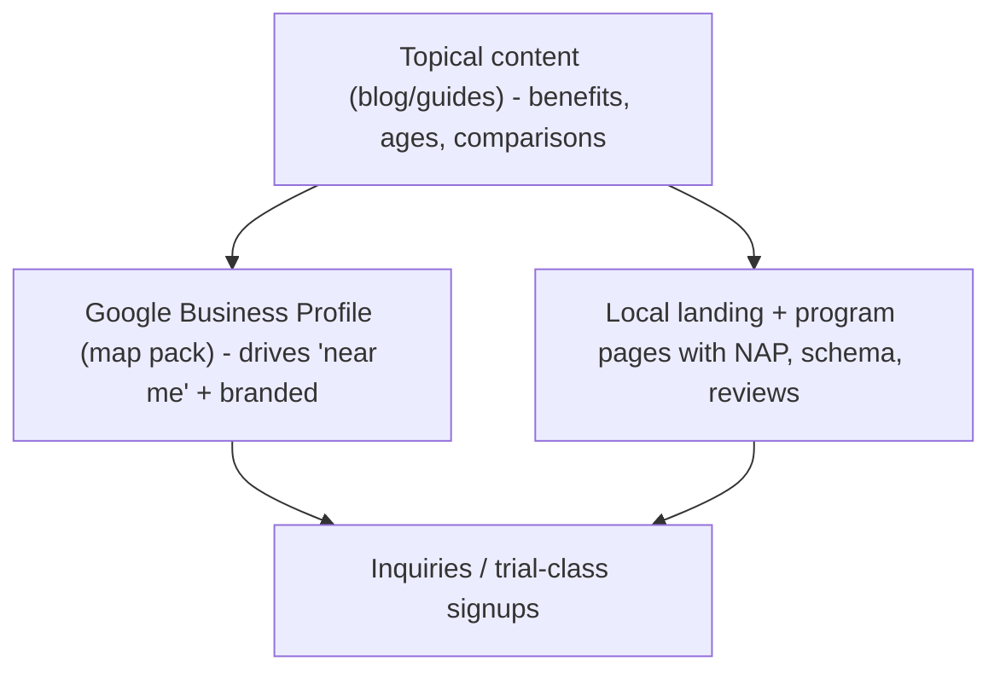

# Vortex Athletics SEO Audit & Optimization (2026)

Two domains audited: `vortexathletics.com` (hub) and `vortex-gymnastics.com` (gymnastics).
Business: Vortex Athletics, a gymnastics + youth athletic development facility at **4961 Tesla Dr, Ste E, Bowie, MD 20715**, phone **+1 (443) 422-4794**, email **team@vortexathletics.com**.

> **Data confidence note.** This audit is built from the live source code (routes, metadata config, components, build scripts) plus public web research on local competitors. Items that require Google Search Console (GSC), GA4, a Google Business Profile (GBP) login, or a paid keyword tool (search volume, keyword difficulty, backlink counts, Core Web Vitals field data) are explicitly labeled **[ASSUMPTION]** and list the data needed to confirm. Keyword priorities use intent + local competition logic, not verified volumes.

---

## 1. Executive Summary

Vortex is a strong, modern brand with a serious technical SEO problem and a large untapped local-intent opportunity.

**The single biggest issue:** the site is a client-rendered SPA and **prerendering is disabled in production** (`scripts/prerender.mjs` exits unless `PRERENDER=true`, and `package.json`'s `vercel-build` never sets it). Every URL on both domains is served the same generic `index.html` (`<title>Vortex Athletics - Transform Youth Athletes Into Champions</title>`). All per-route titles, descriptions, canonicals, Open Graph tags, and H1s only appear after JavaScript runs via `react-helmet-async`. Result: social scrapers and non-JS crawlers see one title for the whole site, and Google must render every page before it sees correct metadata. **[RESOLVED]** `vercel-build` now sets `PRERENDER=true`, `vercel.json` is filesystem-first + host-aware (dedicated `_gym/*` files for the gymnastics domain), and per-route static HTML is generated for both domains.

**The second issue:** there is **zero structured data (JSON-LD)** anywhere. `SeoHead.tsx` emits only title/description/canonical/OG/Twitter. For a local gymnastics business, missing `LocalBusiness`/`SportsActivityLocation`, `FAQPage`, `Course`, and `Event` schema is leaving the highest-leverage local + rich-result wins on the table. **[RESOLVED]** `src/utils/schema.ts` now emits `Organization`, `WebSite`, `SportsActivityLocation` (with `geo`, `openingHoursSpecification`, `hasMap`, `priceRange`, `areaServed`), `BreadcrumbList`, `Course`, `Service`, and `FAQPage` per route on both domains.

**The third issue:** content/keyword targeting is brand-led, not intent-led. Titles like "Transform Youth Athletes Into Champions" and "Our Value & Philosophy" do not target what parents actually search ("kids gymnastics classes Bowie", "preschool gymnastics near me"). The hub homepage H1 rotates through marketing slogans rather than a single keyword-anchored heading. **[RESOLVED]** Titles/descriptions rewritten around local + program intent, and each page now has a single keyword-anchored (visually-hidden) `<h1>`.

**Top opportunities (highest ROI first):**
1. Turn prerendering on and emit JSON-LD -> immediate crawl/indexing + rich-result gains across all pages.
2. Rewrite titles/descriptions/H1s around local + program intent ("Gymnastics Classes in Bowie, MD").
3. Build dedicated program pages on `vortex-gymnastics.com` (preschool, beginner, tumbling, ninja, camps) -> capture mid/bottom-funnel searches the current 3 "artistic by age" pages miss.
4. Optimize the Google Business Profile and reviews engine -> map-pack visibility is the #1 driver for "near me" gymnastics searches.
5. De-duplicate `/campaigns/*` and the `/` vs `/gymnastics` near-duplicate to remove cannibalization.

**Verdict on the two domains:** keep both, but assign roles. `vortexathletics.com` = brand/org hub + non-gymnastics programs (ninja, Athleticism Accelerator, Fit & Flip, events). `vortex-gymnastics.com` = the topical-authority hub for *all* gymnastics intent. This avoids the two sites competing for the same gymnastics queries.

### 1.1 Implementation status (this optimization pass)

**Resolved / shipped:**
- **Dedicated beginner-gymnastics search landing page.** `/beginner-gymnastics` now targets the high-intent “beginner gymnastics classes” query with substantial parent-focused copy, clear enrollment CTAs, local service-area content, internal program links, visible FAQs, `FAQPage` + `Course` + location schema, sitemap inclusion, and production prerendering.
- **Prerendering live in production.** `vercel-build` sets `PRERENDER=true`; `scripts/prerender.mjs` snapshots all hub + gymnastics routes to dedicated static HTML, with non-Chromium baseline files generated first so a Playwright failure never produces 404s.
- **Host-aware Vercel routing.** `vercel.json` is filesystem-first; `vortex-gymnastics.com` serves dedicated `_gym/index.html` and `_gym/read-board.html` so each domain gets its own title/canonical/OG/schema for shared paths (`/`, `/read-board`).
- **Structured data on every route** (`src/utils/schema.ts`): `Organization`, `WebSite`, `SportsActivityLocation` (geo + opening hours + `hasMap` + `priceRange` + `areaServed`), `BreadcrumbList`, `Course`, `Service`, `FAQPage`.
- **Intent-led metadata + single keyword-anchored H1** per page (visually-hidden `sr-only` H1; rotating hero text demoted to non-heading elements).
- **Visible FAQ + `FAQPage` schema** on both home pages.
- **Per-host sitemaps.** `sitemap.xml` (hub + coming-soon stubs) and `sitemap-gymnastics.xml` (gymnastics), each referenced from its own host's `robots.txt`. `/campaigns/*` and the `/` vs `/gymnastics` near-duplicate are consolidated via canonical.
- **NAP consistency** standardized to `4961 Tesla Dr, Ste E, Bowie, MD 20715`; `robots.txt` disallows `/admin`, `/admin.html`, and `/*?sport=`.
- **Open Graph / Twitter** hardened: per-origin default image (hub vs gymnastics branding), `og:image:alt`, `og:locale`, `twitter:image:alt`. (No new image binaries were committed; existing brand logos are reused.)
- **Canonical/URL consistency.** Schema builders reuse `buildCanonical`, so root URLs in canonical, schema, OG, and both sitemaps all use the same no-trailing-slash form.
- **LCP hints.** Hero poster (hub) and first hero image (gymnastics) get `fetchpriority="high"` + a route-scoped `<link rel="preload" as="image">`; below-fold gymnastics hero images and the home video iframe are lazy-loaded.

**Notes / acceptable trade-offs:**
- JSON-LD currently renders in `<body>` (inside `#root`) rather than `<head>`. This is **valid** per Google's structured-data guidelines (JSON-LD may appear anywhere on the page) and is fully crawlable in the prerendered HTML.

**Still requires owner action (external, not code):** GBP optimization + review engine, citation cleanup, GSC/GA4 verification, and Core Web Vitals field data.

---

## 2. Best SEO Mechanism for a Local Youth Gymnastics Business

For a single-location youth gymnastics/athletics facility, organic success is ~70% **local SEO** and ~30% **content/topical authority**. Ranking happens in three layers:



### 2.1 Local SEO strategy
- **Map-pack ranking factors** (in priority order): GBP relevance (categories/services/name), proximity to searcher, prominence (review count + velocity + rating), website relevance (on-page + `LocalBusiness` schema with matching NAP), and citation consistency.
- **Geographic targeting:** primary city **Bowie, MD**; secondary service area **Prince George's County + Anne Arundel County** (Crofton, Mitchellville, Upper Marlboro, Glenn Dale, Lanham, Crofton, Annapolis edge). Competitors openly target this same radius (MGA lists "Bowie, Mitchellville, Crofton, Annapolis").
- **Reviews:** the largest prominence lever. Build an always-on ask (post-trial email/text + in-gym QR) targeting Google reviews with first names + program keywords in responses.
- **Citations:** ensure identical NAP on Google, Bing Places, Apple Business Connect, Yelp, Facebook, Nextdoor, plus niche directories (USA Gymnastics club finder, KidsOutAndAbout DMV, Chesapeake Family, Macaroni KID Bowie).
- **Local backlinks:** Bowie/Crofton parenting blogs, local schools/PTAs, homeschool co-ops, Chamber of Commerce, youth-sports directories, news (camp announcements).
- **Location schema:** `SportsActivityLocation` with `geo`, `openingHoursSpecification`, `areaServed`, `sameAs`.

### 2.2 Website architecture strategy
- **Primary brand domain:** `vortexathletics.com`.
- **`vortex-gymnastics.com`:** keep as the **gymnastics authority hub** (exact-match domain is a mild relevance asset for gymnastics queries). Do **not** redirect it to the hub.
- **Are they competing?** Today, yes — both can surface for "gymnastics" and both share `/read-board`. Fix by role separation: all gymnastics program/intent pages live on `vortex-gymnastics.com`; the hub links to them and keeps only a brief "Gymnastics" teaser that points out.
- **Duplicate-content risk:** Real. (a) Hub `/` and gymnastics `/` are served from the same `index.html`; (b) `/` vs `/gymnastics` render the same component; (c) `/campaigns/artistic-*` are byte-identical to `/artistic-*`. Mitigations: self-referencing canonicals per domain (already correct in helmet), canonical `/campaigns/*` -> `/artistic-*` (or `noindex`), and pick one of `/` vs `/gymnastics` as canonical.
- **Cross-domain links:** hub -> gymnastics (Header "Gymnastics", Programs cards, Sports menu — already implemented via `getGymnasticsSiteUrl`) and gymnastics -> hub (footer + menu logo). Keep these `rel="noopener"` but **not** `nofollow` — internal brand cross-links should pass equity.
- **Authority hub:** `vortex-gymnastics.com` for gymnastics topics; `vortexathletics.com` for brand + athletic-development topics.

### 2.3 Program page strategy
Each program needs its own indexable URL with intent-matched metadata, ~500-900 words, FAQs, schema, and a clear CTA. Recommended page set and targeting:

| Program | Primary keyword | Secondary keywords | Intent | Page structure | CTA | Schema |
|---|---|---|---|---|---|---|
| Gymnastics (hub) | gymnastics classes Bowie MD | gymnastics near me, gymnastics gym Bowie | Commercial/local | Hero + program grid + levels + FAQ | Book a trial class | SportsActivityLocation + Course |
| Preschool / Early (2-5) | preschool gymnastics Bowie | toddler gymnastics, mommy and me gymnastics | Commercial/local | Hero + what-they-learn + schedule + FAQ | Book a trial | Course |
| Beginner gymnastics | beginner gymnastics classes | kids gymnastics for beginners, no experience | Commercial | Hero + skills + progression + FAQ | Book a trial | Course |
| Intermediate/Advanced | advanced gymnastics training | competitive gymnastics, team gymnastics Bowie | Commercial | Levels + tryout info + FAQ | Request team info | Course |
| Tumbling | tumbling classes Bowie MD | cheer tumbling, trampoline & tumbling | Commercial/local | Hero + skills + FAQ | Book a trial | Course |
| Ninja (hub) | ninja classes for kids Bowie | ninja warrior classes kids, obstacle classes | Commercial/local | Hero + what-it-builds + ages + FAQ | Book a trial | Course |
| Athleticism Accelerator (hub) | youth athletic training Bowie | speed and agility training kids, sports performance | Commercial | 8-tenets + who-it's-for + FAQ | Book assessment | Service |
| Homeschool gymnastics | homeschool gymnastics Bowie | homeschool PE classes, daytime gymnastics | Commercial/local | Hero + schedule + benefits + FAQ | Reserve a spot | Course |
| Camps | gymnastics camps Bowie MD | summer gymnastics camp, school break camp | Seasonal/commercial | Hero + sessions + pricing + FAQ | Register now | Event/Course |
| Events / Read board | gymnastics events Bowie | open gym, clinics, parents night out | Navigational/seasonal | Live event list | Register / RSVP | Event |
| Adult fitness / acro (Fit & Flip) | adult gymnastics Bowie | adult fitness classes, acrobatics adults | Commercial | Hero + format + FAQ | Try a class | Service |

### 2.4 Conversion strategy
- Above the fold on every program page: one keyword H1, a benefit subhead, and a primary CTA ("Book a Free Trial Class") + secondary ("View Schedule").
- Replace the single global contact modal with **program-context inquiries** (pass `sportLabel`/program so the form pre-fills interest — partially supported already via `ContactForm` `sportLabel`).
- Trust signals near CTAs: review stars + count, coach credentials, USA Gymnastics affiliation, safety/certification, "since [year]".
- Parent-focused copy: ages, "no experience needed", schedule clarity, drop-off vs parent-stay, pricing transparency.
- FAQ section on every program page (also powers `FAQPage` schema).
- Mobile: tap-to-call the NAP phone, sticky "Book trial" on program pages.

---

## 3. URL Inventory (both domains)

### 3.1 `vortexathletics.com` (hub)
| URL | Type | Purpose | Current title | Current H1 | Index? | Issues / risk |
|---|---|---|---|---|---|---|
| `/` | Home | Brand + program hub | Vortex Athletics - Transform Youth Athletes Into Champions | Rotating slogans (`Hero.tsx`) | Yes (after JS) | No real keyword in title/H1; rotating H1; two H1 nodes (desktop+mobile); no schema; meta only client-side |
| `/ninja` | Program | Ninja obstacle training | Vortex Ninja Programs \| Vortex Athletics | Two `motion.h1` (lines 66,136) | Yes | Multiple H1; no "for kids"/local keyword; no Course schema |
| `/strength-conditioning` | Program | Fit & Flip adult/athlete fitness | Fit & Flip Strength & Conditioning \| Vortex Athletics | Single H1 | Yes | Brand-led title; missing "adult fitness/gymnastics Bowie" intent; no schema |
| `/athleticism-accelerator` | Program | Athletic development | Athleticism Accelerator \| Vortex Athletics | Two `motion.h1` (lines 82,151) | Yes | Multiple H1; no local/athletic-training keyword; no Service schema |
| `/value` | Info | Philosophy/differentiators | Our Value & Philosophy \| Vortex Athletics | Single H1 | Yes | Thin commercial value; rename to "Why Vortex"; low keyword intent |
| `/read-board` | Events | Classes/camps/events | Classes & Events \| Vortex Athletics | H1 present | Yes | Shares path with gymnastics `/read-board`; no Event schema |
| admin/member portals | App | Authenticated tooling | n/a | n/a | Should be noindex | Ensure not crawlable (not in sitemap; gate `/admin.html` already disallowed) |

### 3.2 `vortex-gymnastics.com` (gymnastics)
| URL | Type | Purpose | Current title | Index? | Issues / risk |
|---|---|---|---|---|---|
| `/` | Home | Gymnastics hub | Vortex Gymnastics - Youth Gymnastics Programs | Yes | Near-duplicate of `/gymnastics`; served from shared index.html; no schema |
| `/gymnastics` | Program | Gymnastics overview | Gymnastics Programs \| Vortex Gymnastics | Yes | **Cannibalizes `/`** (same component); pick canonical |
| `/artistic-gymnastics-early` | Program | Ages 2-5 | Artistic Gymnastics Early Development \| Vortex Gymnastics | Yes | Title leads with "Artistic" (low search) vs "Preschool/Toddler" (high search) |
| `/artistic-gymnastics-6-12` | Program | Ages 6-12 | Artistic Gymnastics Ages 6-12 \| Vortex Gymnastics | Yes | Missing "kids gymnastics classes" intent |
| `/artistic-gymnastics-13-18` | Program | Ages 13-18 | Artistic Gymnastics Ages 13-18 \| Vortex Gymnastics | Yes | Low-volume framing; consider "teen/competitive" |
| `/campaigns/artistic-gymnastics-early` | Dup | Paid-campaign LP | (identical to above) | Yes | **Duplicate content** — canonical or noindex |
| `/campaigns/artistic-gymnastics-6-12` | Dup | Paid-campaign LP | (identical) | Yes | **Duplicate content** |
| `/campaigns/artistic-gymnastics-13-18` | Dup | Paid-campaign LP | (identical) | Yes | **Duplicate content** |
| `/read-board` | Events | Schedule/events | Classes & Events \| Vortex Gymnastics | Yes | Path collision with hub `/read-board` in static build |

**Missing pages that should exist on `vortex-gymnastics.com`** (content gaps vs competitors): Preschool gymnastics, Beginner gymnastics, Tumbling, Ninja (or link to hub), Camps, Birthday parties (if offered), Homeschool gymnastics, Adult gymnastics, Open gym.

### 3.3 Sitewide / technical checks
- **Sitemap:** `public/sitemap.xml` generated by `scripts/generate-sitemap.mjs` from `scripts/seo-config.mjs`; includes hub + gymnastics + stub coming-soon URLs. Includes the `/campaigns/*` duplicates (should be excluded once canonicalized).
- **robots.txt:** single file, `Disallow: /admin.html`, references only `https://www.vortexathletics.com/sitemap.xml`. Served on both domains (gymnastics has no own reference).
- **Canonicals:** correct per-domain in helmet, but **only client-side** (not in static HTML) until prerender is enabled.
- **Duplicate titles/descriptions:** `/campaigns/*` vs `/artistic-*` (identical).
- **Missing/multiple H1:** multiple H1 on `/ninja`, `/athleticism-accelerator`, hub `/` (responsive duplicates).
- **Image alt text:** many decorative hero images use `alt=""` (acceptable if truly decorative) but content/og images and logos need descriptive alt; audit per page.
- **OG/Twitter:** present in helmet but client-only -> social shares show generic homepage card for every URL until prerender.
- **HTTPS:** yes (Vercel). **Mobile:** responsive Tailwind, generally good. **CWV:** **[ASSUMPTION]** — needs PageSpeed Insights/CrUX; large hero videos (`HeroBackgroundVideo`, `CdnVideo`) are an LCP/bandwidth risk.

---

## 4. Keyword Research

Volumes/difficulty are **[ASSUMPTION]** (need a keyword tool + GSC). Funnel: TOFU=awareness, MOFU=consideration, BOFU=ready-to-buy.

### Brand
| Keyword | Intent | Funnel | Target page | Priority | Title angle |
|---|---|---|---|---|---|
| vortex athletics | Navigational | BOFU | hub `/` | High | Brand + Bowie + programs |
| vortex gymnastics | Navigational | BOFU | gym `/` | High | Brand + gymnastics + Bowie |
| vortex athletics bowie | Navigational/local | BOFU | hub `/` | High | Brand + location |

### Local gymnastics
| Keyword | Intent | Funnel | Target page | Priority | Title angle |
|---|---|---|---|---|---|
| gymnastics classes near me | Commercial/local | BOFU | gym `/` | High | "Gymnastics Classes in Bowie, MD" |
| gymnastics classes bowie md | Commercial/local | BOFU | gym `/` | High | City-first |
| gymnastics gym near me | Commercial/local | BOFU | gym `/` | High | City + "gym" |
| kids gymnastics classes | Commercial | MOFU | gym `/gymnastics` | High | "Kids Gymnastics Classes" + city |

### Kids gymnastics
| Keyword | Intent | Funnel | Target page | Priority | Title angle |
|---|---|---|---|---|---|
| kids gymnastics bowie | Commercial/local | BOFU | gym `/gymnastics` | High | City + age |
| gymnastics for kids | Commercial | MOFU | gym `/gymnastics` | Med | Benefits + ages |
| beginner gymnastics classes | Commercial | MOFU | new `/beginner-gymnastics` | High | "no experience needed" |

### Toddler & preschool
| Keyword | Intent | Funnel | Target page | Priority | Title angle |
|---|---|---|---|---|---|
| preschool gymnastics | Commercial/local | BOFU | `/preschool-gymnastics` (rename from early) | High | "Preschool Gymnastics (Ages 2-5)" |
| toddler gymnastics near me | Commercial/local | BOFU | `/preschool-gymnastics` | High | Toddler + city |
| mommy and me gymnastics | Commercial | MOFU | `/preschool-gymnastics` | Med | Parent-and-tot |
| gymnastics for 3 year olds | Commercial | MOFU | `/preschool-gymnastics` | Med | Age-specific |

### Tumbling
| Keyword | Intent | Funnel | Target page | Priority | Title angle |
|---|---|---|---|---|---|
| tumbling classes near me | Commercial/local | BOFU | new `/tumbling` | High | City + tumbling |
| cheer tumbling classes | Commercial | MOFU | `/tumbling` | Med | Cheer crossover |
| trampoline and tumbling | Commercial | MOFU | `/tumbling` | Med | T&T |

### Ninja / obstacle
| Keyword | Intent | Funnel | Target page | Priority | Title angle |
|---|---|---|---|---|---|
| ninja classes for kids | Commercial/local | BOFU | hub `/ninja` | High | "Kids Ninja Classes in Bowie" |
| ninja warrior classes near me | Commercial/local | BOFU | hub `/ninja` | High | ANW hook |
| obstacle course classes kids | Commercial | MOFU | hub `/ninja` | Med | Obstacle |

### Athletic performance
| Keyword | Intent | Funnel | Target page | Priority | Title angle |
|---|---|---|---|---|---|
| youth athletic training bowie | Commercial/local | BOFU | `/athleticism-accelerator` | High | Local athletic training |
| speed and agility training for kids | Commercial | MOFU | `/athleticism-accelerator` | Med | Speed/agility |
| sports performance training near me | Commercial/local | BOFU | `/athleticism-accelerator` | Med | Direct vs Redline |

### Homeschool
| Keyword | Intent | Funnel | Target page | Priority | Title angle |
|---|---|---|---|---|---|
| homeschool gymnastics | Commercial/local | BOFU | new `/homeschool-gymnastics` | High | Daytime homeschool |
| homeschool PE classes near me | Commercial/local | BOFU | `/homeschool-gymnastics` | Med | PE credit |

### Camps & clinics
| Keyword | Intent | Funnel | Target page | Priority | Title angle |
|---|---|---|---|---|---|
| gymnastics camps bowie | Seasonal/local | BOFU | new `/camps` | High | Summer + school-break |
| summer gymnastics camp near me | Seasonal/local | BOFU | `/camps` | High | Seasonal |
| school break camps kids | Seasonal | MOFU | `/camps` | Med | No-school days |

### Adult fitness / adult gymnastics
| Keyword | Intent | Funnel | Target page | Priority | Title angle |
|---|---|---|---|---|---|
| adult gymnastics near me | Commercial/local | BOFU | hub `/strength-conditioning` | Med | Adult gymnastics |
| adult fitness classes bowie | Commercial/local | BOFU | hub `/strength-conditioning` | Med | Fit & Flip |
| acrobatics classes adults | Commercial | MOFU | hub `/strength-conditioning` | Low | Acro |

### Parent-intent / informational (blog)
| Keyword | Intent | Funnel | Target page | Priority |
|---|---|---|---|---|
| best age to start gymnastics | Informational | TOFU | blog | High |
| benefits of gymnastics for kids | Informational | TOFU | blog | High |
| gymnastics vs tumbling | Informational | TOFU | blog | Med |
| how to choose a gymnastics gym | Informational | MOFU | blog | High |
| what to wear to gymnastics class | Informational | TOFU | blog | Low |

### Event-based
| Keyword | Intent | Funnel | Target page | Priority |
|---|---|---|---|---|
| open gym near me | Commercial/local | BOFU | `/read-board` or `/open-gym` | Med |
| parents night out bowie | Local/seasonal | BOFU | `/read-board` | Med |
| gymnastics birthday party bowie | Commercial/local | BOFU | new `/birthday-parties` (if offered) | Med [ASSUMPTION: confirm offering] |

---

## 5. Competitor Analysis (Bowie / Crofton / Anne Arundel / PG County)

Sources: competitor websites + public listings (researched 2026). Review counts, backlinks, and GBP internals are **[ASSUMPTION]** without a rank/backlink tool.

| Competitor | Location | Strengths | Programs | Notable for SEO |
|---|---|---|---|---|
| **Docksiders Gymnastics** | Millersville, MD (216 Najoles Rd) | Since 1975; elite competitive teams (110+ athletes, 70+ collegiate), strong reputation | Rec classes, T&T, competitive (JO/Xcel), open gym, adult open gym, clinics, camps | Deep authority/longevity; likely strong branded + "competitive gymnastics" rankings |
| **Emilia's Acrobatics, Gymnastics & Cheer (EAGC)** | Laurel, MD (9000 Maier Rd) | Toddler-through-adult, acro + cheer + yoga, open enrollment, camps/parties | Gymnastics, tumbling, acro teams, cheer, camps, birthday parties | Broad program coverage = many indexable intent pages; "fun fundamentals" parent copy |
| **International Elite** | Crofton, MD (2404 Crofton Blvd) | Women-owned, artistic + acrobatic, personalized | Artistic/acro gymnastics, tumbling (all levels), camps, open gym, parties, private/adult | Strong service taxonomy (many listed services = on-page keyword breadth) |
| **Redline Athletics** | Bowie, MD | **Same-city** sports performance brand | Athletic/sports performance training | **Direct competitor for Athleticism Accelerator** + "youth athletic training Bowie" |
| **Silver Star Gymnastics** | Bowie + Silver Spring | Since 1993, in-city, open play, parties | Preschool, rec, ninja, camps, parties | In-city preschool/ninja + "open play" rankings |
| **MGA Gymnastics** | Upper Marlboro, MD | 60+ yrs, explicit Bowie/Crofton service-area copy | Preschool, girls/boys, ninja, tumbling, camps | Has a clear keyword-rich title ("Gymnastics, Tumbling & Ninja Classes in Upper Marlboro, MD") + service-area copy |
| **My Gym Crofton** | Gambrills, MD | Franchise polish, ninja program | Preschool fitness, ninja, camps, parties | Franchise domain authority; strong ninja content |

**What competitors do better than Vortex today:**
- Keyword-rich, location-stamped titles (MGA: "...Classes in Upper Marlboro, MD"). Vortex titles are brand-led.
- Dedicated program/age pages (EAGC, International Elite list many services -> many indexable pages). Vortex has only 3 "artistic by age" pages.
- Explicit service-area copy (MGA names Bowie/Crofton/Annapolis). Vortex only says "central Maryland".
- Camps, parties, open gym pages that capture seasonal/long-tail intent.

**What Vortex can outperform:**
- **Tech/brand modernity:** Vortex's UX, video, and "8 tenets/technology" story are stronger than competitors' dated sites — once crawlable, this differentiates.
- **Athletic-development angle:** the Athleticism Accelerator is a unique wedge vs pure gymnastics gyms; directly competitive with Redline but bundled with gymnastics.
- **Exact-match domain** `vortex-gymnastics.com` for gymnastics queries.
- **Same-city advantage in Bowie** vs Crofton/Millersville/Laurel/Upper Marlboro competitors for "Bowie" searches (only Silver Star and Redline are in-city).

**Content gaps to fill:** preschool, beginner, tumbling, homeschool, camps, parties (if offered), open gym, adult gymnastics, plus a parent-education blog. **Local SEO opportunities:** dominate "gymnastics Bowie" (most competitors are out-of-city). **Backlink opportunities:** Bowie/PG County parenting + homeschool sites, USA Gymnastics club listing, local news camp coverage.

---

## 6. Page-by-Page SEO Optimization

All titles target <=60 chars, descriptions <=160 chars. "Book a trial" = primary CTA via `ContactForm`.

### 6.1 `vortexathletics.com`

| URL | Page Purpose | Primary KW | Secondary KW | Intent | Recommended Title | Recommended Meta Description | H1 | H2s | Content Changes | Internal Links | Schema | CTA | Priority |
|---|---|---|---|---|---|---|---|---|---|---|---|---|---|
| `/` | Brand + program hub | youth athletic training Bowie MD | gymnastics, ninja, kids fitness Bowie | Brand/local | Vortex Athletics \| Youth Sports & Gymnastics, Bowie MD | Gymnastics, ninja, and athletic training for kids and adults in Bowie, MD. Expert coaching, modern facility. Book a free trial class. | Youth Athletic Training & Gymnastics in Bowie, MD | Programs; Why Vortex; Technology; FAQ; Visit Us | Fix rotating/multiple H1 to one static H1; add city + NAP block; add FAQ visible section | -> gymnastics `/`, `/ninja`, `/athleticism-accelerator`, `/read-board` | Organization, WebSite, SportsActivityLocation, FAQPage | Book a free trial | High |
| `/ninja` | Ninja program | ninja classes for kids Bowie | ninja warrior classes, obstacle classes kids | Commercial/local | Kids Ninja Classes in Bowie, MD \| Vortex | Ninja obstacle classes for kids in Bowie, MD. Build strength, agility, and confidence on warped walls and courses. Book a free trial. | Kids Ninja Classes in Bowie, MD | What Kids Learn; Ages & Levels; Schedule; FAQ | Single H1; add ages, "American Ninja Warrior" hook, schedule, FAQ | -> hub `/`, `/athleticism-accelerator`, `/read-board` | Course, BreadcrumbList | Book a free trial | High |
| `/strength-conditioning` | Fit & Flip adult/athlete | adult fitness classes Bowie | adult gymnastics, acrobatics, conditioning | Commercial/local | Fit & Flip \| Adult Fitness & Acrobatics, Bowie MD | Adult fitness, conditioning, and acrobatics in Bowie, MD. Functional strength and mobility for all levels. Try a class. | Fit & Flip: Adult Fitness & Acrobatics in Bowie | Format; Who It's For; Schedule; FAQ | Add "adult gymnastics" terms; clarify adult audience; add FAQ | -> hub `/`, `/athleticism-accelerator` | Service, BreadcrumbList | Try a class | Medium |
| `/athleticism-accelerator` | Athletic development | youth athletic training Bowie | speed & agility, sports performance kids | Commercial/local | Youth Athletic Training in Bowie \| Vortex Accelerator | Sports performance training for young athletes in Bowie, MD. Build speed, power, and coordination across 8 tenets. Book an assessment. | The Athleticism Accelerator: Youth Athletic Training | The 8 Tenets; Who It's For; Results; FAQ | Single H1 (remove duplicate); add local + "vs Redline" differentiation; FAQ | -> hub `/`, `/ninja`, gymnastics `/` | Service, BreadcrumbList | Book an assessment | High |
| `/value` | Differentiators | why choose Vortex Athletics | development-first coaching, safe gym | Consideration | Why Vortex Athletics \| Development-First Coaching | See what makes Vortex different: development-first training, expert coaches, and modern technology in Bowie, MD. | Why Families Choose Vortex Athletics | Our Approach; Coaches; Technology; FAQ | Rename focus to "Why Vortex"; add proof/trust; link to programs | -> all program pages | BreadcrumbList | Book a trial | Low |
| `/read-board` | Events/classes | gymnastics events Bowie | open gym, camps, parents night out | Navigational/seasonal | Classes, Camps & Events \| Vortex Athletics Bowie | See upcoming classes, camps, open gyms, and events at Vortex Athletics in Bowie, MD. Register your athlete today. | Classes, Camps & Events in Bowie, MD | This Week; Camps; Open Gym; Register | Add Event schema per event; seasonal landing copy | -> programs, contact | ItemList of Event | Register | High |

### 6.2 `vortex-gymnastics.com`

| URL | Page Purpose | Primary KW | Secondary KW | Intent | Recommended Title | Recommended Meta Description | H1 | H2s | Content Changes | Internal Links | Schema | CTA | Priority |
|---|---|---|---|---|---|---|---|---|---|---|---|---|---|
| `/` | Gymnastics hub | gymnastics classes Bowie MD | gymnastics near me, kids gymnastics | Commercial/local | Gymnastics Classes in Bowie, MD \| Vortex Gymnastics | Gymnastics classes for all ages in Bowie, MD. Preschool to competitive, taught by expert coaches. Book a free trial class today. | Gymnastics Classes in Bowie, MD | Programs by Age; Why Vortex; Schedule; FAQ; Visit | Make `/` the canonical hub; add program-by-age grid linking out; NAP block; FAQ | -> `/preschool-gymnastics`, `/beginner-gymnastics`, `/tumbling`, `/camps`, `/read-board` | SportsActivityLocation, WebSite, FAQPage | Book a free trial | High |
| `/gymnastics` | Overview (dup of `/`) | gymnastics programs Bowie | gymnastics levels | Commercial | (canonical to `/`) | (canonical to `/`) | Gymnastics Programs at Vortex | n/a | **Canonical to `/`** to remove cannibalization, or repurpose as a "programs index" with unique copy | -> age pages | canonical only | Book a trial | High |
| `/artistic-gymnastics-early` -> rename intent to **Preschool** | Ages 2-5 | preschool gymnastics Bowie | toddler gymnastics, mommy and me | Commercial/local | Preschool Gymnastics (Ages 2-5) in Bowie, MD | Preschool and toddler gymnastics in Bowie, MD for ages 2-5. Build coordination and confidence through play. Book a free trial. | Preschool Gymnastics in Bowie, MD (Ages 2-5) | What They Learn; A Typical Class; Schedule; FAQ | Lead with "preschool/toddler" (keep artistic context in body); add parent FAQ | -> gym `/`, `/beginner-gymnastics`, `/read-board` | Course, BreadcrumbList | Book a free trial | High |
| `/artistic-gymnastics-6-12` | Ages 6-12 | kids gymnastics classes Bowie | beginner/intermediate gymnastics | Commercial/local | Kids Gymnastics Classes (Ages 6-12) \| Bowie, MD | Gymnastics classes for kids ages 6-12 in Bowie, MD. Beginner to advanced, with safe technique and progression. Book a trial. | Kids Gymnastics Classes in Bowie (Ages 6-12) | Levels; Skills; Schedule; FAQ | Add level/beginner language; progression chart; FAQ | -> gym `/`, `/artistic-gymnastics-13-18`, `/camps` | Course, BreadcrumbList | Book a free trial | High |
| `/artistic-gymnastics-13-18` | Ages 13-18 | teen & competitive gymnastics Bowie | advanced gymnastics, gymnastics team | Commercial/local | Teen & Competitive Gymnastics (13-18) \| Bowie MD | Advanced and competitive gymnastics for ages 13-18 in Bowie, MD. Strength, skills, and performance readiness. Request info. | Teen & Competitive Gymnastics in Bowie (Ages 13-18) | Training Tracks; Team/Tryouts; Schedule; FAQ | Add competitive/team angle vs Docksiders; tryout CTA | -> gym `/`, `/read-board` | Course, BreadcrumbList | Request team info | Medium |
| `/campaigns/artistic-*` (x3) | Paid LPs | (match parent) | — | — | (canonical to matching `/artistic-*`) | (same) | (same) | (same) | **Add canonical to the matching evergreen page; or `noindex,follow`**; remove from sitemap | -> parent program | canonical only | Book a trial | High |
| `/read-board` | Gymnastics events | gymnastics camps Bowie | open gym, clinics | Navigational/seasonal | Gymnastics Classes, Camps & Events \| Bowie, MD | Upcoming gymnastics classes, camps, and open gyms at Vortex Gymnastics in Bowie, MD. Register today. | Gymnastics Classes, Camps & Events | This Week; Camps; Open Gym; Register | Event schema; seasonal copy | -> program pages | ItemList of Event | Register | High |
| **NEW** `/beginner-gymnastics` | Beginner funnel | beginner gymnastics classes Bowie | no experience gymnastics | Commercial/local | Beginner Gymnastics Classes in Bowie, MD | Beginner gymnastics classes in Bowie, MD — no experience needed. Learn the fundamentals in a safe, fun gym. Book a free trial. | Beginner Gymnastics Classes in Bowie, MD | What You'll Learn; First Class; Schedule; FAQ | New page; target "beginner/no experience" | -> age pages, gym `/` | Course | Book a free trial | High |
| **NEW** `/tumbling` | Tumbling funnel | tumbling classes Bowie MD | cheer tumbling, trampoline & tumbling | Commercial/local | Tumbling Classes in Bowie, MD \| Vortex Gymnastics | Tumbling and trampoline classes in Bowie, MD for cheer and gymnastics. All levels welcome. Book a free trial class. | Tumbling Classes in Bowie, MD | Skills by Level; Cheer Tumbling; Schedule; FAQ | New page | -> gym `/`, `/camps` | Course | Book a free trial | High |
| **NEW** `/homeschool-gymnastics` | Homeschool daytime | homeschool gymnastics Bowie | homeschool PE classes | Commercial/local | Homeschool Gymnastics & PE in Bowie, MD | Daytime homeschool gymnastics and PE classes in Bowie, MD. Movement, fitness, and fun for homeschool families. Reserve a spot. | Homeschool Gymnastics & PE in Bowie, MD | Schedule; Benefits; Pricing; FAQ | New page | -> gym `/`, `/camps` | Course | Reserve a spot | Medium |
| **NEW** `/camps` | Camps funnel | gymnastics camps Bowie MD | summer/school-break camps | Seasonal/local | Gymnastics Camps in Bowie, MD \| Summer & Breaks | Summer and school-break gymnastics camps in Bowie, MD. Skill-building, games, and fun for ages 5+. Register your camper. | Gymnastics Camps in Bowie, MD | Summer; School-Break; Daily Schedule; FAQ | New page; seasonal | -> gym `/`, `/read-board` | Event/Course | Register now | High (seasonal) |

---

## 7. Rewritten SEO Copy (priority pages)

Tone: professional, parent-friendly, local, trustworthy, energetic.

### 7.1 Hub Homepage (`vortexathletics.com/`)
- **SEO title:** `Vortex Athletics | Youth Sports & Gymnastics, Bowie MD`
- **Meta:** `Gymnastics, ninja, and athletic training for kids and adults in Bowie, MD. Expert coaching and a modern facility. Book a free trial class.`
- **Hero headline (single H1):** Youth Athletic Training & Gymnastics in Bowie, MD
- **Hero subheadline:** Gymnastics, ninja, and sports-performance programs that build strong, confident athletes — for ages 2 to adult.
- **Primary CTA:** Book a Free Trial Class
- **Secondary CTA:** View Classes & Events
- **Intro paragraph:** At Vortex Athletics in Bowie, Maryland, we develop complete athletes — not just skills. From a toddler's first cartwheel to competitive gymnastics, ninja obstacle training, and our Athleticism Accelerator, our expert coaches combine proven progressions with modern technology so every athlete improves with purpose.
- **Section headings:** Programs for Every Age; Why Families Choose Vortex; Our Technology & Coaching; Classes & Camps; Frequently Asked Questions; Visit Us in Bowie
- **FAQ:** keep the 7 existing FAQs (already strong) and surface them visibly for `FAQPage` schema.
- **Internal links:** Gymnastics (-> vortex-gymnastics.com), Ninja, Athleticism Accelerator, Classes & Events.

### 7.2 Main Gymnastics (`vortex-gymnastics.com/`)
- **SEO title:** `Gymnastics Classes in Bowie, MD | Vortex Gymnastics`
- **Meta:** `Gymnastics classes for all ages in Bowie, MD — preschool to competitive, taught by expert coaches. Book a free trial class today.`
- **H1:** Gymnastics Classes in Bowie, MD
- **Subhead:** Progressive gymnastics for ages 2 to 18 — building strength, flexibility, focus, and confidence.
- **Primary CTA:** Book a Free Trial Class / **Secondary:** View the Schedule
- **Intro:** Vortex Gymnastics in Bowie offers gymnastics for every age and level, from preschool playgroups to competitive team tracks. Our coaches teach safe technique and real progression so your child grows in skill and confidence every class.
- **Sections:** Programs by Age (Preschool 2-5, Kids 6-12, Teen/Competitive 13-18); Beginner-Friendly; Why Vortex; Schedule & Pricing; FAQ; Visit Us
- **FAQ examples:** Do they need experience? What should they wear? How do trials work? Where are you located?

### 7.3 Preschool / Early (`/artistic-gymnastics-early`)
- **SEO title:** `Preschool Gymnastics (Ages 2-5) in Bowie, MD`
- **Meta:** `Preschool and toddler gymnastics in Bowie, MD for ages 2-5. Build coordination and confidence through play. Book a free trial class.`
- **H1:** Preschool Gymnastics in Bowie, MD (Ages 2-5)
- **Subhead:** Playful, structured classes that turn wiggles into coordination, balance, and confidence.
- **CTA:** Book a Free Trial / Secondary: See Class Times
- **Intro:** Our preschool gymnastics classes in Bowie give toddlers and preschoolers (ages 2-5) a safe, joyful place to move. Through games, obstacle courses, and beginner gymnastics skills, your child builds the motor skills and confidence that set up a lifetime of activity.
- **Sections:** What They Learn; A Typical Class; Mommy & Me vs Independent; Schedule; FAQ
- **Internal links:** -> gym `/`, Beginner Gymnastics, Camps.

### 7.4 Beginner Gymnastics (NEW `/beginner-gymnastics`)
- **SEO title:** `Beginner Gymnastics Classes in Bowie, MD`
- **Meta:** `Beginner gymnastics classes in Bowie, MD — no experience needed. Learn the fundamentals in a safe, fun gym. Book a free trial class.`
- **H1:** Beginner Gymnastics Classes in Bowie, MD
- **Subhead:** No experience needed — just bring energy. We'll teach the rest.
- **Intro:** New to gymnastics? Our beginner classes in Bowie meet kids exactly where they are. Coaches break every skill into simple, confidence-building steps so first-timers learn cartwheels, rolls, and bar basics safely.
- **Sections:** What You'll Learn; Your First Class; Levels & Progression; Schedule; FAQ

### 7.5 Ninja (`vortexathletics.com/ninja`)
- **SEO title:** `Kids Ninja Classes in Bowie, MD | Vortex`
- **Meta:** `Ninja obstacle classes for kids in Bowie, MD. Build strength, agility, and confidence on warped walls and courses. Book a free trial.`
- **H1:** Kids Ninja Classes in Bowie, MD
- **Subhead:** American Ninja Warrior-style training that builds strength, agility, and grit.
- **Intro:** If your child loves to climb, jump, and conquer obstacles, our ninja classes in Bowie are their arena. Kids tackle warped walls, hanging obstacles, and agility courses that change weekly — building real strength and a never-quit mindset.
- **Sections:** What Kids Build; Ages & Levels; Schedule; FAQ

### 7.6 Athleticism Accelerator (`/athleticism-accelerator`)
- **SEO title:** `Youth Athletic Training in Bowie | Vortex Accelerator`
- **Meta:** `Sports-performance training for young athletes in Bowie, MD. Build speed, power, and coordination across 8 tenets. Book an assessment.`
- **H1:** The Athleticism Accelerator: Youth Athletic Training in Bowie
- **Subhead:** Develop the speed, power, and coordination that carry across every sport.
- **Intro:** The Athleticism Accelerator is our science-backed program for young athletes in Bowie who want a competitive edge. Using gymnastics-based movement, strength work, and our 8 tenets of athleticism — measured with modern technology — we build athletes who are faster, stronger, and more injury-resistant.
- **Sections:** The 8 Tenets; Who It's For; How We Measure Progress; FAQ

### 7.7 Homeschool (NEW `/homeschool-gymnastics`)
- **SEO title:** `Homeschool Gymnastics & PE in Bowie, MD`
- **Meta:** `Daytime homeschool gymnastics and PE classes in Bowie, MD. Movement, fitness, and fun for homeschool families. Reserve a spot.`
- **H1:** Homeschool Gymnastics & PE in Bowie, MD
- **Subhead:** Daytime classes that check the PE box — and build real athletes.
- **Intro:** Our homeschool gymnastics classes in Bowie give homeschool families a structured, social, daytime way to meet PE goals. Kids build strength, coordination, and confidence while making friends.
- **Sections:** Weekly Schedule; What's Covered; Pricing & Multi-Child; FAQ

### 7.8 Camps (NEW `/camps`)
- **SEO title:** `Gymnastics Camps in Bowie, MD | Summer & Breaks`
- **Meta:** `Summer and school-break gymnastics camps in Bowie, MD. Skill-building, games, and fun for ages 5+. Register your camper today.`
- **H1:** Gymnastics Camps in Bowie, MD
- **Subhead:** High-energy camps for school breaks and all summer long.
- **Intro:** When school's out, Vortex is in. Our gymnastics camps in Bowie keep kids ages 5+ moving with skills, games, obstacle courses, and themed fun — full- and half-day options available.
- **Sections:** Summer Sessions; School-Break Camps; A Day at Camp; Pricing; FAQ

### 7.9 Events / Read Board (`/read-board`)
- **SEO title:** `Classes, Camps & Events | Vortex Athletics Bowie`
- **Meta:** `See upcoming classes, camps, open gyms, and events at Vortex in Bowie, MD. Register your athlete today.`
- **H1:** Classes, Camps & Events in Bowie, MD
- **Sections:** This Week; Upcoming Camps; Open Gym & Parents Night Out; How to Register

### 7.10 Contact / Inquiry
- **SEO title:** `Contact Vortex Athletics | Bowie, MD Gymnastics & Ninja`
- **Meta:** `Visit Vortex Athletics at 4961 Tesla Dr, Bowie, MD. Call (443) 422-4794 or book a free trial class. We'd love to meet your athlete.`
- **H1:** Contact Vortex Athletics in Bowie, MD
- **Body:** NAP block, embedded Google map, hours, tap-to-call, trial-class form. (Currently a modal — recommend also a crawlable `/contact` route.)

---

## 8. Local SEO Plan

### 8.1 Google Business Profile
- **Primary category:** Gymnastics center. **Secondary:** Children's gym, Sports complex, Physical fitness program, Gymnastics instructor (as available). [ASSUMPTION: confirm current categories in GBP.]
- **Services:** Preschool gymnastics, Kids gymnastics, Beginner gymnastics, Competitive gymnastics, Tumbling, Trampoline & tumbling, Ninja classes, Athletic/sports-performance training, Homeschool gymnastics, Camps, Open gym, Adult fitness — each with a 1-2 sentence keyword-rich description.
- **GBP description (example, ~700 chars):**
  > Vortex Athletics is a gymnastics and youth athletic-development center in Bowie, MD. We offer gymnastics for all ages — preschool, kids, beginner through competitive — plus tumbling, ninja obstacle classes, homeschool programs, camps, and our signature Athleticism Accelerator for young athletes. Our expert coaches pair proven progressions with modern technology to build strength, coordination, and confidence that carry into every sport and life. Serving Bowie, Crofton, Mitchellville, Upper Marlboro, Annapolis, and Prince George's & Anne Arundel Counties. Book a free trial class at 4961 Tesla Dr, Ste E, or call (443) 422-4794.
- **Posts:** weekly GBP posts (camps, open gyms, new sessions) with CTAs.
- **Photos:** geotagged facility, classes by program, coaches, logo, exterior with signage.
- **Q&A:** seed with the homepage FAQs.

### 8.2 Reviews
- **Generation:** automated post-trial SMS/email with a direct Google review link; in-gym QR at checkout; quarterly review drives. Target steady velocity (e.g., 4-8/month) rather than bursts.
- **Response:** reply to 100% within 48h; weave program + city keywords naturally ("So glad [child] loves our preschool gymnastics classes in Bowie!"). Never paste identical replies.

### 8.3 Citations (NAP must match exactly)
Google, Bing Places, Apple Business Connect, Yelp, Facebook, Instagram, Nextdoor, YellowPages, USA Gymnastics club finder, KidsOutAndAbout DMV, Chesapeake Family directory, Macaroni KID Bowie, ActivityHero/Sawyer (if used for booking).

### 8.4 Local backlinks & partnerships
Bowie/PG County parenting blogs, homeschool co-ops, local elementary/PTA newsletters, Bowie Chamber of Commerce, youth-sports directories, local press for camp/event announcements, cross-promo with non-competing kids' businesses (dance, music, swim).

### 8.5 Location & service-area pages
- One strong location page (or the homepages) with full NAP + embedded map + `SportsActivityLocation` schema.
- Optional service-area pages only if genuinely serving and able to add unique content (e.g., "Gymnastics near Crofton, MD") — avoid thin doorway pages.

### 8.6 NAP / map
- Standardize everywhere to `4961 Tesla Dr, Ste E, Bowie, MD 20715` (fix the gymnastics hero's "Melford Town Center" copy — same place, but the NAP string must match).
- Embed a Google Map (place embed) on contact/home.

---

## 9. Technical SEO Audit

| Issue | Affected URL(s) | Severity | Why it matters | Recommended fix | Implementation notes |
|---|---|---|---|---|---|
| Prerender disabled; SPA serves generic HTML | All pages, both domains | **Critical** | Crawlers/social scrapers see one title/meta/H1 for the whole site until JS renders | Enable `PRERENDER=true` in `vercel-build`; extend prerender to gymnastics pages | `scripts/prerender.mjs` gated by `PRERENDER!=='true'`; `package.json:14` |
| No structured data | All pages | **High** | Misses LocalBusiness/FAQ/Course/Event rich results + local relevance | Add JSON-LD via `SeoHead`/schema util | New `src/utils/schema.ts` + emit in helmet |
| Generic OG/Twitter for every URL | All (social shares) | High | Bad share cards reduce CTR; per-URL OG only client-side | Fixed once prerender writes per-route OG into static HTML | prerender already injects OG for stubs |
| Duplicate content `/campaigns/*` | gym `/campaigns/artistic-*` (x3) | High | Cannibalizes evergreen pages; dilutes signals | Canonical to matching `/artistic-*` (or `noindex,follow`); drop from sitemap | extend `getGymnasticsSeoForPath` |
| Near-duplicate `/` vs `/gymnastics` | gym | Medium | Two URLs, same component, same intent | Canonical `/gymnastics` -> `/` (or give `/gymnastics` unique "index" copy) | route renders same component |
| Multiple H1 per page | hub `/`, `/ninja`, `/athleticism-accelerator` | Medium | Dilutes primary heading signal | One H1; convert responsive twin to styled `div`/`h2`/`aria-hidden` | `Hero.tsx`(216,371), `Ninja.tsx`(66,136), `AthleticismAccelerator.tsx`(82,151) |
| Brand-led titles/H1 (no local/intent KW) | Most pages | High | Misses high-intent local queries | Rewrite per section 6 | `hubSeo.ts`, `gymnasticsSeo.ts`, hero components |
| NAP inconsistency | gym hero copy | Medium | Inconsistent NAP weakens local trust | Standardize to Tesla Dr | `gymnasticsHeroSlides.ts:18` |
| robots.txt references only hub sitemap; no gym-specific | both domains | Low | Gym domain has no own sitemap reference | Add gymnastics sitemap line / host-aware note | `public/robots.txt` |
| Sitemap includes campaign duplicates | sitemap.xml | Low | Submits dup URLs | Remove `/campaigns/*` from sitemap | `scripts/seo-config.mjs` |
| Large hero video LCP risk | home/program heroes | Medium [ASSUMPTION] | Video can hurt LCP/CWV on mobile | Poster image + lazy/deferred video; confirm with PSI | `HeroBackgroundVideo`, `CdnVideo` |
| Decorative images `alt=""` / missing descriptive alt | various | Low | Accessibility + image SEO | Add descriptive alt to content/logo images | audit per component |
| No crawlable contact page | both | Low | Contact is modal-only | Add `/contact` route with NAP + map | optional |
| No blog/content hub | both | Medium | No TOFU/topical authority capture | Build blog (see section 10/12) | new infra |

**Crawlability/indexability:** once prerendered, ensure each route emits a self-referencing canonical and that `/campaigns/*` + auth routes are `noindex`. **HTTPS:** OK. **URL structure:** clean and readable. **Pagination:** n/a. **JS rendering:** the core risk — resolved by prerender.

---

## 10. Schema Markup Recommendations

| Schema type | Where |
|---|---|
| `Organization` + `WebSite` | Sitewide (both domains, in `<head>`) |
| `SportsActivityLocation` (subtype of LocalBusiness) | Home + contact/location pages (NAP, geo, hours, areaServed, sameAs) |
| `BreadcrumbList` | All non-home pages |
| `Course` | Each program/class page |
| `Service` | Athleticism Accelerator, Fit & Flip |
| `FAQPage` | Pages with visible FAQs (home + program pages) |
| `Event` (ItemList) | `/read-board`, camps |
| `Review`/`AggregateRating` | Only from first-party, on-site reviews per Google policy — **do not** mark up Google reviews you don't host |

### Example JSON-LD

**SportsActivityLocation (home / location):**
```json
{
  "@context": "https://schema.org",
  "@type": "SportsActivityLocation",
  "name": "Vortex Athletics",
  "url": "https://www.vortexathletics.com/",
  "telephone": "+1-443-422-4794",
  "email": "team@vortexathletics.com",
  "image": "https://www.vortexathletics.com/vortex_logo_1.png",
  "address": {
    "@type": "PostalAddress",
    "streetAddress": "4961 Tesla Dr, Ste E",
    "addressLocality": "Bowie",
    "addressRegion": "MD",
    "postalCode": "20715",
    "addressCountry": "US"
  },
  "areaServed": ["Bowie MD", "Crofton MD", "Mitchellville MD", "Upper Marlboro MD", "Prince George's County", "Anne Arundel County"],
  "sameAs": [
    "https://www.instagram.com/vortexathletics.usa/",
    "https://www.facebook.com/profile.php?id=61585434675018",
    "https://www.youtube.com/@VortexAthleticsUSA"
  ]
}
```

**Course (program page):**
```json
{
  "@context": "https://schema.org",
  "@type": "Course",
  "name": "Preschool Gymnastics (Ages 2-5)",
  "description": "Preschool and toddler gymnastics in Bowie, MD for ages 2-5.",
  "provider": { "@type": "SportsActivityLocation", "name": "Vortex Athletics", "url": "https://vortex-gymnastics.com/" }
}
```

**FAQPage:**
```json
{
  "@context": "https://schema.org",
  "@type": "FAQPage",
  "mainEntity": [{
    "@type": "Question",
    "name": "Do I need gymnastics experience to register?",
    "acceptedAnswer": { "@type": "Answer", "text": "No prior experience is required. Our programs teach fundamentals and progress at your athlete's pace." }
  }]
}
```

**Event (camp):**
```json
{
  "@context": "https://schema.org",
  "@type": "Event",
  "name": "Summer Gymnastics Camp",
  "startDate": "2026-07-06",
  "endDate": "2026-07-10",
  "eventAttendanceMode": "https://schema.org/OfflineEventAttendanceMode",
  "location": { "@type": "Place", "name": "Vortex Athletics", "address": "4961 Tesla Dr, Ste E, Bowie, MD 20715" },
  "organizer": { "@type": "Organization", "name": "Vortex Athletics", "url": "https://www.vortexathletics.com/" }
}
```

---

## 11. Internal Linking Strategy

| From | To | Anchor (example) | Purpose |
|---|---|---|---|
| Hub `/` | gymnastics `/` | "Gymnastics classes in Bowie" | Push gymnastics authority |
| Hub `/` | `/ninja`, `/athleticism-accelerator` | "Kids ninja classes", "Youth athletic training" | Distribute to programs |
| Gym `/` | `/preschool`, `/beginner-gymnastics`, age pages, `/tumbling`, `/camps` | exact program names | Hub-and-spoke to class pages |
| Each program page | gym `/` (or hub `/`) | "All gymnastics programs" | Return to hub |
| Each program page | `/read-board` / `/camps` | "View the schedule", "See camps" | Conversion path |
| Each program page | `/contact` (or trial CTA) | "Book a free trial" | Conversion |
| Blog posts | matching program page | descriptive (e.g., "preschool gymnastics in Bowie") | TOFU -> MOFU |
| Footer (sitewide) | top programs + contact + FAQ | program names | Sitewide equity + UX |
| Breadcrumbs | parent pages | Home / Programs / [Program] | Structure + `BreadcrumbList` |

**Nav:** add a "Programs" dropdown on gymnastics site listing the program pages. **Footer:** expand `quickLinks` beyond just "FAQ" to include top programs + Classes & Events + Contact. **Breadcrumbs:** add to all non-home pages.

---

## 12. 6-Month Content Plan (blog)

Requires a blog (none exists today) — recommend a lightweight MDX/markdown route on `vortex-gymnastics.com/blog` (mid-term build). Each post links to a program page and ends with a trial CTA.

| Month | Blog title | Target keyword | Intent | Slug | Outline (sections) | Internal links | CTA |
|---|---|---|---|---|---|---|---|
| 1 | Best Age to Start Gymnastics | best age to start gymnastics | TOFU | `/blog/best-age-to-start-gymnastics` | Why early; readiness signs; what 2-5 yr classes look like | Preschool gymnastics | Book a trial |
| 1 | 10 Benefits of Gymnastics for Kids | benefits of gymnastics for kids | TOFU | `/blog/benefits-of-gymnastics-for-kids` | Physical; cognitive; confidence; cross-sport | Kids gymnastics, Accelerator | Book a trial |
| 2 | How to Choose a Gymnastics Gym in Bowie | how to choose a gymnastics gym | MOFU | `/blog/how-to-choose-a-gymnastics-gym` | Coaching; safety; ratios; questions to ask | Gym `/`, Why Vortex | Book a trial |
| 2 | Gymnastics vs Tumbling: What's the Difference? | gymnastics vs tumbling | TOFU | `/blog/gymnastics-vs-tumbling` | Definitions; skills; which to choose | Tumbling, Kids gymnastics | Book a trial |
| 3 | What to Expect at Your First Gymnastics Class | first gymnastics class | MOFU | `/blog/first-gymnastics-class` | What to wear; arrival; a typical class | Beginner gymnastics | Book a trial |
| 3 | Ninja Classes for Kids: Are They Right for Your Child? | ninja classes for kids | MOFU | `/blog/ninja-classes-for-kids` | What ninja builds; ages; vs gymnastics | Ninja | Book a trial |
| 4 | Homeschool Gymnastics & PE in Maryland | homeschool gymnastics | MOFU | `/blog/homeschool-gymnastics` | PE goals; daytime options; benefits | Homeschool program | Reserve a spot |
| 4 | Summer Gymnastics Camps: A Parent's Guide | gymnastics summer camp | Seasonal | `/blog/summer-gymnastics-camp-guide` | Sessions; what to pack; benefits | Camps | Register |
| 5 | Building Flexibility, Coordination & Confidence | gymnastics flexibility coordination | TOFU | `/blog/flexibility-coordination-confidence` | How gymnastics develops each | Programs, Accelerator | Book a trial |
| 5 | Athletic Development for Young Athletes | youth athletic development | MOFU | `/blog/athletic-development-young-athletes` | The 8 tenets; speed/power; injury prevention | Athleticism Accelerator | Book assessment |
| 6 | Preschool Gymnastics: What Toddlers Learn | preschool gymnastics | MOFU | `/blog/preschool-gymnastics-what-toddlers-learn` | Motor skills; class structure; readiness | Preschool gymnastics | Book a trial |
| 6 | Beginner Gymnastics Skills Every Kid Learns First | beginner gymnastics skills | TOFU | `/blog/beginner-gymnastics-skills` | Rolls, cartwheels, bars basics; progression | Beginner gymnastics | Book a trial |

---

## 13. Prioritized Implementation Roadmap

| Priority | Task | Impact | Effort | Pages affected | Owner | Notes |
|---|---|---|---|---|---|---|
| **Immediate (0-2 wks)** | Enable prerendering (`PRERENDER=true`) + extend to gymnastics | Critical | M | All | Dev | Unblocks all meta/H1/schema crawling |
| Immediate | Add JSON-LD (Org, WebSite, SportsActivityLocation, FAQPage) | High | M | Sitewide + home | Dev | New schema util |
| Immediate | Rewrite titles/descriptions (local+intent) | High | S | All routes | Dev/SEO | `hubSeo.ts`, `gymnasticsSeo.ts` |
| Immediate | Fix multiple/rotating H1 -> one keyword H1 | Med | S | home, ninja, accelerator | Dev | Responsive twins |
| Immediate | Canonicalize `/campaigns/*`; resolve `/` vs `/gymnastics` | High | S | gym | Dev | Remove dup from sitemap |
| Immediate | Standardize NAP (Tesla Dr) everywhere | Med | S | gym hero | Dev | `gymnasticsHeroSlides.ts` |
| **Short-term (30 days)** | Build program pages: preschool framing, beginner, tumbling, camps | High | L | gym | Dev/Content | New routes + copy |
| Short-term | Add Course/Breadcrumb/FAQ schema to program pages | High | M | program pages | Dev | |
| Short-term | GBP optimization (categories, services, description, photos, posts) | High | M | GBP | SEO/Owner | Needs GBP access |
| Short-term | Internal linking + expanded footer + breadcrumbs | Med | M | all | Dev | |
| Short-term | Citations cleanup (NAP consistency across directories) | Med | M | off-site | SEO | |
| **Mid-term (60-90 days)** | Reviews engine (post-trial SMS/email + QR) | High | M | off-site | Owner | Prominence lever |
| Mid-term | Homeschool + adult gymnastics pages; camps SEO before summer | Med | M | gym/hub | Dev/Content | Seasonal timing |
| Mid-term | Launch blog infra + first 4-6 posts | Med | L | gym | Dev/Content | Topical authority |
| Mid-term | Local backlink outreach (parenting/homeschool/PTA, press) | Med | M | off-site | SEO | |
| Mid-term | Core Web Vitals: hero video LCP, image optimization | Med | M | all | Dev | Confirm via PSI/CrUX |
| **Long-term (3-6 mo)** | Complete 12-post content hub + internal links | Med | L | gym | Content | |
| Long-term | Service-area content (Crofton/Annapolis) if justified | Low/Med | M | gym | Content | Avoid thin pages |
| Long-term | Seasonal SEO (summer camps, school-break, fall enrollment) | Med | M | gym/hub | Content | |
| Long-term | Ongoing reviews + rank/GSC tracking + iteration | High | M | all | SEO | Set up dashboards |

---

## Appendix: Data needed to upgrade [ASSUMPTION] items to verified
- **GSC**: real queries, impressions, CTR, indexing status, Core Web Vitals report.
- **GA4**: traffic, conversions, top landing pages, device mix.
- **GBP login**: current categories, review count/rating, performance, current description.
- **Keyword tool** (Ahrefs/Semrush/Keyword Planner): search volumes, difficulty, competitor backlinks/rankings.
- **PageSpeed Insights / CrUX**: confirm LCP/CLS/INP and the hero-video impact.
- **Business confirmations**: do you offer birthday parties / open gym / adult gymnastics? exact business hours? year founded? USA Gymnastics affiliation?
